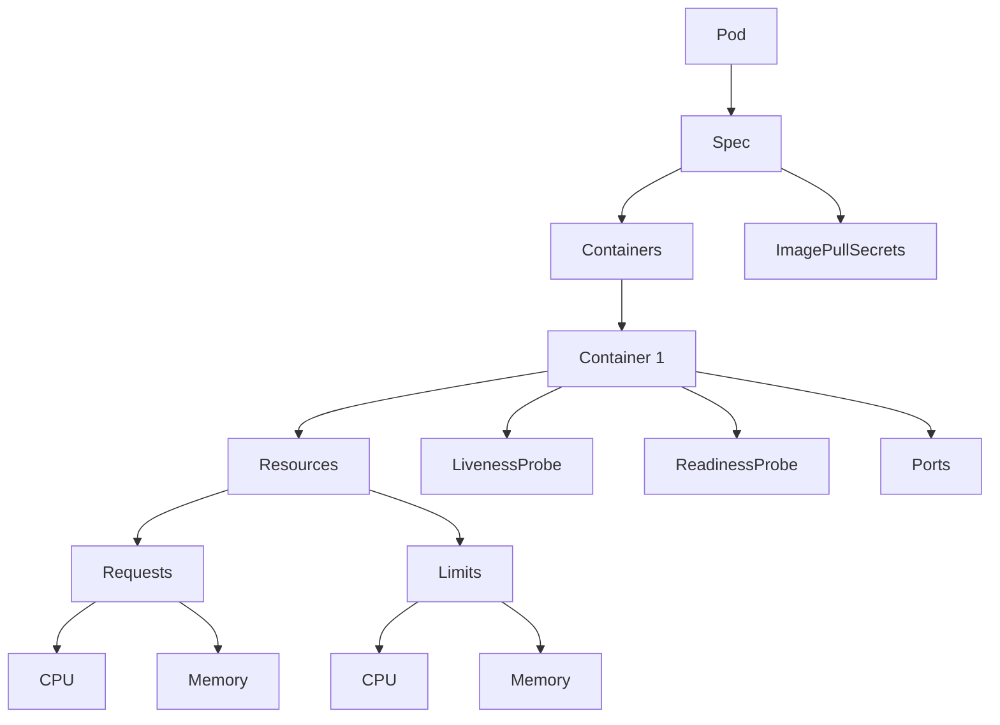

## 第六部分 Pod 资源限制与配置示例

### 1. Pod 资源限制的理论介绍
在 Kubernetes 中，为 Pod 设置资源限制是确保集群资源合理分配和应用稳定运行的重要手段。资源限制主要通过 `requests` 和 `limits` 两个字段来定义，分别表示容器运行所需的最低资源量和最大资源量。合理设置这些参数可以防止某个 Pod 占用过多资源，同时保证关键应用获得足够的资源支持。关于资源限制的详细理论介绍，请参考前文内容，这里不再赘述。

### 2. 为什么要使用 `requests` 和 `limits` 以及两者的含义
- **为什么要使用 `requests` 和 `limits`**：
  - **资源公平分配**：通过设置 `requests` 和 `limits`，可以确保集群资源合理分配，避免某个 Pod 占用过多资源导致其他 Pod 无法正常运行。
  - **应用稳定性**：合理设置资源限制可以防止容器因资源不足而崩溃，或因资源过剩而浪费。
  - **集群稳定性**：资源限制有助于保护集群整体稳定性，避免某个 Pod 的异常行为（如内存泄漏）影响其他 Pod 或节点。
- **`requests` 的含义**：资源请求，表示容器运行所需的最低资源量（CPU 和内存）。Kubernetes 在调度 Pod 时，会根据 `requests` 值选择合适的节点，确保节点有足够的资源满足 Pod 的最低需求。如果集群资源不足，Pod 将处于 `Pending` 状态。
- **`limits` 的含义**：资源限制，表示容器可以使用的最大资源量（CPU 和内存）。当容器尝试使用超出 `limits` 定义的资源时，Kubernetes 会采取限制措施，例如对 CPU 进行节流（throttling），或在内存超限时终止容器（OOMKilled）。


### 3. Pod 资源限制语法
在 Kubernetes 中，Pod 的资源限制通过 `spec.containers[].resources` 字段定义，主要包含 `requests` 和 `limits` 两个子字段，用于指定容器运行所需的最低资源量和最大资源量。以下是资源限制的 YAML 语法结构：

```yaml
spec:
  containers:
  - name: <容器名称>
    image: <镜像名称>
    resources:
      requests:  # 资源请求，表示容器运行所需的最低资源量
        cpu: "<CPU 核心数或毫核数>"  # 例如 "0.2" 或 "200m"
        memory: "<内存大小>"  # 例如 "256Mi" 或 "1Gi"
      limits:  # 资源限制，表示容器可使用的最大资源量
        cpu: "<CPU 核心数或毫核数>"  # 例如 "0.5" 或 "500m"
        memory: "<内存大小>"  # 例如 "512Mi" 或 "2Gi"
```

- **CPU 单位**：可以是小数（如 `0.5` 表示半个核心）或毫核（如 `500m` 表示 0.5 核心）。
- **内存单位**：支持 `Mi`（兆字节）、`Gi`（吉字节）等单位，例如 `512Mi` 表示 512 兆字节。


### 2. 练习 Pod YAML 文件
以下是一个完整的 Pod YAML 配置示例，包含了资源限制、探针配置以及镜像拉取秘钥等内容，供学员参考和学习。此示例严格遵循企业命名规范，并添加了详细注释以便理解：

- 创建一个名为 `pod-stars-emmision.yml` 的文件，内容如下（文件名与 `metadata.name` 保持一致）：

  ```yaml
  apiVersion: v1  # 指定 Kubernetes API 的版本
  kind: Pod  # 资源类型，这里是 Pod
  metadata:
    name: pod-stars-emmision  # Pod 的名称，符合企业标准，文件名应为 pod-stars-emmision.yml
    namespace: your-pinyin-name  # 替换为你的 Namespace 名称，例如 zhangwei
  spec:
    containers:  # 定义 Pod 中的容器
      - name: stars-emmision  # 容器的名称，与应用名保持一致
        image: harbor.labworlds.cc/stars-emmision/master:08061743-shiqi  # 替换为你的镜像标签
        ports:  # 指定容器暴露的端口
          - containerPort: 80  # 容器内部使用的端口号，这里是 80
        resources:  # 定义容器的资源限制
          requests:  # 资源请求，表示容器运行所需的最低资源量
            cpu: "0.2"  # 最低需要 0.2 个 CPU 核心
            memory: "256Mi"  # 最低需要 256Mi 内存
          limits:  # 资源限制，表示容器可使用的最大资源量
            cpu: "0.5"  # 最多可以使用 0.5 个 CPU 核心
            memory: "512Mi"  # 最多可以使用 512Mi 内存
        livenessProbe:  # 活性探测配置，用于检查容器是否正常运行
          httpGet:  # 使用 HTTP GET 请求进行探测
            path: /  # 请求的路径，这里是根路径
            port: 80  # 请求的端口，这里是 80
          initialDelaySeconds: 30  # 在容器启动后，等待 30 秒再进行第一次探测
          periodSeconds: 10  # 每 10 秒进行一次探测
        readinessProbe:  # 就绪探测配置，用于检查容器是否可以接收流量
          httpGet:  # 使用 HTTP GET 请求进行探测
            path: /  # 请求的路径，这里是根路径
            port: 80  # 请求的端口，这里是 80
          initialDelaySeconds: 5  # 在容器启动后，等待 5 秒再进行第一次探测
          periodSeconds: 10  # 每 10 秒进行一次探测
    imagePullSecrets:  # 指定用于拉取镜像的 Secret
      - name: secret-harbor-login  # 引用之前创建的 Secret 名称，用于私有镜像仓库登录
  ```

- 使用以下命令应用该文件：
  ```bash
  kubectl apply -f pod-stars-emmision.yml
  ```

- 查看pod-stars-emmision的状态
  ```bash
  kubectl get pod pod-stars-emmision -n your-pinyin-name
  ```

- 查看pod-stars-emmision的详情
  ```bash
  kubectl describe pod pod-stars-emmision -n your-pinyin-name
  ```

### 4. Mermaid 图表示 Pod 资源限制结构
由于当前环境不支持直接渲染 Mermaid 图表，我以代码形式提供 Pod 资源限制的层级结构图，学员可使用支持 Mermaid 的工具（如 Markdown 编辑器）查看：



此图展示了 Pod 中与资源限制相关的层级结构，包括 `requests` 和 `limits` 的 CPU 和内存配置，以及探针和镜像拉取秘钥等相关字段。

### 5. 练习题
以下是针对 Pod 资源限制与配置的练习题，供学员实践和巩固知识：

#### 练习题 1：修改资源限制
基于上述示例 YAML 文件，将容器的资源限制修改为：
- `requests.cpu` 为 `0.1`，`requests.memory` 为 `128Mi`
- `limits.cpu` 为 `0.3`，`limits.memory` 为 `256Mi`

请写出修改后的 `resources` 字段部分。

#### 练习题 2：添加新容器
在上述示例 Pod 中添加一个新容器，名称为 `sidecar`，镜像为 `busybox:latest`，资源限制如下：
- `requests.cpu` 为 `0.1`，`requests.memory` 为 `64Mi`
- `limits.cpu` 为 `0.2`，`limits.memory` 为 `128Mi`
- 不需要暴露端口，也不需要探针配置

请写出完整的 `containers` 字段部分。

#### 练习题 3：调整探针配置
将示例中的 `livenessProbe` 和 `readinessProbe` 的 `initialDelaySeconds` 分别调整为 20 秒和 10 秒，`periodSeconds` 均调整为 15 秒。请写出修改后的 `livenessProbe` 和 `readinessProbe` 字段部分。

#### 练习题 4：理解与分析
假设一个 Pod 的容器未设置 `limits`，但设置了 `requests`，请回答以下问题：
1. 此 Pod 属于哪种 QoS（服务质量）类别？
2. 如果集群资源紧张，该 Pod 是否容易被驱逐？为什么？

希望以上内容对您有帮助！如果您对练习题的答案或其他相关内容有疑问，请随时告知。