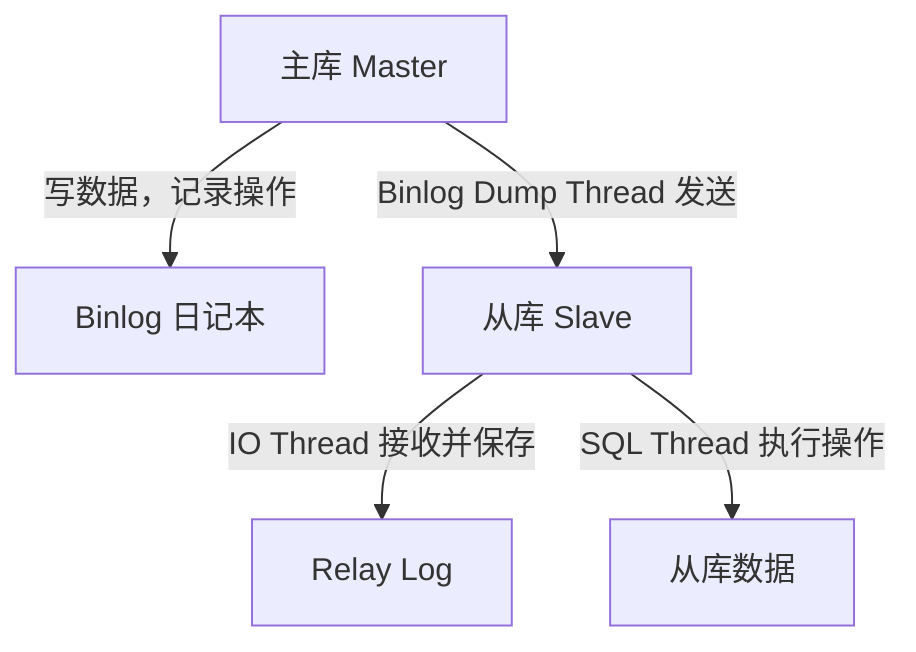

## **第三部分：MySQL 主从同步理论与实践（完整版，含小白类比和举例）**

### **3.1 主从同步的理论与基本原理（完整详细版）**

#### **3.1.1 什么是主从同步？**
MySQL 主从同步（Replication）是一种数据库高可用和负载均衡的技术，它允许将一台数据库服务器（称为主库，Master）上的数据自动复制到一台或多台其他数据库服务器（称为从库，Slave）。主库通常负责处理写操作（INSERT、UPDATE、DELETE 等），而从库主要负责读操作（SELECT 查询），从而实现读写分离，提升系统性能和可靠性。

**主要作用：**
- **负载均衡：** 通过将读操作分担到从库，减轻主库的压力，提高数据库整体吞吐量。
- **数据备份：** 从库作为主库的副本，可用于数据备份，防止主库故障导致数据丢失。
- **高可用性：** 当主库发生故障时，从库可以快速切换为主库（需额外配置），减少服务中断时间。
- **数据分析：** 从库可用于执行复杂的查询或报表分析，不影响主库的在线业务。

**小白类比：** 想象一个老师（主库）负责写讲义和改作业（写操作），而多个学生（从库）负责抄写讲义并回答问题（读操作）。这样老师就不用回答所有问题，减轻了负担；如果老师生病，学生还有讲义可以继续学习（备份作用）。

**小白举例：** 比如一个电商网站，主库负责处理用户下单（写数据），从库负责显示商品列表（读数据）。用户查询商品时不会占用主库资源，主库可以更快地处理订单。

#### **3.1.2 主从同步的工作原理（详细流程，面试常考）**
MySQL 主从同步的核心机制基于二进制日志（Binary Log，简称 Binlog），这是主库记录所有写操作的日志文件。从库通过读取主库的 Binlog，重复执行这些操作，从而保持与主库数据一致。以下是详细的工作流程：

- **主库（Master）的工作流程：**
  1. **记录操作到 Binlog：** 每当主库执行写操作（INSERT、UPDATE、DELETE 等），这些操作会被记录到 Binlog 文件中。Binlog 文件按顺序编号（如 `mysql-bin.000001`），每个操作在文件中有具体位置（Position，如 1200），用于标识操作发生的顺序。
  2. **Binlog Dump Thread（Binlog 转储线程）：** 主库有一个专门的线程，称为 Binlog Dump Thread。当从库连接到主库请求同步时，这个线程会读取 Binlog 文件内容，并将其发送给从库。这个线程是主从同步的起点，确保从库能获取主库的操作记录。

- **从库（Slave）的工作流程：**
  1. **IO Thread（输入输出线程）：** 从库启动一个 IO Thread，负责连接主库，接收主库的 Binlog Dump Thread 发送的 Binlog 数据，并将这些数据写入从库本地的 Relay Log（中继日志）中。Relay Log 是从库的临时日志，相当于从库自己的“抄写本”。
  2. **SQL Thread（SQL 执行线程）：** 从库还有一个 SQL Thread，负责读取 Relay Log 中的操作记录，并在从库数据库上逐一执行这些操作（如插入、更新、删除），确保从库的数据与主库保持一致。
  3. **Relay Log 存储位置：** 中继日志默认存储在 MySQL 的数据目录下（通常是 `/var/lib/mysql/`），文件名格式为 `relay-bin.XXX`（如 `relay-bin.000001`）。具体路径可以通过 MySQL 配置文件或查询 `SHOW VARIABLES LIKE 'relay_log';` 确认。如果未特别设置，Relay Log 与数据文件在同一目录下。

**小白类比：** 想象老师（主库）在黑板上写下知识点并记录到日记本（Binlog），有个助手（Binlog Dump Thread）专门把日记内容读给学生听；学生派一个抄写员（IO Thread）把内容抄到自己的小本子（Relay Log），然后另一个执行员（SQL Thread）按照小本子上的内容在自己的作业本上重写一遍（从库执行操作）。这样学生和老师的内容就一样了。

**小白举例：** 假设主库新增了一条订单记录：“用户小明购买手机，订单号 1001”。主库把这条操作记到 Binlog（文件 `mysql-bin.000001`，位置 1200），助手（Binlog Dump Thread）告诉学生；学生抄写员（IO Thread）抄到自己的小本子（Relay Log），执行员（SQL Thread）在从库也添加这条订单记录，从库也有了“订单号 1001”的数据。

**直观结构图（主从同步流程）：**

**图解说明：**
- 主库（A）记录操作到 Binlog（B），通过 Binlog Dump Thread 发送给从库。
- 从库（C）用 IO Thread 接收数据，存到 Relay Log（D），再用 SQL Thread 执行操作，更新从库数据（E）。

**核心点（面试常问）：** 主从同步依赖 Binlog 作为数据传输的桥梁，主库的 Binlog Dump Thread 和从库的 IO Thread、SQL Thread 协同工作，缺一不可。理解这三个线程的作用和数据流向，是回答“主从同步原理”问题的关键。

#### **3.1.3 为什么同步会有延迟？**
MySQL 主从同步默认是异步复制（Asynchronous Replication），即主库执行写操作后不会等待从库完成同步，而是立即返回结果。从库的 IO Thread 和 SQL Thread 需要时间接收和执行操作，因此从库数据可能比主库滞后，导致同步延迟。

- **延迟原因：** 从库的 Relay Log 写入和执行是串行操作，如果主库写操作频繁或从库性能较低，延迟会更明显。
- **解决方案：** MySQL 提供了半同步复制（Semi-Synchronous Replication），主库在提交事务时至少等待一个从库确认收到 Binlog 数据，这样减少数据丢失风险，但可能降低主库性能。
- **影响：** 延迟可能导致从库查询结果与主库不一致，需根据业务场景选择异步或半同步模式。

**小白类比：** 学生抄老师的笔记（从库同步）总比老师写得慢（主库操作），所以学生可能还没抄完最新内容（数据延迟）。半同步就像老师写完一句就等学生确认抄完再写下一句，保证学生不丢内容，但老师写得就慢了。

**小白举例：** 电商网站主库刚新增一条订单（订单号 1002），但从库还没执行完这条操作，用户在从库查询订单列表可能看不到 1002，这就是延迟。如果用半同步，主库会等从库确认收到操作再返回，用户下单会稍慢，但数据一致性更好。

#### **3.1.4 主从同步的两种方式：全库同步与部分库同步**
主从同步可以根据业务需求选择同步全部数据库（全库同步）或只同步特定数据库（部分库同步）。

- **全库同步：**
  - **定义：** 主库的所有数据库操作都记录到 Binlog，从库同步所有数据库的数据。
  - **配置：** 默认模式，无需特别设置，只需开启主库 Binlog。
  - **适用场景：** 适合大多数企业场景，确保从库数据完整，常用作备份或读写分离。
  - **小白类比：** 学生把老师所有科目的笔记都抄下来，不管是数学还是语文，保证不漏内容。
  - **小白举例：** 一个网站有“用户库”和“订单库”，全库同步让从库两个库都有数据，用户查询订单时不会因为缺用户数据而出错。

- **部分库同步：**
  - **定义：** 主库只记录特定数据库的操作到 Binlog，或从库只同步特定数据库的数据。
  - **配置：** 主库设置 `binlog_do_db=数据库名`（限制记录的数据库），从库设置 `replicate_do_db=数据库名`（限制同步的数据库）。
  - **适用场景：** 适合大公司针对高压力数据库优化，比如只同步查询量大的“订单库”到专用从库，其他数据库不占用资源。
  - **注意问题：** 如果数据库之间有关联操作（如用户和订单联合查询），部分同步可能导致从库查询出错，需谨慎使用。
  - **小白类比：** 学生只抄“数学笔记”，针对性强，节省时间，但如果考试有语文内容，就可能答不上来。
  - **小白举例：** 电商网站的“订单库”每天查询几百万次，压力大，就单独同步到几个从库专门处理订单查询，而“用户库”用其他从库处理，避免资源浪费。

---

### **3.2 企业中重要问题：不停机导出数据及记录数据点**
在企业环境中，数据库通常需要 24 小时运行，不能因备份而停机，同时必须准确记录备份时的“数据点”（Binlog 文件和 Position），确保从库同步正常。以下是解决方法，在实验中尤为重要。

#### **3.2.1 如何不停机导出数据？**
企业数据库不能停止服务，用 `mysqldump` 导出全量数据时需尽量减少对业务的影响：
- **使用 `--single-transaction` 参数：** 适用于 InnoDB 引擎，确保导出过程中数据一致，且不影响其他事务（无需长时间锁表）。
  ```bash
  mysqldump -u root -p --single-transaction --all-databases > backup.sql
  ```
- **记录导出时的 Binlog 位置：** 导出时自动记录数据点，减少手动操作和锁表时间。
  ```bash
  mysqldump -u root -p --single-transaction --master-data=2 --all-databases > backup.sql
  ```
  - `--master-data=2` 会将导出时的 Binlog 文件和 Position 写入备份文件顶部（作为注释），如：
    ```
    -- CHANGE MASTER TO MASTER_LOG_FILE='mysql-bin.000001', MASTER_LOG_POS=1200;
    ```
  - 这样无需额外查询 `SHOW MASTER STATUS`，直接从备份文件提取位置，减少对业务的影响。

**小白类比：** 就像老师在不停课的情况下，把讲义复印给新学生（备份数据），用特殊标记（`--master-data=2`）告诉学生从哪里开始抄新笔记（记录数据点），不耽误其他学生学习。

**小白举例：** 网站数据库每天处理订单，不能停，用 `mysqldump --single-transaction` 导出数据就像在后台悄悄复印讲义，用户下单不受影响。

#### **3.2.2 如何记录导出数据点，确保从库同步正常？**
全量备份后，Binlog 同步只负责“备份之后的新操作”，必须准确记录备份完成时的 Binlog 文件和 Position（数据点），否则从库同步会错乱。
- **方法 1：用 `--master-data` 参数（推荐）：** 如上，导出时自动记录数据点，备份文件顶部有 `CHANGE MASTER TO` 语句，直接读取注释即可。
- **方法 2：手动记录（不推荐）：** 导出前执行 `FLUSH TABLES WITH READ LOCK;` 锁定数据库，再执行 `SHOW MASTER STATUS;` 获取 Binlog 文件和 Position，记录后立即解锁 `UNLOCK TABLES;`，但这会短暂影响业务。
- **为什么重要？** 如果找不到对应数据点，从库可能从错误位置开始同步，导致数据重复或缺失。比如备份时主库在 Position 1200，但从库从 1000 开始同步，就会重复执行旧操作，数据错乱。
- **小白类比：** 就像学生借旧笔记（备份数据），必须知道老师讲到哪里（数据点），才能从正确位置开始抄新笔记（同步新操作）。如果不知道位置，抄错了地方，笔记就乱了。
- **小白举例：** 主库备份时已经写到 Position 1200，但从库从 Position 500 开始同步，就会重复处理 500 到 1200 的旧订单，数据库里可能出现重复记录，订单统计就错了。

#### **3.2.3 企业实践建议：**
- 优先用 `mysqldump --single-transaction --master-data=2` 导出，既不停机，又自动记录数据点。
- 导出后检查备份文件顶部注释，确认 Binlog 文件和 Position，用于从库配置。
- 如果数据量大，可用更高效工具（如 Percona XtraBackup），支持热备份且记录 Binlog 位置。

---

### **3.3 实验场景：1 主 1 从同步配置（超详细版）**

#### **3.3.1 实验目标和环境**
**目标：** 搭建一个主库和一个从库的架构，让从库同步主库数据，验证效果。
**实验环境表格：**

| 角色         | IP 地址          | MySQL 版本 | server_id | 操作系统         | 备注                     |
|--------------|------------------|------------|-----------|------------------|--------------------------|
| 主库 (Master) | 192.168.1.100   | 8.0        | 1         | Ubuntu 22.04 LTS | 负责写数据，生成 Binlog |
| 从库 (Slave)  | 192.168.1.101   | 8.0        | 2         | Ubuntu 22.04 LTS | 负责读数据，同步主库     |

**注意：** 如果本地测试，可用两台虚拟机，或一台机器装两个 MySQL 实例（改端口，如主库 3306，从库 3307）。

#### **3.3.2 配置步骤（1 主 1 从，全库同步）**
以下步骤面向所有用户，详细解释每步操作，包含小白类比和举例。

**步骤 0：准备工作（确保主从数据一致）**
- 如果主库已有数据，需先备份到从库，Binlog 同步只管之后的新操作。
- **备份主库数据（不停机）：** 在主库执行：
  ```bash
  mysqldump -u root -p --single-transaction --master-data=2 --all-databases > backup.sql
  ```
  **小白类比：** 就像老师把之前的讲义复印给新学生（备份数据），不影响课堂继续。
  **小白举例：** 网站主库有 1000 条订单记录，用这个命令备份，就像把 1000 条订单抄到 U 盘，不影响用户继续下单。
- **提取数据点：** 查看备份文件顶部注释，找到类似以下内容：
  ```
  -- CHANGE MASTER TO MASTER_LOG_FILE='mysql-bin.000001', MASTER_LOG_POS=1200;
  ```
  记录 `MASTER_LOG_FILE` 和 `MASTER_LOG_POS`，用于从库配置。
- **导入从库：** 将备份文件传到从库（用 `scp` 或其他工具），在从库执行：
  ```bash
  mysql -u root -p < backup.sql
  ```
  **小白举例：** 就像把 U 盘里的 1000 条订单记录导入从库电脑，从库也有了这 1000 条数据。

**步骤 1：主库设置（192.168.1.100）**
1. **编辑主库配置文件：** 开启 Binlog。
   - 打开配置文件（Ubuntu 上通常是 `/etc/mysql/mysql.conf.d/mysqld.cnf`）：
     ```bash
     sudo vim /etc/mysql/mysql.conf.d/mysqld.cnf
     ```
   - 在 `[mysqld]` 部分加：
     ```ini
     [mysqld]
     log_bin = /var/log/mysql/mysql-bin  # 开启 Binlog
     binlog_format = ROW                # 记录方式，ROW 更准确
     server_id = 1                      # 主库编号，唯一
     ```
   **小白类比：** 就像老师开始记日记（Binlog），记录每节课的内容，编号 1 是老师的名字。
2. **重启主库：** 让设置生效。
   ```bash
   sudo systemctl restart mysql
   ```
3. **创建同步账号：** 给从库权限读 Binlog。
   - 登录主库 MySQL：
     ```bash
     mysql -u root -p
     ```
   - 创建用户并授权：
     ```sql
     CREATE USER 'repl'@'192.168.1.101' IDENTIFIED BY 'ReplPass123';
     GRANT REPLICATION SLAVE ON *.* TO 'repl'@'192.168.1.101';
     FLUSH PRIVILEGES;
     ```
   **小白举例：** 就像老师给学生一个通行证（账号和密码），允许学生来看日记本（Binlog）。

**步骤 2：从库设置（192.168.1.101）**
1. **编辑从库配置文件：** 设置唯一编号。
   - 打开配置文件：
     ```bash
     sudo vim /etc/mysql/mysql.conf.d/mysqld.cnf
     ```
   - 在 `[mysqld]` 部分加：
     ```ini
     [mysqld]
     server_id = 2  # 从库编号，和主库不同
     ```
   **小白类比：** 学生给自己取个编号 2，和老师的编号 1 区分开。
2. **重启从库：** 让设置生效。
   ```bash
   sudo systemctl restart mysql
   ```
3. **配置从库连接主库：** 设置同步起点（用备份文件记录的 Binlog 文件和 Position）。
   - 登录从库 MySQL：
     ```bash
     mysql -u root -p
     ```
   - 设置同步：
     ```sql
     CHANGE MASTER TO
         MASTER_HOST = '192.168.1.100',    # 主库 IP
         MASTER_USER = 'repl',             # 同步账号
         MASTER_PASSWORD = 'ReplPass123',  # 同步密码
         MASTER_LOG_FILE = 'mysql-bin.000001',  # 备份时的 Binlog 文件
         MASTER_LOG_POS = 1200;            # 备份时的 Position
     ```
   **小白类比：** 学生告诉自己，从老师的日记本第 1 本第 1200 行开始抄（同步新操作）。
   **小白举例：** 从库知道主库备份时写到 1200，就从 1201 开始同步新订单，避免重复抄前 1200 条。
4. **开始同步：** 启动从库同步。
   ```sql
   START SLAVE;
   ```
5. **检查同步状态：** 确认同步是否正常。
   ```sql
   SHOW SLAVE STATUS\G;
   ```
   - 看两行：
     ```
     Slave_IO_Running: Yes  # 接收数据正常
     Slave_SQL_Running: Yes # 执行操作正常
     ```
   - 如果都是 `Yes`，同步正常；否则需排查（IP、密码、Position 是否正确）。
   **小白举例：** 就像检查学生抄写员（IO Thread）和执行员（SQL Thread）是否在工作，如果都在干活，说明笔记抄对了。

**步骤 3：测试同步效果**
1. **主库写数据：** 加一条记录。
   - 登录主库：
     ```sql
     INSERT INTO students (id, name) VALUES (1, '小明');
     ```
   **小白举例：** 老师在主库加了“小明”的记录，就像写了一条新笔记。
2. **从库查数据：** 确认同步。
   - 登录从库：
     ```sql
     SELECT * FROM students WHERE id = 1;
     ```
   - 看到“小明”记录，说明同步成功。
   **小白举例：** 学生在从库看到“小明”，说明抄笔记成功，数据和老师一样。

#### **3.3.3 注意事项（常见问题）**
- **版本一致：** 主从 MySQL 版本最好都是 8.0，避免兼容问题。
- **编号唯一：** `server_id` 必须不同（如主库 1，从库 2）。
- **初始数据：** 同步前备份主库数据到从库，用 `--master-data=2` 记录数据点。
- **同步延迟：** 从库可能慢几秒，`SHOW SLAVE STATUS` 的 `Seconds_Behind_Master` 显示延迟时间。
- **小白举例：** 如果从库延迟 5 秒，用户刚下单，可能 5 秒后才能在从库看到订单信息。

#### **3.3.4 部分库同步配置提示**
如果需要部分库同步（本案例不展开），只需在主库配置中加 `binlog_do_db=数据库名`（指定记录的数据库），从库配置中加 `replicate_do_db=数据库名`（指定同步的数据库），重启后生效。具体操作可参考 MySQL 文档。
**小白举例：** 如果只想同步“订单库”，就在主库和从库设置只处理“订单库”，就像学生只抄“数学笔记”，其他科目不抄。

---

### **总结与下一步计划**
1. **总结：**
   - **主从同步原理：** 主库用 Binlog Dump Thread 发送 Binlog，从库用 IO Thread 接收到 Relay Log（存储在数据目录如 `/var/lib/mysql/`），SQL Thread 执行，保持数据一致。
   - **企业问题：** 不停机导出用 `mysqldump --single-transaction --master-data=2`，记录数据点确保从库同步准确。
   - **实验配置：** 1 主 1 从步骤详细，备份和同步数据点结合，避免实验失败。
   - **小白类比：** 主从同步就像老师和学生抄笔记，备份和同步结合，确保学生笔记完整。

2. **实践建议：**
   - 按步骤搭建主从同步，先备份数据并记录数据点，再配置同步。
   - 用 `SHOW SLAVE STATUS` 检查状态，确保同步正常。

3. **下一步：**
   - 如果基本原理和配置清楚，可学习 1 主多从或延迟优化。
   - 如有疑问（备份、数据点、同步错误），随时告诉我，我会进一步解释。

**特别提醒：** 主从同步中备份和数据点的准确性是成功关键，企业场景下尤其重要。希望这次内容既全面又易懂，能满足你的需求，期待反馈！