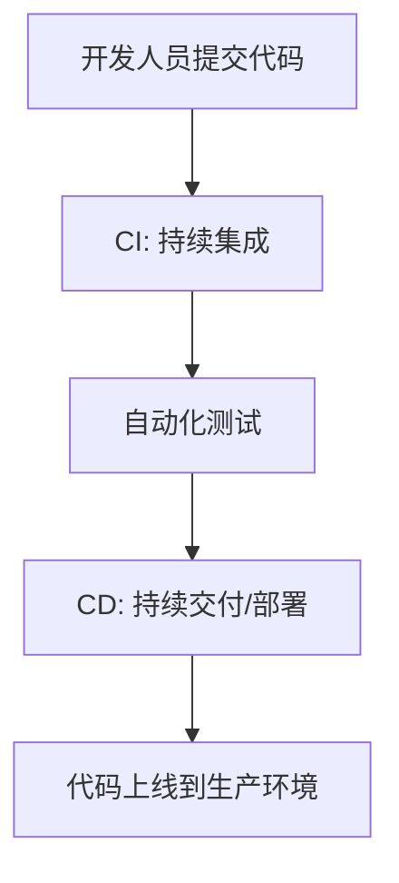
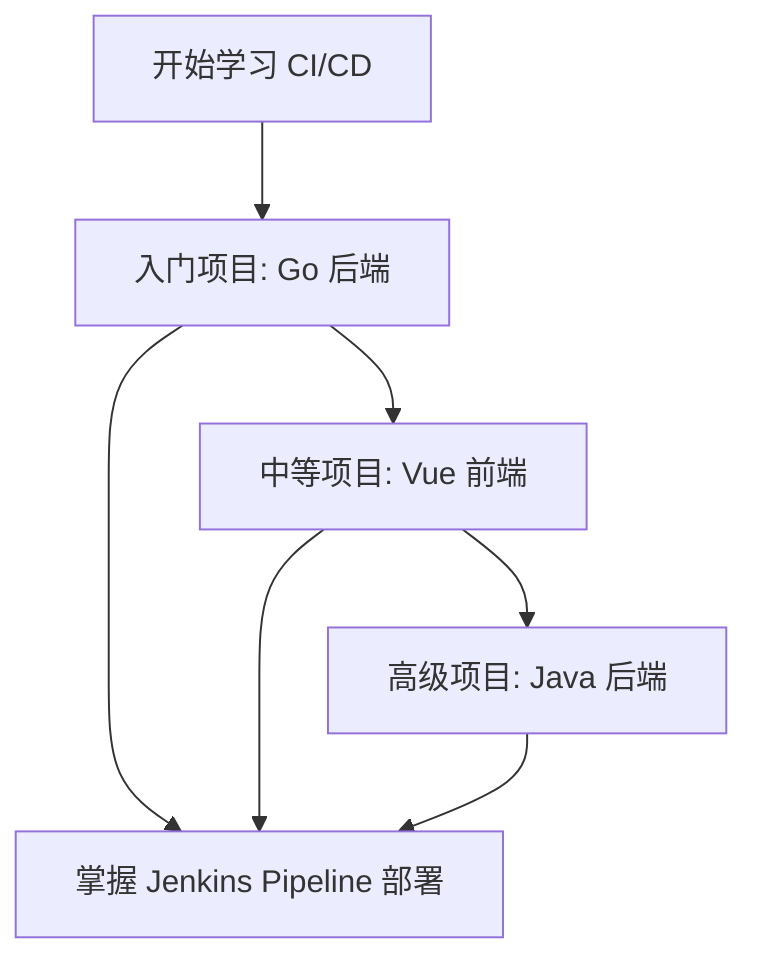
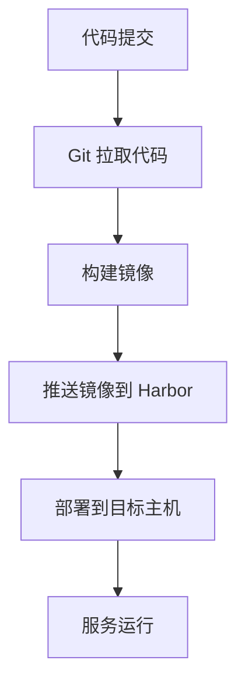
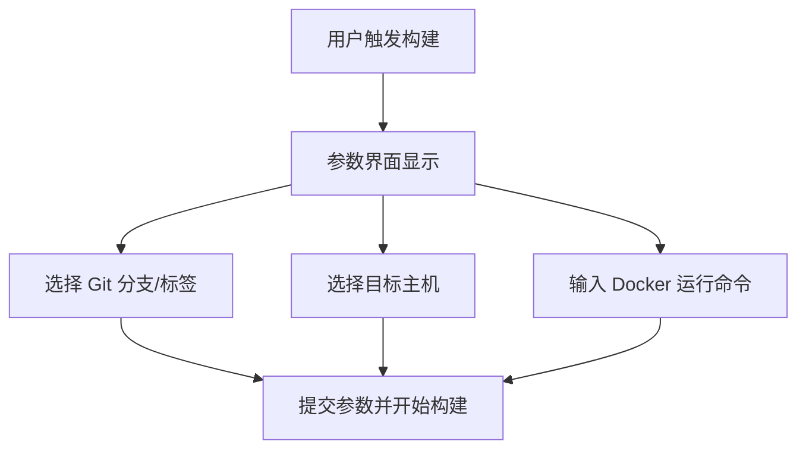

python3 /root/PyDockerDeploy/deployer.py \
    -p admin3-ui \
    --git_branch master \
    --image_tag liujun-0802 \
    --hosts 192.168.110.8 \
    --harbor_registry harbor.labworlds.cc \
    --docker_run "docker run -d -p 8000:80"

python3 /root/PyDockerDeploy/deployer.py \
    -p go-starter \
    --git_branch master \
    --image_tag liujun-v1.0 \
    --hosts 192.168.110.8,192.168.110.171 \
    --harbor_registry harbor.labworlds.cc \
    --docker_run "docker run -d -p 9006:8080"


python3 /root/PyDockerDeploy/config_manager.py \
--data """$(cat //root/admin3/admin3-server/application.yml)""" \
--filepath "/opt/admin3-server/application.yml" \
--hosts "192.168.110.17"


python3 /root/PyDockerDeploy/deployer.py \
  -p admin3-server \
  --git_branch master \
  --image_tag zx-0802 \
  --hosts 192.168.110.8,192.168.110.17 \
  --harbor_registry harbor.labworlds.cc \
  --docker_run "docker run -d -p 8080:8080 -v /opt/admin3-server/application.yml:/app/application.yml"


好的，感谢您的确认。以下是从第一部分开始的完整教案，面向小白学员，涵盖 CI/CD 入门、Jenkins Pipeline 部署、从节点配置以及 Git 免密拉取等内容。教案将理论与实践相结合，并使用 Mermaid 结构图帮助学员理解。我会分部分逐步编写，确保内容清晰易懂。如果有任何调整或补充要求，请随时告知。

---

# CI/CD 入门教案：从小白到掌握 Jenkins Pipeline 部署

## 第一部分：CI/CD 基础与学习路径

### 教案目标
- 帮助小白学员理解 CI/CD 的基本概念和重要性。
- 明确学习路径，通过三个项目（入门、中等、高级）逐步掌握 Jenkins Pipeline 的编写与部署。
- 学会分析项目需求、设计参数界面、规划部署步骤，并将参数传递给 PyDockerDeploy 工具。

### 受众
- 对 CI/CD 和 Jenkins 几乎没有经验的小白学员。
- 具备基础的 Linux 命令、Git 基础和 Docker 基本概念。

### 1.1 CI/CD 基本概念
**理论讲解**：
- **什么是 CI/CD**：
  - **CI（持续集成）**：指开发人员频繁地将代码合并到主分支，并通过自动化测试确保代码质量。目的是尽早发现问题，减少集成冲突。
  - **CD（持续交付/持续部署）**：持续交付是指将代码自动构建并准备好随时部署到生产环境；持续部署则更进一步，自动将代码部署到目标环境。
- **CI/CD 的优势**：
  - 提高开发效率：自动化流程减少手动操作。
  - 降低错误率：自动化测试和部署减少人为失误。
  - 加快交付速度：快速将代码上线，满足业务需求。
- **Jenkins 在 CI/CD 中的作用**：
  - Jenkins 是一个开源的自动化服务器，支持通过 Pipeline（流水线）定义 CI/CD 流程。
  - Pipeline 是一种脚本化的方式，用代码描述从代码拉取到部署的完整流程。

**Mermaid 结构图**：CI/CD 基本流程


### 1.2 学习计划与项目分级
**理论讲解**：
- **学习路径**：通过三个不同难度的项目，逐步掌握 CI/CD 流程和 Jenkins Pipeline 编写。
- **项目分级**：
  1. **入门项目**：`training-go-starter-liujun`（Go 项目，简单后端服务）
     - 目标：掌握基础 CI/CD 流程，理解代码拉取、镜像构建和部署。
  2. **中等项目**：`training-vue-admin3-ui-shiqi`（Vue 前端项目，涉及静态资源处理）
     - 目标：学习前端项目的构建与部署，处理静态资源和代理配置。
  3. **高级项目**：`training-java-admin3-liujun`（Java 后端项目，涉及配置文件挂载）
     - 目标：掌握复杂项目的部署需求，如配置文件管理、多主机部署。

**学习路径步骤**：
1. **分析项目与部署步骤**：理解不同项目的部署需求和技术栈。
2. **设计参数界面**：学习如何通过 Jenkins 参数化构建，满足灵活部署需求。
3. **规划部署步骤**：将 CI/CD 流程拆分为多个 Stage（如 Git Clone、Build、Deploy）。
4. **参数传递给 PyDockerDeploy**：掌握如何调用自动化部署工具并传递参数。

**Mermaid 结构图**：学习路径与项目分级


### 1.3 环境与工具准备
**理论讲解**：
- **Jenkins 环境**：需要一个运行中的 Jenkins 服务器，支持主从架构（Master 和 Slave/Agent）。
- **从节点（Agent）**：从节点负责执行具体任务，如代码拉取、构建和部署。
- **工具准备**：
  - **Git**：用于代码拉取。
  - **Docker**：用于镜像构建和容器部署。
  - **PyDockerDeploy**：一个 Python 脚本工具，用于自动化 Docker 部署。
  - **Harbor**：私有镜像仓库，用于存储构建的 Docker 镜像。

**实践步骤**：
1. **检查 Jenkins 环境**：
   - 登录 Jenkins UI，确保可以正常访问。
   - 确认已配置从节点（后续会详细讲解从节点配置）。
2. **安装基础工具**：
   - 在从节点主机上安装 Git 和 Docker：
     ```bash
     sudo apt update
     sudo apt install -y git docker.io
     ```
   - 确保 Docker 服务启动：
     ```bash
     sudo systemctl start docker
     sudo systemctl enable docker
     ```
3. **准备 PyDockerDeploy 工具**：
   - 后续章节会详细讲解如何下载和配置此工具。

**注意事项**：
- 确保 Jenkins 和从节点之间网络通畅。
- 确认从节点有权限访问 Git 仓库和 Harbor 镜像仓库。

---

## 第二部分：项目分析与部署步骤

### 2.1 分析项目与部署需求
**理论讲解**：
- **项目分析**：不同的项目有不同的技术栈（如 Go、Vue、Java），需要不同的构建工具和部署方式。
- **部署步骤**：一般包括代码拉取（Git Clone）、构建镜像（Docker Build）、推送镜像（Docker Push）、部署到目标主机（Docker Run）。

**项目分析实例**：
- **入门项目 `training-go-starter-liujun`**：
  - 技术栈：Go 语言后端服务。
  - 部署需求：拉取代码、编译成二进制、构建 Docker 镜像、部署到指定主机，映射端口（如 9006:8080）。
- **中等项目 `training-vue-admin3-ui-shiqi`**：
  - 技术栈：Vue.js 前端项目。
  - 部署需求：拉取代码、用 npm 构建静态资源、基于 Nginx 构建镜像、部署到主机，映射端口（如 8000:80）。
- **高级项目 `training-java-admin3-liujun`**：
  - 技术栈：Java Spring Boot 后端服务。
  - 部署需求：拉取代码、Maven 构建 Jar 包、构建 Docker 镜像、挂载配置文件、部署到多主机，映射端口（如 8080:8080）。

**Mermaid 结构图**：CI/CD 通用流程


### 2.2 设计参数界面
**理论讲解**：
- **参数的作用**：Jenkins Pipeline 支持参数化构建，允许用户在运行时选择分支、标签、主机等信息，增强灵活性。
- **参数类型**：包括字符串参数（输入分支名）、布尔参数（是否渲染页面）、多选参数（选择主机）等。
- **设计原则**：参数应覆盖所有部署变量，如代码来源、镜像标签、目标主机、运行命令等。

**参数设计实例**：
- **入门项目 `training-go-starter-liujun`**：
  - `rendering`（布尔）：是否渲染页面，默认 false。
  - `git_branch`（字符串）：代码分支，默认 `master`。
  - `git_tag`（字符串）：代码标签，默认空。
  - `hosts`（多选）：目标主机 IP，如 `192.168.110.8,192.168.110.171`。
  - `docker_run`（字符串）：Docker 运行命令，如 `docker run -d -p 9006:8080 --restart=always`。
- **中等项目 `training-vue-admin3-ui-shiqi`**：
  - 类似入门项目，但 `docker_run` 可能为 `docker run -d -p 8000:80`。
- **高级项目 `training-java-admin3-liujun`**：
  - 增加配置文件路径参数或挂载卷参数，如 `docker_run` 中添加 `-v /opt/admin3-server/application.yml:/app/application.yml`。

**Mermaid 结构图**：参数界面设计逻辑


---

## 第三部分：Jenkins Pipeline 部署步骤与 PyDockerDeploy 调用
（后续内容将在下一部分中详细展开，包括 Pipeline 具体步骤、参数传递给 PyDockerDeploy、从节点配置和 Git 免密拉取等内容。）


您说得对，我理解您的意思。确实应该分阶段实现 Jenkins Pipeline 脚本，先从简单的参数界面和 Pipeline 结构开始，逐步深入到每个步骤的实际内容。这样可以让学习者循序渐进地掌握内容，避免一开始就接触过于复杂的实现。以下是重新整理的第 6 部分，将内容分为几个阶段，逐步引导学习者理解和实现 Pipeline 脚本。

---

### 6. Jenkins Pipeline 脚本实现
为了让学习者更容易掌握 Jenkins Pipeline 的编写，我们将分阶段实现脚本，从简单的参数界面开始，逐步构建完整的 CI/CD 流程。每个阶段都会有详细的说明和代码示例，确保内容易于理解。

#### 6.1 阶段 1：参数界面设计
**目标**：学习如何在 Jenkins 中设计参数界面，允许用户在运行 Pipeline 时选择分支、标签、主机等信息。

**理论讲解**：
- 参数化构建是 Jenkins 的核心功能之一，通过 `properties` 插件可以为 Pipeline 定义多种类型的参数。
- 参数设计需要覆盖部署过程中的所有变量，例如代码分支、目标主机和 Docker 运行命令等。

**实现代码**：
```groovy
// 定义 Pipeline 参数，允许用户在运行时选择拉取代码的分支、标签等信息
properties([
    parameters([
        // 布尔参数：是否要渲染页面，默认值为 false，勾选为 true
        booleanParam(name: 'rendering', defaultValue: false, description: '是否要渲染页面'),
        // 字符串参数：输入 Git 分支名称，默认值为 'master'，trim 去除首尾空格
        string(name: 'git_branch', defaultValue: 'master', description: '请输入代码分支', trim: true),
        // 字符串参数：输入 Git 标签名称，默认值为空，trim 去除首尾空格
        string(name: 'git_tag', defaultValue: '', description: '请输入代码TAG', trim: true),
        // 字符串参数：输入镜像地址，默认值为空，trim 去除首尾空格
        string(name: 'image', defaultValue: '', description: '请输入完整的镜像地址', trim: true),
        // 隐藏参数：项目名称，默认值为 'go-starter'，用户不可见也不可修改
        hidden(name: 'project_name', defaultValue: 'go-starter', description: '隐藏参数不给修改'),
        // harbor私库地址
        hidden(name: 'harbor_registry', defaultValue: 'harbor.labworlds.cc', description: '隐藏参数不给修改'),
        // 扩展选择参数：多选主机 IP，支持勾选多个选项，用逗号分隔
        extendedChoice(
            name: 'hosts', 
            type: 'PT_CHECKBOX', 
            value: '192.168.110.8,192.168.110.171,192.168.110.172', 
            description: '请选择主机',
            multiSelectDelimiter: ','
        ),
        // 字符串参数：输入 Docker 运行命令，默认值已提供，trim 去除首尾空格
        string(name: 'docker_run', defaultValue: 'docker run -d -p 9006:8080 --restart=always', description: '请输入Docker运行命令', trim: true),
    ])
])
```

**说明**：
- 以上代码定义了用户在 Jenkins 界面上可以看到的参数，包括布尔类型、字符串类型、多选类型等。
- 学习者可以先在 Jenkins 中运行这段代码，观察参数界面效果，并尝试输入不同的值来熟悉参数功能。

#### 6.2 阶段 2：Pipeline 基本结构
**目标**：学习 Jenkins Pipeline 的基本结构，了解如何定义运行节点、选项和阶段（Stages）。

**理论讲解**：
- Pipeline 是一个完整的 CI/CD 流程，通常包含多个阶段（Stage），每个阶段完成一个具体任务。
- `agent` 指定 Pipeline 在哪个节点运行，`options` 设置构建行为，`stages` 定义具体的流程步骤。

**实现代码**：
```groovy
// 定义 Pipeline 主结构
pipeline {
    // 指定运行节点：任务在特定 Agent 节点上执行，企业中常指定跳板机
    agent { node 'node-192.168.110.6-shiqi' }
    // 设置 Pipeline 选项
    options {
        // 保留最近 30 个构建记录，防止日志过多占用空间
        buildDiscarder(logRotator(numToKeepStr: '30'))
        // 禁止并行构建，确保一次只运行一个构建
        disableConcurrentBuilds()  
        // 启用 ANSI 颜色输出，日志显示更美观
        ansiColor('xterm')
    }
    // 定义环境变量，在整个 Pipeline 中都可以使用
    environment {
        // 自定义变量：初始化分支变量，稍后根据参数赋值
        branch = null
    }
    // 定义 Pipeline 阶段
    stages {
        // 阶段 1：占位阶段，仅用于测试 Pipeline 结构
        stage('Test Stage 1') {
            steps {
                echo "这是一个测试阶段，参数 git_branch 是：${params.git_branch}"
            }
        }
        // 阶段 2：另一个占位阶段
        stage('Test Stage 2') {
            steps {
                echo "这是第二个测试阶段，参数 hosts 是：${params.hosts}"
            }
        }
    }
}
```

**说明**：
- 以上代码是一个简单的 Pipeline 框架，包含两个测试阶段，用于输出用户输入的参数。
- 学习者可以将这段代码与参数界面代码结合，在 Jenkins 中运行，观察 Pipeline 的执行流程和日志输出。


#### 6.3 阶段 3：完整步骤与实际内容
**目标**：在掌握了参数界面和 Pipeline 基本结构后，逐步实现每个阶段的实际功能，包括代码拉取、构建镜像和部署。

**理论讲解**：
- 完整的 CI/CD 流程需要多个阶段配合，每个阶段都有明确的条件（`when`）和步骤（`steps`）。
- 本阶段将实现从代码拉取到部署的全过程，并结合用户输入的参数动态调整行为。

**完整实现代码**：
```groovy
// docker镜像标签，按照时间-构建编号命名
def getBuildTag() {
    return new Date().format('MMddHH') + "-${env.BUILD_ID}"
}

// 定义 Pipeline 参数，允许用户在运行时选择拉取代码的分支、标签等信息
properties([
    parameters([
        booleanParam(name: 'rendering', defaultValue: false, description: '是否要渲染页面'),
        string(name: 'git_branch', defaultValue: 'master', description: '请输入代码分支', trim: true),
        string(name: 'git_tag', defaultValue: '', description: '请输入代码TAG', trim: true),
        string(name: 'image', defaultValue: '', description: '请输入完整的镜像地址', trim: true),
        hidden(name: 'project_name', defaultValue: 'go-starter', description: '隐藏参数不给修改'),
        hidden(name: 'harbor_registry', defaultValue: 'harbor.labworlds.cc', description: '隐藏参数不给修改'),
        extendedChoice(
            name: 'hosts', 
            type: 'PT_CHECKBOX', 
            value: '192.168.110.8,192.168.110.171,192.168.110.172', 
            description: '请选择主机',
            multiSelectDelimiter: ','
        ),
        string(name: 'docker_run', defaultValue: 'docker run -d -p 9006:8080 --restart=always', description: '请输入Docker运行命令', trim: true),
    ])
])

// 定义 Pipeline 主结构
pipeline {
    agent { node 'node-192.168.110.6-shiqi' }
    options {
        buildDiscarder(logRotator(numToKeepStr: '30'))
        disableConcurrentBuilds()  
        ansiColor('xterm')
    }
    environment {
        image_tag = getBuildTag()
        branch = null
    }
    stages {
        // 阶段 1：Git 克隆代码，只有当分支或标签参数不为空时才执行
        stage('Git Clone') {
            when {
                expression { params.rendering == false && (params.git_branch != "" || params.git_tag != "") }
            }
            steps {
                script {
                    if (params.git_tag != "") {
                        checkout([$class: 'GitSCM',
                            branches: [[name: "refs/tags/${params.git_tag}"]],
                            doGenerateSubmoduleConfigurations: false,
                            extensions: [],
                            userRemoteConfigs: [[
                                credentialsId: 'c4b7f929-0269-4967-b9e3-7d462db21aca',
                                url: 'git@gitee.com:Tender-Liu/go-starter.git'
                            ]]
                        ])
                        branch = params.git_tag
                    } else {
                        git credentialsId: 'c4b7f929-0269-4967-b9e3-7d462db21aca', url: 'git@gitee.com:Tender-Liu/go-starter.git', branch: "${params.git_branch}"
                        branch = params.git_branch
                    }
                }
            }
        }
        // 阶段 2：构建镜像
        stage('Build Image'){
            when {
                expression { params.rendering == false && (params.git_tag != "" || params.git_branch != "") }
            }
            steps {
                script {
                    def docker_image_name = "${params.harbor_registry}/${params.project_name}/${branch}:${image_tag}"
                    sh "docker build -t ${docker_image_name} ."
                    sh "docker push ${docker_image_name}"
                    sh "docker rmi ${docker_image_name}"
                }
            }
        }
        // 阶段 3：部署到目标主机
        stage('Deploy'){
            when {
                expression { params.rendering == false }
            }
            steps {
                script {
                    sh """
                        python3 /home/ubuntu/PyDockerDeploy/deployer.py \
                            -p "${params.project_name}" \
                            --git_branch "${branch}" \
                            --image_tag "${image_tag}" \
                            --image "${params.image}" \
                            --hosts "${params.hosts}" \
                            --harbor_registry "${params.harbor_registry}" \
                            --docker_run "${params.docker_run}"
                    """
                }
            }
        }
    }
}
```

**各阶段详细说明**：
1. **Git Clone 阶段**：
   - **功能**：根据用户输入的 `git_branch` 或 `git_tag` 参数，从 Gitee 仓库拉取代码。
   - **条件**：只有当 `rendering` 为 false 且分支或标签参数不为空时执行。
   - **逻辑**：如果指定了标签，则拉取指定标签的代码；否则拉取指定分支的代码。拉取后将代码版本赋值给 `branch` 变量，用于后续镜像命名。
2. **Build Image 阶段**：
   - **功能**：编译 Go 代码并构建 Docker 镜像，镜像标签基于时间戳和构建编号生成。
   - **条件**：与 Git Clone 阶段相同，只有在需要拉取代码时才构建镜像。
   - **逻辑**：构建镜像后推送到 Harbor 私有仓库，并删除本地镜像以节省空间。
3. **Deploy 阶段**：
   - **功能**：调用 PyDockerDeploy 工具，将镜像部署到用户选择的目标主机。
   - **条件**：只要 `rendering` 为 false 就执行此阶段。
   - **逻辑**：通过 Python 脚本传递镜像信息、主机列表和运行命令，完成自动化部署。

**学习建议**：
- 学习者可以先运行前两个阶段的代码，观察参数界面和 Pipeline 执行效果。
- 然后逐步添加每个阶段的功能，运行并调试代码，理解每个步骤的作用。
- 最后结合完整代码，运行整个 CI/CD 流程，完成从代码拉取到部署的全过程。