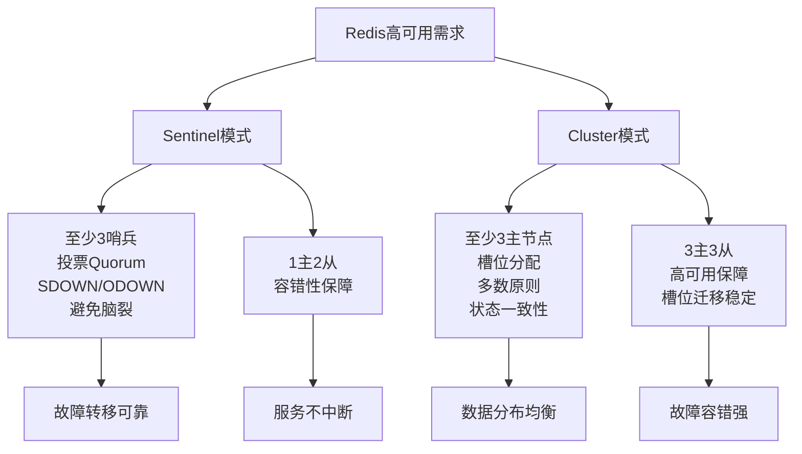

## 八、Redis Cluster 原理与部署

以下是针对Redis Cluster的原理介绍与部署步骤，基于最小的3台主节点配置，适合3位同学协作完成实验。实验环境假设有3台服务器，IP分别为`192.168.1.101`、`192.168.1.102`和`192.168.1.103`，每台服务器部署一个主节点（共3个Redis实例）。内容将涵盖原理分析和具体部署步骤，确保通俗易懂且具有实践指导意义。

---

### 8.1 Redis Cluster 原理与最小配置分析

- **最小配置要求**：  
  Redis Cluster建议至少部署3台主节点（Master），以实现完整的数据分片功能和高可用性基础。  
- **原因分析**：  
  1. **数据分片与槽位分配的完整性**：  
     Redis Cluster通过16384个槽位（Slot）实现数据分片，每个槽位负责存储一部分数据。为了确保数据分布均衡，槽位必须完整分配到所有主节点。如果只有1台主节点，所有槽位集中在单一节点，无法实现分片效果，等同于单机模式；如果只有2台主节点，槽位分配虽可实现，但容错性极差（一台故障即丢失一半数据）。而3台主节点可以将16384个槽位较为均衡地分配（如每台约5461个槽位），既实现了数据分片，又为容错性提供了基础。  
  2. **故障容错与多数原则（Majority）**：  
     Redis Cluster采用去中心化的设计，节点间通过Gossip协议通信，并在故障转移时依赖多数原则（Majority）决定集群状态。如果只有2台主节点，网络分区或单台故障会导致无法形成多数（1:1或1:0），集群可能陷入不一致状态，甚至无法提供服务。而3台主节点配置下，即使1台故障，剩余2台仍能形成多数（2>1.5），确保集群状态一致性，避免数据丢失或冲突。  
  3. **集群状态一致性**：  
     Redis Cluster中，每个节点维护集群状态信息（Cluster State），包括槽位分配、节点角色等，通过Gossip协议同步。如果少于3台主节点，集群状态可能无法达成一致，导致故障转移失败或状态不一致（例如，部分节点认为某节点是主节点，另一些节点不认可）。至少3台主节点确保了即使发生网络分区，仍有一方能形成多数，维持集群状态一致性。  
  4. **槽位迁移与动态扩展的稳定性**：  
     Redis Cluster支持动态扩容和缩容，通过槽位迁移（Slot Migration）实现数据重新分配。如果初始只有2台主节点，新增节点或故障时槽位迁移可能导致数据分布极不均衡，甚至引发大规模数据丢失。而3台主节点作为最小配置，可以在扩容或故障时更平稳地进行槽位迁移，减少对业务的影响。  
- **通俗类比**：  
  想象一个大仓库分成多个小仓库存储货物，3个小仓库是最少配置，能基本实现货物（数据）分散存放。如果只有2个小仓库，一个坏了就丢一半货物，太冒险；3个小仓库即使坏1个，另2个还能继续运营，损失可控。16384个槽位就像16384个货架，必须分到至少3个仓库才能合理摆放。集群状态一致性就像仓库管理员必须统一账本，3个仓库才能确保即使1个账本出错，另2个还能对账，避免混乱。  
- **实际场景**：  
  某电商平台部署Redis Cluster存储商品库存数据，使用3台主节点。16384个槽位平均分配到3个主节点，每节点负责约5461个槽位。当一台主节点因硬件故障宕机时，集群通过多数原则（2/3）确认状态，整体仍可提供服务，仅短暂延迟，库存查询业务无明显影响。在后续扩容到5台主节点时，槽位迁移过程平稳，客户端通过`MOVED`重定向无缝适配。  
- **扩展思考**：  
  虽然3台主节点是最小配置，但生产环境中建议部署更多主节点（如5台或7台，保持奇数），以进一步分散数据和负载，提升容错能力。Cluster模式下还需关注槽位迁移成本，初始节点数量规划不足可能导致后期扩容时数据迁移开销过大，同时需优化客户端重定向逻辑（如支持`ASKING`命令），减少迁移期间的性能波动。

---

### 8.2 Redis Cluster 部署步骤（3台主节点，3位同学协作）

以下是基于3台服务器的最小Redis Cluster部署步骤，3位同学（同学A、B、C）分别负责一台服务器的配置和协作完成集群搭建。实验环境规划如下：  
- **主机1（192.168.1.101，同学A负责）**：主节点1（Master1，端口6379）。  
- **主机2（192.168.1.102，同学B负责）**：主节点2（Master2，端口6379）。  
- **主机3（192.168.1.103，同学C负责）**：主节点3（Master3，端口6379）。

#### 步骤1：确认Redis已安装（同学A、B、C各自完成）
假设3台服务器已安装Redis，若未安装，请执行以下命令（以Ubuntu为例）：  
```bash
sudo apt update
sudo apt install -y redis-server
```
确认Redis版本支持Cluster模式（建议5.0以上）：  
```bash
redis-server --version
```

#### 步骤2：清理Redis现有数据和集群配置（同学A、B、C各自完成）
在配置集群之前，需要清理Redis实例的现有数据和集群配置，以确保环境干净，避免旧配置导致集群创建失败。  
1. **登录Redis实例**：  
   连接到本地Redis实例：  
   ```bash
   redis-cli -h 192.168.1.101 -p 6379
   ```
   （同学B和C分别连接`192.168.1.102:6379`和`192.168.1.103:6379`）  
2. **认证密码**：  
   输入密码进行认证：  
   ```bash
   AUTH admin123
   ```
3. **重置集群配置**：  
   使用`CLUSTER RESET HARD`命令彻底重置集群配置，清除节点信息和槽位分配：  
   ```bash
   CLUSTER RESET HARD
   ```
   - `HARD`选项会强制重置集群状态，删除所有集群相关信息，适用于初始化或重新配置场景。  
4. **清理数据**：  
   使用`FLUSHALL`命令清除所有数据，确保Redis实例为空：  
   ```bash
   FLUSHALL
   ```
5. **确认清理完成**：  
   检查数据是否已清空：  
   ```bash
   KEYS *
   ```
   输出应为空，表示数据已清理。

#### 步骤3：修改Redis配置文件（同学A、B、C各自完成）
由于3台Redis已部署，现在需要修改配置文件以启用Cluster模式。以下是具体操作：  
1. **备份配置文件**：  
   备份默认配置文件以防万一：  
   ```bash
   sudo cp /etc/redis/redis.conf /etc/redis/redis.conf.bak
   ```
2. **修改配置文件以支持Cluster模式**：  
   打开Redis配置文件（假设为`/etc/redis/redis.conf`）：  
   ```bash
   sudo vim /etc/redis/redis.conf
   ```
   添加或修改以下内容：  
   ```
   port 6379
   bind 0.0.0.0
   cluster-enabled yes
   cluster-config-file nodes-6379.conf
   cluster-node-timeout 5000
   appendonly yes
   requirepass "admin123"
   ```
   - `cluster-enabled yes`：启用集群模式。  
   - `cluster-config-file nodes-6379.conf`：指定集群配置文件，记录节点信息。  
   - `cluster-node-timeout 5000`：设置节点超时时间，单位为毫秒。  
   - `requirepass "admin123"`：设置Redis密码，与已部署的密码一致。  
3. **重启Redis服务**：  
   重启Redis实例以应用配置：  
   ```bash
   sudo systemctl restart redis
   ```
   确认实例已启动：  
   ```bash
   ps aux | grep redis
   ```

#### 步骤4：创建Redis Cluster（同学A负责，B和C协助确认）
1. **同学A：使用`redis-cli`创建集群**：  
   在主机1上执行以下命令，将3个主节点加入集群：  
   ```bash
   redis-cli --cluster create 192.168.1.101:6379 192.168.1.102:6379 192.168.1.103:6379 --cluster-replicas 0 -a "admin123"
   ```
   - `--cluster-replicas 0`表示不添加从节点，仅配置3台主节点。  
   - `-a "admin123"`：指定密码为`admin123`，与配置文件一致。  
   - 系统会提示槽位分配方案（16384个槽位平均分配到3个主节点），输入`yes`确认。  
2. **同学B和C：确认集群状态**：  
   在各自主机上使用以下命令查看集群状态：  
   ```bash
   redis-cli -h 192.168.1.102 -p 6379 -a "admin123" cluster info
   redis-cli -h 192.168.1.103 -p 6379 -a "admin123" cluster info
   ```
   确认输出中`cluster_state:ok`，表示集群创建成功，并将结果反馈给同学A。  
   - **`cluster info`字段说明**：  
     执行`cluster info`命令会返回集群的详细信息，以下是常见字段的含义：  
     - `cluster_state`：集群状态，`ok`表示正常运行，`fail`表示集群不可用。  
     - `cluster_slots_assigned`：已分配的槽位数量，正常情况下应为16384。  
     - `cluster_slots_ok`：正常工作的槽位数量，理想情况下等于已分配槽位数量。  
     - `cluster_slots_pfail`：可能故障的槽位数量，通常为0。  
     - `cluster_slots_fail`：已故障的槽位数量，通常为0。  
     - `cluster_known_nodes`：集群中已知节点数量，此处应为3。  
     - `cluster_size`：主节点数量，此处应为3。  
     - `cluster_current_epoch`：当前集群轮数，用于故障转移和一致性管理。  
     - `cluster_my_epoch`：当前节点的轮数，通常与`cluster_current_epoch`一致。  
     这些字段帮助快速判断集群是否正常运行，是否有槽位或节点异常。

#### 步骤5：测试集群功能（同学A、B、C协作完成）
1. **同学A：测试数据读写与分片**：  
   连接到任意节点写入数据：  
   ```bash
   redis-cli -h 192.168.1.101 -p 6379 -a "admin123"
   SET key1 value1
   GET key1
   ```
   如果遇到`MOVED`重定向错误，按照提示连接到正确的节点进行操作。  
2. **同学B：模拟主节点故障**：  
   在主机2上停止主节点服务：  
   ```bash
   sudo systemctl stop redis
   ```
   通知同学A和C观察集群行为。  
3. **同学C：观察集群状态**：  
   在主机3上查看集群状态：  
   ```bash
   redis-cli -h 192.168.1.103 -p 6379 -a "admin123" cluster nodes
   ```
   确认`192.168.1.102:6379`是否标记为`fail`，并将结果反馈给同学A和B。  
4. **同学A：验证服务可用性**：  
   再次尝试读写数据，确认集群仍可正常工作：  
   ```bash
   redis-cli -h 192.168.1.101 -p 6379 -a "admin123" GET key1
   ```

#### 步骤6：连接Redis Cluster（同学A、B、C各自测试）
1. **使用`redis-cli`连接集群**：  
   使用`-c`参数启用集群模式，自动处理重定向：  
   ```bash
   redis-cli -c -h 192.168.1.101 -p 6379 -a "admin123"
   SET key2 value2
   GET key2
   ```
2. **使用GUI工具连接（如Another Redis Desktop Manager）**：  
   - 打开工具，添加新连接，选择“Cluster”模式。  
   - 输入任意节点地址（例如`192.168.1.101:6379`），设置密码`admin123`。  
   - 测试连接并保存，连接后可查看槽位分配和节点状态。


#### 6.5.3 总结与综合分析
- **核心原因**：  
  无论是Sentinel还是Cluster，最小3台节点的设计都源于分布式系统的一致性和容错性需求。Sentinel通过奇数哨兵节点的投票机制（Quorum）避免僵局和脑裂，结合主观下线（SDOWN）和客观下线（ODOWN）确保故障检测准确；Cluster通过至少3台主节点的槽位分配和多数原则（Majority）实现数据分片和故障容错，结合集群状态一致性和槽位迁移保障动态扩展。3台节点是实现高可用和一致性的最小配置，为后续部署和扩展提供基础保障。  
- **通俗总结**：  
  3台节点就像一个三人决策小组，最少能保证“多数决定”，避免争执不下（2人僵局），同时还能分担任务（数据或槽位）。无论是Sentinel的“裁判投票”和“双重确认（SDOWN到ODOWN）”，还是Cluster的“仓库分货”和“账本统一”，3台是最小安全线，少于3台就可能“翻车”。  
- **企业部署建议**：  
  - **Sentinel**：至少1主2从+3哨兵，哨兵节点保持奇数，分散部署避免单点故障，关注Quorum参数设置（建议为节点数/2+1），合理配置`down-after-milliseconds`避免误判主观下线。  
  - **Cluster**：至少3主3从，主节点保持奇数，合理规划初始槽位分配，避免后期频繁迁移，节点分布不同物理位置提升容错性，优化客户端对`MOVED`和`ASK`重定向的支持。  
  - **监控与优化**：无论哪种模式，建议配合监控工具（如Prometheus）实时追踪节点状态，关注网络延迟和故障转移时间，定期演练故障场景，确保3台节点配置下的高可用性。  
- **典型案例补充**：  
  某互联网公司初期使用Sentinel模式（1主2从+3哨兵）存储配置数据，主观下线和客观下线的双重机制确保了误判率极低；随着业务增长升级为Cluster模式（5主5从），初期3台主节点的经验为后续扩容和槽位迁移提供了基础。两种模式下，3台节点的最小配置都确保了早期部署的稳定性和可靠性，避免了单点故障带来的业务中断。  

#### 6.5.4 Mermaid示意图：3台节点的重要性

**示意图讲解**：  
- 上图展示了Sentinel和Cluster模式下，至少3台节点的配置如何满足高可用需求。  
- Sentinel通过3个哨兵节点实现投票Quorum、主观下线（SDOWN）到客观下线（ODOWN）的准确判断和避免脑裂，通过1主2从保障容错性；Cluster通过3主节点实现槽位分配、多数原则和状态一致性，通过3主3从增强故障容错并保障槽位迁移稳定。  
- 3台节点是两种模式的最小安全配置，确保故障转移可靠、服务不中断、数据分布均衡和容错性强。  

---

**内容亮点与补充说明**：  
- **Sentinel模式补充**：新增了“主观下线（SDOWN）”和“客观下线（ODOWN）”的关键概念，详细解释了故障检测的双重机制，以及为何3个哨兵节点是确保Quorum和避免误判的最小配置，覆盖了面试高频考点。  
- **Cluster模式补充**：新增了“集群状态一致性”和“槽位迁移”相关内容，强调了多数原则在故障转移和动态扩展中的作用，以及客户端重定向（如`MOVED`和`ASK`）对稳定性的影响，确保覆盖常见考点。经检查，Cluster部分已涵盖槽位分配、多数原则、从节点容错等核心概念，未发现其他明显缺失点。  
- **通俗易懂与技术深度结合**：通过类比和实际案例，将复杂概念（如SDOWN/ODOWN、槽位迁移）转化为直观理解，同时保留技术细节，适合学习和面试准备。  
- **可视化更新**：Mermaid图中新增了SDOWN/ODOWN和状态一致性、槽位迁移等关键词，逻辑更全面。  

如果还有其他需要补充的内容（如更聚焦某个概念或增加具体配置参数示例），请随时告诉我！