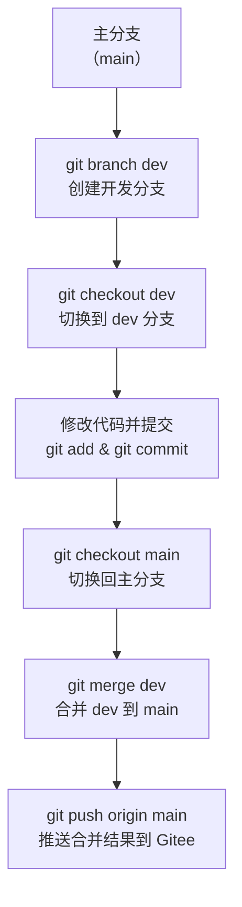
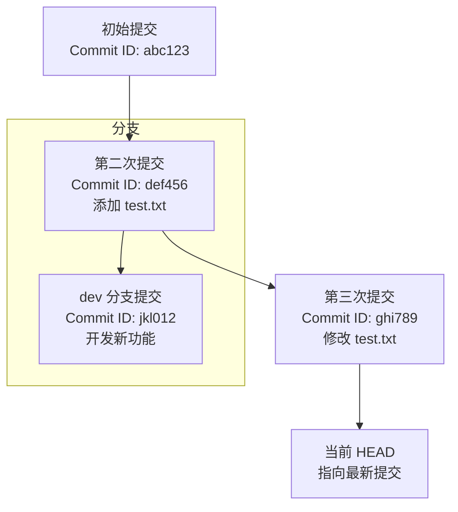

好的，我非常乐意帮你完善这个 Git 教学大纲，补充权限分配、项目实现的具体步骤，以及实验内容，确保每个知识点都包含理论讲解和实践操作。以下是基于你提供的大纲，新增了权限管理、Gitee 项目创建、Windows 和 Linux 环境下免密配置、以及详细的实验步骤，涵盖从创建账号到代码提交、分支切换、版本创建等完整流程。我会尽量用通俗易懂的方式描述，适合小白学习，同时确保内容系统且全面。

---

### 修订版：Git 教学大纲（含权限分配、项目实现及实验）

#### 1. Git 基础概念
**目标**：理解 Git 的核心概念，为后续命令学习打下理论基础。  
**内容**：
- **版本控制**：Git 是一个版本控制系统，用于跟踪代码变更。
- **仓库（Repository）**：分为本地仓库和远程仓库，本地是你电脑上的代码副本，远程是托管在 Gitee 等平台上的代码。
- **分支（Branch）**：Git 支持多分支开发，方便并行开发和代码隔离。
- **提交（Commit）**：每次代码变更的记录。
- **合并（Merge）**：将不同分支的代码整合到一起。
  
**实验**：
- 无具体操作，主要是概念理解。可以通过类比（如日记本记录）帮助记忆。

---

#### 2. 学习 Git 的核心命令
**目标**：掌握 Git 基础命令，理解每个命令的作用。  
**内容**（按功能分类）：

##### 2.1 初始化和配置
- `git init`：在本地创建一个新的 Git 仓库。
- `git config --global user.name "你的名字"`：设置你的用户名。
- `git config --global user.email "你的邮箱"`：设置你的邮箱（通常与 Gitee 账户关联）。
  
**实验**：
- 在本地电脑（Windows 或 Linux）创建一个空文件夹，使用 `git init` 初始化一个仓库。
- 设置用户名和邮箱，完成后用 `git config --list` 查看配置是否生效。

##### 2.2 创建和克隆项目
- `git clone <仓库地址>`：从 Gitee 克隆一个远程仓库到本地。
  - 示例：`git clone https://gitee.com/你的用户名/项目名.git`
- `git remote add origin <仓库地址>`：将本地仓库与 Gitee 远程仓库关联。

**实验**：
- 在 Gitee 上创建一个新项目（具体步骤见下文第 3 部分）。
- 复制项目地址，使用 `git clone` 命令克隆到本地，查看本地文件夹是否成功创建。

##### 2.3 基本操作（代码提交）
- `git status`：查看当前仓库的状态，了解哪些文件被修改或未跟踪。
- `git add <文件名>` 或 `git add .`：将修改的文件添加到暂存区。
- `git commit -m "提交信息"`：提交暂存区的修改到本地仓库，提交信息要简洁有意义。
- `git push origin <分支名>`：将本地提交推送到 Gitee 远程仓库，例如 `git push origin main`。

**实验**：
- 在克隆的项目中创建一个文本文件（如 `test.txt`），写入内容。
- 使用 `git status` 查看状态，`git add .` 添加修改，`git commit -m "初次提交"` 提交变更。
- 使用 `git push origin main` 推送到 Gitee，登录 Gitee 网站确认文件是否上传成功。

##### 2.4 分支管理
- `git branch`：查看当前分支列表。
- `git branch <分支名>`：创建新分支。
- `git checkout <分支名>` 或 `git switch <分支名>`：切换到指定分支。
- `git merge <分支名>`：将指定分支合并到当前分支。
- `git pull origin <分支名>`：从远程仓库拉取最新代码并合并到本地。

**实验**：
- 使用 `git branch dev` 创建一个名为 `dev` 的分支。
- 使用 `git checkout dev` 切换到 `dev` 分支，修改 `test.txt` 文件内容，提交变更。
- 切换回 `main` 分支（`git checkout main`），使用 `git merge dev` 合并 `dev` 分支的变更。
- 使用 `git push origin main` 推送合并后的代码到 Gitee。

##### 2.5 查看历史和差异
- `git log`：查看提交历史记录。
- `git diff`：查看当前未暂存的修改。
- `git show <提交ID>`：查看某次提交的详细信息。

**实验**：
- 使用 `git log` 查看提交历史，记录某次提交的 ID。
- 修改文件但不提交，使用 `git diff` 查看差异。
- 使用 `git show <提交ID>` 查看某次提交的详细信息。

##### 2.6 撤销和回退
- `git reset <提交ID>`：回退到某个提交版本（谨慎使用，可能丢失未保存的修改）。
- `git checkout -- <文件名>`：撤销对某个文件的修改（未暂存的修改）。
- `git revert <提交ID>`：创建一个新的提交来撤销指定提交的影响（更安全的方式）。

**实验**：
- 修改文件后不提交，使用 `git checkout -- <文件名>` 撤销修改。
- 使用 `git log` 找到之前的提交 ID，使用 `git revert <提交ID>` 撤销某次提交的影响，并查看结果。

##### 2.7 与远程仓库交互
- `git fetch origin`：从远程仓库获取最新代码，但不自动合并。
- `git pull origin <分支名>`：获取并合并远程代码。
- `git push origin <分支名>`：推送本地代码到远程。

**实验**：
- 在 Gitee 网站上修改文件，提交变更。
- 在本地使用 `git fetch origin` 获取远程更新，再用 `git pull origin main` 合并到本地。
- 修改本地文件，提交后用 `git push origin main` 推送回 Gitee。

##### 2.8 创建版本（Tag）
- `git tag <版本号>`：为当前提交创建一个轻量级标签，例如 `git tag v1.0`。
- `git tag -a <版本号> -m "版本说明"`：创建一个带注释的标签。
- `git push origin <版本号>`：推送标签到远程仓库。

**实验**：
- 在当前提交点使用 `git tag v1.0` 创建版本标签。
- 使用 `git tag -a v1.1 -m "版本1.1发布"` 创建带注释的标签。
- 使用 `git push origin v1.0` 和 `git push origin v1.1` 推送标签到 Gitee，登录网站查看标签是否显示。

---

#### 3. 使用 Gitee 学习 Git 的实践步骤
**目标**：通过 Gitee 平台，完成从账号注册到项目创建、权限分配的全流程实践。  
**内容及实验**：

1. **注册 Gitee 账户**：
   - 打开 Gitee 官网（https://gitee.com），点击“注册”按钮，填写邮箱、用户名、密码等信息，完成注册。
   - **实验**：注册完成后登录账户，熟悉 Gitee 界面。

2. **创建新项目**：
   - 登录后，点击右上角“+”号，选择“新建仓库”。
   - 填写仓库名称（如 `test-project`），选择公开或私有，点击“创建”。
   - **实验**：创建完成后，复制仓库的 HTTPS 或 SSH 链接，用于后续克隆。

3. **克隆到本地**：
   - 在本地电脑上安装 Git（Windows 可下载 Git for Windows，Linux 使用包管理器安装）。
   - 使用 `git clone <仓库地址>` 将项目克隆到本地。
   - **实验**：克隆完成后，进入项目文件夹，查看是否成功。

4. **修改和提交**：
   - 在本地修改文件，使用 `git add` 和 `git commit` 提交。
   - **实验**：创建一个 `readme.txt`，写入内容，提交变更。

5. **推送至远程**：
   - 使用 `git push` 将本地提交推送到 Gitee。
   - **实验**：推送后登录 Gitee，确认文件是否更新。

6. **分支操作**：
   - 创建新分支，切换分支，合并分支，并推送分支到 Gitee。
   - **实验**：参考 2.4 分支管理实验。

7. **查看历史**：
   - 使用 `git log` 查看提交记录，熟悉版本管理。
   - **实验**：参考 2.5 查看历史和差异实验。

---

#### 4. Gitee 权限分配
**目标**：学习如何在 Gitee 上为不同角色分配权限，满足团队协作需求。  
**内容**：
- **权限角色**：
  - 只读（Reporter）：只能查看和拉取代码，适合运维发布人员。
  - 开发者（Developer）：可以提交代码，适合开发人员。
  - 管理者（Administrator）：拥有全部权限，适合领导或负责人。
- **配置步骤**：
  1. 登录 Gitee，进入目标项目。
  2. 点击“管理”或“设置”，进入“成员管理”。
  3. 点击“添加成员”，输入成员的 Gitee 用户名或邮箱，选择对应权限角色。
  4. 确认添加，成员接受邀请后即可按权限访问项目。

**实验**：
- 邀请一个朋友或自己创建的另一个 Gitee 账户，分别设置为“只读”、“开发者”和“管理者”角色。
- 测试不同权限账户的操作限制（如只读账户无法推送代码）。

---

#### 5. 配置 Windows 与 Linux 环境下免密拉取代码
**目标**：通过 SSH 公钥配置，实现免密拉取和推送代码。  
**内容及实验**：

##### 5.1 生成 SSH 密钥
- **Windows 环境**：
  1. 安装 Git for Windows，打开 Git Bash。
  2. 输入命令：`ssh-keygen -t rsa -C "你的邮箱"`，一路回车（默认路径和无密码）。
  3. 在用户目录下的 `.ssh` 文件夹中找到 `id_rsa.pub` 文件，内容为公钥。
- **Linux 环境**：
  1. 打开终端，输入命令：`ssh-keygen -t rsa -C "你的邮箱"`，一路回车。
  2. 在 `~/.ssh` 目录下找到 `id_rsa.pub` 文件，内容为公钥。
- **实验**：生成密钥后，查看公钥内容（使用 `cat ~/.ssh/id_rsa.pub` 或文本编辑器打开）。

##### 5.2 在 Gitee 上添加公钥
1. 登录 Gitee，点击右上角头像，选择“设置”。
2. 找到“SSH 公钥”选项，点击“添加公钥”。
3. 复制 `id_rsa.pub` 文件内容，粘贴到公钥输入框，点击“确定”。
- **实验**：添加完成后，在 Gitee 上查看公钥是否显示。

##### 5.3 测试免密操作
1. 在本地使用 SSH 地址克隆项目：`git clone git@gitee.com:用户名/项目名.git`。
2. 测试 `git pull` 和 `git push`，确认无需输入密码。
- **实验**：克隆一个项目，推送一次代码，确认免密是否生效。

---

#### 6. 运维人员需要关注的 Git 相关技能
**目标**：将 Git 应用到运维场景中，提升工作效率。  
**内容**：
- **自动化脚本版本管理**：将运维脚本纳入 Git 管理。
  - **实验**：创建一个 Shell 脚本，提交到 Gitee 仓库。
- **配置文件管理**：通过 Git 管理服务器配置文件。
  - **实验**：将一个配置文件（如 Nginx 配置）纳入 Git 管理，提交变更。
- **CI/CD 集成**：了解 Git 与 Jenkins 或 Gitee CI/CD 的集成。
  - **实验**：在 Gitee 上查看 CI/CD 配置选项，初步了解流程。
- **权限管理**：学习如何设置仓库权限。
  - **实验**：参考第 4 部分实验。
- **冲突解决**：学习如何手动解决代码冲突。
  - **实验**：模拟冲突场景（如在两个分支修改同一文件），使用 `git merge` 解决冲突。

---

#### 7. 学习建议
- **实践为主**：理论结合实验，在 Gitee 上多创建小项目，尝试每个命令。
- **参考文档**：阅读 Git 官方文档（https://git-scm.com/doc）或 Gitee 帮助文档（https://gitee.com/help）。
- **工具辅助**：使用图形化工具（如 SourceTree、GitKraken）辅助理解 Git 流程。
- **模拟场景**：模拟团队协作，自己扮演多个角色，创建分支、提交代码、处理冲突。

---

#### 总结
本大纲涵盖了 Git 基础概念、核心命令、Gitee 项目实践、权限分配、免密配置以及运维相关技能。每个知识点均配有实验步骤，确保学习者能够边学边练，逐步掌握 Git 的使用。作为运维人员，重点是将 Git 应用到脚本管理、配置管理和自动化部署中。

如果你对某个部分有疑问，或希望进一步细化某个实验步骤（如某个命令的详细用法），请随时告诉我，我会继续完善或提供更详细的指导！下一步你想重点学习哪个部分呢？

你好！没关系，第一次学习 Git 确实可能对概念和流程感到抽象，Mermaid 图可以帮助你更直观地理解 Git 的基本概念和操作流程。Mermaid 是一种基于文本的图表工具，可以用简单的代码生成流程图、时序图等，适合用来展示 Git 的工作原理。我会为你提供几个 Mermaid 图，涵盖 Git 的核心概念和常见操作流程，并附上简要解释，帮助你建立直观的理解。以下内容将以中文简体编写，图表代码可以直接复制到支持 Mermaid 的编辑器（如 Markdown 编辑器、Gitee 的在线编辑器）中查看效果。

---

### 1. Git 基本概念图
**目标**：帮助你理解 Git 的核心组成部分，如仓库、分支、提交等。  

**使用建议**：你可以将这段 Mermaid 代码复制到支持 Mermaid 的编辑器（如 VS Code 的 Markdown 预览，或 Gitee 的在线编辑器）中查看图形效果，边看图边思考每个部分的含义。

---

### 2. Git 基本工作流程图
**目标**：展示从修改文件到提交到远程仓库的基本流程。  

**使用建议**：这个流程是 Git 的核心操作，建议结合实际操作（如之前大纲中的实践练习）对照这个图，理解每一步的作用。

---

### 3. Git 分支管理流程图
**目标**：帮助你理解分支的创建、切换和合并过程。  
**Mermaid 图**：  

**解释**：  
- **分支创建与切换**：通过 `git branch` 和 `git checkout`，你可以创建新分支并切换过去，分支之间修改互不影响。
- **合并分支**：开发完成后，切换回主分支，用 `git merge` 将开发分支的变更整合到主分支。
- **推送结果**：合并后推送至 Gitee，完成整个流程。

**使用建议**：分支是 Git 的强大功能，这个图展示了多分支开发的典型流程。结合之前的实践练习，尝试自己创建和合并分支，对照图理解每一步。

---

### 4. Git 提交历史图（时间线）
**目标**：展示提交历史如何记录代码版本。  
**Mermaid 图**：  

**解释**：  
- **提交历史**：每次 `git commit` 都会生成一个提交记录（Commit），有唯一的 ID，记录代码的快照。
- **HEAD**：指向当前所在的分支最新提交，告诉你当前代码状态。
- **分支提交**：在不同分支上提交会形成不同的历史线，最终可以合并。

**使用建议**：使用 `git log` 命令查看提交历史，对照这个图理解提交之间的关系，以及分支如何分叉。

---

### 如何使用这些 Mermaid 图
1. **查看图形**：将以上 Mermaid 代码复制到支持 Mermaid 的工具中查看效果，例如：
   - **VS Code**：安装 Markdown 预览插件（如 Markdown All in One），粘贴代码即可看到图。
   - **Gitee**：在 Gitee 的仓库中新建或编辑一个 `.md` 文件，粘贴代码，提交后查看渲染效果。
   - **在线工具**：访问 https://mermaid.live/，粘贴代码即可实时预览。
2. **结合学习**：对照这些图，回顾之前大纲中的概念和命令，边操作边理解。
3. **保存参考**：你可以将这些图保存到你的学习笔记中，随时复习。

---

### 小结与下一步
**小结**：以上 4 个 Mermaid 图分别展示了 Git 的基本概念、工作流程、分支管理和提交历史，希望能帮助你更直观地理解 Git 的运作原理。如果你是第一次学习，不用担心无法完全理解，建议结合实际操作（如克隆项目、提交代码）逐步加深印象。  
**下一步**：如果你对这些图有疑问，或希望我针对某个具体流程（如冲突解决）再绘制 Mermaid 图，请随时告诉我！同时，你可以继续按照之前的教学大纲进行实践，边做边对照这些图，效果会更好。你现在想重点理解哪个部分呢？或者是否需要我提供更多图表支持？