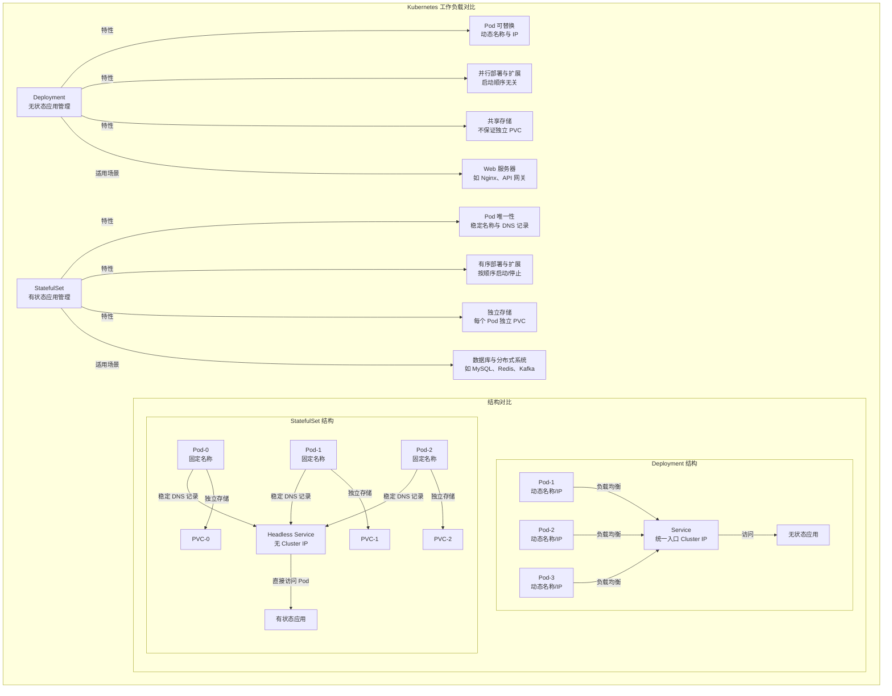

抱歉，我之前的表述中没有对 Headless Service 进行详细介绍。以下是对 Headless Service 的概念和作用的补充说明，我会将其融入到《第六部分：StatefulSet 原理》的内容中，以便学习者更好地理解 StatefulSet 与 Headless Service 的关系。

---

### 2. StatefulSet 在企业中的作用：有状态与无状态的区别（补充版）

- **什么是无状态（Stateless）？**
  - **定义**：无状态应用是指应用实例之间没有特定的身份差异，数据不依赖于特定实例，实例可以随时被替换或重新调度，而不影响应用的整体功能。无状态应用通常将数据存储在外部（如数据库、缓存服务），自身不保存状态信息。
  - **特点**：
    1. **实例可替换**：Pod 可以随时被删除或重新创建，新的 Pod 与旧的 Pod 没有区别。
    2. **动态网络标识**：Pod 的名称和 IP 地址是动态生成的，不需要固定。
    3. **并行部署**：Pod 的启动顺序无关紧要，可以并行创建或销毁。
  - **典型场景**：Web 服务器（如 Nginx）、API 网关、负载均衡器等。这些应用通常通过外部数据库或缓存存储数据，自身不保存状态。
  - **Kubernetes 管理方式**：无状态应用通常使用 Deployment 管理，结合 Service 提供负载均衡。

- **什么是有状态（Stateful）？**
  - **定义**：有状态应用是指应用实例具有特定的身份标识，数据依赖于特定实例，实例之间可能存在依赖关系（如主从关系），不能随意替换或重新调度。有状态应用通常需要将数据持久化存储在本地或特定存储资源中。
  - **特点**：
    1. **实例唯一性**：每个实例（Pod）有唯一的名称，不能随意替换。
    2. **稳定网络标识**：Pod 的名称是固定的，并且通过 Headless Service 提供稳定的 DNS 记录。虽然 Pod 的 IP 地址可能在重启或重新调度时发生变化，但 DNS 记录（如 `pod-name.service-name.namespace.svc.cluster.local`）始终指向正确的 Pod，方便节点间通信。
    3. **有序部署**：实例的启动和停止需要按照特定顺序进行，例如数据库集群的主从节点。
    4. **独立存储需求**：每个实例需要独立的持久化存储，不能共享同一存储资源。
  - **典型场景**：数据库（如 MySQL、PostgreSQL、MongoDB）、分布式缓存（如 Redis 主从集群）、消息队列（如 Kafka、ZooKeeper）等。这些应用需要保存状态信息，依赖特定实例的身份和数据。
  - **Kubernetes 管理方式**：有状态应用通常使用 StatefulSet 管理，结合 Headless Service 和 PVC 提供稳定的网络标识和独立存储。

- **什么是 Headless Service？**
  - **定义**：Headless Service 是 Kubernetes 中一种特殊的 Service 类型，与普通的 Service 不同，它不会为 Pod 分配一个统一的 Cluster IP 地址，也不会提供负载均衡功能。相反，Headless Service 直接返回与该 Service 关联的所有 Pod 的 IP 地址或 DNS 记录，允许客户端直接访问特定的 Pod。
  - **特点**：
    1. **无 Cluster IP**：Headless Service 的 `spec.clusterIP` 字段设置为 `None`，表示不分配统一的 IP 地址。
    2. **直接访问 Pod**：通过 Headless Service，客户端可以获取到每个 Pod 的独立 DNS 记录（如 `pod-name.service-name.namespace.svc.cluster.local`），从而直接与特定 Pod 通信。
    3. **稳定 DNS 记录**：对于 StatefulSet 管理的 Pod，Headless Service 提供稳定的 DNS 记录，即使 Pod 的 IP 地址发生变化，DNS 记录依然指向正确的 Pod。
  - **与 StatefulSet 的关系**：StatefulSet 通常与 Headless Service 配合使用，因为有状态应用需要每个 Pod 具有唯一的网络标识，方便 Pod 之间直接通信（如数据库主从节点的同步）。Headless Service 通过 DNS 记录为每个 Pod 提供稳定的访问入口，而 StatefulSet 保证 Pod 名称的唯一性和有序性。
  - **典型配置**：在 StatefulSet 的 `spec.serviceName` 字段中指定一个 Headless Service 的名称，Kubernetes 会自动为该 StatefulSet 创建的每个 Pod 生成对应的 DNS 记录。
  - **示例**：假设有一个名为 `redis-service` 的 Headless Service，关联到一个名为 `redis-statefulset` 的 StatefulSet，Pod 名称为 `redis-statefulset-0`，则可以通过 DNS 记录 `redis-statefulset-0.redis-service.default.svc.cluster.local` 直接访问该 Pod。

- **StatefulSet 在企业中的作用**：
  1. **管理分布式数据库**：企业在部署数据库集群（如 MySQL 主从、MongoDB 副本集）时，使用 StatefulSet 可以确保每个数据库节点有唯一的标识和独立存储，支持主从复制和数据一致性。
  2. **支持分布式系统**：对于需要协调一致的分布式系统（如 ZooKeeper、Etcd），StatefulSet 提供有序部署和稳定标识，确保节点间通信和状态同步。
  3. **持久化存储管理**：StatefulSet 通过 `volumeClaimTemplates` 为每个 Pod 自动创建独立的 PVC，简化了存储管理，特别适合需要独立数据存储的应用。
  4. **高可用性与容错**：StatefulSet 支持 Pod 的有序重启和恢复，确保在故障恢复时不会破坏应用的状态依赖（如主从关系）。
- **互动思考**：问学习者，假设企业需要部署一个 Kafka 集群，Kafka 的每个节点需要独立存储日志数据并保持固定标识，是应该选择 Deployment 还是 StatefulSet？为什么？

---

### 3. Mermaid 结构图：StatefulSet 与 Deployment 的对比与原理（补充版）

- **图解说明**：
  1. **Deployment 部分**：
     - 展示了 Deployment 管理无状态应用的特性，Pod 名称和 IP 动态生成，通过 Service 提供负载均衡和统一的 Cluster IP 入口。
     - 强调 Pod 是可替换的，适用于不需要特定标识和独立存储的应用。
  2. **StatefulSet 部分**：
     - 展示了 StatefulSet 管理有状态应用的特性，Pod 名称固定，通过 Headless Service 提供稳定的 DNS 记录，而非统一的 Cluster IP。
     - 每个 Pod 分配独立的 PVC，确保数据隔离和持久化，适用于需要唯一性和有序性的应用。
  3. **特性对比**：
     - 从 Pod 唯一性、部署顺序和存储管理三个方面对比了两者的差异，帮助学习者理解为什么有状态应用需要 StatefulSet。
- **互动思考**：问学习者，根据这个图，StatefulSet 的 Headless Service 和 Deployment 的 Service 有何不同？为什么 Headless Service 更适合有状态应用？

---

以上内容补充了对 Headless Service 的详细介绍，解释了其定义、特点以及与 StatefulSet 的关系，并更新了 Mermaid 图中的相关描述。如果您有其他建议或需要进一步调整内容，请随时告知！