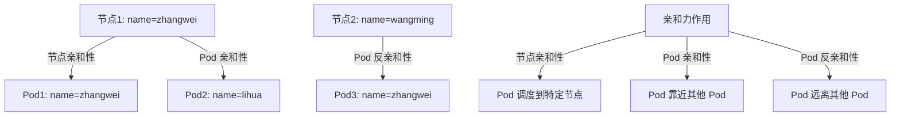

你好！如果你在 Kubernetes 环境中只有 `name=名字拼音` 标签可用，我会根据这个标签来调整亲和力示例和配置，确保内容贴合你的实际情况。以下是基于 `name=名字拼音` 标签的优化教案片段，重点是亲和力配置示例和说明。我假设 `名字拼音` 是类似 `zhangwei` 这样的具体值，如果有不同，请提供具体标签值，我会进一步调整。

---

## **二、亲和力（Affinity）**（基于 `name=名字拼音` 标签的示例）

### **1. 背景说明**
- 在你的环境中，节点或 Pod 的标签可能只有 `name=名字拼音` 这一种形式（例如 `name=zhangwei`）。
- 亲和力规则可以通过这个标签来控制 Pod 的调度位置，例如将 Pod 调度到特定名字拼音的节点，或让 Pod 靠近/远离特定名字拼音的其他 Pod。

#### **教学提示**
- 解释标签的作用：标签是 Kubernetes 中标识资源的方式，亲和力通过匹配标签来决定调度。
- 问学员：如果你只有 `name=名字拼音` 标签，你会如何用它来区分不同类型的节点或 Pod？

---

### **2. 简单示例（基于 `name=名字拼音` 标签）**
以下是针对你的标签设计的亲和力规则示例，展示如何使用 `name=名字拼音` 来实现节点亲和性和 Pod 反亲和性。

- **节点亲和性（硬性要求）**：
  强制 Pod 调度到带有 `name=zhangwei` 标签的节点（假设 `zhangwei` 是你环境中的一个具体拼音值）。
  ```yaml
  affinity:
    nodeAffinity:
      requiredDuringSchedulingIgnoredDuringExecution:  # 硬性要求，调度时必须满足
        nodeSelectorTerms:
        - matchExpressions:
          - key: name          # 匹配节点的标签键，这里是 name
            operator: In       # 操作符，表示值在列表中
            values:
            - zhangwei         # 匹配值，必须是 zhangwei
  ```
  **解释**：如果没有节点带有 `name=zhangwei` 标签，Pod 将不会被调度。适用于严格要求 Pod 调度到特定节点的场景，例如某个负责人的专用节点。

- **Pod 亲和性（软性要求）**：
  尽量将 Pod 调度到与带有 `name=zhangwei` 标签的 Pod 所在的节点。
  ```yaml
  affinity:
    podAffinity:
      preferredDuringSchedulingIgnoredDuringExecution:  # 软性要求，尽量满足
      - weight: 100           # 权重，值越高优先级越高（1-100）
        podAffinityTerm:
          labelSelector:
            matchLabels:
              name: zhangwei    # 匹配其他 Pod 的标签，寻找 name=zhangwei 的 Pod
          topologyKey: "kubernetes.io/hostname"  # 按主机名划分拓扑，同一主机名表示同一节点
  ```
  **解释**：调度器会尽量将 Pod 调度到与 `name=zhangwei` 的 Pod 相同的节点（例如相关服务需要靠在一起），但如果没有符合条件的节点，Pod 仍会被调度到其他地方。

- **Pod 反亲和性（软性要求）**：
  尽量避免 Pod 与其他带有 `name=zhangwei` 标签的 Pod 调度到同一节点。
  ```yaml
  affinity:
    podAntiAffinity:
      preferredDuringSchedulingIgnoredDuringExecution:  # 软性要求，尽量满足
      - weight: 100           # 权重，值越高优先级越高（1-100）
        podAffinityTerm:
          labelSelector:
            matchLabels:
              name: zhangwei    # 匹配其他 Pod 的标签，寻找 name=zhangwei 的 Pod
          topologyKey: "kubernetes.io/hostname"  # 按主机名划分拓扑，同一主机名表示同一节点
  ```
  **解释**：调度器会尽量将 Pod 分散到不同节点，避免与 `name=zhangwei` 的 Pod 在同一节点上（例如避免单点故障），但如果节点不足，Pod 仍会被调度。

#### **教学提示**
- 强调 `name=名字拼音` 标签的灵活性：虽然标签单一，但仍可以通过亲和力实现复杂的调度需求。
- 问学员：如果你有多个 `name=名字拼音` 标签值，如何用 Pod 反亲和性确保 Pod 分布均匀？

---

### **3. 直观理解：Mermaid 图（基于 `name=名字拼音` 标签）**
以下是基于 `name=名字拼音` 标签的亲和力效果图，帮助你直观理解调度结果。



#### **图表解释**
- **节点亲和性**：Pod1 因为节点亲和性规则，被调度到带有 `name=zhangwei` 标签的节点1。
- **Pod 亲和性**：Pod2 因为想靠近 Pod1（例如与 `name=zhangwei` 相关的服务），也被调度到节点1。
- **Pod 反亲和性**：Pod3 因为不想与其他 `name=zhangwei` 的 Pod 在同一节点，所以被调度到节点2（`name=wangming`）。

#### **教学提示**
- 用图表帮助学员理解：即使只有 `name=名字拼音` 标签，亲和力依然可以实现“聚集”和“分散”的调度效果。
- 问学员：如果节点1 宕机，Pod1 和 Pod2 都会受影响，如何调整亲和性规则来提高可靠性？

---

### **4. 亲和力配置建议（针对 `name=名字拼音` 标签）**
- **标签单一的挑战**：由于只有 `name=名字拼音` 标签，可能难以区分 Pod 或节点的具体角色（例如前端、数据库）。建议在条件允许时为资源添加更多描述性标签（如 `role=frontend`），以便更精细地控制调度。
- **当前可行方案**：
  - 使用 `name=名字拼音` 区分不同负责人或团队的资源，通过亲和性将相关 Pod 调度到对应节点。
  - 对于高可用需求，使用 Pod 反亲和性，确保相同 `name=名字拼音` 的 Pod 分散到不同节点。
- **注意事项**：
  - 如果 `name=名字拼音` 标签值较少，可能导致亲和性规则过于宽泛或过于严格，需根据实际节点数量调整硬性/软性要求。
  - 检查节点和 Pod 是否正确打上了 `name=名字拼音` 标签，避免因标签缺失导致调度失败。

#### **教学提示**
- 提醒学员：标签是亲和力规则的基础，使用前需确保节点和 Pod 的标签一致且准确。
- 问学员：如果你的节点没有 `name=zhangwei` 标签，但 Pod 配置了硬性节点亲和性，会发生什么？如何解决？

---

### **5. 总结与互动讨论**
#### **总结**
- 即使只有 `name=名字拼音` 标签，亲和力依然可以有效控制 Pod 调度，实现节点亲和性、Pod 亲和性和反亲和性。
- 通过硬性要求和软性要求，可以灵活调整调度策略，满足不同场景需求。
- 建议未来为资源添加更多标签，以便更精确地应用亲和力规则。

#### **互动讨论问题**
- 在只有 `name=名字拼音` 标签的环境中，你会如何用亲和性优化应用性能？
- 如果你有多个相同 `name=名字拼音` 的 Pod，如何用反亲和性提高应用的高可用性？
- 如果节点标签值不足以支持你的调度需求，你会如何改进标签体系？

---

### **补充说明**
- 如果 `名字拼音` 标签的具体值与我假设的 `zhangwei`、`lihua`、`wangming` 不一致，请提供实际值，我会进一步调整示例。
- 如果你有具体的应用场景（例如需要将某些 Pod 绑定到特定拼音名字的节点），请告诉我，我可以为你定制更贴合的亲和力规则。

希望这些基于 `name=名字拼音` 标签的亲和力示例和说明对你有帮助！如果需要进一步优化教案或补充内容，请随时告知。祝学习顺利！😊