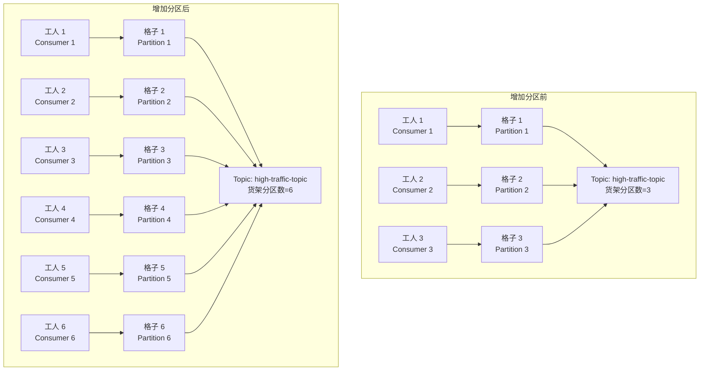
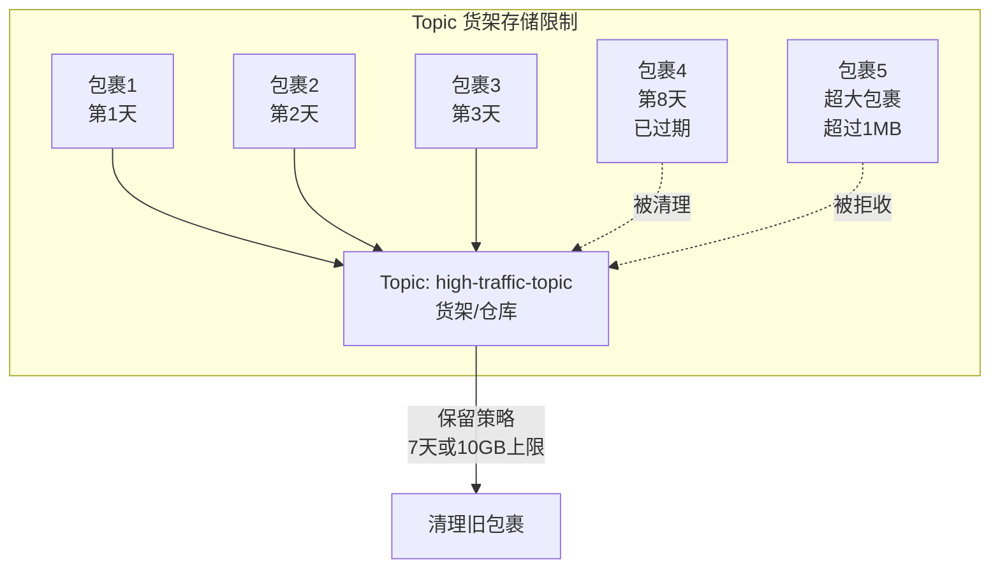
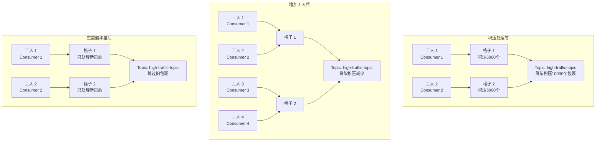

没问题，我很乐意为初学者提供更直观的解释。之前我已经针对“企业级问题解决：消息处理与优化”部分提供了详细的教案内容，并结合 Mermaid 图和形象类比进行了补充说明。由于您再次贴出了教案内容并提出相同的需求，我会确保之前的解释得以延续，并针对您可能需要的更多细节或不同角度的类比进行补充。如果您有新的具体关注点，请随时指出，我会重点调整。

---

### 针对小白的补充解释：Mermaid 图与形象类比

为了帮助初学者更好地理解 Kafka 在企业级应用中的问题解决和优化方法，我将通过 **形象类比**（以日常生活场景比喻 Kafka 概念）和 **Mermaid 图**（直观展示结构和流程）来进一步解释教案中的核心内容。以下内容围绕“消息来得太快”、“限制最大消息数”和“消息积压处理不过来”三个问题展开。

#### 1. 整体 Kafka 系统类比：快递分拣中心
在开始具体问题之前，先用一个统一的类比帮助大家建立 Kafka 的整体认知：
- **Kafka 集群**：就像一个大型“快递分拣中心”，负责接收、存储和分发快递包裹（消息）。
- **Broker 节点**：分拣中心里的每个“分拣站”，负责处理一部分包裹（存储和转发消息）。
- **Topic**：就像分拣中心里的“分类货架”，每个货架存放特定类型的包裹（特定主题的消息）。
- **Partition（分区）**：每个货架上的“格子”，一个 Topic 分成多个格子，方便多人同时处理。
- **生产者（Producer）**：就像“寄快递的人”，不断把包裹送到分拣中心。
- **消费者（Consumer）**：就像“收快递的人”，从分拣中心取走包裹。
- **消费者组**：就像一个“收件团队”，团队里多人分工取包裹，每个格子只被一个人负责，避免重复。

这个类比将贯穿下面的问题解释，帮助大家把抽象概念映射到熟悉的场景。

---

#### 2. 问题 1：消息来得太快

##### 形象类比：快递包裹来得太快
- **问题场景**：想象快递分拣中心每天收到 10 万个包裹，但分拣站的工人（消费者）和仓库空间（Broker 存储）只能处理 5 万个，包裹堆积如山，中心快要“爆仓”。
- **解决方法类比**：
  1. **增加分区数**：就像把一个大货架拆分成更多小格子，每个格子可以分配给不同工人同时处理，加快分拣速度。
  2. **扩展 Broker 节点**：就像在城市里新增一个分拣站，把一部分包裹分流过去，减轻原有站点的压力。
  3. **调整生产者配置**：就像告诉寄快递的人“别一次送太多，攒一攒再送”（设置 `linger.ms` 批量发送），或者“把包裹压缩一下再送”（设置 `compression.type`），减少分拣站的负担。
  4. **生产者限流**：就像在分拣站门口设个限流闸，每天只收一定数量的包裹，确保不超载。

##### Mermaid 图：增加分区数的效果

**图解释**：
- 增加分区数就像把货架分成更多小格子，每个格子可以被一个工人（消费者）负责，处理速度变快，包裹不再堆积。
- 注意：如果工人数量没增加（消费者数量不足），多出来的格子也没人处理，效果就不明显。

---

#### 3. 问题 2：限制最大消息数

##### 形象类比：限制包裹大小和存储数量
- **问题场景**：分拣中心的仓库空间有限，如果包裹太大或数量太多，仓库会装不下，影响正常运营。
- **解决方法类比**：
  1. **限制单条消息大小（message.max.bytes）**：就像规定每个包裹不能超过 5 公斤，超重的包裹直接拒收，确保分拣和存储不超载。
  2. **控制存储总量（log.retention.bytes、log.retention.hours）**：就像设定仓库最多存 1000 个包裹，或者只存 7 天的包裹，超限就清理掉旧包裹，给新包裹腾地方。

##### Mermaid 图：消息保留与清理策略

**图解释**：
- Topic 就像一个仓库，包裹（消息）有存储时间和大小限制。超过 7 天的旧包裹会被清理，超大包裹直接不收，确保仓库空间够用。

---

#### 4. 问题 3：消息积压处理不过来

##### 形象类比：包裹积压，分拣跟不上
- **问题场景**：分拣中心收到太多包裹，分拣工人（消费者）处理速度跟不上，包裹堆积如山，客户（业务）投诉延迟严重。
- **解决方法类比**：
  1. **增加消费者数量**：就像多雇佣几个分拣工人，每个工人处理一部分包裹，加速分拣。
  2. **优化消费者性能**：就像给工人更好的工具（调整参数），或者简化分拣流程（优化代码），让一个人能处理更多包裹。
  3. **临时扩容消费者组**：就像临时加派人手帮忙，处理完积压后再减少人数。
  4. **跳过积压消息（重置偏移量）**：就像直接扔掉过期的包裹，只处理新到的包裹，放弃旧的。
  5. **回压生产者**：就像告诉寄包裹的人“别送了，等我们处理完再送”，暂时停止接收新包裹。

##### Mermaid 图：消费者扩容与偏移量重置效果

**图解释**：
- **增加工人（消费者）**：原来只有 2 个工人处理 2 个格子，积压严重；增加到 4 个工人后，每个格子有更多人处理，积压快速减少。
- **重置偏移量**：就像放弃积压的旧包裹，工人只处理新到的包裹，分拣中心恢复正常运营。

---

### 补充：Docker 环境的类比
- **Docker 是什么**：就像一个“便携式集装箱”，把 Kafka 程序和它需要的环境（工具、配置）打包在一起，方便快速在任何主机上安装和运行。
- **为什么用 Docker**：就像用集装箱运货，无论在哪个码头（主机）都能直接卸货使用，不用担心环境不匹配，省时省力。

---

### 总结：为什么用类比和图表？
- **形象类比**：通过“快递分拣中心”这个贴近生活的场景，把 Kafka 的抽象概念（如 Broker、Partition、Consumer）转化为大家熟悉的事物，帮助小白快速建立直观认知。
- **Mermaid 图**：用图形化方式展示 Kafka 的问题解决过程（如分区增加、消费者扩容），让复杂的流程一目了然，方便理解和记忆。

如果您觉得某些部分还需要更详细的类比或图表，比如某个具体命令的操作效果，或者生产者与消费者交互的更细化流程，请随时告诉我，我会继续补充！另外，如果您有其他需求（比如手绘风格的示意图、更多生活化例子），也可以提出来，我会尽力配合。希望这些内容能帮助大家更好地学习 Kafka！