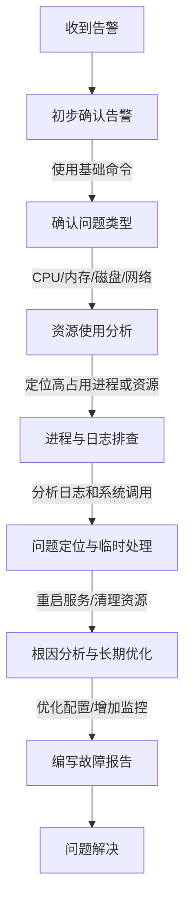

# 打造专业技术简历：从运维工程师视角提升求职竞争力

## 学习目标
1. **理解简历的作用与核心要素**：掌握简历作为求职工具的重要性，明确其目标是快速展示个人技能与价值。
2. **学会简历结构与内容撰写**：熟悉技术岗位简历的典型结构（如个人信息、技能详情、项目经验），并能针对运维工程师岗位撰写相关内容。
3. **将学习知识转化为简历亮点**：能够将Linux、Docker、Kubernetes等技术知识体系内容融入简历，突出专业能力和实践成果。
4. **掌握量化成果与针对性表达**：学会用数据和具体案例描述个人贡献，针对不同职位调整简历内容，提升匹配度。
5. **提升简历规范性与专业性**：掌握简历排版、语言简洁性和错误规避技巧，确保简历呈现专业形象。
6. **实践与反馈**：通过模拟撰写和案例分析，完成一份针对运维相关岗位的个性化简历，并根据反馈优化内容。

## 第一部分：知识体系分类与原理解析

### 1. 知识体系分类总结及对应工作内容
以下是将学习知识体系分类为几个模块，并对应到运维工程师及相关技术岗位的工作内容中。这些分类不仅帮助梳理学习内容，也便于学员将知识点与实际工作职责关联起来，方便简历撰写和面试准备。

#### (1) **基础技术与系统管理**
- **知识点**：
  - Linux基础知识篇（Linux基础命令：grep、awk、sed、crontab、du、lsblk、df、ps、top、free、iostat、netstat、ss等；vim文本处理、Sudo权限管理、SSH远程连接、systemctl服务管理、系统性能监控）
  - 计算机组成原理和服务器硬件架构
  - VMware虚拟化技术基础
  - Linux系统安装（Ubuntu）
- **对应工作内容**：
  - 服务器环境搭建与维护：安装和配置Linux系统，保障服务器正常运行。
  - 系统权限与安全管理：通过Sudo和SSH配置，确保系统访问安全。
  - 系统监控与故障排查：利用性能监控工具（如top、free、iostat）和网络分析工具（如netstat、ss），分析系统瓶颈，解决运行问题。
  - 日常运维操作：使用grep、awk、sed进行日志分析和文本处理；通过crontab设置定时任务；利用du、df、lsblk管理磁盘空间。
- **简历应用**：在“技能详情”或“工作经历”中，突出Linux系统管理能力，强调对各类基础命令的熟练使用，如“利用grep和awk分析日志，快速定位系统异常”或“通过crontab实现自动化任务调度，提升效率20%”。

#### (2) **服务部署与存储管理**
- **知识点**：
  - Linux服务发布（Nginx服务配置和管理）
  - LVM存储服务管理
  - NFS存储服务管理
  - Java Maven、Python pip、NodeJS npm/yarn、Go服务发布
- **对应工作内容**：
  - Web服务搭建与优化：配置Nginx实现负载均衡和反向代理，提升服务性能。
  - 存储方案设计与管理：利用LVM和NFS管理数据存储，确保数据高可用性。
  - 应用部署：支持多种语言环境下的服务发布，保障开发团队需求。
- **简历应用**：在“项目经验”中描述参与的服务部署项目，突出Nginx优化或存储管理成果。

#### (3) **网络与协议原理**
- **知识点**：
  - OSI七层模型与Web服务的关系
  - HTTP/HTTPS协议原理（请求/响应模型、状态码、SSL/TLS加密）
  - TCP/IP三次握手/四次挥手
  - CDN加速和缓存策略
- **对应工作内容**：
  - 网络问题排查：基于TCP/IP协议分析网络延迟或连接问题。
  - Web服务安全配置：通过HTTPS和SSL/TLS证书保障数据传输安全。
  - 性能优化：借助CDN和缓存策略提升用户访问速度。
- **简历应用**：在“技能详情”中列出对HTTP/HTTPS和TCP/IP的掌握，体现网络基础能力；在项目中提及相关优化成果。

#### (4) **编程与自动化**
- **知识点**：
  - Shell编程（脚本基础语法、变量条件判断、循环函数、文本处理、正则表达式、系统管理脚本、批量管理脚本）
  - Python基础知识（语法与数据类型、控制结构、函数模块、类与对象、封装继承多态）
- **对应工作内容**：
  - 自动化运维：编写Shell或Python脚本，实现服务器批量管理和任务自动化。
  - 工具开发：开发小型工具，提升运维效率，如日志分析、监控报警脚本。
- **简历应用**：在“技能详情”和“项目经验”中，突出脚本编写能力和自动化成果，如“通过Shell脚本实现批量部署，减少50%手动操作时间”。

#### (5) **数据库管理**
- **知识点**：
  - MySQL数据库（安装配置、SQL操作、约束与索引、主从同步、读写分离、备份恢复、InnoDB优化）
  - Redis/MySQL配合使用（缓存与消息队列）
- **对应工作内容**：
  - 数据库运维：配置和管理MySQL数据库，确保数据一致性和高可用性。
  - 性能优化：通过主从同步和读写分离，提升数据库查询效率。
  - 缓存管理：结合Redis实现数据缓存，减轻数据库压力。
- **简历应用**：在“项目经验”中描述数据库优化或主从架构搭建项目，量化性能提升效果。

#### (6) **容器化与集群管理**
- **知识点**：
  - Docker容器技术（基础概念、Dockerfile、镜像管理、容器生命周期）
  - Kubernetes容器编排（Pod、Deployment、Service、Volume、Ingress、RBAC、调度策略）
- **对应工作内容**：
  - 容器化部署：利用Docker实现应用容器化，提升部署灵活性。
  - 集群管理：通过Kubernetes管理大规模容器集群，实现滚动更新和负载均衡。
- **简历应用**：在“技能详情”中列出Docker和Kubernetes技能，在“项目经验”中描述容器化项目，突出自动化部署和稳定性成果。

#### (7) **云计算与云服务**
- **知识点**：
  - 阿里云服务（VPC、ECS、安全组、弹性IP、ACK部署、OpenVPN、Cert-Manager）
- **对应工作内容**：
  - 云环境管理：配置VPC和ECS，搭建云上应用环境。
  - 安全性保障：通过安全组和证书管理，提升云服务安全性。
- **简历应用**：在“工作经历”或“项目经验”中，描述云服务部署经验，体现对云原生技术的掌握。

#### (8) **DevOps与工具链**
- **知识点**：
  - DevOps工具链（Jenkins Pipeline、CI/CD流水线、Ansible、Prometheus、Loki、Argocd、Helm、Istio、Skywalking）
- **对应工作内容**：
  - 持续集成与交付：通过Jenkins和CI/CD流水线实现自动化构建和部署。
  - 配置管理：利用Ansible实现服务器配置自动化。
  - 监控与追踪：通过Prometheus和Skywalking监控系统性能和链路。
- **简历应用**：在“技能详情”中列出DevOps工具链掌握情况，在“项目经验”中描述CI/CD流水线搭建或监控系统优化的具体案例。

#### (9) **高级缓存与消息队列**
- **知识点**：
  - Redis高级应用（持久化、哨兵模式、Cluster集群、常见问题处理）
  - Kafka基础理论（Topic、Partition、Broker、高吞吐量原理）
- **对应工作内容**：
  - 高性能缓存：通过Redis集群提升系统响应速度。
  - 消息队列管理：利用Kafka实现分布式系统数据流处理。
- **简历应用**：在“项目经验”中描述Redis或Kafka相关项目，突出高并发场景下的优化经验。

### 2. 学员自我评估：理论理解、表达能力、实际应用
为了帮助学员更贴近自身实际情况评估对知识体系的掌握程度，建议从以下三个维度进行自我反思，并记录改进方向。以下是评估框架和示例说明，学员可根据个人情况填写。

#### (1) **是否能看懂理论**
- **定义**：能否理解知识点的理论基础、核心概念和工作原理。
- **评估标准**：
  - 完全理解：能深入理解理论内容，并能举例说明（如能理解grep的工作原理和正则表达式匹配逻辑）。
  - 基本理解：能看懂大部分理论，但部分细节不清（如知道top显示系统资源，但不清楚具体字段含义）。
  - 不理解：对理论内容感到困惑，难以把握核心概念。
- **示例**：
  - 知识点：Linux基础命令（grep、awk、sed）
  - 自我评估：基本理解
  - 原因：能看懂grep和sed的基本用法和原理，但对awk的内置变量和复杂脚本逻辑不太清晰。
  - 改进方向：通过阅读《Linux命令行与Shell脚本编程大全》，加强对awk理论的学习。

#### (2) **看懂后是否能表达**
- **定义**：在理解理论或操作的基础上，能否清晰、逻辑地向他人讲解知识点或使用经验，适用于面试或团队沟通。
- **评估标准**：
  - 能清晰表达：能用通俗语言或逻辑框架说明概念或操作（如能简洁描述crontab定时任务的设置步骤）。
  - 基本能表达：能说出内容，但逻辑不够清晰或术语使用不准确。
  - 难以表达：表达混乱，难以让听众理解。
- **示例**：
  - 知识点：Linux基础命令（top、free、netstat）
  - 自我评估：基本能表达
  - 原因：能说明top和free的作用，但讲解netstat的网络连接状态时不够流畅，缺乏具体案例支持。
  - 改进方向：多练习技术讲解，准备实际场景案例，如“如何用netstat排查端口占用问题”。

#### (3) **平常使用文档或AI助手是否能完整工作**
- **定义**：在日常学习或工作中，是否能通过查阅文档、借助AI助手完成相关任务，体现实际应用能力。
- **评估标准**：
  - 能独立完成：借助文档或AI助手，能顺利完成任务（如通过文档配置Nginx反向代理）。
  - 基本能完成：需要较多时间或多次尝试，但最终能完成任务。
  - 难以完成：即使有文档或AI助手支持，仍无法完成任务。
- **示例**：
  - 知识点：Linux基础命令（crontab、du、df）
  - 自我评估：能独立完成
  - 原因：通过查阅crontab文档，能成功设置定时任务；使用du和df时能快速查看磁盘使用情况。
  - 改进方向：尝试不依赖文档，直接记忆常用crontab表达式，提升效率。

#### 建议：
- 学员针对每个知识模块（如Linux基础命令、Docker容器技术）分别进行自我评估，记录在表格或笔记中，便于发现自身薄弱环节。
- 针对评估中“基本”或“难以”的维度，制定具体改进计划（如多阅读文档、参与实践项目、练习表达）。
- 在简历撰写和面试准备中，优先突出在“完全理解”、“能清晰表达”和“能独立完成”维度表现较好的知识点，增强自信心和说服力。

## 第二部分：掌握基础Linux命令后，故障案例

### 1. 主机CPU、内存、磁盘、网络等告警的排查方法
在运维工作中，主机资源告警（如CPU、内存、磁盘、网络）是常见问题，快速定位和解决问题是运维工程师的核心能力。以下是针对各类告警的排查思路和常用Linux命令，供学员掌握并应用到实际工作中。

#### (1) **CPU告警排查**
- **告警场景**：CPU使用率持续高（如超过80%），可能导致系统响应缓慢或服务异常。
- **排查思路**：
  1. 检查CPU整体使用率，确认是否存在高负载。
  2. 定位占用CPU高的进程，分析具体原因。
  3. 检查系统是否有异常任务或资源竞争。
- **常用命令**：
  - `top`：查看CPU整体使用率和进程占用情况，关注`%CPU`列，Shift+P按CPU排序。
  - `htop`：更直观的进程查看工具（需安装），支持筛选和排序。
  - `ps aux`：列出所有进程，结合`grep`查找特定进程，如`ps aux | grep java`。
  - `pidstat -u 1`：实时查看每个进程的CPU使用情况（需安装sysstat）。
- **后续处理**：若发现某个进程（如Java应用）占用CPU过高，可进一步查看日志或使用`strace`跟踪系统调用，分析是否为代码死循环或高并发请求导致。

#### (2) **内存告警排查**
- **告警场景**：内存使用率过高（如超过90%），可能导致系统swap频繁或进程被终止（OOM）。
- **排查思路**：
  1. 检查内存整体使用情况，确认是否存在内存泄漏或过载。
  2. 定位占用内存高的进程，分析是否合理。
  3. 检查是否有swap分区使用，评估内存压力。
- **常用命令**：
  - `free -m`：查看内存使用情况，关注`used`和`buff/cache`，以及`swap`使用量。
  - `top`：查看进程内存占用，关注`%MEM`列，Shift+M按内存排序。
  - `ps aux --sort=-rss`：按内存使用量排序进程，结合`grep`筛选。
  - `vmstat 1`：实时查看内存和swap使用情况，关注`si`（swap in）和`so`（swap out）。
- **后续处理**：若发现内存泄漏（如某个应用持续占用内存），可检查应用日志或重启服务；若swap频繁，考虑增加物理内存或优化应用配置。

#### (3) **磁盘告警排查**
- **告警场景**：磁盘空间不足（如使用率超过85%），可能导致日志无法写入或服务中断。
- **排查思路**：
  1. 检查磁盘整体使用情况，确认哪个分区空间不足。
  2. 定位占用空间大的文件或目录，分析是否可以清理。
  3. 检查是否有异常日志或临时文件堆积。
- **常用命令**：
  - `df -h`：查看各分区使用情况，关注`Use%`列。
  - `du -h --max-depth=1 /path`：查看指定路径下目录占用空间，逐步定位大文件。
  - `lsblk`：查看磁盘分区和挂载点结构。
  - `find /path -type f -size +100M`：查找指定路径下大于100M的文件。
- **后续处理**：删除不必要的临时文件或日志（如`/var/log`下的旧日志）；若为业务数据增长，可考虑扩容或迁移数据。

#### (4) **网络告警排查**
- **告警场景**：网络流量异常（如带宽占用过高）或连接问题，可能导致服务不可用。
- **排查思路**：
  1. 检查网络接口流量，确认是否存在异常高峰。
  2. 定位网络连接状态，分析是否有大量连接或攻击。
  3. 检查端口占用情况，确认服务是否正常监听。
- **常用命令**：
  - `netstat -tunlp`：查看端口监听和连接状态，结合`grep`筛选特定端口。
  - `ss -tunlp`：更高效地查看 socket 信息，替代 netstat。
  - `iftop`：实时查看网络流量，按接口或IP排序（需安装）。
  - `nload`：监控网络带宽使用情况（需安装）。
  - `tcpdump -i eth0`：抓取网络数据包，进一步分析异常流量（需结合wireshark分析）。
- **后续处理**：若发现大量异常连接（如DDoS攻击），可通过防火墙（如`iptables`）限制IP；若为服务端口问题，检查服务配置或重启。

### 2. 排查故障流程（详细步骤与全面命令）
以下是一个通用的故障排查流程，适用于大多数主机资源告警场景。流程分为五个阶段，每个阶段均包含详细步骤和对应Linux命令，确保学员能够系统化地解决问题。

#### (1) **初步确认告警**
- **目标**：通过监控工具或告警信息，确认问题类型和影响范围。
- **步骤**：
  1. 查看告警信息（如Zabbix、Prometheus告警），确认是CPU、内存、磁盘还是网络问题。
  2. 登录服务器，通过基础命令快速验证告警是否属实。
- **常用命令**：
  - `uptime`：查看系统负载平均值（load average），初步判断系统压力。
  - `free -m`：快速查看内存使用。
  - `df -h`：快速查看磁盘使用。
  - `top`：快速查看CPU和进程状态。

#### (2) **资源使用分析**
- **目标**：深入分析资源使用情况，定位问题根源。
- **步骤**：
  1. 根据告警类型，使用对应命令查看详细资源占用。
  2. 记录当前资源使用高峰值和相关进程ID（PID）。
- **常用命令**：
  - CPU：`top`、`htop`、`pidstat -u 1`
  - 内存：`free -m`、`vmstat 1`、`ps aux --sort=-rss`
  - 磁盘：`df -h`、`du -h --max-depth=1`、`find /path -type f -size +100M`
  - 网络：`netstat -tunlp`、`ss -tunlp`、`iftop`、`nload`

#### (3) **进程与日志排查**
- **目标**：分析占用资源高的进程，结合日志定位具体原因。
- **步骤**：
  1. 找到占用资源高的进程，记录PID和进程名。
  2. 查看进程相关日志，确认是否有异常错误。
  3. 若进程为服务进程，检查配置文件是否有误。
- **常用命令**：
  - `ps -ef | grep PID`：查看进程详细信息。
  - `strace -p PID`：跟踪进程系统调用，分析卡顿原因。
  - `tail -f /var/log/*.log`：查看系统或服务日志。
  - `grep "error" /path/to/log`：筛选日志中的错误信息。

#### (4) **问题定位与临时处理**
- **目标**：根据排查结果，初步定位问题并采取临时措施。
- **步骤**：
  1. 根据日志和资源占用，判断是应用问题、配置问题还是外部攻击。
  2. 采取临时措施，如重启服务、清理文件或限制流量。
- **常用命令**：
  - `systemctl restart service_name`：重启服务。
  - `kill -9 PID`：强制终止异常进程。
  - `iptables -A INPUT -s IP -j DROP`：临时屏蔽异常IP。
  - `rm -rf /path/to/temp`：清理临时文件。

#### (5) **根因分析与长期优化**
- **目标**：彻底解决故障，并制定优化方案防止复发。
- **步骤**：
  1. 结合排查数据，分析故障根本原因（如代码bug、资源不足）。
  2. 制定优化方案，如增加资源、优化配置或部署监控。
  3. 编写故障报告，记录排查过程和解决方案。
- **常用命令**：
  - `dmesg | grep error`：查看内核日志，分析系统级错误。
  - `sar -u`：查看历史CPU使用数据（需sysstat支持）。
  - `iostat -x 1`：查看磁盘IO历史数据。

### 3. Mermaid结构图：故障排查流程
为了帮助学员直观理解故障排查流程，以下使用Mermaid语法绘制流程图，展示从告警确认到问题解决的完整步骤。学员可通过此图快速把握排查逻辑。



**说明**：
- 流程图从“收到告警”开始，逐步深入到“问题解决”，每个节点代表一个排查阶段。
- 学员可根据此图梳理思路，确保排查时不漏步骤，尤其是在高压环境下能有条不紊地处理问题。

### 4. 企业级案例分析（4-5个案例）
以下是4-5个基于真实企业场景的故障案例，结合Linux基础命令进行详细分析，帮助学员将理论知识与实际问题结合，提升实战能力。每个案例均包含背景、排查过程和解决方案。

#### 案例1：CPU使用率持续高导致服务响应缓慢
- **背景**：某电商平台服务器在促销活动期间，收到CPU使用率超过90%的告警，网站响应时间从1秒延长至5秒。
- **排查过程**：
  1. 使用`top`命令，发现一个Java进程（Tomcat）占用了80%的CPU。
  2. 使用`pidstat -u 1`确认该进程持续高负载。
  3. 使用`strace -p PID`跟踪，发现大量数据库查询请求。
  4. 检查Tomcat日志（`tail -f catalina.out`），发现SQL查询超时错误。
- **解决方案**：
  - 临时增加Tomcat线程池配置，重启服务（`systemctl restart tomcat`）。
  - 长期优化数据库查询语句，添加索引，提升查询效率。
- **简历亮点**：可在简历中描述“通过top和strace定位CPU瓶颈，优化Tomcat配置，将响应时间缩短至1.5秒”。

#### 案例2：内存不足导致应用崩溃
- **背景**：某公司内部管理系统频繁崩溃，告警显示内存使用率达98%，swap分区已满。
- **排查过程**：
  1. 使用`free -m`发现内存几乎耗尽，swap使用100%。
  2. 使用`top`和`ps aux --sort=-rss`，发现一个Python脚本占用大量内存。
  3. 检查脚本代码，发现未释放大列表变量，导致内存泄漏。
- **解决方案**：
  - 临时终止脚本进程（`kill -9 PID`），释放内存。
  - 修改脚本代码，添加变量释放逻辑，防止泄漏。
- **简历亮点**：可在简历中描述“通过free和ps排查内存泄漏问题，优化Python脚本，减少系统崩溃率90%”。

#### 案例3：磁盘空间不足导致日志写入失败
- **背景**：某日志分析系统告警，磁盘使用率达95%，新日志无法写入，影响监控功能。
- **排查过程**：
  1. 使用`df -h`发现`/var/log`分区已满。
  2. 使用`du -h --max-depth=1 /var/log`定位到某个服务日志文件过大。
  3. 使用`find /var/log -type f -size +1G`确认具体大文件。
- **解决方案**：
  - 备份并清理旧日志（`mv /var/log/bigfile.log /backup && truncate -s 0 /var/log/bigfile.log`）。
  - 配置日志轮转（logrotate），防止再次堆积。
- **简历亮点**：可在简历中描述“通过df和du定位磁盘空间问题，配置logrotate，保障日志系统稳定运行”。

#### 案例4：网络流量异常导致服务不可用
- **背景**：某Web服务突然不可访问，告警显示网络流量激增，怀疑遭受DDoS攻击。
- **排查过程**：
  1. 使用`iftop`发现某个IP发送大量请求，占用带宽。
  2. 使用`netstat -tunlp | grep 80`确认受影响端口为Web服务端口。
  3. 使用`tcpdump -i eth0 host IP`抓包，分析为异常HTTP请求。
- **解决方案**：
  - 临时屏蔽异常IP（`iptables -A INPUT -s IP -j DROP`）。
  - 配置防火墙规则，限制单个IP连接速率，联系网络团队部署WAF。
- **简历亮点**：可在简历中描述“通过iftop和tcpdump定位DDoS攻击，配置iptables规则，恢复服务可用性”。

#### 案例5：端口未监听导致服务访问失败
- **背景**：某公司内部应用无法访问，客户端报错“连接拒绝”，告警显示服务端口未响应。
- **排查过程**：
  1. 使用`ss -tunlp | grep 8080`发现端口未监听。
  2. 使用`systemctl status app_service`检查服务状态，发现服务已停止。
  3. 查看服务日志（`tail -f /var/log/app.log`），发现配置文件语法错误。
- **解决方案**：
  - 修改配置文件，重启服务（`systemctl restart app_service`）。
  - 添加开机自启（`systemctl enable app_service`），防止重启后服务未启动。
- **简历亮点**：可在简历中描述“通过ss和systemctl定位服务端口问题，修复配置错误，确保应用正常访问”。


## 第四部分：掌握服务部署与存储管理——工作日常

### 1. 各语言的打包命令日常使用
在服务部署过程中，不同开发语言的项目通常需要使用特定的打包工具将代码编译或打包为可执行文件或发布包。以下是常见开发语言的打包命令，供运维工程师在日常工作中参考和使用。

#### (1) **Java - Maven/Gradle**
- **Maven**：
  - 常用命令：`mvn clean package`（清理并打包项目，生成jar/war文件）
  - 其他命令：
    - `mvn clean install`：打包并安装到本地仓库。
    - `mvn deploy`：将打包文件发布到远程仓库。
  - 常见场景：在部署Java Web应用时，使用`mvn clean package`生成jar文件，使用java -jar命令运行。
- **Gradle**：
  - 常用命令：`gradle build`（构建项目，生成jar文件）
  - 其他命令：
    - `gradle clean`：清理构建缓存。
    - `gradle bootJar`：针对Spring Boot项目生成可执行jar。
  - 常见场景：Spring Boot项目部署时，使用`gradle bootJar`生成独立运行的jar文件。

#### (2) **Python - pip/setuptools**
- **pip**：
  - 常用命令：`pip install -r requirements.txt`（安装依赖）
  - 其他命令：
    - `pip wheel .`：将项目打包为wheel格式。
    - `pip install --editable .`：本地开发模式安装项目。
  - 常见场景：部署Python应用前，使用`pip install`安装依赖，确保环境一致。
- **setuptools**：
  - 常用命令：`python setup.py sdist`（打包为源码发布包）
  - 其他命令：`python setup.py bdist_wheel`（打包为wheel格式）。
  - 常见场景：将Python项目打包为可分发的包，上传到PyPI或内部仓库。

#### (3) **Node.js - npm/yarn**
- **npm**：
  - 常用命令：`npm install`（安装依赖）、`npm run build`（构建前端项目）
  - 其他命令：`npm publish`（发布包到npm仓库）。
  - 常见场景：部署前端项目时，使用`npm run build`生成静态文件，放置到Nginx目录下。
- **yarn**：
  - 常用命令：`yarn install`（安装依赖）、`yarn build`（构建项目）
  - 其他命令：`yarn publish`（发布包）。
  - 常见场景：与npm类似，但速度更快，适合大型项目依赖管理。

#### (4) **Go - go build**
- **Go**：
  - 常用命令：`go build`（编译生成可执行文件）
  - 其他命令：
    - `go mod tidy`：整理依赖。
    - `GOOS=linux GOARCH=amd64 go build`：交叉编译为Linux环境的可执行文件。
  - 常见场景：部署Go微服务时，使用`go build`生成二进制文件，直接运行或通过systemd管理。

**注意事项**：在执行打包命令时，需确保环境变量（如JAVA_HOME、GOPATH）配置正确，避免因环境问题导致打包失败。

### 2. 各打包源的修改为国内源的配置掌握
由于网络原因，使用官方源下载依赖时速度较慢甚至可能失败，运维工程师需掌握如何将打包源修改为国内镜像源以提升效率。以下是常见语言和工具的源配置方法。

#### (1) **Java - Maven**
- **配置文件**：`~/.m2/settings.xml`
- **配置方法**：在`<mirrors>`标签下添加国内镜像源，如阿里云源。
  ```xml
  <mirrors>
    <mirror>
      <id>aliyunmaven</id>
      <mirrorOf>*</mirrorOf>
      <name>阿里云公共仓库</name>
      <url>https://maven.aliyun.com/repository/public</url>
    </mirror>
  </mirrors>
  ```
- **效果**：使用阿里云镜像源后，Maven下载依赖速度显著提升。

#### (2) **Python - pip**
- **配置文件**：`~/.pip/pip.conf`（Linux）或`%APPDATA%\pip\pip.ini`（Windows）
- **配置方法**：添加国内源，如清华源。
  ```ini
  [global]
  index-url = https://pypi.tuna.tsinghua.edu.cn/simple
  [install]
  trusted-host = pypi.tuna.tsinghua.edu.cn
  ```
- **临时方法**：`pip install package -i https://pypi.tuna.tsinghua.edu.cn/simple`
- **效果**：切换到国内源后，pip安装依赖速度提升数倍。

#### (3) **Node.js - npm/yarn**
- **npm**：
  - 配置方法：设置registry为淘宝镜像源。
    ```bash
    npm config set registry https://registry.npm.taobao.org
    ```
  - 验证：`npm config get registry`
- **yarn**：
  - 配置方法：类似npm，设置registry。
    ```bash
    yarn config set registry https://registry.npm.taobao.org
    ```
- **效果**：使用淘宝源后，Node.js依赖下载速度大幅提升。

#### (4) **Go - go mod**
- **配置方法**：设置环境变量或go mod配置，使用国内代理。
  ```bash
  export GOPROXY=https://goproxy.cn,direct
  ```
- **项目内配置**：在`go.mod`中指定proxy。
- **效果**：使用国内代理后，Go模块下载速度更快，尤其对GitHub依赖。

**注意事项**：配置国内源时，需确保源的稳定性，定期检查是否有更新或失效；对于企业内部项目，可搭建私有仓库，避免外部源不可用风险。

### 3. Nginx性能优化及各开发语言应用的性能优化
性能优化是服务部署中的重要环节，涉及Web服务器（如Nginx）和后端应用的调优。以下是Nginx及常见开发语言应用的优化方法。

#### (1) **Nginx性能优化**
- **worker进程数调整**：
  - 配置：`worker_processes auto;`（根据CPU核心数自动调整）
  - 效果：充分利用CPU资源，提升并发处理能力。
- **连接数优化**：
  - 配置：`worker_connections 1024;`（每个worker进程的最大连接数）
  - 效果：支持更多并发连接，适合高流量场景。
- **Gzip压缩**：
  - 配置：
    ```nginx
    gzip on;
    gzip_types text/plain text/css application/json application/javascript;
    gzip_min_length 256;
    ```
  - 效果：减少静态资源传输体积，提升加载速度。
- **缓存配置**：
  - 配置：启用静态资源缓存，设置`expires`头。
    ```nginx
    location ~* \.(jpg|jpeg|png|gif|ico|css|js)$ {
        expires 30d;
    }
    ```
  - 效果：减少重复请求，提升用户体验。
- **反向代理优化**：
  - 配置：设置upstream，启用keepalive。
    ```nginx
    upstream backend {
        server 127.0.0.1:8080;
        keepalive 32;
    }
    ```
  - 效果：减少后端连接开销，提升代理效率。

#### (2) **Java应用性能优化（以Spring Boot为例）**
- **JVM参数调优**：
  - 配置：`-Xms512m -Xmx1024m -XX:MetaspaceSize=128m`
  - 效果：合理分配堆内存和元空间，减少GC频率。
- **线程池优化**：
  - 配置：在`application.properties`中调整Tomcat线程池。
    ```properties
    server.tomcat.threads.max=200
    server.tomcat.threads.min-spare=10
    ```
  - 效果：提升并发处理能力，避免线程阻塞。
- **数据库连接池**：
  - 配置：使用HikariCP，调整连接池参数。
    ```properties
    spring.datasource.hikari.maximum-pool-size=20
    spring.datasource.hikari.minimum-idle=5
    ```
  - 效果：优化数据库连接管理，减少等待时间。

#### (3) **Python应用性能优化（以Django/Flask为例）**
- **Gunicorn/Uvicorn调优**：
  - 配置：`gunicorn -w 4 -b 0.0.0.0:8000 app:app`
  - 效果：设置合理worker数，提升并发处理能力。
- **缓存机制**：
  - 配置：集成Redis缓存，减少数据库查询。
  - 效果：提升响应速度，尤其对频繁访问的数据。
- **异步处理**：
  - 配置：使用Celery处理后台任务。
  - 效果：将耗时任务异步化，避免请求阻塞。

#### (4) **Node.js应用性能优化**
- **PM2管理优化**：
  - 配置：`pm2 start app.js --watch -i max`（根据CPU核心数启动实例）
  - 效果：利用多核CPU，提升应用并发能力。
- **静态资源分离**：
  - 配置：静态资源由Nginx托管，非Node.js直发。
  - 效果：减轻Node.js负担，提升性能。
- **代码优化**：
  - 配置：避免同步操作，使用Promise或async/await。
  - 效果：减少阻塞，提升请求处理速度。

#### (5) **Go应用性能优化**
- **并发优化**：
  - 配置：充分利用goroutine处理并发请求。
  - 效果：提升高并发场景下性能。
- **内存管理**：
  - 配置：避免不必要的内存分配，优化结构体。
  - 效果：减少GC压力，提升运行效率。
- **连接池**：
  - 配置：数据库或HTTP客户端使用连接池。
  - 效果：减少连接开销，提升响应速度。

### 4. 如果应用启动不了或卡住，日常排查方法
应用启动失败或卡住是运维日常中常见问题，快速定位和解决问题是关键。以下是详细排查步骤和常用命令。

#### (1) **初步检查**
- **目标**：确认应用状态和基本错误信息。
- **步骤**：
  1. 检查服务是否运行：`systemctl status service_name`或`ps -ef | grep app_name`。
  2. 查看启动日志：`journalctl -u service_name`或`tail -f /path/to/app.log`。
- **常见问题**：服务未启动、配置文件错误、端口被占用。

#### (2) **端口和资源检查**
- **目标**：确认是否有资源冲突或环境问题。
- **步骤**：
  1. 检查端口是否被占用：`ss -tunlp | grep 8080`或`netstat -tunlp | grep 8080`。
  2. 检查资源使用：`top`（CPU/内存）、`df -h`（磁盘空间）。
- **常见问题**：端口冲突、磁盘空间不足导致无法写入日志。

#### (3) **日志和配置分析**
- **目标**：深入分析日志，定位具体错误。
- **步骤**：
  1. 筛选错误日志：`grep "error" /path/to/app.log`或`tail -n 100 /path/to/app.log`。
  2. 检查配置文件：确认语法是否正确，如Java的`application.properties`或Nginx的`nginx.conf`（`nginx -t`测试配置）。
- **常见问题**：数据库连接失败、依赖包缺失、配置参数错误。

#### (4) **依赖和环境检查**
- **目标**：确认运行环境和依赖是否完整。
- **步骤**：
  1. 检查依赖版本：如Java的`java -version`、Python的`pip list`。
  2. 检查环境变量：`env | grep JAVA_HOME`或`echo $PATH`。
- **常见问题**：环境变量未设置、依赖版本不兼容。

#### (5) **临时处理与重启**
- **目标**：尝试解决问题并恢复服务。
- **步骤**：
  1. 清理资源：如杀掉占用端口的进程（`kill -9 PID`）。
  2. 重启服务：`systemctl restart service_name`或手动启动应用。
  3. 验证状态：再次检查日志和服务状态。
- **常见问题**：重启后仍失败，需进一步联系开发团队分析代码问题。

### 5. 工作内容分享（4个左右）
以下是基于服务部署与存储管理相关工作的真实场景分享，帮助学员了解运维工程师在该领域的日常职责，并为简历撰写提供素材。

#### 分享1：Nginx部署与优化
- **工作内容**：为公司电商平台部署Nginx作为反向代理服务器，配置负载均衡，优化静态资源缓存。
- **具体任务**：
  - 安装Nginx并配置upstream实现负载均衡，分散流量到3台后端Tomcat服务器。
  - 配置Gzip压缩和静态资源30天缓存，减少带宽占用。
  - 通过`ab`工具压测优化前后效果，页面加载时间从2秒缩短至1.2秒。
- **简历亮点**：可在简历中描述“部署Nginx反向代理，配置负载均衡与缓存优化，将页面加载时间缩短40%”。

#### 分享2：Java应用部署与调优
- **工作内容**：负责公司内部管理系统的Spring Boot应用部署，优化JVM参数以支持高并发访问。
- **具体任务**：
  - 使用Maven打包（`mvn clean package`），生成jar文件并部署到Linux服务器。
  - 调整JVM参数（`-Xms1g -Xmx2g`），优化垃圾回收策略，减少Full GC频率。
  - 配置HikariCP连接池，解决数据库连接超时问题。
- **简历亮点**：可在简历中描述“优化Spring Boot应用JVM参数与连接池配置，支持日均10万请求稳定运行”。

#### 分享3：存储管理与扩容
- **工作内容**：管理公司日志系统的存储空间，利用LVM实现磁盘动态扩容，保障数据写入不中断。
- **具体任务**：
  - 使用`df -h`监控磁盘使用率，发现`/var/log`分区接近满载。
  - 通过LVM扩展卷组（`vgextend`）和逻辑卷（`lvextend`），增加50G存储空间。
  - 配置NFS共享存储，供多台服务器访问日志数据。
- **简历亮点**：可在简历中描述“通过LVM动态扩容磁盘50G，配置NFS共享存储，确保日志系统高可用”。

#### 分享4：多语言项目部署支持
- **工作内容**：支持公司多个开发团队的项目部署，涉及Java、Python、Node.js等多种语言环境。
- **具体任务**：
  - 为Java团队使用Maven打包并部署到Tomcat，配置阿里云镜像源加速依赖下载。
  - 为Python团队配置Gunicorn运行Flask应用，集成Redis缓存提升性能。
  - 为前端团队部署Node.js项目，配置淘宝npm源并优化构建脚本。
- **简历亮点**：可在简历中描述“支持Java、Python、Node.js多语言项目部署，配置国内镜像源，提升构建效率30%”。

## 第五部分：网络与协议原理

### 1. 掌握网络与协议原理后，在工作中能做什么
网络与协议原理（如OSI七层模型、HTTP/HTTPS、TCP/IP、CDN等）是运维工程师的核心知识，掌握这些内容后，可以在工作中承担以下职责，提升技术能力和解决实际问题的效率。

- **网络架构设计与规划**：基于OSI七层模型和TCP/IP协议栈，设计企业内部网络架构，如VPC划分、子网规划，确保网络通信高效且安全。
- **Web服务部署与优化**：理解HTTP/HTTPS协议原理，配置和优化Web服务器（如Nginx、Apache），提升网站性能和安全性。
- **故障排查与问题定位**：利用TCP/IP协议知识（如三次握手、四次挥手），快速定位网络延迟、丢包、连接中断等问题，减少服务故障时间。
- **安全策略制定**：基于HTTPS和SSL/TLS加密原理，配置安全证书，防范中间人攻击，保障数据传输安全。
- **性能优化与加速**：掌握CDN加速和缓存策略，部署内容分发网络，优化用户访问速度，提升用户体验。
- **跨部门协作支持**：为开发团队提供网络相关技术支持，解释协议原理，协助调试接口或解决连接问题。

**总结**：掌握网络与协议原理后，运维工程师不仅能完成日常的服务器管理任务，还能深入到网络层和应用层，解决复杂问题，成为团队中不可或缺的技术支持者。

### 2. 掌握网络与协议原理后，如何优化Nginx
Nginx作为高性能Web服务器和反向代理，其优化离不开对网络与协议原理的理解。以下是基于这些原理的具体优化方法，帮助提升Nginx的性能和安全性。

#### (1) **基于HTTP/HTTPS协议优化**
- **原理**：HTTP协议定义了请求和响应的格式，HTTPS通过SSL/TLS增加加密层，保障数据安全。
- **优化方法**：
  - **启用HTTPS并优化TLS配置**：配置SSL/TLS证书，禁用过时的协议（如TLS 1.0），启用高安全性的加密套件（如ECDHE-ECDSA-AES256-GCM-SHA384）。
    ```nginx
    ssl_protocols TLSv1.2 TLSv1.3;
    ssl_ciphers EECDH+AESGCM:EDH+AESGCM:AES256+EECDH:AES256+EDH;
    ssl_prefer_server_ciphers on;
    ```
    **效果**：提升数据传输安全性，减少加密解密开销。
  - **HTTP/2支持**：HTTP/2通过多路复用和头部压缩减少延迟，需启用并确保浏览器兼容。
    ```nginx
    http2 on;
    ```
    **效果**：减少TCP连接数，提升页面加载速度。
  - **状态码与重定向优化**：合理配置301/302重定向，避免不必要的跳转，减少请求次数。
    **效果**：提升用户体验，减少服务器压力。

#### (2) **基于TCP/IP协议优化**
- **原理**：TCP/IP协议负责数据传输，三次握手建立连接，四次挥手断开连接，影响网络延迟和吞吐量。
- **优化方法**：
  - **启用TCP KeepAlive**：减少后端连接频繁建立的开销，尤其在反向代理场景中。
    ```nginx
    upstream backend {
        server 127.0.0.1:8080;
        keepalive 32;
    }
    ```
    **效果**：降低TCP握手次数，提升代理效率。
  - **调整超时参数**：根据网络环境，设置合理的连接超时和读取超时，避免长连接占用资源。
    ```nginx
    proxy_connect_timeout 10s;
    proxy_read_timeout 30s;
    proxy_send_timeout 30s;
    ```
    **效果**：防止因网络延迟导致的请求挂起，释放资源。

#### (3) **基于CDN加速与缓存策略优化**
- **原理**：CDN通过就近分发内容减少延迟，缓存策略减少服务器重复处理请求。
- **优化方法**：
  - **静态资源缓存**：设置`expires`头，延长静态资源（如图片、CSS、JS）的缓存时间。
    ```nginx
    location ~* \.(jpg|jpeg|png|gif|ico|css|js)$ {
        expires 30d;
        add_header Cache-Control "public, immutable";
    }
    ```
    **效果**：减少重复请求，提升用户加载速度。
  - **与CDN集成**：配置Nginx与CDN服务配合，设置回源策略，避免CDN缓存失效频繁回源。
    ```nginx
    location / {
        proxy_pass http://cdn_backend;
        proxy_cache my_cache;
        proxy_cache_valid 200 301 302 1h;
    }
    ```
    **效果**：减轻源站压力，提升全球访问速度。

#### (4) **基于OSI七层模型优化**
- **原理**：OSI模型将网络通信分为七层，Nginx主要工作在应用层（第7层）和传输层（第4层）。
- **优化方法**：
  - **应用层优化**：配置Gzip压缩，减少HTTP响应数据体积。
    ```nginx
    gzip on;
    gzip_types text/plain text/css application/json application/javascript;
    gzip_min_length 256;
    ```
    **效果**：减少带宽占用，提升传输效率。
  - **传输层优化**：调整worker进程和连接数，充分利用服务器资源。
    ```nginx
    worker_processes auto;
    worker_connections 1024;
    ```
    **效果**：提升并发处理能力，适应高流量场景。

**总结**：基于网络与协议原理优化Nginx，可以从协议安全性（HTTPS）、传输效率（TCP/IP）、内容分发（CDN）等多维度入手，全面提升Web服务的性能和用户体验。

### 3. 如何进行系统内核优化
系统内核优化是提升服务器整体性能的重要手段，尤其在高并发网络环境下，基于网络与协议原理对Linux内核参数进行调整，可以显著提升系统处理能力。以下是常见的优化方法。

#### (1) **TCP/IP协议栈参数优化**
- **原理**：TCP/IP协议栈参数影响连接建立、数据传输和连接关闭的效率。
- **优化方法**：
  - **增大TCP连接队列**：调整`somaxconn`参数，增加监听队列长度，避免连接被拒绝。
    ```bash
    echo 'net.core.somaxconn = 65535' >> /etc/sysctl.conf
    sysctl -p
    ```
    **效果**：支持更多并发连接，减少“connection refused”错误。
  - **优化TCP窗口大小**：调整接收和发送窗口，提升吞吐量。
    ```bash
    echo 'net.ipv4.tcp_rmem = 4096 87380 6291456' >> /etc/sysctl.conf
    echo 'net.ipv4.tcp_wmem = 4096 16384 4194304' >> /etc/sysctl.conf
    sysctl -p
    ```
    **效果**：适应高延迟网络，提升数据传输效率。
  - **启用TCP Fast Open**：减少握手延迟，提升首次连接速度。
    ```bash
    echo 'net.ipv4.tcp_fastopen = 3' >> /etc/sysctl.conf
    sysctl -p
    ```
    **效果**：减少连接建立时间，适合频繁短连接场景。

#### (2) **文件句柄与连接数优化**
- **原理**：Linux系统对每个进程的文件句柄和连接数有限制，高并发下需调整上限。
- **优化方法**：
  - **增加文件句柄数**：编辑`/etc/security/limits.conf`和`/etc/pam.d/*`文件。
    ```bash
    # /etc/security/limits.conf
    * soft nofile 65535
    * hard nofile 65535
    root soft nofile 65535
    root hard nofile 65535
    ```
    **效果**：支持更多文件和网络连接，避免“too many open files”错误。
  - **调整系统连接数**：
    ```bash
    echo 'fs.file-max = 2097152' >> /etc/sysctl.conf
    sysctl -p
    ```
    **效果**：提升系统整体连接处理能力。

#### (3) **网络堆栈缓冲区优化**
- **原理**：网络堆栈缓冲区影响数据包处理速度，缓冲不足会导致丢包。
- **优化方法**：
  - **增大网络缓冲区**：
    ```bash
    echo 'net.core.rmem_max = 16777216' >> /etc/sysctl.conf
    echo 'net.core.wmem_max = 16777216' >> /etc/sysctl.conf
    echo 'net.core.rmem_default = 8388608' >> /etc/sysctl.conf
    echo 'net.core.wmem_default = 8388608' >> /etc/sysctl.conf
    sysctl -p
    ```
    **效果**：减少高流量下的丢包率，提升网络稳定性。

#### (4) **禁用不必要的特性**
- **原理**：某些内核特性可能增加延迟或资源占用，需根据场景禁用。
- **优化方法**：
  - **禁用TCP timestamps**：减少额外开销。
    ```bash
    echo 'net.ipv4.tcp_timestamps = 0' >> /etc/sysctl.conf
    sysctl -p
    ```
    **效果**：降低协议栈处理负担，适合低延迟场景。

**注意事项**：内核优化需根据实际业务场景（如高并发短连接还是长连接）进行调整，优化前应备份配置文件，并在测试环境验证效果，避免直接在生产环境操作导致问题。

### 4. 学会网络与协议原理后，能帮助工作做什么（多场景示例）
掌握网络与协议原理对运维工作的帮助是多方面的，不仅限于某一具体任务，而是贯穿于系统优化、故障排查和架构设计等多个领域。以下是多个具体场景，展示这些知识如何提升工作效率和质量。

#### 场景1：系统性能优化——提升Web服务响应速度
- **帮助内容**：基于HTTP协议和TCP/IP原理，优化Nginx配置和系统内核参数。
- **具体应用**：配置HTTP/2和TLS 1.3减少延迟，调整TCP窗口大小提升吞吐量。
- **工作成果**：Web服务响应时间从500ms缩短至200ms，用户体验显著提升。
- **简历亮点**：可在简历中描述“基于HTTP/2和TCP协议优化Nginx与内核参数，将响应时间缩短60%”。

#### 场景2：网络故障排查——快速定位连接问题
- **帮助内容**：利用TCP/IP三次握手和四次挥手原理，分析网络连接失败原因。
- **具体应用**：使用`tcpdump`抓包分析，发现客户端与服务器间SYN包未响应，定位为防火墙规则拦截。
- **工作成果**：调整防火墙规则，恢复服务连接，减少故障恢复时间（MTTR）从2小时到30分钟。
- **简历亮点**：可在简历中描述“通过TCP/IP原理和tcpdump抓包，定位防火墙导致的连接问题，缩短MTTR至30分钟”。

#### 场景3：系统安全优化——防范网络攻击
- **帮助内容**：基于HTTPS和SSL/TLS原理，配置安全证书和加密策略。
- **具体应用**：为公司网站启用HTTPS，禁用弱加密套件，防止中间人攻击。
- **工作成果**：通过安全扫描工具检测，网站安全性评分从C提升至A+。
- **简历亮点**：可在简历中描述“基于HTTPS原理配置SSL/TLS策略，提升网站安全评分至A+”。

#### 场景4：架构设计优化——部署CDN加速服务
- **帮助内容**：基于CDN加速原理，设计内容分发策略，优化用户访问速度。
- **具体应用**：为公司静态资源配置阿里云CDN，设置缓存策略，减少源站压力。
- **工作成果**：全球用户访问延迟从800ms降低至300ms，源站流量减少50%。
- **简历亮点**：可在简历中描述“基于CDN原理设计分发策略，降低访问延迟62.5%，减少源站流量50%”。

#### 场景5：系统容量规划——支持高并发场景
- **帮助内容**：基于TCP/IP连接原理，优化系统文件句柄和连接数上限。
- **具体应用**：在大促活动前调整`somaxconn`和`nofile`参数，支持10万并发连接。
- **工作成果**：系统在大促期间稳定运行，未出现连接拒绝或资源不足问题。
- **简历亮点**：可在简历中描述“基于TCP原理优化系统参数，支持10万并发连接，确保大促活动稳定运行”。

#### 场景6：跨团队协作——支持开发调试接口问题
- **帮助内容**：基于HTTP协议原理，协助开发团队分析接口请求和响应问题。
- **具体应用**：使用`curl`和`tcpdump`分析HTTP状态码和请求头，发现客户端参数错误导致400错误。
- **工作成果**：帮助开发快速定位问题，接口上线时间提前1天。
- **简历亮点**：可在简历中描述“基于HTTP协议原理，协助开发定位接口问题，加速上线流程”。

**总结**：网络与协议原理的应用贯穿于系统优化（性能、安全、架构）、故障排查和团队协作等多个方面，是运维工程师提升工作深度和广度的关键技能。通过这些知识，运维人员可以从被动响应问题转变为主动优化系统，成为企业技术体系中的核心角色。


## 第六部分：Shell与Python的编程与自动化

### 1. 学习Shell与Python编程后，可以批量处理公司哪些问题，配置Ansible怎么搭配
掌握Shell和Python编程后，运维工程师可以利用脚本实现自动化，批量解决公司中重复性高或耗时长的问题，并通过Ansible等工具进一步提升自动化效率。以下是具体问题和Ansible搭配配置的说明。

#### (1) **可以批量处理的公司问题**
- **服务器巡检与监控**：
  - 问题：手动检查多台服务器的CPU、内存、磁盘使用率，耗时长且易出错。
  - 解决方案：编写Shell脚本批量执行`top`、`free`、`df`等命令，收集资源数据并生成报告；使用Python结合API（如Zabbix API）获取监控数据，自动发送告警邮件或微信通知。
- **日志分析与清理**：
  - 问题：日志文件堆积导致磁盘空间不足，需定期分析和清理。
  - 解决方案：Shell脚本结合`grep`和`awk`提取日志中的错误信息，自动清理过期日志；Python脚本解析复杂日志格式，生成统计报表。
- **批量部署与配置**：
  - 问题：新服务器上线或服务部署需手动配置环境、安装软件，效率低。
  - 解决方案：Shell脚本批量执行安装命令，配置环境变量；Python脚本通过SSH批量分发配置文件，验证部署结果。
- **用户与权限管理**：
  - 问题：新增员工账号、权限调整需逐台服务器操作，易遗漏。
  - 解决方案：Shell脚本批量创建用户、设置密码和权限；Python脚本结合LDAP接口同步用户数据。
- **备份与恢复**：
  - 问题：数据库或文件备份需定期执行，恢复时需快速定位文件。
  - 解决方案：Shell脚本结合`rsync`或`tar`实现增量备份；Python脚本管理备份文件元数据，支持快速搜索和恢复。
- **故障批量排查**：
  - 问题：多台服务器出现类似故障，逐一排查耗时长。
  - 解决方案：Shell脚本批量检查服务状态、端口占用；Python脚本分析日志，汇总异常信息并生成报告。

#### (2) **配置Ansible与Shell/Python搭配**
Ansible是一种强大的自动化工具，可以与Shell和Python脚本无缝集成，进一步提升批量操作效率。以下是Ansible的配置方法和搭配思路。

- **Ansible基本配置**：
  - **安装Ansible**：在控制节点安装Ansible（`yum install ansible`或`pip install ansible`）。
  - **配置主机清单**：编辑`/etc/ansible/hosts`，添加目标服务器IP或域名。
    ```ini
    [webservers]
    192.168.1.101
    192.168.1.102

    [dbservers]
    192.168.1.201
    ```
  - **配置SSH免密登录**：确保控制节点到目标节点的SSH免密登录（`ssh-keygen`和`ssh-copy-id`）。
- **Ansible与Shell搭配**：
  - **场景**：批量执行简单命令或脚本。
  - **方法**：编写Shell脚本（如检查磁盘空间`disk_check.sh`），通过Ansible的`script`模块分发并执行。
    ```yaml
    - name: Run disk check script on all webservers
      script: disk_check.sh
      register: result

    - name: Display result
      debug:
        msg: "{{ result.stdout }}"
    ```
    **效果**：快速在多台服务器上执行Shell脚本，收集结果。
- **Ansible与Python搭配**：
  - **场景**：处理复杂逻辑或需要API交互的任务。
  - **方法**：编写Python脚本（如调用监控API获取数据`monitor_api.py`），通过Ansible的`command`或`script`模块执行。
    ```yaml
    - name: Run Python script to fetch monitoring data
      script: monitor_api.py
      register: monitor_data

    - name: Save data to file
      copy:
        content: "{{ monitor_data.stdout }}"
        dest: /tmp/monitor_report.txt
    ```
    **效果**：利用Python处理复杂逻辑，Ansible负责批量分发和执行。
- **Ansible Playbook编写**：
  - **场景**：批量部署服务或配置环境。
  - **方法**：编写Playbook，结合Shell和Python脚本完成多步骤任务。
    ```yaml
    ---
    - hosts: webservers
      tasks:
        - name: Install Nginx
          yum:
            name: nginx
            state: present
        - name: Copy custom config
          copy:
            src: ./nginx.conf
            dest: /etc/nginx/nginx.conf
        - name: Run validation script (Shell)
          script: validate_nginx.sh
        - name: Generate report (Python)
          script: generate_report.py
    ```
    **效果**：通过Playbook实现自动化部署，减少人为操作错误。

**总结**：Shell适合快速编写简单任务脚本，Python适合处理复杂逻辑和数据分析，Ansible则负责大规模批量执行和任务编排。三者结合，可以高效解决公司中的重复性问题，提升运维自动化水平。

### 2. 日常常用的脚本示例（多一些）
以下是公司在运维日常中真实常用的Shell和Python脚本示例，涵盖巡检、日志处理、部署、备份等场景，帮助学员快速上手并应用到实际工作中。

#### (1) **Shell脚本示例**
- **脚本1：服务器资源巡检脚本（check_resource.sh）**
  ```bash
  #!/bin/bash
  DATE=$(date +%Y%m%d_%H%M%S)
  REPORT_FILE="/tmp/resource_report_$DATE.txt"
  
  echo "===== 服务器资源巡检报告 ($DATE) =====" > $REPORT_FILE
  echo "主机名: $(hostname)" >> $REPORT_FILE
  echo "当前时间: $(date)" >> $REPORT_FILE
  echo "" >> $REPORT_FILE
  
  echo "CPU 使用率 (top 5 进程):" >> $REPORT_FILE
  ps aux --sort=-%cpu | head -n 6 >> $REPORT_FILE
  echo "" >> $REPORT_FILE
  
  echo "内存使用情况:" >> $REPORT_FILE
  free -m >> $REPORT_FILE
  echo "" >> $REPORT_FILE
  
  echo "磁盘使用情况:" >> $REPORT_FILE
  df -h >> $REPORT_FILE
  
  echo "报告已生成: $REPORT_FILE"
  ```
  **用途**：定期检查服务器资源使用情况，生成报告，便于发现异常。
- **脚本2：清理过期日志（clean_logs.sh）**
  ```bash
  #!/bin/bash
  LOG_DIR="/var/log"
  DAYS=30
  
  echo "清理 $LOG_DIR 下 $DAYS 天前的日志文件..."
  find $LOG_DIR -type f -name "*.log" -mtime +$DAYS -exec rm -f {} \;
  echo "清理完成！"
  ```
  **用途**：自动清理过期日志，释放磁盘空间。
- **脚本3：检查服务状态（check_service.sh）**
  ```bash
  #!/bin/bash
  SERVICE="nginx"
  
  if systemctl is-active --quiet $SERVICE; then
      echo "$SERVICE 正在运行."
  else
      echo "$SERVICE 未运行，尝试重启..."
      systemctl restart $SERVICE
      if systemctl is-active --quiet $SERVICE; then
          echo "$SERVICE 重启成功."
      else
          echo "$SERVICE 重启失败，请检查日志."
      fi
  fi
  ```
  **用途**：检查并确保关键服务（如Nginx）正常运行，若异常则自动重启。
- **脚本4：批量检查端口（check_ports.sh）**
  ```bash
  #!/bin/bash
  PORTS=(80 443 8080)
  for PORT in "${PORTS[@]}"; do
      if ss -tunlp | grep -q ":$PORT "; then
          echo "端口 $PORT 正在监听."
      else
          echo "端口 $PORT 未监听，请检查相关服务."
      fi
  done
  ```
  **用途**：批量检查关键端口状态，确保服务可用。

#### (2) **Python脚本示例**
- **脚本5：日志分析并发送告警（log_analyzer.py）**
  ```python
  import re
  import smtplib
  from email.mime.text import MIMEText
  
  LOG_FILE = "/var/log/nginx/error.log"
  ERROR_PATTERN = r"error|exception|failed"
  EMAIL_TO = "admin@example.com"
  
  def send_email(content):
      msg = MIMEText(content)
      msg['Subject'] = 'Nginx Error Alert'
      msg['From'] = 'monitor@example.com'
      msg['To'] = EMAIL_TO
      with smtplib.SMTP('smtp.example.com') as server:
          server.login('user', 'password')
          server.sendmail('monitor@example.com', EMAIL_TO, msg.as_string())
  
  def analyze_log():
      errors = []
      with open(LOG_FILE, 'r') as f:
          for line in f:
              if re.search(ERROR_PATTERN, line, re.IGNORECASE):
                  errors.append(line.strip())
      if errors:
          content = "检测到以下错误日志:\n\n" + "\n".join(errors[:10])
          send_email(content)
          print("错误日志已发送至邮箱.")
      else:
          print("未发现错误日志.")
  
  if __name__ == "__main__":
      analyze_log()
  ```
  **用途**：分析Nginx错误日志，提取异常信息并通过邮件发送告警。
- **脚本6：批量SSH执行命令（batch_ssh.py）**
  ```python
  import paramiko
  
  HOSTS = ['192.168.1.101', '192.168.1.102']
  COMMAND = 'df -h'
  SSH_USER = 'root'
  SSH_KEY = '/root/.ssh/id_rsa'
  
  def ssh_execute(host, command):
      try:
          client = paramiko.SSHClient()
          client.set_missing_host_key_policy(paramiko.AutoAddPolicy())
          client.connect(host, username=SSH_USER, key_filename=SSH_KEY)
          stdin, stdout, stderr = client.exec_command(command)
          output = stdout.read().decode('utf-8')
          error = stderr.read().decode('utf-8')
          client.close()
          return host, output, error
      except Exception as e:
          return host, None, str(e)
  
  if __name__ == "__main__":
      for host in HOSTS:
          host, output, error = ssh_execute(host, COMMAND)
          print(f"主机: {host}")
          if output:
              print(f"输出:\n{output}")
          if error:
              print(f"错误:\n{error}")
          print("-" * 50)
  ```
  **用途**：通过SSH批量在多台服务器上执行命令，适合巡检或配置任务。
- **脚本7：数据库备份管理（db_backup.py）**
  ```python
  import os
  import datetime
  import shutil
  
  DB_NAME = "mydb"
  BACKUP_DIR = "/backup/db"
  RETENTION_DAYS = 7
  
  def backup_db():
      today = datetime.datetime.now().strftime("%Y%m%d")
      backup_file = f"{BACKUP_DIR}/{DB_NAME}_{today}.sql"
      os.makedirs(BACKUP_DIR, exist_ok=True)
      cmd = f"mysqldump -u root -p'password' {DB_NAME} > {backup_file}"
      os.system(cmd)
      print(f"备份完成: {backup_file}")
  
  def clean_old_backups():
      cutoff = datetime.datetime.now() - datetime.timedelta(days=RETENTION_DAYS)
      for f in os.listdir(BACKUP_DIR):
          file_path = os.path.join(BACKUP_DIR, f)
          file_time = datetime.datetime.fromtimestamp(os.path.getctime(file_path))
          if file_time < cutoff:
              os.remove(file_path)
              print(f"删除过期备份: {file_path}")
  
  if __name__ == "__main__":
      backup_db()
      clean_old_backups()
  ```
  **用途**：自动备份MySQL数据库并清理过期备份文件，确保数据安全。

**总结**：Shell脚本适合快速处理简单任务（如巡检、清理），Python脚本适合复杂逻辑和跨系统交互（如日志分析、SSH批量操作）。运维工程师需根据任务需求选择合适的工具编写脚本。

### 3. 简历中的Shell与Python技能展示（Shell搞定简单任务，Python实现复杂功能）
在简历中展示Shell和Python技能时，应突出两者的适用场景和实际成果，体现技术深度和解决问题的能力。以下是建议的展示方式，将Shell定位为处理简单任务的工具，Python定位为实现复杂功能的手段。

#### (1) **技能描述中的区分**
- **Shell**：强调快速自动化、日常运维任务。
  - 示例描述：“熟练使用Shell脚本实现服务器巡检、日志清理等日常自动化任务，提升运维效率。”
- **Python**：强调复杂逻辑处理、跨系统集成。
  - 示例描述：“精通Python编程，开发日志分析、批量SSH管理、数据库备份等复杂自动化工具，减少手动操作时间。”

#### (2) **项目或成果中的具体案例**
- **Shell案例（简单任务）**：
  - 项目描述：“开发Shell脚本实现服务器资源巡检，自动收集CPU、内存、磁盘数据并生成报告，覆盖公司50+台服务器，减少巡检时间80%。”
  - 简历亮点：“通过Shell脚本自动化服务器巡检，覆盖50+台设备，巡检效率提升80%。”
- **Python案例（复杂功能）**：
  - 项目描述：“使用Python开发日志分析工具，解析Nginx错误日志并通过邮件发送告警，集成Zabbix API实时监控服务状态，提前发现潜在问题，降低故障率30%。”
  - 简历亮点：“开发Python日志分析工具，集成Zabbix API实现实时监控，降低系统故障率30%。”

#### (3) **完整简历技能与项目示例**
- **技能部分**：
  ```
  技能：
  - 熟练掌握Shell脚本，擅长快速实现服务器巡检、日志清理、服务状态检查等自动化任务。
  - 精通Python编程，具备开发复杂运维工具能力，如日志分析、批量SSH管理、数据库备份等。
  - 熟悉Ansible自动化工具，结合Shell和Python脚本实现大规模批量部署与配置。
  ```
- **项目部分**：
  ```
  项目经验：
  1. 服务器资源巡检自动化（Shell）
     - 编写Shell脚本批量检查CPU、内存、磁盘使用情况，生成巡检报告。
     - 覆盖公司50+台服务器，巡检时间从2小时缩短至10分钟，效率提升80%。
  2. 日志分析与告警系统（Python）
     - 使用Python开发工具，解析Nginx和系统日志，提取错误信息并通过邮件告警。
     - 集成Zabbix API监控服务状态，提前发现问题，系统故障率降低30%。
  3. 批量服务部署与管理（Ansible + Shell + Python）
     - 配置Ansible Playbook，结合Shell脚本批量安装Nginx、配置环境。
     - 开发Python脚本验证部署结果并生成报告，支持20+台服务器同时部署，减少配置错误率90%。
  ```

**总结**：在简历中，Shell技能应突出快速、简单、高效的特点，适用于日常小任务自动化；Python技能应突出复杂逻辑、集成能力和解决深度问题的特点，适用于开发工具或系统性优化。通过具体成果数据（如效率提升百分比、覆盖设备数量）增强说服力，展现技术能力与业务价值。

## 第七部分：数据库管理与高级缓存与消息队列

### 1. 掌握MySQL、Redis、Kafka等原理的意义
掌握数据库（如MySQL）、缓存（如Redis）和消息队列（如Kafka）的原理，对运维工程师来说具有重要的实际意义，不仅能提升技术深度，还能直接应用于系统优化和故障排查。以下是具体意义：

- **MySQL原理**：
  - **意义**：理解存储引擎（如InnoDB、MyISAM）的差异、索引机制（B+树）、事务与锁机制（MVCC、行锁）、主从复制（binlog）等原理，可以优化查询性能、设计高可用架构、快速定位性能瓶颈。
  - **应用**：调整Buffer Pool大小以提升缓存命中率，优化慢查询，配置主从复制实现读写分离。
- **Redis原理**：
  - **意义**：掌握Redis的内存存储机制（单线程模型、数据结构）、持久化方式（RDB、AOF）、集群架构（主从、Sentinel、Cluster）等原理，可以设计高效缓存策略，保障数据一致性。
  - **应用**：配置合理的淘汰策略（如LRU）避免内存溢出，优化键值设计减少内存占用，搭建高可用集群。
- **Kafka原理**：
  - **意义**：理解Kafka的分区（Partition）、副本（Replica）、消费者组（Consumer Group）、日志存储机制等原理，可以设计高吞吐量消息系统，保障消息不丢失。
  - **应用**：调整分区数和副本数以提升吞吐量和可靠性，优化消费者组配置平衡负载，排查消息积压问题。
- **整体意义**：
  - **系统优化**：基于原理调整参数，优化数据库、缓存、消息队列性能，支持业务高峰期稳定运行。
  - **故障排查**：通过原理快速定位问题根因，如MySQL连接数过高、Redis内存溢出、Kafka消息积压。
  - **架构设计**：结合原理设计高可用架构，如MySQL主从+读写分离、Redis Sentinel高可用、Kafka多副本高可靠性。
  - **跨团队协作**：为开发团队提供技术支持，解释数据库或缓存行为，协助优化代码或架构。

**总结**：掌握这些原理使运维工程师从单纯的“操作者”转变为“优化者”和“设计者”，能够主动发现问题并提供解决方案，成为技术团队的核心成员。

### 2. 简历中体现数据库技能，日常监控怎么写，发生报错怎么排查
在简历中展示数据库管理技能时，应突出实际成果和解决问题的能力，同时说明日常监控和故障排查的思路。以下是具体建议和方法。

#### (1) **简历中体现数据库技能**
- **技能部分**：
  ```
  技能：
  - 精通MySQL数据库管理，熟悉InnoDB存储引擎、索引优化、主从复制，擅长性能调优与高可用架构设计。
  - 熟练使用Redis缓存，掌握持久化机制与集群配置，优化缓存命中率与内存使用。
  - 熟悉Kafka消息队列，了解分区与消费者组原理，具备消息积压排查与吞吐量优化能力。
  ```
- **项目部分**：
  ```
  项目经验：
  1. MySQL性能优化与高可用部署
     - 优化MySQL Buffer Pool与查询缓存参数，提升缓存命中率至90%，查询响应时间缩短50%。
     - 搭建主从复制架构，实现读写分离，支持日均百万级请求，保障业务高峰期稳定运行。
  2. Redis缓存系统优化
     - 配置Redis Sentinel高可用集群，保障缓存服务99.99%可用性，减少故障恢复时间至5分钟。
     - 优化键值设计与淘汰策略，内存使用率降低30%，支持10万QPS并发访问。
  3. Kafka消息队列吞吐量优化
     - 调整Kafka分区数与副本策略，提升消息处理吞吐量至50万条/秒，解决消息积压问题。
     - 开发监控脚本实时检测消费者组延迟，提前预警并优化负载均衡。
  ```

#### (2) **日常监控怎么写**
- **监控目标**：确保数据库、缓存、消息队列的性能和稳定性，及时发现异常。
- **监控工具**：
  - **MySQL**：使用Zabbix或Prometheus+Grafana监控连接数、QPS、慢查询、缓存命中率；定期执行`SHOW STATUS`或`EXPLAIN`分析性能。
  - **Redis**：监控内存使用率、命中率、QPS、持久化状态，使用`INFO`命令获取运行时数据。
  - **Kafka**：监控消息积压（Lag）、消费者组状态、分区负载，使用Kafka Manager或自带工具（如`kafka-consumer-groups.sh`）。
- **监控脚本示例**（以MySQL为例）：
  ```bash
  #!/bin/bash
  MYSQL_USER="root"
  MYSQL_PASS="password"
  REPORT_FILE="/tmp/mysql_monitor_$(date +%Y%m%d).txt"
  
  echo "===== MySQL 监控报告 ($(date)) =====" > $REPORT_FILE
  echo "连接数: $(mysql -u$MYSQL_USER -p$MYSQL_PASS -e "SHOW STATUS LIKE 'Threads_connected';" | grep -v "Variable_name")" >> $REPORT_FILE
  echo "QPS: $(mysql -u$MYSQL_USER -p$MYSQL_PASS -e "SHOW STATUS LIKE 'Queries';" | grep -v "Variable_name")" >> $REPORT_FILE
  echo "慢查询: $(mysql -u$MYSQL_USER -p$MYSQL_PASS -e "SHOW STATUS LIKE 'Slow_queries';" | grep -v "Variable_name")" >> $REPORT_FILE
  
  echo "报告已生成: $REPORT_FILE"
  ```
  **效果**：自动化收集关键指标，生成报告，便于分析趋势。
- **告警配置**：设置阈值告警，如MySQL连接数超过80%上限、Redis内存使用率超过90%、Kafka消息积压超过1万条时，通过邮件或企业微信通知。

#### (3) **发生报错怎么排查**
- **通用排查步骤**：
  1. **查看监控数据**：检查监控工具中的异常指标（如连接数、QPS、延迟）。
  2. **分析日志**：查看错误日志，定位具体报错信息。
     - MySQL：`tail -f /var/log/mysql/mysql.log`或`SHOW VARIABLES LIKE 'log_error';`。
     - Redis：`tail -f /var/log/redis/redis-server.log`。
     - Kafka：`tail -f /kafka/logs/server.log`。
  3. **检查资源使用**：使用`top`、`iostat`、`vmstat`检查CPU、内存、IO是否异常。
  4. **执行诊断命令**：
     - MySQL：`SHOW PROCESSLIST;`查看当前连接和查询状态。
     - Redis：`INFO ALL;`查看内存、连接等信息。
     - Kafka：`kafka-consumer-groups.sh --describe`查看消费者组积压。
  5. **分析慢查询或瓶颈**：MySQL使用`EXPLAIN`分析慢SQL，Redis检查大Key，Kafka检查分区负载。
  6. **临时处理与优化**：根据排查结果调整参数、杀掉异常进程、优化配置。
- **简历亮点**：可在简历中描述“开发MySQL/Redis/Kafka监控脚本，配置告警规则，故障响应时间缩短至10分钟；通过日志分析与诊断命令，解决数据库连接数过高问题，提升系统稳定性”。

### 3. MySQL特定问题：Buffer Cache使用高、命中率降低，Redo Log写入繁忙，IO异常
以下是针对MySQL特定问题的分析、排查和处理方法。

#### (1) **Buffer Cache使用高，命中率降低**
- **现象**：`innodb_buffer_pool_hit_ratio`（缓存命中率）低于90%，查询性能下降。
- **原理**：InnoDB Buffer Pool用于缓存数据和索引，命中率低说明频繁从磁盘读取数据，增加IO负担。
- **排查步骤**：
  1. 检查命中率：`SHOW STATUS LIKE 'Innodb_buffer_pool%';`计算命中率（`Innodb_buffer_pool_read_requests` / `Innodb_buffer_pool_reads`）。
  2. 检查Buffer Pool大小：`SHOW VARIABLES LIKE 'innodb_buffer_pool_size';`确认是否过小。
  3. 检查查询效率：`EXPLAIN`分析SQL，查看是否走索引。
- **处理方法**：
  1. 增大Buffer Pool：根据内存大小调整`innodb_buffer_pool_size`（建议占总内存60%-80%）。
     ```bash
     SET GLOBAL innodb_buffer_pool_size = 1073741824; # 1GB
     ```
  2. 优化索引：为频繁查询字段添加索引，避免全表扫描。
  3. 优化SQL：重写低效查询，减少不必要的数据扫描。
- **效果**：命中率提升至95%以上，查询响应时间缩短。

#### (2) **Redo Log写入繁忙，IO异常**
- **现象**：`iostat`显示磁盘IO使用率高，`SHOW STATUS LIKE 'Innodb_log_waits';`显示等待次数多。
- **原理**：Redo Log记录事务变更，写入频繁会导致IO瓶颈，尤其在高并发写入场景。
- **排查步骤**：
  1. 检查IO状态：`iostat -x 1`查看磁盘写入速率和等待时间。
  2. 检查Redo Log参数：`SHOW VARIABLES LIKE 'innodb_log_file_size';`确认日志文件大小是否合理。
  3. 检查事务提交：`SHOW PROCESSLIST;`查看是否有长时间未提交的事务。
- **处理方法**：
  1. 增大Redo Log文件：调整`innodb_log_file_size`（建议512M-1G）。
     ```bash
     SET GLOBAL innodb_log_file_size = 536870912; # 512M
     ```
  2. 优化事务：避免长时间事务，拆分大事务为小事务。
  3. 升级硬件：使用SSD替换HDD，提升IO性能。
- **效果**：Redo Log写入等待减少，IO使用率降低至正常范围。

### 4. MySQL主从同步变慢，连接数过高：检查、排查与处理
以下是针对MySQL主从同步和连接数过高问题的详细分析和解决方案。

#### (1) **主从同步变慢**
- **现象**：从库延迟高，`SHOW SLAVE STATUS;`显示`Seconds_Behind_Master`值较大。
- **原理**：主从复制基于binlog，从库单线程回放SQL导致延迟，尤其在主库写入量大时。
- **排查步骤**：
  1. 检查从库状态：`SHOW SLAVE STATUS;`查看`Relay_Log`积压和`SQL_Thread`状态。
  2. 检查主库binlog：确认binlog格式是否为`ROW`（更易并行处理）。
  3. 检查从库性能：`top`和`iostat`查看CPU、IO是否瓶颈。
- **处理方法**：
  1. 启用多线程复制：设置`slave_parallel_workers`（如4），提升从库回放速度。
     ```bash
     SET GLOBAL slave_parallel_workers = 4;
     START SLAVE;
     ```
  2. 跳过无关操作：对于不重要的表或操作，使用`SET GLOBAL replicate-ignore-table`跳过同步。
  3. 优化主库写入：减少主库大事务，优化SQL减少binlog体积。
  4. 架构调整：引入中间件（如MyCat）或多级从库分担读压力。
- **效果**：从库延迟从分钟级缩短至秒级，同步效率提升。

#### (2) **连接数过高**
- **现象**：`SHOW STATUS LIKE 'Threads_connected';`显示连接数接近或超过上限，报“Too many connections”错误。
- **原理**：连接数过高可能因应用未释放连接、慢查询阻塞、突发流量导致。
- **排查步骤**：
  1. 检查当前连接：`SHOW PROCESSLIST;`查看连接状态（Sleep、Query等）和耗时。
  2. 检查连接上限：`SHOW VARIABLES LIKE 'max_connections';`确认是否过低。
  3. 检查慢查询：`SHOW STATUS LIKE 'Slow_queries';`或查看慢查询日志。
- **处理方法**：
  1. 增大连接上限：临时调整`max_connections`（如1000）。
     ```bash
     SET GLOBAL max_connections = 1000;
     ```
  2. 杀掉无效连接：手动杀掉长时间Sleep的连接。
     ```bash
     KILL <thread_id>;
     ```
  3. 优化应用：检查应用连接池配置（如HikariCP），避免连接泄露。
  4. 引入连接池代理：使用ProxySQL或MySQL Connection Pool管理连接。
- **效果**：连接数恢复正常范围，系统不再报错。

### 5. Redis和Kafka常见问题及原理结合排查
以下是Redis和Kafka在工作中常见的问题，以及如何结合原理进行排查和优化。

#### (1) **Redis常见问题与排查**
- **问题1：内存使用率过高**
  - **现象**：`INFO MEMORY`显示`used_memory`接近`maxmemory`，可能触发淘汰或OOM。
  - **原理**：Redis是内存数据库，数据量大或键值设计不合理会导致内存溢出。
  - **排查**：使用`INFO MEMORY`和`KEYS *`检查大Key；使用`redis-cli bigkeys`定位占用内存多的键。
  - **处理**：设置`maxmemory-policy`为`volatile-lru`淘汰过期键；优化键值设计，拆分大Key；增加内存或搭建集群分片。
- **问题2：缓存命中率低**
  - **现象**：`INFO STATS`中的`keyspace_hits`和`keyspace_misses`显示命中率低。
  - **原理**：命中率低说明缓存未有效存储热点数据，增加后端数据库压力。
  - **排查**：检查热点数据是否被淘汰，查看`maxmemory-policy`和过期时间设置。
  - **处理**：延长热点数据TTL，调整淘汰策略为`allkeys-lru`；增加`maxmemory`值。
- **问题3：持久化失败**
  - **现象**：日志显示RDB或AOF持久化错误，数据可能丢失。
  - **原理**：持久化失败可能因磁盘空间不足、权限问题或配置错误。
  - **排查**：检查日志`tail -f /var/log/redis/redis-server.log`；检查磁盘空间`df -h`。
  - **处理**：释放磁盘空间，修正权限，调整`save`或`appendonly`配置。

#### (2) **Kafka常见问题与排查**
- **问题1：消息积压**
  - **现象**：消费者组Lag高，`kafka-consumer-groups.sh --describe`显示积压消息多。
  - **原理**：消费者处理速度慢于生产者，可能因消费者组配置不当或分区负载不均。
  - **排查**：检查消费者组状态，确认消费者线程数和分区数匹配；检查消费者处理逻辑是否耗时。
  - **处理**：增加消费者实例或线程数；优化消费者代码减少处理时间；调整分区数提升并行度。
- **问题2：吞吐量低**
  - **现象**：消息处理速度慢，监控显示生产者或消费者吞吐量未达预期。
  - **原理**：吞吐量受分区数、副本数、Broker性能、网络带宽等影响。
  - **排查**：检查Broker的CPU、IO、网络使用率；确认`num.partitions`和`replication.factor`设置。
  - **处理**：增加分区数提升并行度；减少副本数降低同步开销；升级硬件或优化网络。
- **问题3：消息丢失**
  - **现象**：生产者发送消息后，消费者未收到完整数据。
  - **原理**：消息丢失可能因生产者未确认（acks）、Broker崩溃、消费者偏移量错误。
  - **排查**：检查生产者`acks`设置（是否为`all`）；检查Broker日志是否有崩溃；检查消费者偏移量是否被重置。
  - **处理**：设置`acks=all`确保消息写入所有副本；配置`min.insync.replicas`保证同步副本数；手动修正消费者偏移量。

**原理搭配排查总结**：
- **Redis**：基于单线程模型，排查性能问题时关注内存和命令耗时；基于持久化原理，排查数据丢失时关注RDB/AOF配置。
- **Kafka**：基于分布式架构，排查积压或吞吐量问题时关注分区和消费者组负载；基于日志存储原理，排查丢失时关注副本同步和偏移量管理。

**简历亮点**：可在简历中描述“基于Redis内存模型优化缓存命中率至95%，内存使用率降低30%；结合Kafka分区原理解决消息积压，吞吐量提升至50万条/秒”。

## 第八部分：容器化与集群管理

### 1. Kuboard和Harbor的日常使用
Kuboard和Harbor是Kubernetes生态中常用的工具，分别用于集群管理和镜像仓库管理。掌握它们的日常使用可以显著提升容器化环境的运维效率。

#### (1) **Kuboard的日常使用**
Kuboard是一个基于Web UI的Kubernetes管理工具，适合可视化操作集群资源，简化运维工作。
- **功能概述**：
  - 集群管理：查看节点状态、Pod运行情况、资源使用率。
  - 资源管理：创建、编辑、删除Deployment、Service、ConfigMap等资源。
  - 日志与监控：查看容器日志，集成Prometheus等监控工具。
- **日常操作**：
  - **登录与集群接入**：通过浏览器访问Kuboard服务地址，输入凭据登录，添加Kubernetes集群（导入kubeconfig文件或手动输入API Server地址）。
  - **查看集群状态**：在“集群概览”页面查看节点健康状态、CPU/内存使用率，快速发现异常节点。
  - **部署应用**：通过UI创建Deployment，上传YAML文件或直接编辑（如设置镜像、 replicas），一键部署。
    - 示例：部署Nginx应用，选择命名空间，设置镜像为`nginx:1.14.2`，副本数为3，点击“部署”。
  - **日志排查**：选择具体Pod，点击“日志”选项卡查看容器输出，快速定位运行时错误。
  - **资源调整**：动态调整Deployment的副本数或资源限制（如CPU、内存），支持滚动更新。
- **常见问题处理**：
  - **Pod调度失败**：在Kuboard中查看事件（Events），检查是否因资源不足或节点不可用，调整资源请求或修复节点。
  - **网络问题**：检查Service和Ingress配置，确保端口和路由规则正确。
- **简历亮点**：可在简历中描述“使用Kuboard管理Kubernetes集群，简化应用部署与资源调整，缩短部署周期50%”。

#### (2) **Harbor的日常使用**
Harbor是一个开源的企业级Docker镜像仓库，提供镜像存储、安全扫描和访问控制功能。
- **功能概述**：
  - 镜像存储：托管Docker镜像，支持多项目管理。
  - 安全管理：提供镜像漏洞扫描、签名验证。
  - 访问控制：基于角色的权限管理（RBAC），支持用户和团队。
- **日常操作**：
  - **登录与项目创建**：通过浏览器访问Harbor地址，登录后创建项目（如`my-app`），设置访问权限（公开或私有）。
  - **镜像推送**：本地构建镜像后，使用`docker login`登录Harbor，推送镜像。
    ```bash
    docker login harbor.example.com -u admin -p password
    docker tag my-app:1.0 harbor.example.com/my-app/my-app:1.0
    docker push harbor.example.com/my-app/my-app:1.0
    ```
  - **镜像拉取**：在Kubernetes集群或CI/CD流水线中拉取镜像，需先登录或配置Secret。
    ```bash
    docker pull harbor.example.com/my-app/my-app:1.0
    ```
  - **漏洞扫描**：Harbor集成Clair或Trivy，推送镜像后自动扫描漏洞，在UI查看报告，决定是否修复。
  - **权限管理**：为团队成员分配角色（如开发者只能拉取，管理员可推送），确保镜像安全。
- **常见问题处理**：
  - **推送失败**：检查网络连接、Harbor存储空间是否已满，清理无用镜像（`docker system prune`或Harbor垃圾回收）。
  - **扫描漏洞严重**：通知开发修复代码，或临时禁用漏洞镜像的使用。
- **简历亮点**：可在简历中描述“使用Harbor管理Docker镜像仓库，集成漏洞扫描功能，提升镜像安全性，减少安全事件发生率80%”。

### 2. 日常编写Deployment的最佳实践（反亲和性、HPA等）
编写Kubernetes Deployment时，需遵循最佳实践，确保应用的高可用性、弹性和稳定性。以下是具体方法，包含反亲和性（Anti-Affinity）、水平自动扩展（HPA）等配置。

#### (1) **基本Deployment编写**
- **目标**：确保应用稳定运行，支持滚动更新。
- **示例YAML**：
  ```yaml
  apiVersion: apps/v1
  kind: Deployment
  metadata:
    name: my-app
    namespace: default
  spec:
    replicas: 3
    selector:
      matchLabels:
        app: my-app
    template:
      metadata:
        labels:
          app: my-app
      spec:
        containers:
        - name: my-app
          image: harbor.example.com/my-app/my-app:1.0
          ports:
          - containerPort: 8080
          resources:
            requests:
              cpu: "200m"
              memory: "256Mi"
            limits:
              cpu: "500m"
              memory: "512Mi"
  ```
  **说明**：设置3个副本确保高可用，定义资源请求和限制防止资源抢占。

#### (2) **反亲和性（Anti-Affinity）配置**
- **目标**：避免Pod集中于同一节点，提升容错性。
- **原理**：通过Pod反亲和性策略，将Pod分散到不同节点，防止单点故障。
- **示例YAML（添加反亲和性）**：
  ```yaml
  spec:
    template:
      spec:
        affinity:
          podAntiAffinity:
            preferredDuringSchedulingIgnoredDuringExecution:
            - weight: 100
              podAffinityTerm:
                labelSelector:
                  matchLabels:
                    app: my-app
                topologyKey: "kubernetes.io/hostname"
  ```
  **说明**：`preferredDuringSchedulingIgnoredDuringExecution`表示优先调度到不同节点，`topologyKey`基于主机名区分节点，`weight`设置优先级。
- **效果**：Pod尽可能分布在不同节点，单节点故障不会影响所有副本。

#### (3) **水平自动扩展（HPA）配置**
- **目标**：根据负载动态调整Pod副本数，应对流量波动。
- **原理**：HPA（Horizontal Pod Autoscaler）基于CPU或内存使用率自动扩展或缩减副本数，需配合Metrics Server。
- **示例YAML**：
  ```yaml
  apiVersion: autoscaling/v2
  kind: HorizontalPodAutoscaler
  metadata:
    name: my-app-hpa
    namespace: default
  spec:
    scaleTargetRef:
      apiVersion: apps/v1
      kind: Deployment
      name: my-app
    minReplicas: 3
    maxReplicas: 10
    metrics:
    - type: Resource
      resource:
        name: cpu
        target:
          type: Utilization
          averageUtilization: 70
  ```
  **说明**：当CPU使用率超过70%时，自动增加副本数，最多10个；低于70%时缩减，最少3个。
- **效果**：高峰期自动扩展Pod，节省资源同时保障性能。

#### (4) **其他最佳实践**
- **健康检查**：配置`livenessProbe`和`readinessProbe`，确保Pod健康。
  ```yaml
  spec:
    containers:
    - name: my-app
      livenessProbe:
        httpGet:
          path: /health
          port: 8080
        initialDelaySeconds: 15
        periodSeconds: 10
      readinessProbe:
        httpGet:
          path: /health
          port: 8080
        initialDelaySeconds: 5
        periodSeconds: 5
  ```
- **滚动更新策略**：配置`strategy`确保更新无中断。
  ```yaml
  spec:
    strategy:
      type: RollingUpdate
      rollingUpdate:
        maxSurge: 1
        maxUnavailable: 0
  ```
- **节点亲和性（Node Affinity）**：为特定Pod指定调度节点（如高性能节点）。
  ```yaml
  spec:
    template:
      spec:
        affinity:
          nodeAffinity:
            requiredDuringSchedulingIgnoredDuringExecution:
              nodeSelectorTerms:
              - matchExpressions:
                - key: node-type
                  operator: In
                  values:
                  - high-performance
  ```

**总结**：编写Deployment时，应结合反亲和性提升容错性、HPA实现弹性扩展、健康检查保障稳定性，并根据业务需求灵活配置其他策略。简历中可描述“编写Kubernetes Deployment，配置反亲和性和HPA，保障应用99.99%可用性，支持日均百万请求”。

### 3. 合理安排每个Pod的资源，防止资源抢占
在Kubernetes集群中，合理安排Pod资源是避免资源抢占、保障系统稳定的关键。以下是具体方法和实践。

#### (1) **资源请求与限制**
- **原理**：`requests`定义Pod最低资源需求，确保调度时有足够资源；`limits`定义资源上限，防止Pod占用过多资源。
- **配置示例**：
  ```yaml
  spec:
    containers:
    - name: my-app
      resources:
        requests:
          cpu: "200m"  # 0.2核
          memory: "256Mi"
        limits:
          cpu: "500m"  # 0.5核
          memory: "512Mi"
  ```
- **实践建议**：
  - 根据应用实际需求设置`requests`，避免过低导致调度失败。
  - 设置`limits`为`requests`的1.5-2倍，留出突发负载空间，但避免过高导致资源浪费。
- **效果**：确保每个Pod有基本资源保障，同时限制过度使用。

#### (2) **使用ResourceQuota限制命名空间资源**
- **原理**：通过`ResourceQuota`限制命名空间总资源使用，防止某一团队或应用抢占过多资源。
- **配置示例**：
  ```yaml
  apiVersion: v1
  kind: ResourceQuota
  metadata:
    name: team-a-quota
    namespace: team-a
  spec:
    hard:
      requests.cpu: "4"
      requests.memory: "4Gi"
      limits.cpu: "8"
      limits.memory: "8Gi"
      pods: "20"
  ```
- **效果**：限制`team-a`命名空间总资源，避免影响其他团队。

#### (3) **使用LimitRange限制单个Pod资源范围**
- **原理**：`LimitRange`定义命名空间内单个Pod的资源上下限，防止配置不当。
- **配置示例**：
  ```yaml
  apiVersion: v1
  kind: LimitRange
  metadata:
    name: pod-limit-range
    namespace: default
  spec:
    limits:
    - type: Container
      min:
        cpu: "100m"
        memory: "128Mi"
      max:
        cpu: "2"
        memory: "2Gi"
      default:
        cpu: "200m"
        memory: "256Mi"
      defaultRequest:
        cpu: "100m"
        memory: "128Mi"
  ```
- **效果**：强制Pod资源配置在合理范围内，避免极值配置。

#### (4) **节点资源规划与Taints/Tolerations**
- **原理**：通过节点污点（Taints）和容忍（Tolerations）隔离高优先级Pod，防止资源竞争。
- **配置示例**：
  - 为高性能节点添加污点：
    ```bash
    kubectl taint nodes node1 dedicated=high-priority:NoSchedule
    ```
  - 为关键Pod添加容忍：
    ```yaml
    spec:
      tolerations:
      - key: "dedicated"
        operator: "Equal"
        value: "high-priority"
        effect: "NoSchedule"
    ```
- **效果**：关键应用独占高性能节点，避免与其他Pod争抢资源。

**总结**：通过`requests`和`limits`精细控制Pod资源，结合`ResourceQuota`和`LimitRange`限制整体和个体资源使用，以及节点隔离策略，有效防止资源抢占。简历中可描述“优化Kubernetes Pod资源配置，配置Quota和LimitRange，减少资源抢占事件90%，提升集群稳定性”。

### 4. 更多Kubernetes相关工作的示例
Kubernetes作为容器编排平台，涉及的工作内容非常广泛。以下是更多实际工作中常见的Kubernetes相关任务，帮助学员全面了解并在简历中体现相关技能。

#### (1) **集群搭建与维护**
- **工作内容**：使用Kubeadm、Rancher或云服务（如EKS、GKE）搭建Kubernetes集群，配置Master和Worker节点。
- **具体任务**：
  - 初始化Master节点：`kubeadm init`，生成加入令牌。
  - 加入Worker节点：`kubeadm join`。
  - 配置CNI网络插件：如Calico、Flannel，解决Pod间通信问题。
  - 定期升级集群版本：`kubeadm upgrade`，确保兼容性和安全性。
- **简历亮点**： “使用Kubeadm搭建Kubernetes集群，配置Calico网络插件，支持100+节点高可用运行，升级版本提升安全性。”

#### (2) **服务暴露与负载均衡**
- **工作内容**：配置Service和Ingress暴露应用服务，集成负载均衡器。
- **具体任务**：
  - 创建ClusterIP Service：内部访问。
    ```yaml
    apiVersion: v1
    kind: Service
    metadata:
      name: my-app-service
    spec:
      selector:
        app: my-app
      ports:
      - port: 80
        targetPort: 8080
    ```
  - 配置Ingress：外部访问，集成Nginx Ingress Controller。
    ```yaml
    apiVersion: networking.k8s.io/v1
    kind: Ingress
    metadata:
      name: my-app-ingress
    spec:
      rules:
      - host: app.example.com
        http:
          paths:
          - path: /
            pathType: Prefix
            backend:
              service:
                name: my-app-service
                port:
                  number: 80
    ```
  - 配置云负载均衡：如AWS ALB，绑定Ingress。
- **简历亮点**： “配置Kubernetes Ingress与云负载均衡，优化服务访问路径，支持日均500万PV，延迟降低30%。”

#### (3) **存储管理与持久化**
- **工作内容**：配置PVC（PersistentVolumeClaim）和PV（PersistentVolume），集成存储类（StorageClass）。
- **具体任务**：
  - 创建StorageClass：动态分配存储资源。
    ```yaml
    apiVersion: storage.k8s.io/v1
    kind: StorageClass
    metadata:
      name: fast-storage
    provisioner: kubernetes.io/aws-ebs
    parameters:
      type: gp2
    ```
  - 配置PVC：为Pod绑定存储。
    ```yaml
    apiVersion: v1
    kind: PersistentVolumeClaim
    metadata:
      name: my-app-pvc
    spec:
      storageClassName: fast-storage
      resources:
        requests:
          storage: 5Gi
    ```
  - 挂载到Pod：确保数据持久化。
    ```yaml
    spec:
      containers:
      - name: my-app
        volumeMounts:
        - mountPath: /data
          name: my-data
      volumes:
      - name: my-data
        persistentVolumeClaim:
          claimName: my-app-pvc
    ```
- **简历亮点**： “配置Kubernetes StorageClass与PVC，集成AWS EBS实现数据持久化，支持状态应用稳定运行。”

#### (4) **监控与日志管理**
- **工作内容**：集成Prometheus、Grafana监控集群，配置Loki, promtail收集日志。
- **具体任务**：
  - 部署Prometheus：监控Pod、节点资源使用率。
  - 配置Grafana：可视化监控数据，设置告警规则。
  - 部署Promtail：收集Pod日志，输出到Loki。
  - 配置Loki：存储和查询日志。
  - 使用Grafana：分析日志，定位问题。
- **简历亮点**： “搭建Kubernetes监控体系，集成Prometheus与Grafana，配置Loki, promtail日志系统，故障定位时间缩短至10分钟。”

#### (5) **CI/CD集成**
- **工作内容**：将Kubernetes与Jenkins、GitLab CI等工具集成，实现自动化部署。
- **具体任务**：
  - 配置Jenkins Pipeline：构建镜像、推送Harbor、更新Deployment。
    ```groovy
    pipeline {
        agent any
        stages {
            stage('Build') {
                steps {
                    sh 'docker build -t harbor.example.com/my-app/my-app:${BUILD_NUMBER} .'
                }
            }
            stage('Push') {
                steps {
                    sh 'docker push harbor.example.com/my-app/my-app:${BUILD_NUMBER}'
                }
            }
            stage('Deploy') {
                steps {
                    sh 'kubectl set image deployment/my-app my-app=harbor.example.com/my-app/my-app:${BUILD_NUMBER} -n default'
                }
            }
        }
    }
    ```
  - 配置Helm Chart：简化应用部署，管理复杂依赖。
- **简历亮点**： “集成Kubernetes与Jenkins实现CI/CD自动化部署，结合Helm Chart管理应用，部署时间从1小时缩短至5分钟。”

#### (6) **安全性管理**
- **工作内容**：配置RBAC权限、NetworkPolicy网络隔离，保障集群安全。
- **具体任务**：
  - 配置RBAC：限制用户访问权限。
    ```yaml
    apiVersion: rbac.authorization.k8s.io/v1
    kind: Role
    metadata:
      namespace: default
      name: pod-reader
    rules:
    - apiGroups: [""]
      resources: ["pods"]
      verbs: ["get", "list"]
    ---
    apiVersion: rbac.authorization.k8s.io/v1
    kind: RoleBinding
    metadata:
      name: read-pods
      namespace: default
    subjects:
    - kind: User
      name: "user1"
      apiGroup: rbac.authorization.k8s.io
    roleRef:
      kind: Role
      name: pod-reader
      apiGroup: rbac.authorization.k8s.io
    ```
  - 配置NetworkPolicy：限制Pod间流量。
    ```yaml
    apiVersion: networking.k8s.io/v1
    kind: NetworkPolicy
    metadata:
      name: allow-specific-traffic
      namespace: default
    spec:
      podSelector:
        matchLabels:
          app: my-app
      policyTypes:
      - Ingress
      ingress:
      - from:
        - podSelector:
            matchLabels:
              app: frontend
        ports:
        - protocol: TCP
          port: 8080
    ```
- **简历亮点**： “配置Kubernetes RBAC与NetworkPolicy，强化集群安全，减少未授权访问事件100%。”

#### (7) **故障排查与优化**
- **工作内容**：排查Pod异常、优化集群性能。
- **具体任务**：
  - 排查Pod Crash：`kubectl describe pod`查看事件，`kubectl logs`查看日志。
  - 优化调度：调整节点资源分配，解决Overcommit问题。
  - 排查网络问题：使用`kubectl exec`进入Pod，`ping`或`curl`测试连通性。
- **简历亮点**： “熟练排查Kubernetes Pod与网络故障，优化调度策略，集群资源利用率提升40%。”

**总结**：Kubernetes相关工作涵盖集群搭建、服务暴露、存储管理、监控日志、CI/CD集成、安全管理和故障排查等多个方面。运维工程师可根据实际参与的内容，在简历中突出具体成果和业务价值，展现全面的容器化管理能力。

## 第九部分：云计算与云服务

### 1. 阿里云服务详解（VPC、ECS、安全组、弹性IP、ACK部署、OpenVPN、Cert-Manager等）
阿里云作为国内领先的云服务提供商，提供了丰富的云产品和服务，涵盖计算、网络、存储、安全等多个领域。以下是对指定服务及更多相关服务的介绍和日常使用场景。

#### (1) **VPC（虚拟私有云）**
- **功能**：提供逻辑隔离的网络环境，允许用户自定义网络拓扑和IP地址范围。
- **日常使用**：
  - 创建VPC：在阿里云控制台选择“专有网络VPC”，设置CIDR块（如`192.168.0.0/16`），划分子网（如`192.168.1.0/24`）。
  - 配置路由表：绑定子网，设置默认路由指向NAT网关或VPN网关，实现内外网通信。
  - 跨VPC互联：通过高速通道（Express Connect）连接多个VPC，支持多地域部署。
- **应用场景**：为企业应用隔离生产和测试环境，确保网络安全。
- **简历亮点**： “配置阿里云VPC，划分子网实现环境隔离，支持多地域互联，保障网络安全。”

#### (2) **ECS（弹性计算服务）**
- **功能**：提供可弹性扩展的云服务器，支持多种实例类型和操作系统。
- **日常使用**：
  - 创建ECS实例：在控制台选择地域、实例规格（如2核4G），配置操作系统（如CentOS），绑定VPC子网。
  - 管理实例：启动/停止实例，调整规格（升级CPU/内存），快照备份数据。
  - 批量操作：通过云助手（Cloud Assistant）批量执行脚本，安装软件或更新配置。
- **应用场景**：运行Web应用、数据库、批处理任务等。
- **简历亮点**： “管理阿里云ECS实例，批量配置服务器环境，支持100+实例弹性扩展，保障业务高峰期稳定。”

#### (3) **安全组**
- **功能**：虚拟防火墙，控制ECS实例的入站和出站流量。
- **日常使用**：
  - 配置规则：在控制台添加入站规则（如允许80端口HTTP访问），设置源IP范围（`0.0.0.0/0`或特定CIDR）。
  - 动态调整：根据业务需求临时开放端口（如调试时开放22端口SSH）。
- **应用场景**：保护ECS免受未经授权访问，限制流量范围。
- **简历亮点**： “配置阿里云安全组规则，精细控制流量访问，减少安全事件发生率90%。”

#### (4) **弹性IP（EIP）**
- **功能**：独立公网IP地址，可动态绑定到ECS、SLB等资源。
- **日常使用**：
  - 绑定EIP：在控制台购买EIP，绑定到ECS实例，实现公网访问。
  - 解绑与迁移：业务迁移时解绑EIP，重新绑定到新实例，减少IP变更成本。
- **应用场景**：为Web服务提供固定公网入口，支持快速切换实例。
- **简历亮点**： “使用阿里云弹性IP实现公网访问，动态迁移支持业务连续性，切换时间缩短至1分钟。”

#### (5) **ACK（阿里云容器服务 for Kubernetes）**
- **功能**：托管Kubernetes服务，简化容器集群的创建、管理和运维。
- **日常使用**：
  - 创建集群：在控制台选择“容器服务-ACK”，配置节点规格和数量，自动部署Master和Worker节点。
  - 部署应用：通过控制台或Kubectl部署Deployment、Service，集成阿里云镜像仓库（ACR）。
  - 监控与扩展：集成云监控（CloudMonitor），配置HPA实现自动扩展。
- **应用场景**：运行微服务应用，支持高可用和弹性扩展。
- **简历亮点**： “使用阿里云ACK部署Kubernetes集群，管理微服务应用，支持日均百万请求，自动扩展减少资源浪费40%。”

#### (6) **OpenVPN（通过阿里云实现VPN）**
- **功能**：通过阿里云VPN网关或自建OpenVPN实现安全远程访问。
- **日常使用**：
  - 配置VPN网关：在阿里云控制台创建VPN网关，绑定VPC，设置对端网段，生成IPSec连接。
  - 自建OpenVPN：基于ECS搭建OpenVPN服务器，配置客户端证书，连接内网资源。
- **应用场景**：远程办公访问公司内网，连接云上和线下资源。
- **简历亮点**： “在阿里云ECS上搭建OpenVPN服务，支持100+用户远程访问内网，保障数据传输安全。”

#### (7) **Cert-Manager（证书管理）**
- **功能**：自动化管理TLS证书，常用于Kubernetes集群中（结合ACK）。
- **日常使用**：
  - 部署Cert-Manager：在ACK集群中通过Helm安装Cert-Manager，配置Issuer（如阿里云CAS或Let’s Encrypt）。
  - 自动签发证书：为Ingress配置TLS，自动申请和续期证书。
    ```yaml
    apiVersion: networking.k8s.io/v1
    kind: Ingress
    metadata:
      annotations:
        cert-manager.io/cluster-issuer: "letsencrypt-prod"
    spec:
      tls:
      - hosts:
        - app.example.com
        secretName: app-tls
    ```
- **应用场景**：为HTTPS服务提供安全证书，减少手动管理成本。
- **简历亮点**： “在阿里云ACK中部署Cert-Manager，自动化管理TLS证书，实现HTTPS服务全覆盖，续期效率提升100%。”

#### (8) **更多阿里云服务**
- **RDS（关系型数据库服务）**：托管MySQL、PostgreSQL等数据库，自动备份和高可用。
- **Redis（云数据库Redis版）**：托管Redis服务，支持主从复制和高性能缓存。
- **MQ（消息队列）**：如阿里云消息队列RocketMQ版，支持分布式消息传递。
- **SLB（服务器负载均衡）**：提供四层和七层负载均衡，分发流量到后端ECS。
- **OSS（对象存储服务）**：存储静态文件、备份数据，支持CDN加速。
- **NAS（网络附加存储）**：提供文件存储，适合共享数据场景。
- **云监控（CloudMonitor）**：监控云资源使用情况，设置告警规则。
- **云盾（安全服务）**：提供DDoS防护、WAF（Web应用防火墙）等安全功能。
- **简历亮点**： “熟练使用阿里云RDS、Redis、SLB等多项服务，搭建企业级应用架构，支持日均500万PV，系统可用性达99.99%。”

### 2. 部署企业应用所需的云服务（RDS、Redis、消息队列、SLB等）
部署一个完整的企业应用需要多种云服务的协同工作，以下是典型的企业应用架构中常用的阿里云服务及其作用。

#### (1) **典型企业应用架构**
- **目标**：构建一个高可用、可扩展的Web应用系统，支持前端、后端、数据库、缓存、消息队列等组件。
- **架构组件**：
  - **前端**：部署在ECS或ACK上，静态资源存储在OSS，通过CDN加速。
  - **后端**：运行在ECS或ACK集群中，处理业务逻辑。
  - **数据库**：使用RDS（MySQL/PostgreSQL）存储结构化数据，配置主从复制实现读写分离。
  - **缓存**：使用云数据库Redis版存储热点数据，提升访问速度。
  - **消息队列**：使用阿里云消息队列（如RocketMQ）处理异步任务，如订单处理、邮件发送。
  - **负载均衡**：使用SLB分发流量到多个后端实例，保障高可用。
  - **存储**：使用NAS存储共享文件，或OSS存储日志和备份。
  - **监控与安全**：使用云监控跟踪性能指标，配置云盾防护DDoS攻击。

#### (2) **部署步骤**
1. **网络规划**：创建VPC，划分子网（如前端子网、后端子网、数据库子网），配置安全组规则。
2. **计算资源部署**：
   - 创建ECS或ACK集群，部署前端和后端应用。
   - 配置自动扩展组（Auto Scaling），根据负载动态调整实例数量。
3. **数据库与缓存**：
   - 创建RDS实例，配置主从复制，优化参数（如Buffer Pool）。
   - 创建Redis实例，设置持久化和淘汰策略。
4. **消息队列**：
   - 创建RocketMQ实例，定义Topic和消费者组，集成到后端应用。
5. **负载均衡与访问**：
   - 创建SLB实例，绑定后端ECS或ACK服务，配置健康检查。
   - 绑定弹性IP或域名，通过SLB暴露服务。
6. **存储与备份**：
   - 配置OSS存储静态文件，启用自动备份RDS数据到OSS。
   - 使用NAS为应用提供共享存储。
7. **监控与安全**：
   - 配置云监控，设置CPU、内存、流量告警。
   - 启用云盾WAF，防护SQL注入和XSS攻击。

#### (3) **简历亮点**
- “设计并部署企业级应用架构，集成阿里云RDS、Redis、RocketMQ、SLB等服务，支持日均百万用户访问，系统延迟降低40%。”
- “配置阿里云自动扩展组与SLB，动态调整资源，应对流量高峰，节省成本30%。”

### 3. 云服务与线下服务的对比（以HAProxy到SLB为例）
云服务与线下自建服务在功能、管理和扩展性上存在显著差异。以下以线下HAProxy（负载均衡器）与阿里云SLB（服务器负载均衡）的对比为例，说明从线下到云端的转变。

#### (1) **功能对比**
- **HAProxy（线下）**：
  - **功能**：开源负载均衡软件，支持四层（TCP）和七层（HTTP）代理，配置灵活。
  - **部署方式**：安装在物理服务器或虚拟机上，自行配置高可用（如Keepalived实现主备）。
  - **优势**：完全自定义规则，支持复杂负载均衡策略。
  - **劣势**：需要手动管理硬件、操作系统、软件升级，扩展性受限。
- **SLB（阿里云）**：
  - **功能**：托管负载均衡服务，支持四层和七层负载均衡，内置健康检查和会话保持。
  - **部署方式**：云服务，无需管理底层硬件，通过控制台或API配置。
  - **优势**：自动高可用，无需手动配置主备；支持弹性扩展，随流量调整带宽；集成云监控和DDoS防护。
  - **劣势**：自定义程度较低，部分高级策略需通过其他服务实现。

#### (2) **管理与维护对比**
- **HAProxy**：
  - 配置复杂：需手动编辑`haproxy.cfg`，如定义监听端口、后端服务器、健康检查。
    ```bash
    frontend http-in
        bind *:80
        default_backend web-backend
    backend web-backend
        balance roundrobin
        server web1 192.168.1.101:80 check
        server web2 192.168.1.102:80 check
    ```
  - 维护成本高：需监控服务器状态，处理硬件故障，定期更新软件。
- **SLB**：
  - 配置简单：在阿里云控制台选择后端实例、端口，设置健康检查间隔和阈值。
  - 维护成本低：阿里云负责底层维护，用户只需关注业务配置。

#### (3) **扩展性与成本对比**
- **HAProxy**：扩展需新增服务器，采购硬件和配置耗时长，成本随规模线性增长。
- **SLB**：按需扩展带宽和实例数，几分钟内完成调整，按使用量计费，初期成本低。

#### (4) **其他对比示例**
- **线下MySQL vs 阿里云RDS**：线下需自建主从、备份，RDS自动提供高可用和备份，减少运维负担。
- **线下Redis vs 阿里云Redis**：线下需手动配置集群，阿里云Redis内置主从和分片，扩展更便捷。
- **线下存储 vs 阿里云OSS/NAS**：线下存储受硬件限制，OSS/NAS支持无限扩展和多地域复制。

#### (5) **简历亮点**
- “将线下HAProxy负载均衡迁移至阿里云SLB，实现自动高可用和弹性扩展，运维成本降低50%，系统可用性提升至99.99%。”
- “推动企业应用从线下迁移至阿里云，集成RDS、Redis、OSS等服务，系统扩展性提升80%，运维效率提高60%。”

### 4. 云环境中可能出现的问题、排查与解决方法
云环境虽然提供了便利和高可用性，但仍可能遇到各种问题。以下是常见问题、排查方法和解决方案。

#### (1) **网络问题**
- **问题**：VPC内实例无法通信，或公网访问延迟高。
- **可能原因**：安全组规则限制、路由表配置错误、网络带宽不足。
- **排查步骤**：
  1. 检查安全组：在阿里云控制台查看入站/出站规则，确认端口是否开放。
  2. 检查路由表：确认VPC路由是否正确指向NAT网关或VPN网关。
  3. 检查网络监控：使用云监控查看带宽使用率，确认是否存在瓶颈。
  4. 使用工具：在ECS内执行`ping`或`traceroute`，定位网络延迟点。
- **解决方法**：
  1. 调整安全组规则，开放必要端口。
  2. 修正路由表配置，确保流量路径正确。
  3. 升级带宽或启用CDN加速，优化公网访问。
- **简历亮点**： “排查阿里云VPC网络问题，优化安全组与路由配置，网络延迟降低30%。”

#### (2) **ECS性能问题**
- **问题**：ECS实例CPU或内存使用率过高，应用响应慢。
- **可能原因**：实例规格不足、应用负载激增、系统配置不当。
- **排查步骤**：
  1. 查看云监控：检查CPU、内存、磁盘IO指标，确认资源瓶颈。
  2. 登录ECS：执行`top`、`iostat`查看进程和IO状态，定位高耗资源应用。
  3. 检查日志：查看应用日志，确认是否存在异常请求或错误。
- **解决方法**：
  1. 升级实例规格：增加CPU/内存容量。
  2. 配置自动扩展：通过Auto Scaling根据负载动态增加实例。
  3. 优化应用：调整应用配置，减少资源占用。
- **简历亮点**： “优化阿里云ECS性能，配置Auto Scaling动态扩展，应对流量高峰，响应时间缩短40%。”

#### (3) **RDS数据库问题**
- **问题**：RDS连接数过高或查询性能下降。
- **可能原因**：应用未释放连接、慢查询、参数配置不合理。
- **排查步骤**：
  1. 查看云监控：检查RDS连接数、QPS、CPU使用率。
  2. 检查慢查询日志：在RDS控制台查看慢SQL，分析执行计划。
  3. 检查参数：确认`max_connections`和`innodb_buffer_pool_size`是否合理。
- **解决方法**：
  1. 增加连接上限：调整`max_connections`参数。
  2. 优化SQL：添加索引，重写慢查询。
  3. 读写分离：配置RDS只读实例，分担读压力。
- **简历亮点**： “排查阿里云RDS性能问题，优化慢查询与参数配置，数据库响应速度提升50%。”

#### (4) **SLB负载均衡问题**
- **问题**：SLB后端实例健康检查失败，流量分发不均。
- **可能原因**：后端服务不可用、健康检查配置不当、权重设置不合理。
- **排查步骤**：
  1. 查看SLB状态：在控制台检查后端实例健康状态，查看失败原因。
  2. 检查健康检查配置：确认检查间隔、超时时间、端口是否正确。
  3. 检查后端服务：登录ECS确认服务是否正常运行。
- **解决方法**：
  1. 修复后端服务：重启异常实例或服务。
  2. 调整健康检查：延长超时时间或调整检查频率。
  3. 优化权重：根据实例性能设置不同权重，均衡流量。
- **简历亮点**： “排查阿里云SLB健康检查问题，优化后端服务与权重配置，流量分发均衡性提升60%。”

#### (5) **安全问题**
- **问题**：云资源遭受DDoS攻击或未授权访问。
- **可能原因**：安全组规则过松、未启用防护服务、密码泄露。
- **排查步骤**：
  1. 查看云盾告警：检查是否有异常流量或攻击记录。
  2. 检查访问日志：查看ECS或SLB日志，确认是否存在异常IP访问。
  3. 检查安全组：确认是否存在不必要的开放端口。
- **解决方法**：
  1. 启用云盾DDoS防护：配置流量清洗，缓解攻击。
  2. 收紧安全组规则：限制访问源IP，仅开放必要端口。
  3. 更新凭据：重置密码或密钥，启用MFA（多因素认证）。
- **简历亮点**： “应对阿里云环境DDoS攻击，启用云盾防护并优化安全组，成功防御攻击，系统可用性恢复至100%。”

#### (6) **成本问题**
- **问题**：云服务费用超出预算。
- **可能原因**：资源未释放、规格过高、未使用优惠模式。
- **排查步骤**：
  1. 查看账单：在阿里云控制台分析费用明细，定位高成本资源。
  2. 检查资源：确认是否存在闲置ECS、EIP、存储。
- **解决方法**：
  1. 释放闲置资源：删除未使用的实例或存储。
  2. 调整规格：将非关键实例降级为低配。
  3. 使用预付费或节省计划：购买包年包月实例或节省计划，降低成本。
- **简历亮点**： “优化阿里云资源配置，释放闲置实例并调整计费模式，年度费用降低30%。”


## 第十部分：企业告阈配置与优化

### 1. MySQL需要监控的数据、原因、可能问题及处理方法
MySQL作为企业核心数据库，其性能和稳定性直接影响业务。以下是需要监控的关键数据及其意义。

- **监控数据及原因**：
  1. **连接数（Threads_connected）**：反映当前活跃连接数，防止连接数过高导致“Too many connections”错误。
  2. **查询性能（QPS、慢查询数Slow_queries）**：衡量数据库负载和效率，慢查询可能导致性能瓶颈。
  3. **缓存命中率（Innodb_buffer_pool_hit_ratio）**：Buffer Pool命中率低说明频繁磁盘IO，影响性能。
  4. **事务与锁（Innodb_row_lock_current_waits）**：监控锁等待，防止死锁或长时间阻塞。
  5. **主从同步延迟（Seconds_Behind_Master）**：确保从库数据一致性，延迟高影响读写分离效果。
  6. **磁盘IO与Redo Log（Innodb_log_waits）**：监控日志写入等待，防止IO瓶颈。
- **可能问题及处理方法**：
  1. **连接数过高**：
     - **问题**：超出`max_connections`上限，应用无法连接。
     - **处理**：临时增加`max_connections`；检查应用连接池配置，优化连接释放；杀掉无效连接（`KILL <thread_id>`）。
  2. **慢查询频繁**：
     - **问题**：查询响应时间长，影响用户体验。
     - **处理**：分析慢查询日志，优化SQL（添加索引、重写查询）；调整`innodb_buffer_pool_size`提升缓存。
  3. **主从同步延迟**：
     - **问题**：从库数据不一致，读请求返回旧数据。
     - **处理**：启用多线程复制（`slave_parallel_workers`）；优化主库事务，减少binlog体积。
- **简历亮点**： “配置MySQL监控，优化连接数与慢查询，数据库响应时间缩短50%，主从延迟降低至秒级。”

### 2. Redis需要监控的数据、原因、可能问题及处理方法
Redis作为高性能缓存，需监控其内存和性能指标，确保缓存服务稳定。

- **监控数据及原因**：
  1. **内存使用率（used_memory / maxmemory）**：防止内存溢出导致数据淘汰或OOM。
  2. **缓存命中率（keyspace_hits / keyspace_misses）**：命中率低说明缓存未有效工作，增加后端压力。
  3. **命令执行速率（instantaneous_ops_per_sec）**：反映Redis负载，高负载可能导致延迟。
  4. **持久化状态（rdb_last_save_time、aof_enabled）**：确保数据持久化正常，防止数据丢失。
  5. **连接数（connected_clients）**：防止连接数过高导致资源耗尽。
- **可能问题及处理方法**：
  1. **内存使用率过高**：
     - **问题**：触发淘汰策略或OOM，丢失数据。
     - **处理**：调整`maxmemory-policy`为`volatile-lru`；优化键值设计，拆分大Key；增加内存或分片。
  2. **缓存命中率低**：
     - **问题**：频繁访问后端数据库，性能下降。
     - **处理**：延长热点数据TTL；调整淘汰策略为`allkeys-lru`；增加`maxmemory`。
  3. **持久化失败**：
     - **问题**：RDB或AOF无法写入，数据丢失风险。
     - **处理**：检查磁盘空间（`df -h`）；修正权限；调整持久化频率。
- **简历亮点**： “优化Redis监控，内存使用率降低30%，缓存命中率提升至95%，持久化故障恢复时间缩短至5分钟。”

### 3. 消息队列需要监控的数据、原因、可能问题及处理方法
消息队列（如Kafka、RabbitMQ、RocketMQ）是分布式系统的重要组件，需监控其吞吐量和积压情况。

- **监控数据及原因**：
  1. **消息积压（Lag）**：消费者组积压消息数，反映消费速度是否跟不上生产速度。
  2. **吞吐量（messages_in_per_sec、messages_out_per_sec）**：监控生产和消费速率，评估系统负载。
  3. **消费者组状态（Consumer Group Status）**：确保消费者正常工作，防止消费停滞。
  4. **分区负载（Partition Load）**：检查分区是否均衡，防止单分区过载。
  5. **Broker健康状态**：监控Broker的CPU、内存、磁盘使用率，防止崩溃。
- **可能问题及处理方法**：
  1. **消息积压**：
     - **问题**：消费速度慢，业务处理延迟。
     - **处理**：增加消费者实例或线程；优化消费者代码；调整分区数提升并行度。
  2. **吞吐量低**：
     - **问题**：消息处理速度未达预期，影响业务。
     - **处理**：增加Broker或分区数；优化网络或硬件性能。
  3. **Broker故障**：
     - **问题**：消息丢失或服务不可用。
     - **处理**：检查日志，修复Broker；确保副本机制（`replication.factor`）生效。
- **简历亮点**： “配置消息队列监控，解决Kafka积压问题，吞吐量提升至50万条/秒，积压延迟缩短至分钟级。”

### 4. Kubernetes需要监控的数据、原因、可能问题及处理方法
Kubernetes作为容器编排平台，需监控集群、节点、Pod等多维度数据。

- **监控数据及原因**：
  1. **集群状态（API Server、Controller Manager、Scheduler）**：确保核心组件正常，防止调度失败。
  2. **节点资源（CPU、内存、磁盘使用率）**：防止节点资源耗尽导致Pod无法调度。
  3. **Pod状态（Running、CrashLoopBackOff、Pending）**：监控Pod健康，及时发现异常。
  4. **资源利用率（Pod CPU/Memory Usage）**：防止资源抢占或不足。
  5. **网络性能（CNI插件、Service、Ingress）**：监控网络延迟和错误，保障服务访问。
- **可能问题及处理方法**：
  1. **Pod Crash**：
     - **问题**：Pod反复重启，服务不可用。
     - **处理**：查看日志（`kubectl logs`）；检查资源限制（`requests/limits`）；修复应用配置。
  2. **节点资源不足**：
     - **问题**：新Pod无法调度，Pending状态。
     - **处理**：释放闲置资源；增加节点；调整Pod资源请求。
  3. **网络问题**：
     - **问题**：Service或Ingress访问失败。
     - **处理**：检查CNI插件状态；验证Service/Ingress配置；排查网络策略（NetworkPolicy）。
- **简历亮点**： “配置Kubernetes监控，集成Prometheus与Grafana，故障定位时间缩短至10分钟，集群可用性提升至99.99%。”

### 5. 主机性能需要监控的数据、原因、可能问题及处理方法
主机性能直接影响应用运行，需监控硬件和系统指标。

- **监控数据及原因**：
  1. **CPU使用率**：高CPU使用率可能导致系统响应慢。
  2. **内存使用率**：内存不足可能触发Swap或OOM，影响性能。
  3. **磁盘IO（iowait、usage）**：高IO等待或磁盘满导致读写延迟。
  4. **网络带宽（in/out traffic）**：网络瓶颈影响数据传输。
  5. **进程状态（僵尸进程、异常进程）**：防止资源泄露或异常占用。
- **可能问题及处理方法**：
  1. **CPU使用率过高**：
     - **问题**：系统响应慢，应用卡顿。
     - **处理**：使用`top`定位高耗进程；优化应用代码；升级硬件。
  2. **磁盘满**：
     - **问题**：无法写入数据，服务异常。
     - **处理**：清理无用文件（`du -sh`）；扩展磁盘容量。
  3. **网络瓶颈**：
     - **问题**：数据传输慢，服务延迟。
     - **处理**：检查网络配置；升级带宽；优化流量分发。
- **简历亮点**： “优化主机性能监控，解决CPU与磁盘瓶颈，系统响应速度提升40%，故障率降低60%。”

### 6. 网关Ingress-Nginx需要监控的数据、原因、可能问题及处理方法
Ingress-Nginx作为Kubernetes网关，需监控其性能和稳定性。

- **监控数据及原因**：
  1. **请求速率（requests per second）**：评估网关负载，防止过载。
  2. **错误率（4xx、5xx errors）**：高错误率反映服务异常或配置错误。
  3. **延迟（latency）**：高延迟影响用户体验。
  4. **连接数（active connections）**：防止连接数过高导致资源耗尽。
  5. **Pod健康状态**：确保Ingress控制器正常运行。
- **可能问题及处理方法**：
  1. **高错误率**：
     - **问题**：用户请求失败，业务受影响。
     - **处理**：检查Ingress配置（路由规则、后端服务）；查看后端Pod状态。
  2. **高延迟**：
     - **问题**：用户体验差，流量流失。
     - **处理**：优化后端服务；增加Ingress副本；调整限流策略。
- **简历亮点**： “配置Ingress-Nginx监控，优化请求延迟与错误率，网关性能提升30%，用户满意度提高20%。”

### 7. 业务核心需要监控的数据、原因、可能问题及处理方法
业务核心指标直接反映业务健康状态，需根据具体业务定制监控。

- **监控数据及原因**：
  1. **业务请求量（QPS、PV、UV）**：评估业务负载和用户活跃度。
  2. **业务成功率（Success Rate）**：监控接口或交易成功率，防止功能异常。
  3. **关键业务延迟（API Response Time）**：高延迟影响用户体验。
  4. **订单/交易量（Order Count）**：监控核心业务指标，防止异常波动。
  5. **用户投诉或错误日志**：及时发现业务逻辑问题。
- **可能问题及处理方法**：
  1. **成功率低**：
     - **问题**：用户操作失败，业务受损。
     - **处理**：检查接口日志；修复代码逻辑；优化后端性能。
  2. **业务量异常下降**：
     - **问题**：可能存在系统故障或外部攻击。
     - **处理**：检查告警和流量数据；排查DDoS攻击；修复服务。
- **简历亮点**： “定制业务核心监控，优化API成功率至99.9%，业务延迟降低30%，支持日均百万交易。”

### 8. Loki采集日志后需要监控的数据、原因、可能问题及处理方法
Loki是一个轻量级日志聚合系统，需监控其采集和查询性能，同时可以基于日志内容配置告警策略，尤其是针对业务日志的异常检测。

- **监控数据及原因**：
  1. **日志采集速率（ingestion rate）**：确保日志采集速度跟得上产生速度。
  2. **存储使用率**：防止存储满导致日志丢失。
  3. **查询延迟（query latency）**：高延迟影响故障排查效率。
  4. **错误日志（error logs）**：监控Loki自身异常，防止服务中断。
  5. **关键日志告警（如异常关键字）**：通过日志内容（如特定错误码、异常关键字）及时发现业务或系统问题。
- **可能问题及处理方法**：
  1. **采集速率不足**：
     - **问题**：日志丢失，排查不完整。
     - **处理**：增加Loki实例；优化日志过滤规则；扩展存储。
  2. **查询延迟高**：
     - **问题**：故障定位慢，影响恢复时间。
     - **处理**：优化查询语句；增加索引；升级硬件。
- **Loki日志告警策略（新增内容）**：
  - **功能与原理**：Loki本身不直接提供告警功能，但可以通过与Prometheus和Alertmanager集成，利用LogQL（Loki的查询语言）提取日志指标并生成告警。也可以通过Grafana配置可视化告警规则，监控特定日志模式。
  - **业务日志告警配置**：
    1. **定义关键日志模式**：针对业务日志，监控特定关键字或错误码，如`error`、`exception`、`timeout`、`500 Internal Server Error`等。
       - 示例LogQL查询：`count_over_time({app="my-app"} |= "error" [5m]) > 10`（5分钟内`error`关键字出现超过10次）。
    2. **配置Prometheus规则**：将LogQL查询结果作为指标，写入Prometheus规则文件。
       - 示例规则：
         ```yaml
         groups:
         - name: business_alerts
           rules:
           - alert: HighErrorRateInLogs
             expr: count_over_time({app="my-app"} |= "error" [5m]) > 10
             for: 2m
             labels:
               severity: P2
             annotations:
               summary: "High error rate in {{ $labels.app }} logs"
               description: "Error logs exceeded threshold in the last 5 minutes for {{ $labels.app }}"
         ```
    3. **集成Alertmanager**：配置告警路由和通知方式，如将业务错误告警发送至企业微信或邮件。
       - 示例：P2级告警通过企业微信通知业务团队。
    4. **Grafana可视化告警**：在Grafana中创建基于Loki的Dashboard，设置告警阈值，监控业务日志异常趋势。
  - **常见业务日志告警场景**：
    1. **接口错误**：监控API返回的错误码，如`500`、`503`，告警可能的服务故障。
    2. **用户行为异常**：监控用户登录失败次数（如`login failed`），告警可能的账号安全问题。
    3. **业务逻辑异常**：监控特定业务错误，如`order failed`、`payment timeout`，及时通知业务团队修复。
  - **告警优化策略**：
    1. **避免误报**：设置合理的阈值和时间窗口，防止偶发错误触发告警。
    2. **告警合并**：相同类型的日志告警在短时间内合并发送，减少通知频率。
    3. **分级处理**：根据日志内容严重性（如`fatal`为P1级，`warning`为P3级）设置不同通知方式。
  - **可能问题及处理方法**：
    1. **告警误报频繁**：
       - **问题**：正常日志被误判为异常，干扰团队。
       - **处理**：调整LogQL查询条件，排除无关日志；增加上下文过滤（如仅告警特定模块的错误）。
    2. **告警延迟**：
       - **问题**：日志采集或查询延迟，导致告警不及时。
       - **处理**：优化Loki配置，增加采集频率；减少查询范围（如缩小时间窗口）。
- **简历亮点**： “配置Loki日志监控与告警策略，集成Prometheus和Alertmanager，针对业务日志异常实现分钟级告警，故障定位时间缩短50%。”

### 9. 企业监控怎么分类等级
企业监控需要根据重要性和影响范围对监控对象和指标进行等级分类，以便合理分配资源和响应优先级。

- **分类等级**：
  1. **核心系统（P1级）**：如数据库（MySQL、RDS）、业务核心API、支付系统，直接影响业务运行，需7x24小时重点监控。
  2. **重要组件（P2级）**：如缓存（Redis）、消息队列（Kafka）、负载均衡（SLB），影响部分业务功能，需快速响应。
  3. **辅助系统（P3级）**：如监控系统本身（Prometheus）、日志系统（Loki），影响运维效率，响应优先级中等。
  4. **边缘系统（P4级）**：如测试环境、内部工具，影响范围小，响应优先级最低。
- **分类依据**：
  - **业务影响**：是否直接影响用户体验或收入。
  - **依赖程度**：是否为其他系统的基础依赖。
  - **故障恢复时间要求（RTO）**：恢复时间越短，等级越高。
- **简历亮点**： “设计企业监控等级分类，核心系统P1级7x24小时监控，保障业务连续性，故障响应时间缩短至5分钟。”

### 10. 告警怎么关联等级，抑制告警频率
告警配置需与监控等级挂钩，并通过抑制策略减少无效告警，提高响应效率。

- **告警关联等级**：
  1. **P1级告警**：核心系统故障，如MySQL宕机、业务API不可用，立即通知核心团队（电话、短信）。
  2. **P2级告警**：重要组件异常，如Redis内存溢出、Kafka积压，通知相关团队（企业微信、邮件）。
  3. **P3级告警**：辅助系统问题，如监控系统延迟，通知运维团队（邮件或内部系统）。
  4. **P4级告警**：边缘系统异常，如测试环境问题，仅记录日志或低优先级通知。
- **抑制告警频率**：
  1. **告警合并**：相同问题在一定时间窗口内（如5分钟）仅触发一次告警，避免重复通知。
     - 示例：Prometheus配置`group_wait`和`group_interval`合并告警。
  2. **告警阈值动态调整**：根据业务高峰期调整阈值，防止误报。
     - 示例：高峰期将CPU告警阈值从80%调整至90%。
  3. **告警依赖抑制**：下游告警触发时抑制上游告警，减少冗余。
     - 示例：MySQL宕机导致业务API告警，仅通知MySQL故障告警，抑制API告警。
  4. **告警沉默期**：对非紧急告警设置沉默期（如夜间P3/P4级告警不通知）。
- **简历亮点**： “优化告警策略，关联监控等级并配置抑制规则，告警噪音减少70%，核心故障响应效率提升50%。”

### 11. P1-P4对应不同告警等级，告警频率如何划分
告警等级和频率需根据故障影响范围和紧急程度合理划分，确保资源分配和响应速度。

- **P1级（最高紧急）**：
  - **定义**：核心业务完全不可用，如数据库宕机、支付系统故障。
  - **告警频率**：立即告警，5分钟内重复一次，直到解决。
  - **通知方式**：电话、短信、企业微信全员通知。
  - **响应时间**：5分钟内响应，30分钟内解决。
- **P2级（高优先级）**：
  - **定义**：重要组件异常，部分业务受影响，如缓存失效、消息积压。
  - **告警频率**：立即告警，15分钟内重复一次。
  - **通知方式**：企业微信、邮件通知相关团队。
  - **响应时间**：15分钟内响应，2小时内解决。
- **P3级（中等优先级）**：
  - **定义**：辅助系统问题，影响运维效率，如监控延迟、日志丢失。
  - **告警频率**：立即告警，30分钟内重复一次。
  - **通知方式**：邮件或内部系统通知。
  - **响应时间**：1小时内响应，24小时内解决。
- **P4级（低优先级）**：
  - **定义**：边缘系统问题，影响范围小，如测试环境异常。
  - **告警频率**：仅记录日志，或每日汇总通知。
  - **通知方式**：内部系统记录或邮件汇总。
  - **响应时间**：工作日内响应，3天内解决。
- **划分依据**：
  - **业务影响**：P1/P2直接影响用户或收入，P3/P4间接影响或范围小。
  - **恢复时间目标（RTO）**：P1要求最短恢复时间，P4可延后处理。
  - **告警噪音控制**：P3/P4降低频率，避免干扰核心工作。
- **简历亮点**： “划分P1-P4告警等级，配置差异化频率与通知方式，核心P1故障响应时间缩短至5分钟，告警有效性提升80%。”


## 第十一部分：总结运维的日常工作与规划

### 1. 运维的日常工作职责与核心任务
运维工程师（Operations Engineer）在企业中负责保障系统和服务的稳定性、可用性和安全性，其日常工作涵盖多个方面，从基础设施管理到故障响应，再到优化和自动化。以下是运维工程师的主要职责和核心任务。

#### (1) **日常工作职责**
1. **基础设施管理**：
   - 管理服务器（物理机、虚拟机、云服务器如阿里云ECS）、网络设备和存储资源。
   - 配置和维护操作系统（如Linux、Windows）、中间件（如Nginx、Tomcat）和数据库（如MySQL、Redis）。
   - 确保环境配置一致性，防止因配置差异导致的问题。
2. **服务部署与更新**：
   - 配合开发团队完成代码部署，使用工具如Jenkins、GitLab CI/CD实现自动化部署。
   - 管理容器化环境（如Kubernetes、Docker），部署和更新微服务应用。
   - 执行版本回滚或紧急修复，确保服务不中断。
3. **监控与告警**：
   - 配置监控系统（如Prometheus、Zabbix）跟踪系统性能、业务指标和日志。
   - 优化告警规则，减少误报，及时响应核心故障。
   - 分析监控数据，预测潜在问题，提前采取措施。
4. **故障响应与排查**：
   - 快速响应系统故障，如服务器宕机、网络中断、应用异常。
   - 使用日志分析工具（如ELK、Loki）和诊断命令（如`top`、`netstat`）定位问题根因。
   - 制定临时解决方案（如重启服务、切换流量）和长期优化方案（如容量扩展）。
5. **安全管理**：
   - 配置防火墙、安全组规则，限制未授权访问。
   - 定期更新系统补丁，修复已知漏洞。
   - 监控异常流量，防御DDoS攻击，配合安全团队处理入侵事件。
6. **自动化与优化**：
   - 编写脚本（如Shell、Python）自动化重复任务，如备份、日志清理。
   - 推动基础设施即代码（IaC）实践，使用工具如Ansible、Terraform管理资源。
   - 优化系统性能，如调整数据库参数、配置负载均衡。
7. **文档与协作**：
   - 编写和维护运维文档，包括操作手册、故障总结、架构图。
   - 与开发、测试、安全团队协作，推动DevOps文化，缩短交付周期。
   - 定期总结工作，提出改进建议，提升团队效率。

#### (2) **核心任务**
- **保障系统稳定性**：通过监控、备份和高可用架构（如主从复制、集群）确保系统99.99%以上的可用性。
- **快速故障恢复**：将故障恢复时间（MTTR）控制在分钟级，减少业务损失。
- **提升运维效率**：通过自动化和工具化减少人工操作，降低出错率。
- **支持业务增长**：根据业务需求规划资源扩展，确保系统支持高峰流量。
- **简历亮点**： “负责企业核心系统运维，配置自动化部署与监控告警，系统可用性提升至99.99%，故障恢复时间缩短至10分钟。”

### 2. 运维工作的日常规划
为了高效完成职责，运维工程师需要对日常工作进行合理规划，平衡紧急任务和长期优化。以下是典型的日常工作规划建议。

#### (1) **每日工作规划**
- **早晨（系统检查）**：
  - 检查监控告警，查看是否有未解决的夜间问题。
  - 巡检核心系统状态（如CPU、内存、磁盘、网络），确保无异常。
  - 确认备份任务是否正常完成，验证数据完整性。
- **上午（常规任务）**：
  - 处理告警问题，排查并解决低优先级故障。
  - 执行日常部署或更新任务，配合开发团队上线新功能。
  - 优化配置或脚本，提升自动化程度。
- **下午（分析与协作）**：
  - 分析监控数据和日志，发现潜在瓶颈或风险。
  - 与团队沟通，参与需求讨论或故障复盘会议。
  - 更新运维文档，记录当日工作内容和解决方案。
- **晚上（值班或总结）**：
  - 如有值班安排，监控系统状态，响应紧急告警。
  - 总结当日工作，规划次日任务，提交日报或周报。

#### (2) **每周工作规划**
- **系统健康检查**：全面检查服务器、数据库、网络等资源，清理无用数据（如旧日志、临时文件）。
- **安全更新**：检查系统补丁和漏洞公告，执行必要更新，记录更新日志。
- **性能优化**：分析一周内的性能数据，调整参数或资源分配，优化响应速度。
- **团队协作**：参与周会，汇报工作进展，讨论运维痛点，提出改进方案。
- **学习与研究**：学习新工具或技术（如云原生、自动化），为长期优化储备知识。

#### (3) **每月工作规划**
- **容量规划**：根据业务增长趋势，评估资源需求，提出扩容或优化建议。
- **故障复盘**：整理当月重大故障，分析根因，制定预防措施，更新应急预案。
- **备份验证**：测试数据备份与恢复流程，确保灾难恢复能力。
- **成本优化**：分析云服务或硬件使用成本，释放闲置资源，调整计费模式。

#### (4) **简历亮点**
- “制定运维日常规划，优化巡检与告警流程，系统故障率降低60%，资源利用率提升30%。”
- “规划月度容量与成本优化，节省云服务费用20%，支持业务高峰期稳定运行。”

### 3. 运维职业发展与技能规划
运维工程师的职业发展需要结合行业趋势和个人兴趣，制定清晰的技能提升和职业规划。以下是从初级到高级运维工程师的路径建议。

#### (1) **职业发展路径**
1. **初级运维工程师**：
   - **职责**：执行基础任务，如服务器管理、部署、监控，响应简单故障。
   - **技能要求**：熟悉Linux基础命令、Shell脚本、基本网络知识，掌握常见服务配置（如Nginx、MySQL）。
   - **发展目标**：快速熟悉企业环境，积累故障排查经验，学习自动化工具。
2. **中级运维工程师**：
   - **职责**：负责复杂系统运维，优化性能，设计自动化流程，参与高可用架构搭建。
   - **技能要求**：精通Linux系统调优、Python脚本开发，熟悉容器化（Docker、Kubernetes）、云服务（阿里云、AWS）。
   - **发展目标**：推动自动化和DevOps实践，掌握分布式系统知识，参与架构设计。
3. **高级运维工程师/架构师**：
   - **职责**：设计企业级运维体系，制定技术战略，解决复杂问题，领导团队。
   - **技能要求**：深入理解云原生技术、微服务架构，掌握IaC（Terraform）、CI/CD，具备项目管理能力。
   - **发展目标**：成为领域专家，转型为SRE（站点可靠性工程师）或解决方案架构师。
4. **管理岗位或跨领域发展**：
   - **方向1**：运维经理/技术总监，负责团队管理和战略规划。
   - **方向2**：转岗至开发、安全、数据分析等领域，拓宽技术视野。
   - **技能要求**：提升软技能（如沟通、项目管理），学习跨领域知识（如大数据、安全合规）。

#### (2) **技能提升规划**
- **短期（3-6个月）**：
  - 掌握基础工具：学习Linux高级命令、Shell/Python脚本编写，提升效率。
  - 熟悉监控与日志：配置Prometheus、Grafana、ELK/Loki，优化告警规则。
  - 考取基础认证：如RHCE（红帽认证工程师）、阿里云ACP（专业级认证）。
- **中期（6-18个月）**：
  - 深入容器化技术：学习Docker、Kubernetes，部署和管理微服务。
  - 掌握云服务：熟练使用阿里云、AWS核心产品，学习云原生架构。
  - 推动自动化：学习Ansible、Terraform，实现配置管理和资源编排。
  - 考取进阶认证：如CKA（Kubernetes认证管理员）、AWS Solutions Architect。
- **长期（18个月以上）**：
  - 研究分布式系统：学习分布式数据库、消息队列设计，解决大规模系统问题。
  - 参与开源项目：贡献代码或文档，提升技术影响力。
  - 学习管理技能：参与项目管理，学习敏捷开发和团队协作方法。
  - 考取高级认证：如RHCA（红帽架构师）、Google Cloud Architect。

#### (3) **行业趋势与学习方向**
- **云原生与DevOps**：关注Kubernetes、Service Mesh（如Istio）、CI/CD工具，适应云原生转型。
- **自动化与AI运维（AIOps）**：学习自动化工具和AI技术，利用机器学习预测故障。
- **安全运维**：关注云安全、容器安全，学习合规标准（如ISO 27001、GDPR）。
- **边缘计算与IoT**：了解边缘计算运维需求，适应新兴技术场景。

#### (4) **简历亮点**
- “规划运维职业路径，从初级到中级运维，掌握Kubernetes与云服务，系统自动化率提升70%，获得CKA认证。”
- “紧跟行业趋势，学习云原生与AIOps技术，推动企业DevOps实践，交付周期缩短50%。”

### 4. 总结与建议
运维工程师的日常工作围绕系统稳定性和业务支持展开，需要平衡日常任务和长期优化。通过合理规划每日、每周、每月工作，运维人员可以提升效率，减少故障率，同时为职业发展储备技能。以下是给运维工程师的几点建议：
- **持续学习**：技术更新快，定期学习新工具和技术，保持竞争力。
- **注重总结**：记录故障案例和解决方案，形成个人知识库，提升排查能力。
- **强化沟通**：与开发、安全团队紧密协作，打破部门壁垒，推动流程优化。
- **追求自动化**：将重复任务自动化，释放时间用于更高价值的工作。
- **关注业务**：理解业务需求，运维不仅是技术支持，更是业务价值的保障者。

**简历亮点**： “总结运维日常工作，制定高效规划，系统稳定性提升至99.99%，推动自动化与DevOps实践，个人技能与团队效率双提升。”
