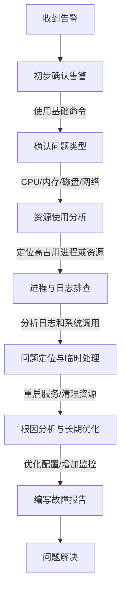

# 打造专业技术简历：从运维工程师视角提升求职竞争力

## 学习目标
1. **理解简历的作用与核心要素**：掌握简历作为求职工具的重要性，明确其目标是快速展示个人技能与价值。
2. **学会简历结构与内容撰写**：熟悉技术岗位简历的典型结构（如个人信息、技能详情、项目经验），并能针对运维工程师岗位撰写相关内容。
3. **将学习知识转化为简历亮点**：能够将Linux、Docker、Kubernetes等技术知识体系内容融入简历，突出专业能力和实践成果。
4. **掌握量化成果与针对性表达**：学会用数据和具体案例描述个人贡献，针对不同职位调整简历内容，提升匹配度。
5. **提升简历规范性与专业性**：掌握简历排版、语言简洁性和错误规避技巧，确保简历呈现专业形象。
6. **实践与反馈**：通过模拟撰写和案例分析，完成一份针对运维相关岗位的个性化简历，并根据反馈优化内容。

## 第一部分：知识体系分类与原理解析

### 1. 知识体系分类总结及对应工作内容
以下是将学习知识体系分类为几个模块，并对应到运维工程师及相关技术岗位的工作内容中。这些分类不仅帮助梳理学习内容，也便于学员将知识点与实际工作职责关联起来，方便简历撰写和面试准备。

#### (1) **基础技术与系统管理**
- **知识点**：
  - Linux基础知识篇（Linux基础命令：grep、awk、sed、crontab、du、lsblk、df、ps、top、free、iostat、netstat、ss等；vim文本处理、Sudo权限管理、SSH远程连接、systemctl服务管理、系统性能监控）
  - 计算机组成原理和服务器硬件架构
  - VMware虚拟化技术基础
  - Linux系统安装（Ubuntu）
- **对应工作内容**：
  - 服务器环境搭建与维护：安装和配置Linux系统，保障服务器正常运行。
  - 系统权限与安全管理：通过Sudo和SSH配置，确保系统访问安全。
  - 系统监控与故障排查：利用性能监控工具（如top、free、iostat）和网络分析工具（如netstat、ss），分析系统瓶颈，解决运行问题。
  - 日常运维操作：使用grep、awk、sed进行日志分析和文本处理；通过crontab设置定时任务；利用du、df、lsblk管理磁盘空间。
- **简历应用**：在“技能详情”或“工作经历”中，突出Linux系统管理能力，强调对各类基础命令的熟练使用，如“利用grep和awk分析日志，快速定位系统异常”或“通过crontab实现自动化任务调度，提升效率20%”。

#### (2) **服务部署与存储管理**
- **知识点**：
  - Linux服务发布（Nginx服务配置和管理）
  - LVM存储服务管理
  - NFS存储服务管理
  - Java Maven、Python pip、NodeJS npm/yarn、Go服务发布
- **对应工作内容**：
  - Web服务搭建与优化：配置Nginx实现负载均衡和反向代理，提升服务性能。
  - 存储方案设计与管理：利用LVM和NFS管理数据存储，确保数据高可用性。
  - 应用部署：支持多种语言环境下的服务发布，保障开发团队需求。
- **简历应用**：在“项目经验”中描述参与的服务部署项目，突出Nginx优化或存储管理成果。

#### (3) **网络与协议原理**
- **知识点**：
  - OSI七层模型与Web服务的关系
  - HTTP/HTTPS协议原理（请求/响应模型、状态码、SSL/TLS加密）
  - TCP/IP三次握手/四次挥手
  - CDN加速和缓存策略
- **对应工作内容**：
  - 网络问题排查：基于TCP/IP协议分析网络延迟或连接问题。
  - Web服务安全配置：通过HTTPS和SSL/TLS证书保障数据传输安全。
  - 性能优化：借助CDN和缓存策略提升用户访问速度。
- **简历应用**：在“技能详情”中列出对HTTP/HTTPS和TCP/IP的掌握，体现网络基础能力；在项目中提及相关优化成果。

#### (4) **编程与自动化**
- **知识点**：
  - Shell编程（脚本基础语法、变量条件判断、循环函数、文本处理、正则表达式、系统管理脚本、批量管理脚本）
  - Python基础知识（语法与数据类型、控制结构、函数模块、类与对象、封装继承多态）
- **对应工作内容**：
  - 自动化运维：编写Shell或Python脚本，实现服务器批量管理和任务自动化。
  - 工具开发：开发小型工具，提升运维效率，如日志分析、监控报警脚本。
- **简历应用**：在“技能详情”和“项目经验”中，突出脚本编写能力和自动化成果，如“通过Shell脚本实现批量部署，减少50%手动操作时间”。

#### (5) **数据库管理**
- **知识点**：
  - MySQL数据库（安装配置、SQL操作、约束与索引、主从同步、读写分离、备份恢复、InnoDB优化）
  - Redis/MySQL配合使用（缓存与消息队列）
- **对应工作内容**：
  - 数据库运维：配置和管理MySQL数据库，确保数据一致性和高可用性。
  - 性能优化：通过主从同步和读写分离，提升数据库查询效率。
  - 缓存管理：结合Redis实现数据缓存，减轻数据库压力。
- **简历应用**：在“项目经验”中描述数据库优化或主从架构搭建项目，量化性能提升效果。

#### (6) **容器化与集群管理**
- **知识点**：
  - Docker容器技术（基础概念、Dockerfile、镜像管理、容器生命周期）
  - Kubernetes容器编排（Pod、Deployment、Service、Volume、Ingress、RBAC、调度策略）
- **对应工作内容**：
  - 容器化部署：利用Docker实现应用容器化，提升部署灵活性。
  - 集群管理：通过Kubernetes管理大规模容器集群，实现滚动更新和负载均衡。
- **简历应用**：在“技能详情”中列出Docker和Kubernetes技能，在“项目经验”中描述容器化项目，突出自动化部署和稳定性成果。

#### (7) **云计算与云服务**
- **知识点**：
  - 阿里云服务（VPC、ECS、安全组、弹性IP、ACK部署、OpenVPN、Cert-Manager）
- **对应工作内容**：
  - 云环境管理：配置VPC和ECS，搭建云上应用环境。
  - 安全性保障：通过安全组和证书管理，提升云服务安全性。
- **简历应用**：在“工作经历”或“项目经验”中，描述云服务部署经验，体现对云原生技术的掌握。

#### (8) **DevOps与工具链**
- **知识点**：
  - DevOps工具链（Jenkins Pipeline、CI/CD流水线、Ansible、Prometheus、Loki、Argocd、Helm、Istio、Skywalking）
- **对应工作内容**：
  - 持续集成与交付：通过Jenkins和CI/CD流水线实现自动化构建和部署。
  - 配置管理：利用Ansible实现服务器配置自动化。
  - 监控与追踪：通过Prometheus和Skywalking监控系统性能和链路。
- **简历应用**：在“技能详情”中列出DevOps工具链掌握情况，在“项目经验”中描述CI/CD流水线搭建或监控系统优化的具体案例。

#### (9) **高级缓存与消息队列**
- **知识点**：
  - Redis高级应用（持久化、哨兵模式、Cluster集群、常见问题处理）
  - Kafka基础理论（Topic、Partition、Broker、高吞吐量原理）
- **对应工作内容**：
  - 高性能缓存：通过Redis集群提升系统响应速度。
  - 消息队列管理：利用Kafka实现分布式系统数据流处理。
- **简历应用**：在“项目经验”中描述Redis或Kafka相关项目，突出高并发场景下的优化经验。

### 2. 学员自我评估：理论理解、表达能力、实际应用
为了帮助学员更贴近自身实际情况评估对知识体系的掌握程度，建议从以下三个维度进行自我反思，并记录改进方向。以下是评估框架和示例说明，学员可根据个人情况填写。

#### (1) **是否能看懂理论**
- **定义**：能否理解知识点的理论基础、核心概念和工作原理。
- **评估标准**：
  - 完全理解：能深入理解理论内容，并能举例说明（如能理解grep的工作原理和正则表达式匹配逻辑）。
  - 基本理解：能看懂大部分理论，但部分细节不清（如知道top显示系统资源，但不清楚具体字段含义）。
  - 不理解：对理论内容感到困惑，难以把握核心概念。
- **示例**：
  - 知识点：Linux基础命令（grep、awk、sed）
  - 自我评估：基本理解
  - 原因：能看懂grep和sed的基本用法和原理，但对awk的内置变量和复杂脚本逻辑不太清晰。
  - 改进方向：通过阅读《Linux命令行与Shell脚本编程大全》，加强对awk理论的学习。

#### (2) **看懂后是否能表达**
- **定义**：在理解理论或操作的基础上，能否清晰、逻辑地向他人讲解知识点或使用经验，适用于面试或团队沟通。
- **评估标准**：
  - 能清晰表达：能用通俗语言或逻辑框架说明概念或操作（如能简洁描述crontab定时任务的设置步骤）。
  - 基本能表达：能说出内容，但逻辑不够清晰或术语使用不准确。
  - 难以表达：表达混乱，难以让听众理解。
- **示例**：
  - 知识点：Linux基础命令（top、free、netstat）
  - 自我评估：基本能表达
  - 原因：能说明top和free的作用，但讲解netstat的网络连接状态时不够流畅，缺乏具体案例支持。
  - 改进方向：多练习技术讲解，准备实际场景案例，如“如何用netstat排查端口占用问题”。

#### (3) **平常使用文档或AI助手是否能完整工作**
- **定义**：在日常学习或工作中，是否能通过查阅文档、借助AI助手完成相关任务，体现实际应用能力。
- **评估标准**：
  - 能独立完成：借助文档或AI助手，能顺利完成任务（如通过文档配置Nginx反向代理）。
  - 基本能完成：需要较多时间或多次尝试，但最终能完成任务。
  - 难以完成：即使有文档或AI助手支持，仍无法完成任务。
- **示例**：
  - 知识点：Linux基础命令（crontab、du、df）
  - 自我评估：能独立完成
  - 原因：通过查阅crontab文档，能成功设置定时任务；使用du和df时能快速查看磁盘使用情况。
  - 改进方向：尝试不依赖文档，直接记忆常用crontab表达式，提升效率。

#### 建议：
- 学员针对每个知识模块（如Linux基础命令、Docker容器技术）分别进行自我评估，记录在表格或笔记中，便于发现自身薄弱环节。
- 针对评估中“基本”或“难以”的维度，制定具体改进计划（如多阅读文档、参与实践项目、练习表达）。
- 在简历撰写和面试准备中，优先突出在“完全理解”、“能清晰表达”和“能独立完成”维度表现较好的知识点，增强自信心和说服力。

## 第二部分：掌握基础Linux命令后，故障案例

### 1. 主机CPU、内存、磁盘、网络等告警的排查方法
在运维工作中，主机资源告警（如CPU、内存、磁盘、网络）是常见问题，快速定位和解决问题是运维工程师的核心能力。以下是针对各类告警的排查思路和常用Linux命令，供学员掌握并应用到实际工作中。

#### (1) **CPU告警排查**
- **告警场景**：CPU使用率持续高（如超过80%），可能导致系统响应缓慢或服务异常。
- **排查思路**：
  1. 检查CPU整体使用率，确认是否存在高负载。
  2. 定位占用CPU高的进程，分析具体原因。
  3. 检查系统是否有异常任务或资源竞争。
- **常用命令**：
  - `top`：查看CPU整体使用率和进程占用情况，关注`%CPU`列，Shift+P按CPU排序。
  - `htop`：更直观的进程查看工具（需安装），支持筛选和排序。
  - `ps aux`：列出所有进程，结合`grep`查找特定进程，如`ps aux | grep java`。
  - `pidstat -u 1`：实时查看每个进程的CPU使用情况（需安装sysstat）。
- **后续处理**：若发现某个进程（如Java应用）占用CPU过高，可进一步查看日志或使用`strace`跟踪系统调用，分析是否为代码死循环或高并发请求导致。

#### (2) **内存告警排查**
- **告警场景**：内存使用率过高（如超过90%），可能导致系统swap频繁或进程被终止（OOM）。
- **排查思路**：
  1. 检查内存整体使用情况，确认是否存在内存泄漏或过载。
  2. 定位占用内存高的进程，分析是否合理。
  3. 检查是否有swap分区使用，评估内存压力。
- **常用命令**：
  - `free -m`：查看内存使用情况，关注`used`和`buff/cache`，以及`swap`使用量。
  - `top`：查看进程内存占用，关注`%MEM`列，Shift+M按内存排序。
  - `ps aux --sort=-rss`：按内存使用量排序进程，结合`grep`筛选。
  - `vmstat 1`：实时查看内存和swap使用情况，关注`si`（swap in）和`so`（swap out）。
- **后续处理**：若发现内存泄漏（如某个应用持续占用内存），可检查应用日志或重启服务；若swap频繁，考虑增加物理内存或优化应用配置。

#### (3) **磁盘告警排查**
- **告警场景**：磁盘空间不足（如使用率超过85%），可能导致日志无法写入或服务中断。
- **排查思路**：
  1. 检查磁盘整体使用情况，确认哪个分区空间不足。
  2. 定位占用空间大的文件或目录，分析是否可以清理。
  3. 检查是否有异常日志或临时文件堆积。
- **常用命令**：
  - `df -h`：查看各分区使用情况，关注`Use%`列。
  - `du -h --max-depth=1 /path`：查看指定路径下目录占用空间，逐步定位大文件。
  - `lsblk`：查看磁盘分区和挂载点结构。
  - `find /path -type f -size +100M`：查找指定路径下大于100M的文件。
- **后续处理**：删除不必要的临时文件或日志（如`/var/log`下的旧日志）；若为业务数据增长，可考虑扩容或迁移数据。

#### (4) **网络告警排查**
- **告警场景**：网络流量异常（如带宽占用过高）或连接问题，可能导致服务不可用。
- **排查思路**：
  1. 检查网络接口流量，确认是否存在异常高峰。
  2. 定位网络连接状态，分析是否有大量连接或攻击。
  3. 检查端口占用情况，确认服务是否正常监听。
- **常用命令**：
  - `netstat -tunlp`：查看端口监听和连接状态，结合`grep`筛选特定端口。
  - `ss -tunlp`：更高效地查看 socket 信息，替代 netstat。
  - `iftop`：实时查看网络流量，按接口或IP排序（需安装）。
  - `nload`：监控网络带宽使用情况（需安装）。
  - `tcpdump -i eth0`：抓取网络数据包，进一步分析异常流量（需结合wireshark分析）。
- **后续处理**：若发现大量异常连接（如DDoS攻击），可通过防火墙（如`iptables`）限制IP；若为服务端口问题，检查服务配置或重启。

### 2. 排查故障流程（详细步骤与全面命令）
以下是一个通用的故障排查流程，适用于大多数主机资源告警场景。流程分为五个阶段，每个阶段均包含详细步骤和对应Linux命令，确保学员能够系统化地解决问题。

#### (1) **初步确认告警**
- **目标**：通过监控工具或告警信息，确认问题类型和影响范围。
- **步骤**：
  1. 查看告警信息（如Zabbix、Prometheus告警），确认是CPU、内存、磁盘还是网络问题。
  2. 登录服务器，通过基础命令快速验证告警是否属实。
- **常用命令**：
  - `uptime`：查看系统负载平均值（load average），初步判断系统压力。
  - `free -m`：快速查看内存使用。
  - `df -h`：快速查看磁盘使用。
  - `top`：快速查看CPU和进程状态。

#### (2) **资源使用分析**
- **目标**：深入分析资源使用情况，定位问题根源。
- **步骤**：
  1. 根据告警类型，使用对应命令查看详细资源占用。
  2. 记录当前资源使用高峰值和相关进程ID（PID）。
- **常用命令**：
  - CPU：`top`、`htop`、`pidstat -u 1`
  - 内存：`free -m`、`vmstat 1`、`ps aux --sort=-rss`
  - 磁盘：`df -h`、`du -h --max-depth=1`、`find /path -type f -size +100M`
  - 网络：`netstat -tunlp`、`ss -tunlp`、`iftop`、`nload`

#### (3) **进程与日志排查**
- **目标**：分析占用资源高的进程，结合日志定位具体原因。
- **步骤**：
  1. 找到占用资源高的进程，记录PID和进程名。
  2. 查看进程相关日志，确认是否有异常错误。
  3. 若进程为服务进程，检查配置文件是否有误。
- **常用命令**：
  - `ps -ef | grep PID`：查看进程详细信息。
  - `strace -p PID`：跟踪进程系统调用，分析卡顿原因。
  - `tail -f /var/log/*.log`：查看系统或服务日志。
  - `grep "error" /path/to/log`：筛选日志中的错误信息。

#### (4) **问题定位与临时处理**
- **目标**：根据排查结果，初步定位问题并采取临时措施。
- **步骤**：
  1. 根据日志和资源占用，判断是应用问题、配置问题还是外部攻击。
  2. 采取临时措施，如重启服务、清理文件或限制流量。
- **常用命令**：
  - `systemctl restart service_name`：重启服务。
  - `kill -9 PID`：强制终止异常进程。
  - `iptables -A INPUT -s IP -j DROP`：临时屏蔽异常IP。
  - `rm -rf /path/to/temp`：清理临时文件。

#### (5) **根因分析与长期优化**
- **目标**：彻底解决故障，并制定优化方案防止复发。
- **步骤**：
  1. 结合排查数据，分析故障根本原因（如代码bug、资源不足）。
  2. 制定优化方案，如增加资源、优化配置或部署监控。
  3. 编写故障报告，记录排查过程和解决方案。
- **常用命令**：
  - `dmesg | grep error`：查看内核日志，分析系统级错误。
  - `sar -u`：查看历史CPU使用数据（需sysstat支持）。
  - `iostat -x 1`：查看磁盘IO历史数据。

### 3. Mermaid结构图：故障排查流程
为了帮助学员直观理解故障排查流程，以下使用Mermaid语法绘制流程图，展示从告警确认到问题解决的完整步骤。学员可通过此图快速把握排查逻辑。



**说明**：
- 流程图从“收到告警”开始，逐步深入到“问题解决”，每个节点代表一个排查阶段。
- 学员可根据此图梳理思路，确保排查时不漏步骤，尤其是在高压环境下能有条不紊地处理问题。

### 4. 企业级案例分析（4-5个案例）
以下是4-5个基于真实企业场景的故障案例，结合Linux基础命令进行详细分析，帮助学员将理论知识与实际问题结合，提升实战能力。每个案例均包含背景、排查过程和解决方案。

#### 案例1：CPU使用率持续高导致服务响应缓慢
- **背景**：某电商平台服务器在促销活动期间，收到CPU使用率超过90%的告警，网站响应时间从1秒延长至5秒。
- **排查过程**：
  1. 使用`top`命令，发现一个Java进程（Tomcat）占用了80%的CPU。
  2. 使用`pidstat -u 1`确认该进程持续高负载。
  3. 使用`strace -p PID`跟踪，发现大量数据库查询请求。
  4. 检查Tomcat日志（`tail -f catalina.out`），发现SQL查询超时错误。
- **解决方案**：
  - 临时增加Tomcat线程池配置，重启服务（`systemctl restart tomcat`）。
  - 长期优化数据库查询语句，添加索引，提升查询效率。
- **简历亮点**：可在简历中描述“通过top和strace定位CPU瓶颈，优化Tomcat配置，将响应时间缩短至1.5秒”。

#### 案例2：内存不足导致应用崩溃
- **背景**：某公司内部管理系统频繁崩溃，告警显示内存使用率达98%，swap分区已满。
- **排查过程**：
  1. 使用`free -m`发现内存几乎耗尽，swap使用100%。
  2. 使用`top`和`ps aux --sort=-rss`，发现一个Python脚本占用大量内存。
  3. 检查脚本代码，发现未释放大列表变量，导致内存泄漏。
- **解决方案**：
  - 临时终止脚本进程（`kill -9 PID`），释放内存。
  - 修改脚本代码，添加变量释放逻辑，防止泄漏。
- **简历亮点**：可在简历中描述“通过free和ps排查内存泄漏问题，优化Python脚本，减少系统崩溃率90%”。

#### 案例3：磁盘空间不足导致日志写入失败
- **背景**：某日志分析系统告警，磁盘使用率达95%，新日志无法写入，影响监控功能。
- **排查过程**：
  1. 使用`df -h`发现`/var/log`分区已满。
  2. 使用`du -h --max-depth=1 /var/log`定位到某个服务日志文件过大。
  3. 使用`find /var/log -type f -size +1G`确认具体大文件。
- **解决方案**：
  - 备份并清理旧日志（`mv /var/log/bigfile.log /backup && truncate -s 0 /var/log/bigfile.log`）。
  - 配置日志轮转（logrotate），防止再次堆积。
- **简历亮点**：可在简历中描述“通过df和du定位磁盘空间问题，配置logrotate，保障日志系统稳定运行”。

#### 案例4：网络流量异常导致服务不可用
- **背景**：某Web服务突然不可访问，告警显示网络流量激增，怀疑遭受DDoS攻击。
- **排查过程**：
  1. 使用`iftop`发现某个IP发送大量请求，占用带宽。
  2. 使用`netstat -tunlp | grep 80`确认受影响端口为Web服务端口。
  3. 使用`tcpdump -i eth0 host IP`抓包，分析为异常HTTP请求。
- **解决方案**：
  - 临时屏蔽异常IP（`iptables -A INPUT -s IP -j DROP`）。
  - 配置防火墙规则，限制单个IP连接速率，联系网络团队部署WAF。
- **简历亮点**：可在简历中描述“通过iftop和tcpdump定位DDoS攻击，配置iptables规则，恢复服务可用性”。

#### 案例5：端口未监听导致服务访问失败
- **背景**：某公司内部应用无法访问，客户端报错“连接拒绝”，告警显示服务端口未响应。
- **排查过程**：
  1. 使用`ss -tunlp | grep 8080`发现端口未监听。
  2. 使用`systemctl status app_service`检查服务状态，发现服务已停止。
  3. 查看服务日志（`tail -f /var/log/app.log`），发现配置文件语法错误。
- **解决方案**：
  - 修改配置文件，重启服务（`systemctl restart app_service`）。
  - 添加开机自启（`systemctl enable app_service`），防止重启后服务未启动。
- **简历亮点**：可在简历中描述“通过ss和systemctl定位服务端口问题，修复配置错误，确保应用正常访问”。


## 第四部分：掌握服务部署与存储管理——工作日常

### 1. 各语言的打包命令日常使用
在服务部署过程中，不同开发语言的项目通常需要使用特定的打包工具将代码编译或打包为可执行文件或发布包。以下是常见开发语言的打包命令，供运维工程师在日常工作中参考和使用。

#### (1) **Java - Maven/Gradle**
- **Maven**：
  - 常用命令：`mvn clean package`（清理并打包项目，生成jar/war文件）
  - 其他命令：
    - `mvn clean install`：打包并安装到本地仓库。
    - `mvn deploy`：将打包文件发布到远程仓库。
  - 常见场景：在部署Java Web应用时，使用`mvn clean package`生成war文件，放置到Tomcat的webapps目录下。
- **Gradle**：
  - 常用命令：`gradle build`（构建项目，生成jar文件）
  - 其他命令：
    - `gradle clean`：清理构建缓存。
    - `gradle bootJar`：针对Spring Boot项目生成可执行jar。
  - 常见场景：Spring Boot项目部署时，使用`gradle bootJar`生成独立运行的jar文件。

#### (2) **Python - pip/setuptools**
- **pip**：
  - 常用命令：`pip install -r requirements.txt`（安装依赖）
  - 其他命令：
    - `pip wheel .`：将项目打包为wheel格式。
    - `pip install --editable .`：本地开发模式安装项目。
  - 常见场景：部署Python应用前，使用`pip install`安装依赖，确保环境一致。
- **setuptools**：
  - 常用命令：`python setup.py sdist`（打包为源码发布包）
  - 其他命令：`python setup.py bdist_wheel`（打包为wheel格式）。
  - 常见场景：将Python项目打包为可分发的包，上传到PyPI或内部仓库。

#### (3) **Node.js - npm/yarn**
- **npm**：
  - 常用命令：`npm install`（安装依赖）、`npm run build`（构建前端项目）
  - 其他命令：`npm publish`（发布包到npm仓库）。
  - 常见场景：部署前端项目时，使用`npm run build`生成静态文件，放置到Nginx目录下。
- **yarn**：
  - 常用命令：`yarn install`（安装依赖）、`yarn build`（构建项目）
  - 其他命令：`yarn publish`（发布包）。
  - 常见场景：与npm类似，但速度更快，适合大型项目依赖管理。

#### (4) **Go - go build**
- **Go**：
  - 常用命令：`go build`（编译生成可执行文件）
  - 其他命令：
    - `go mod tidy`：整理依赖。
    - `GOOS=linux GOARCH=amd64 go build`：交叉编译为Linux环境的可执行文件。
  - 常见场景：部署Go微服务时，使用`go build`生成二进制文件，直接运行或通过systemd管理。

**注意事项**：在执行打包命令时，需确保环境变量（如JAVA_HOME、GOPATH）配置正确，避免因环境问题导致打包失败。

### 2. 各打包源的修改为国内源的配置掌握
由于网络原因，使用官方源下载依赖时速度较慢甚至可能失败，运维工程师需掌握如何将打包源修改为国内镜像源以提升效率。以下是常见语言和工具的源配置方法。

#### (1) **Java - Maven**
- **配置文件**：`~/.m2/settings.xml`
- **配置方法**：在`<mirrors>`标签下添加国内镜像源，如阿里云源。
  ```xml
  <mirrors>
    <mirror>
      <id>aliyunmaven</id>
      <mirrorOf>*</mirrorOf>
      <name>阿里云公共仓库</name>
      <url>https://maven.aliyun.com/repository/public</url>
    </mirror>
  </mirrors>
  ```
- **效果**：使用阿里云镜像源后，Maven下载依赖速度显著提升。

#### (2) **Python - pip**
- **配置文件**：`~/.pip/pip.conf`（Linux）或`%APPDATA%\pip\pip.ini`（Windows）
- **配置方法**：添加国内源，如清华源。
  ```ini
  [global]
  index-url = https://pypi.tuna.tsinghua.edu.cn/simple
  [install]
  trusted-host = pypi.tuna.tsinghua.edu.cn
  ```
- **临时方法**：`pip install package -i https://pypi.tuna.tsinghua.edu.cn/simple`
- **效果**：切换到国内源后，pip安装依赖速度提升数倍。

#### (3) **Node.js - npm/yarn**
- **npm**：
  - 配置方法：设置registry为淘宝镜像源。
    ```bash
    npm config set registry https://registry.npm.taobao.org
    ```
  - 验证：`npm config get registry`
- **yarn**：
  - 配置方法：类似npm，设置registry。
    ```bash
    yarn config set registry https://registry.npm.taobao.org
    ```
- **效果**：使用淘宝源后，Node.js依赖下载速度大幅提升。

#### (4) **Go - go mod**
- **配置方法**：设置环境变量或go mod配置，使用国内代理。
  ```bash
  export GOPROXY=https://goproxy.cn,direct
  ```
- **项目内配置**：在`go.mod`中指定proxy。
- **效果**：使用国内代理后，Go模块下载速度更快，尤其对GitHub依赖。

**注意事项**：配置国内源时，需确保源的稳定性，定期检查是否有更新或失效；对于企业内部项目，可搭建私有仓库，避免外部源不可用风险。

### 3. Nginx性能优化及各开发语言应用的性能优化
性能优化是服务部署中的重要环节，涉及Web服务器（如Nginx）和后端应用的调优。以下是Nginx及常见开发语言应用的优化方法。

#### (1) **Nginx性能优化**
- **worker进程数调整**：
  - 配置：`worker_processes auto;`（根据CPU核心数自动调整）
  - 效果：充分利用CPU资源，提升并发处理能力。
- **连接数优化**：
  - 配置：`worker_connections 1024;`（每个worker进程的最大连接数）
  - 效果：支持更多并发连接，适合高流量场景。
- **Gzip压缩**：
  - 配置：
    ```nginx
    gzip on;
    gzip_types text/plain text/css application/json application/javascript;
    gzip_min_length 256;
    ```
  - 效果：减少静态资源传输体积，提升加载速度。
- **缓存配置**：
  - 配置：启用静态资源缓存，设置`expires`头。
    ```nginx
    location ~* \.(jpg|jpeg|png|gif|ico|css|js)$ {
        expires 30d;
    }
    ```
  - 效果：减少重复请求，提升用户体验。
- **反向代理优化**：
  - 配置：设置upstream，启用keepalive。
    ```nginx
    upstream backend {
        server 127.0.0.1:8080;
        keepalive 32;
    }
    ```
  - 效果：减少后端连接开销，提升代理效率。

#### (2) **Java应用性能优化（以Spring Boot为例）**
- **JVM参数调优**：
  - 配置：`-Xms512m -Xmx1024m -XX:MetaspaceSize=128m`
  - 效果：合理分配堆内存和元空间，减少GC频率。
- **线程池优化**：
  - 配置：在`application.properties`中调整Tomcat线程池。
    ```properties
    server.tomcat.threads.max=200
    server.tomcat.threads.min-spare=10
    ```
  - 效果：提升并发处理能力，避免线程阻塞。
- **数据库连接池**：
  - 配置：使用HikariCP，调整连接池参数。
    ```properties
    spring.datasource.hikari.maximum-pool-size=20
    spring.datasource.hikari.minimum-idle=5
    ```
  - 效果：优化数据库连接管理，减少等待时间。

#### (3) **Python应用性能优化（以Django/Flask为例）**
- **Gunicorn/Uvicorn调优**：
  - 配置：`gunicorn -w 4 -b 0.0.0.0:8000 app:app`
  - 效果：设置合理worker数，提升并发处理能力。
- **缓存机制**：
  - 配置：集成Redis缓存，减少数据库查询。
  - 效果：提升响应速度，尤其对频繁访问的数据。
- **异步处理**：
  - 配置：使用Celery处理后台任务。
  - 效果：将耗时任务异步化，避免请求阻塞。

#### (4) **Node.js应用性能优化**
- **PM2管理优化**：
  - 配置：`pm2 start app.js --watch -i max`（根据CPU核心数启动实例）
  - 效果：利用多核CPU，提升应用并发能力。
- **静态资源分离**：
  - 配置：静态资源由Nginx托管，非Node.js直发。
  - 效果：减轻Node.js负担，提升性能。
- **代码优化**：
  - 配置：避免同步操作，使用Promise或async/await。
  - 效果：减少阻塞，提升请求处理速度。

#### (5) **Go应用性能优化**
- **并发优化**：
  - 配置：充分利用goroutine处理并发请求。
  - 效果：提升高并发场景下性能。
- **内存管理**：
  - 配置：避免不必要的内存分配，优化结构体。
  - 效果：减少GC压力，提升运行效率。
- **连接池**：
  - 配置：数据库或HTTP客户端使用连接池。
  - 效果：减少连接开销，提升响应速度。

### 4. 如果应用启动不了或卡住，日常排查方法
应用启动失败或卡住是运维日常中常见问题，快速定位和解决问题是关键。以下是详细排查步骤和常用命令。

#### (1) **初步检查**
- **目标**：确认应用状态和基本错误信息。
- **步骤**：
  1. 检查服务是否运行：`systemctl status service_name`或`ps -ef | grep app_name`。
  2. 查看启动日志：`journalctl -u service_name`或`tail -f /path/to/app.log`。
- **常见问题**：服务未启动、配置文件错误、端口被占用。

#### (2) **端口和资源检查**
- **目标**：确认是否有资源冲突或环境问题。
- **步骤**：
  1. 检查端口是否被占用：`ss -tunlp | grep 8080`或`netstat -tunlp | grep 8080`。
  2. 检查资源使用：`top`（CPU/内存）、`df -h`（磁盘空间）。
- **常见问题**：端口冲突、磁盘空间不足导致无法写入日志。

#### (3) **日志和配置分析**
- **目标**：深入分析日志，定位具体错误。
- **步骤**：
  1. 筛选错误日志：`grep "error" /path/to/app.log`或`tail -n 100 /path/to/app.log`。
  2. 检查配置文件：确认语法是否正确，如Java的`application.properties`或Nginx的`nginx.conf`（`nginx -t`测试配置）。
- **常见问题**：数据库连接失败、依赖包缺失、配置参数错误。

#### (4) **依赖和环境检查**
- **目标**：确认运行环境和依赖是否完整。
- **步骤**：
  1. 检查依赖版本：如Java的`java -version`、Python的`pip list`。
  2. 检查环境变量：`env | grep JAVA_HOME`或`echo $PATH`。
- **常见问题**：环境变量未设置、依赖版本不兼容。

#### (5) **临时处理与重启**
- **目标**：尝试解决问题并恢复服务。
- **步骤**：
  1. 清理资源：如杀掉占用端口的进程（`kill -9 PID`）。
  2. 重启服务：`systemctl restart service_name`或手动启动应用。
  3. 验证状态：再次检查日志和服务状态。
- **常见问题**：重启后仍失败，需进一步联系开发团队分析代码问题。

### 5. 工作内容分享（4个左右）
以下是基于服务部署与存储管理相关工作的真实场景分享，帮助学员了解运维工程师在该领域的日常职责，并为简历撰写提供素材。

#### 分享1：Nginx部署与优化
- **工作内容**：为公司电商平台部署Nginx作为反向代理服务器，配置负载均衡，优化静态资源缓存。
- **具体任务**：
  - 安装Nginx并配置upstream实现负载均衡，分散流量到3台后端Tomcat服务器。
  - 配置Gzip压缩和静态资源30天缓存，减少带宽占用。
  - 通过`ab`工具压测优化前后效果，页面加载时间从2秒缩短至1.2秒。
- **简历亮点**：可在简历中描述“部署Nginx反向代理，配置负载均衡与缓存优化，将页面加载时间缩短40%”。

#### 分享2：Java应用部署与调优
- **工作内容**：负责公司内部管理系统的Spring Boot应用部署，优化JVM参数以支持高并发访问。
- **具体任务**：
  - 使用Maven打包（`mvn clean package`），生成jar文件并部署到Linux服务器。
  - 调整JVM参数（`-Xms1g -Xmx2g`），优化垃圾回收策略，减少Full GC频率。
  - 配置HikariCP连接池，解决数据库连接超时问题。
- **简历亮点**：可在简历中描述“优化Spring Boot应用JVM参数与连接池配置，支持日均10万请求稳定运行”。

#### 分享3：存储管理与扩容
- **工作内容**：管理公司日志系统的存储空间，利用LVM实现磁盘动态扩容，保障数据写入不中断。
- **具体任务**：
  - 使用`df -h`监控磁盘使用率，发现`/var/log`分区接近满载。
  - 通过LVM扩展卷组（`vgextend`）和逻辑卷（`lvextend`），增加50G存储空间。
  - 配置NFS共享存储，供多台服务器访问日志数据。
- **简历亮点**：可在简历中描述“通过LVM动态扩容磁盘50G，配置NFS共享存储，确保日志系统高可用”。

#### 分享4：多语言项目部署支持
- **工作内容**：支持公司多个开发团队的项目部署，涉及Java、Python、Node.js等多种语言环境。
- **具体任务**：
  - 为Java团队使用Maven打包并部署到Tomcat，配置阿里云镜像源加速依赖下载。
  - 为Python团队配置Gunicorn运行Flask应用，集成Redis缓存提升性能。
  - 为前端团队部署Node.js项目，配置淘宝npm源并优化构建脚本。
- **简历亮点**：可在简历中描述“支持Java、Python、Node.js多语言项目部署，配置国内镜像源，提升构建效率30%”。

## 第五部分：网络与协议原理

### 1. 掌握网络与协议原理后，在工作中能做什么
网络与协议原理（如OSI七层模型、HTTP/HTTPS、TCP/IP、CDN等）是运维工程师的核心知识，掌握这些内容后，可以在工作中承担以下职责，提升技术能力和解决实际问题的效率。

- **网络架构设计与规划**：基于OSI七层模型和TCP/IP协议栈，设计企业内部网络架构，如VPC划分、子网规划，确保网络通信高效且安全。
- **Web服务部署与优化**：理解HTTP/HTTPS协议原理，配置和优化Web服务器（如Nginx、Apache），提升网站性能和安全性。
- **故障排查与问题定位**：利用TCP/IP协议知识（如三次握手、四次挥手），快速定位网络延迟、丢包、连接中断等问题，减少服务故障时间。
- **安全策略制定**：基于HTTPS和SSL/TLS加密原理，配置安全证书，防范中间人攻击，保障数据传输安全。
- **性能优化与加速**：掌握CDN加速和缓存策略，部署内容分发网络，优化用户访问速度，提升用户体验。
- **跨部门协作支持**：为开发团队提供网络相关技术支持，解释协议原理，协助调试接口或解决连接问题。

**总结**：掌握网络与协议原理后，运维工程师不仅能完成日常的服务器管理任务，还能深入到网络层和应用层，解决复杂问题，成为团队中不可或缺的技术支持者。

### 2. 掌握网络与协议原理后，如何优化Nginx
Nginx作为高性能Web服务器和反向代理，其优化离不开对网络与协议原理的理解。以下是基于这些原理的具体优化方法，帮助提升Nginx的性能和安全性。

#### (1) **基于HTTP/HTTPS协议优化**
- **原理**：HTTP协议定义了请求和响应的格式，HTTPS通过SSL/TLS增加加密层，保障数据安全。
- **优化方法**：
  - **启用HTTPS并优化TLS配置**：配置SSL/TLS证书，禁用过时的协议（如TLS 1.0），启用高安全性的加密套件（如ECDHE-ECDSA-AES256-GCM-SHA384）。
    ```nginx
    ssl_protocols TLSv1.2 TLSv1.3;
    ssl_ciphers EECDH+AESGCM:EDH+AESGCM:AES256+EECDH:AES256+EDH;
    ssl_prefer_server_ciphers on;
    ```
    **效果**：提升数据传输安全性，减少加密解密开销。
  - **HTTP/2支持**：HTTP/2通过多路复用和头部压缩减少延迟，需启用并确保浏览器兼容。
    ```nginx
    http2 on;
    ```
    **效果**：减少TCP连接数，提升页面加载速度。
  - **状态码与重定向优化**：合理配置301/302重定向，避免不必要的跳转，减少请求次数。
    **效果**：提升用户体验，减少服务器压力。

#### (2) **基于TCP/IP协议优化**
- **原理**：TCP/IP协议负责数据传输，三次握手建立连接，四次挥手断开连接，影响网络延迟和吞吐量。
- **优化方法**：
  - **启用TCP KeepAlive**：减少后端连接频繁建立的开销，尤其在反向代理场景中。
    ```nginx
    upstream backend {
        server 127.0.0.1:8080;
        keepalive 32;
    }
    ```
    **效果**：降低TCP握手次数，提升代理效率。
  - **调整超时参数**：根据网络环境，设置合理的连接超时和读取超时，避免长连接占用资源。
    ```nginx
    proxy_connect_timeout 10s;
    proxy_read_timeout 30s;
    proxy_send_timeout 30s;
    ```
    **效果**：防止因网络延迟导致的请求挂起，释放资源。

#### (3) **基于CDN加速与缓存策略优化**
- **原理**：CDN通过就近分发内容减少延迟，缓存策略减少服务器重复处理请求。
- **优化方法**：
  - **静态资源缓存**：设置`expires`头，延长静态资源（如图片、CSS、JS）的缓存时间。
    ```nginx
    location ~* \.(jpg|jpeg|png|gif|ico|css|js)$ {
        expires 30d;
        add_header Cache-Control "public, immutable";
    }
    ```
    **效果**：减少重复请求，提升用户加载速度。
  - **与CDN集成**：配置Nginx与CDN服务配合，设置回源策略，避免CDN缓存失效频繁回源。
    ```nginx
    location / {
        proxy_pass http://cdn_backend;
        proxy_cache my_cache;
        proxy_cache_valid 200 301 302 1h;
    }
    ```
    **效果**：减轻源站压力，提升全球访问速度。

#### (4) **基于OSI七层模型优化**
- **原理**：OSI模型将网络通信分为七层，Nginx主要工作在应用层（第7层）和传输层（第4层）。
- **优化方法**：
  - **应用层优化**：配置Gzip压缩，减少HTTP响应数据体积。
    ```nginx
    gzip on;
    gzip_types text/plain text/css application/json application/javascript;
    gzip_min_length 256;
    ```
    **效果**：减少带宽占用，提升传输效率。
  - **传输层优化**：调整worker进程和连接数，充分利用服务器资源。
    ```nginx
    worker_processes auto;
    worker_connections 1024;
    ```
    **效果**：提升并发处理能力，适应高流量场景。

**总结**：基于网络与协议原理优化Nginx，可以从协议安全性（HTTPS）、传输效率（TCP/IP）、内容分发（CDN）等多维度入手，全面提升Web服务的性能和用户体验。

### 3. 如何进行系统内核优化
系统内核优化是提升服务器整体性能的重要手段，尤其在高并发网络环境下，基于网络与协议原理对Linux内核参数进行调整，可以显著提升系统处理能力。以下是常见的优化方法。

#### (1) **TCP/IP协议栈参数优化**
- **原理**：TCP/IP协议栈参数影响连接建立、数据传输和连接关闭的效率。
- **优化方法**：
  - **增大TCP连接队列**：调整`somaxconn`参数，增加监听队列长度，避免连接被拒绝。
    ```bash
    echo 'net.core.somaxconn = 65535' >> /etc/sysctl.conf
    sysctl -p
    ```
    **效果**：支持更多并发连接，减少“connection refused”错误。
  - **优化TCP窗口大小**：调整接收和发送窗口，提升吞吐量。
    ```bash
    echo 'net.ipv4.tcp_rmem = 4096 87380 6291456' >> /etc/sysctl.conf
    echo 'net.ipv4.tcp_wmem = 4096 16384 4194304' >> /etc/sysctl.conf
    sysctl -p
    ```
    **效果**：适应高延迟网络，提升数据传输效率。
  - **启用TCP Fast Open**：减少握手延迟，提升首次连接速度。
    ```bash
    echo 'net.ipv4.tcp_fastopen = 3' >> /etc/sysctl.conf
    sysctl -p
    ```
    **效果**：减少连接建立时间，适合频繁短连接场景。

#### (2) **文件句柄与连接数优化**
- **原理**：Linux系统对每个进程的文件句柄和连接数有限制，高并发下需调整上限。
- **优化方法**：
  - **增加文件句柄数**：编辑`/etc/security/limits.conf`和`/etc/pam.d/*`文件。
    ```bash
    # /etc/security/limits.conf
    * soft nofile 65535
    * hard nofile 65535
    root soft nofile 65535
    root hard nofile 65535
    ```
    **效果**：支持更多文件和网络连接，避免“too many open files”错误。
  - **调整系统连接数**：
    ```bash
    echo 'fs.file-max = 2097152' >> /etc/sysctl.conf
    sysctl -p
    ```
    **效果**：提升系统整体连接处理能力。

#### (3) **网络堆栈缓冲区优化**
- **原理**：网络堆栈缓冲区影响数据包处理速度，缓冲不足会导致丢包。
- **优化方法**：
  - **增大网络缓冲区**：
    ```bash
    echo 'net.core.rmem_max = 16777216' >> /etc/sysctl.conf
    echo 'net.core.wmem_max = 16777216' >> /etc/sysctl.conf
    echo 'net.core.rmem_default = 8388608' >> /etc/sysctl.conf
    echo 'net.core.wmem_default = 8388608' >> /etc/sysctl.conf
    sysctl -p
    ```
    **效果**：减少高流量下的丢包率，提升网络稳定性。

#### (4) **禁用不必要的特性**
- **原理**：某些内核特性可能增加延迟或资源占用，需根据场景禁用。
- **优化方法**：
  - **禁用TCP timestamps**：减少额外开销。
    ```bash
    echo 'net.ipv4.tcp_timestamps = 0' >> /etc/sysctl.conf
    sysctl -p
    ```
    **效果**：降低协议栈处理负担，适合低延迟场景。

**注意事项**：内核优化需根据实际业务场景（如高并发短连接还是长连接）进行调整，优化前应备份配置文件，并在测试环境验证效果，避免直接在生产环境操作导致问题。

### 4. 学会网络与协议原理后，能帮助工作做什么（多场景示例）
掌握网络与协议原理对运维工作的帮助是多方面的，不仅限于某一具体任务，而是贯穿于系统优化、故障排查和架构设计等多个领域。以下是多个具体场景，展示这些知识如何提升工作效率和质量。

#### 场景1：系统性能优化——提升Web服务响应速度
- **帮助内容**：基于HTTP协议和TCP/IP原理，优化Nginx配置和系统内核参数。
- **具体应用**：配置HTTP/2和TLS 1.3减少延迟，调整TCP窗口大小提升吞吐量。
- **工作成果**：Web服务响应时间从500ms缩短至200ms，用户体验显著提升。
- **简历亮点**：可在简历中描述“基于HTTP/2和TCP协议优化Nginx与内核参数，将响应时间缩短60%”。

#### 场景2：网络故障排查——快速定位连接问题
- **帮助内容**：利用TCP/IP三次握手和四次挥手原理，分析网络连接失败原因。
- **具体应用**：使用`tcpdump`抓包分析，发现客户端与服务器间SYN包未响应，定位为防火墙规则拦截。
- **工作成果**：调整防火墙规则，恢复服务连接，减少故障恢复时间（MTTR）从2小时到30分钟。
- **简历亮点**：可在简历中描述“通过TCP/IP原理和tcpdump抓包，定位防火墙导致的连接问题，缩短MTTR至30分钟”。

#### 场景3：系统安全优化——防范网络攻击
- **帮助内容**：基于HTTPS和SSL/TLS原理，配置安全证书和加密策略。
- **具体应用**：为公司网站启用HTTPS，禁用弱加密套件，防止中间人攻击。
- **工作成果**：通过安全扫描工具检测，网站安全性评分从C提升至A+。
- **简历亮点**：可在简历中描述“基于HTTPS原理配置SSL/TLS策略，提升网站安全评分至A+”。

#### 场景4：架构设计优化——部署CDN加速服务
- **帮助内容**：基于CDN加速原理，设计内容分发策略，优化用户访问速度。
- **具体应用**：为公司静态资源配置阿里云CDN，设置缓存策略，减少源站压力。
- **工作成果**：全球用户访问延迟从800ms降低至300ms，源站流量减少50%。
- **简历亮点**：可在简历中描述“基于CDN原理设计分发策略，降低访问延迟62.5%，减少源站流量50%”。

#### 场景5：系统容量规划——支持高并发场景
- **帮助内容**：基于TCP/IP连接原理，优化系统文件句柄和连接数上限。
- **具体应用**：在大促活动前调整`somaxconn`和`nofile`参数，支持10万并发连接。
- **工作成果**：系统在大促期间稳定运行，未出现连接拒绝或资源不足问题。
- **简历亮点**：可在简历中描述“基于TCP原理优化系统参数，支持10万并发连接，确保大促活动稳定运行”。

#### 场景6：跨团队协作——支持开发调试接口问题
- **帮助内容**：基于HTTP协议原理，协助开发团队分析接口请求和响应问题。
- **具体应用**：使用`curl`和`tcpdump`分析HTTP状态码和请求头，发现客户端参数错误导致400错误。
- **工作成果**：帮助开发快速定位问题，接口上线时间提前1天。
- **简历亮点**：可在简历中描述“基于HTTP协议原理，协助开发定位接口问题，加速上线流程”。

**总结**：网络与协议原理的应用贯穿于系统优化（性能、安全、架构）、故障排查和团队协作等多个方面，是运维工程师提升工作深度和广度的关键技能。通过这些知识，运维人员可以从被动响应问题转变为主动优化系统，成为企业技术体系中的核心角色。


## 第六部分：Shell与Python的编程与自动化

### 1. 学习Shell与Python编程后，可以批量处理公司哪些问题，配置Ansible怎么搭配
掌握Shell和Python编程后，运维工程师可以利用脚本实现自动化，批量解决公司中重复性高或耗时长的问题，并通过Ansible等工具进一步提升自动化效率。以下是具体问题和Ansible搭配配置的说明。

#### (1) **可以批量处理的公司问题**
- **服务器巡检与监控**：
  - 问题：手动检查多台服务器的CPU、内存、磁盘使用率，耗时长且易出错。
  - 解决方案：编写Shell脚本批量执行`top`、`free`、`df`等命令，收集资源数据并生成报告；使用Python结合API（如Zabbix API）获取监控数据，自动发送告警邮件或微信通知。
- **日志分析与清理**：
  - 问题：日志文件堆积导致磁盘空间不足，需定期分析和清理。
  - 解决方案：Shell脚本结合`grep`和`awk`提取日志中的错误信息，自动清理过期日志；Python脚本解析复杂日志格式，生成统计报表。
- **批量部署与配置**：
  - 问题：新服务器上线或服务部署需手动配置环境、安装软件，效率低。
  - 解决方案：Shell脚本批量执行安装命令，配置环境变量；Python脚本通过SSH批量分发配置文件，验证部署结果。
- **用户与权限管理**：
  - 问题：新增员工账号、权限调整需逐台服务器操作，易遗漏。
  - 解决方案：Shell脚本批量创建用户、设置密码和权限；Python脚本结合LDAP接口同步用户数据。
- **备份与恢复**：
  - 问题：数据库或文件备份需定期执行，恢复时需快速定位文件。
  - 解决方案：Shell脚本结合`rsync`或`tar`实现增量备份；Python脚本管理备份文件元数据，支持快速搜索和恢复。
- **故障批量排查**：
  - 问题：多台服务器出现类似故障，逐一排查耗时长。
  - 解决方案：Shell脚本批量检查服务状态、端口占用；Python脚本分析日志，汇总异常信息并生成报告。

#### (2) **配置Ansible与Shell/Python搭配**
Ansible是一种强大的自动化工具，可以与Shell和Python脚本无缝集成，进一步提升批量操作效率。以下是Ansible的配置方法和搭配思路。

- **Ansible基本配置**：
  - **安装Ansible**：在控制节点安装Ansible（`yum install ansible`或`pip install ansible`）。
  - **配置主机清单**：编辑`/etc/ansible/hosts`，添加目标服务器IP或域名。
    ```ini
    [webservers]
    192.168.1.101
    192.168.1.102

    [dbservers]
    192.168.1.201
    ```
  - **配置SSH免密登录**：确保控制节点到目标节点的SSH免密登录（`ssh-keygen`和`ssh-copy-id`）。
- **Ansible与Shell搭配**：
  - **场景**：批量执行简单命令或脚本。
  - **方法**：编写Shell脚本（如检查磁盘空间`disk_check.sh`），通过Ansible的`script`模块分发并执行。
    ```yaml
    - name: Run disk check script on all webservers
      script: disk_check.sh
      register: result

    - name: Display result
      debug:
        msg: "{{ result.stdout }}"
    ```
    **效果**：快速在多台服务器上执行Shell脚本，收集结果。
- **Ansible与Python搭配**：
  - **场景**：处理复杂逻辑或需要API交互的任务。
  - **方法**：编写Python脚本（如调用监控API获取数据`monitor_api.py`），通过Ansible的`command`或`script`模块执行。
    ```yaml
    - name: Run Python script to fetch monitoring data
      script: monitor_api.py
      register: monitor_data

    - name: Save data to file
      copy:
        content: "{{ monitor_data.stdout }}"
        dest: /tmp/monitor_report.txt
    ```
    **效果**：利用Python处理复杂逻辑，Ansible负责批量分发和执行。
- **Ansible Playbook编写**：
  - **场景**：批量部署服务或配置环境。
  - **方法**：编写Playbook，结合Shell和Python脚本完成多步骤任务。
    ```yaml
    ---
    - hosts: webservers
      tasks:
        - name: Install Nginx
          yum:
            name: nginx
            state: present
        - name: Copy custom config
          copy:
            src: ./nginx.conf
            dest: /etc/nginx/nginx.conf
        - name: Run validation script (Shell)
          script: validate_nginx.sh
        - name: Generate report (Python)
          script: generate_report.py
    ```
    **效果**：通过Playbook实现自动化部署，减少人为操作错误。

**总结**：Shell适合快速编写简单任务脚本，Python适合处理复杂逻辑和数据分析，Ansible则负责大规模批量执行和任务编排。三者结合，可以高效解决公司中的重复性问题，提升运维自动化水平。

### 2. 日常常用的脚本示例（多一些）
以下是公司在运维日常中真实常用的Shell和Python脚本示例，涵盖巡检、日志处理、部署、备份等场景，帮助学员快速上手并应用到实际工作中。

#### (1) **Shell脚本示例**
- **脚本1：服务器资源巡检脚本（check_resource.sh）**
  ```bash
  #!/bin/bash
  DATE=$(date +%Y%m%d_%H%M%S)
  REPORT_FILE="/tmp/resource_report_$DATE.txt"
  
  echo "===== 服务器资源巡检报告 ($DATE) =====" > $REPORT_FILE
  echo "主机名: $(hostname)" >> $REPORT_FILE
  echo "当前时间: $(date)" >> $REPORT_FILE
  echo "" >> $REPORT_FILE
  
  echo "CPU 使用率 (top 5 进程):" >> $REPORT_FILE
  ps aux --sort=-%cpu | head -n 6 >> $REPORT_FILE
  echo "" >> $REPORT_FILE
  
  echo "内存使用情况:" >> $REPORT_FILE
  free -m >> $REPORT_FILE
  echo "" >> $REPORT_FILE
  
  echo "磁盘使用情况:" >> $REPORT_FILE
  df -h >> $REPORT_FILE
  
  echo "报告已生成: $REPORT_FILE"
  ```
  **用途**：定期检查服务器资源使用情况，生成报告，便于发现异常。
- **脚本2：清理过期日志（clean_logs.sh）**
  ```bash
  #!/bin/bash
  LOG_DIR="/var/log"
  DAYS=30
  
  echo "清理 $LOG_DIR 下 $DAYS 天前的日志文件..."
  find $LOG_DIR -type f -name "*.log" -mtime +$DAYS -exec rm -f {} \;
  echo "清理完成！"
  ```
  **用途**：自动清理过期日志，释放磁盘空间。
- **脚本3：检查服务状态（check_service.sh）**
  ```bash
  #!/bin/bash
  SERVICE="nginx"
  
  if systemctl is-active --quiet $SERVICE; then
      echo "$SERVICE 正在运行."
  else
      echo "$SERVICE 未运行，尝试重启..."
      systemctl restart $SERVICE
      if systemctl is-active --quiet $SERVICE; then
          echo "$SERVICE 重启成功."
      else
          echo "$SERVICE 重启失败，请检查日志."
      fi
  fi
  ```
  **用途**：检查并确保关键服务（如Nginx）正常运行，若异常则自动重启。
- **脚本4：批量检查端口（check_ports.sh）**
  ```bash
  #!/bin/bash
  PORTS=(80 443 8080)
  for PORT in "${PORTS[@]}"; do
      if ss -tunlp | grep -q ":$PORT "; then
          echo "端口 $PORT 正在监听."
      else
          echo "端口 $PORT 未监听，请检查相关服务."
      fi
  done
  ```
  **用途**：批量检查关键端口状态，确保服务可用。

#### (2) **Python脚本示例**
- **脚本5：日志分析并发送告警（log_analyzer.py）**
  ```python
  import re
  import smtplib
  from email.mime.text import MIMEText
  
  LOG_FILE = "/var/log/nginx/error.log"
  ERROR_PATTERN = r"error|exception|failed"
  EMAIL_TO = "admin@example.com"
  
  def send_email(content):
      msg = MIMEText(content)
      msg['Subject'] = 'Nginx Error Alert'
      msg['From'] = 'monitor@example.com'
      msg['To'] = EMAIL_TO
      with smtplib.SMTP('smtp.example.com') as server:
          server.login('user', 'password')
          server.sendmail('monitor@example.com', EMAIL_TO, msg.as_string())
  
  def analyze_log():
      errors = []
      with open(LOG_FILE, 'r') as f:
          for line in f:
              if re.search(ERROR_PATTERN, line, re.IGNORECASE):
                  errors.append(line.strip())
      if errors:
          content = "检测到以下错误日志:\n\n" + "\n".join(errors[:10])
          send_email(content)
          print("错误日志已发送至邮箱.")
      else:
          print("未发现错误日志.")
  
  if __name__ == "__main__":
      analyze_log()
  ```
  **用途**：分析Nginx错误日志，提取异常信息并通过邮件发送告警。
- **脚本6：批量SSH执行命令（batch_ssh.py）**
  ```python
  import paramiko
  
  HOSTS = ['192.168.1.101', '192.168.1.102']
  COMMAND = 'df -h'
  SSH_USER = 'root'
  SSH_KEY = '/root/.ssh/id_rsa'
  
  def ssh_execute(host, command):
      try:
          client = paramiko.SSHClient()
          client.set_missing_host_key_policy(paramiko.AutoAddPolicy())
          client.connect(host, username=SSH_USER, key_filename=SSH_KEY)
          stdin, stdout, stderr = client.exec_command(command)
          output = stdout.read().decode('utf-8')
          error = stderr.read().decode('utf-8')
          client.close()
          return host, output, error
      except Exception as e:
          return host, None, str(e)
  
  if __name__ == "__main__":
      for host in HOSTS:
          host, output, error = ssh_execute(host, COMMAND)
          print(f"主机: {host}")
          if output:
              print(f"输出:\n{output}")
          if error:
              print(f"错误:\n{error}")
          print("-" * 50)
  ```
  **用途**：通过SSH批量在多台服务器上执行命令，适合巡检或配置任务。
- **脚本7：数据库备份管理（db_backup.py）**
  ```python
  import os
  import datetime
  import shutil
  
  DB_NAME = "mydb"
  BACKUP_DIR = "/backup/db"
  RETENTION_DAYS = 7
  
  def backup_db():
      today = datetime.datetime.now().strftime("%Y%m%d")
      backup_file = f"{BACKUP_DIR}/{DB_NAME}_{today}.sql"
      os.makedirs(BACKUP_DIR, exist_ok=True)
      cmd = f"mysqldump -u root -p'password' {DB_NAME} > {backup_file}"
      os.system(cmd)
      print(f"备份完成: {backup_file}")
  
  def clean_old_backups():
      cutoff = datetime.datetime.now() - datetime.timedelta(days=RETENTION_DAYS)
      for f in os.listdir(BACKUP_DIR):
          file_path = os.path.join(BACKUP_DIR, f)
          file_time = datetime.datetime.fromtimestamp(os.path.getctime(file_path))
          if file_time < cutoff:
              os.remove(file_path)
              print(f"删除过期备份: {file_path}")
  
  if __name__ == "__main__":
      backup_db()
      clean_old_backups()
  ```
  **用途**：自动备份MySQL数据库并清理过期备份文件，确保数据安全。

**总结**：Shell脚本适合快速处理简单任务（如巡检、清理），Python脚本适合复杂逻辑和跨系统交互（如日志分析、SSH批量操作）。运维工程师需根据任务需求选择合适的工具编写脚本。

### 3. 简历中的Shell与Python技能展示（Shell搞定简单任务，Python实现复杂功能）
在简历中展示Shell和Python技能时，应突出两者的适用场景和实际成果，体现技术深度和解决问题的能力。以下是建议的展示方式，将Shell定位为处理简单任务的工具，Python定位为实现复杂功能的手段。

#### (1) **技能描述中的区分**
- **Shell**：强调快速自动化、日常运维任务。
  - 示例描述：“熟练使用Shell脚本实现服务器巡检、日志清理等日常自动化任务，提升运维效率。”
- **Python**：强调复杂逻辑处理、跨系统集成。
  - 示例描述：“精通Python编程，开发日志分析、批量SSH管理、数据库备份等复杂自动化工具，减少手动操作时间。”

#### (2) **项目或成果中的具体案例**
- **Shell案例（简单任务）**：
  - 项目描述：“开发Shell脚本实现服务器资源巡检，自动收集CPU、内存、磁盘数据并生成报告，覆盖公司50+台服务器，减少巡检时间80%。”
  - 简历亮点：“通过Shell脚本自动化服务器巡检，覆盖50+台设备，巡检效率提升80%。”
- **Python案例（复杂功能）**：
  - 项目描述：“使用Python开发日志分析工具，解析Nginx错误日志并通过邮件发送告警，集成Zabbix API实时监控服务状态，提前发现潜在问题，降低故障率30%。”
  - 简历亮点：“开发Python日志分析工具，集成Zabbix API实现实时监控，降低系统故障率30%。”

#### (3) **完整简历技能与项目示例**
- **技能部分**：
  ```
  技能：
  - 熟练掌握Shell脚本，擅长快速实现服务器巡检、日志清理、服务状态检查等自动化任务。
  - 精通Python编程，具备开发复杂运维工具能力，如日志分析、批量SSH管理、数据库备份等。
  - 熟悉Ansible自动化工具，结合Shell和Python脚本实现大规模批量部署与配置。
  ```
- **项目部分**：
  ```
  项目经验：
  1. 服务器资源巡检自动化（Shell）
     - 编写Shell脚本批量检查CPU、内存、磁盘使用情况，生成巡检报告。
     - 覆盖公司50+台服务器，巡检时间从2小时缩短至10分钟，效率提升80%。
  2. 日志分析与告警系统（Python）
     - 使用Python开发工具，解析Nginx和系统日志，提取错误信息并通过邮件告警。
     - 集成Zabbix API监控服务状态，提前发现问题，系统故障率降低30%。
  3. 批量服务部署与管理（Ansible + Shell + Python）
     - 配置Ansible Playbook，结合Shell脚本批量安装Nginx、配置环境。
     - 开发Python脚本验证部署结果并生成报告，支持20+台服务器同时部署，减少配置错误率90%。
  ```

**总结**：在简历中，Shell技能应突出快速、简单、高效的特点，适用于日常小任务自动化；Python技能应突出复杂逻辑、集成能力和解决深度问题的特点，适用于开发工具或系统性优化。通过具体成果数据（如效率提升百分比、覆盖设备数量）增强说服力，展现技术能力与业务价值。
