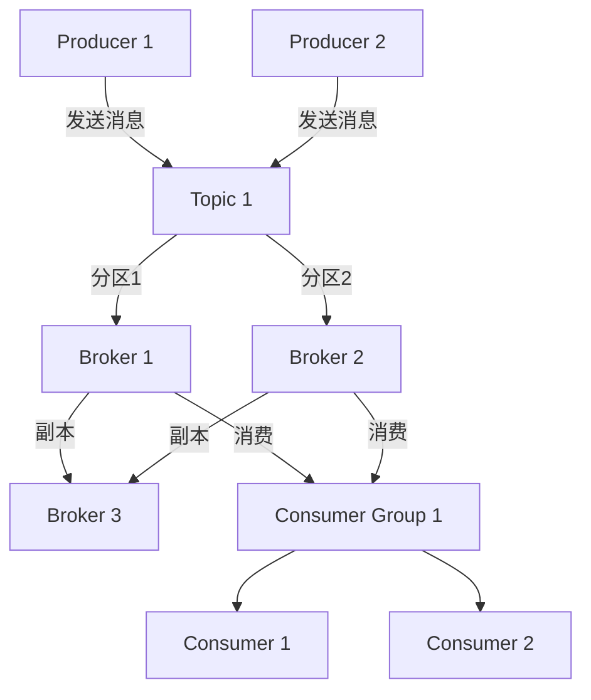

以下是一份详细的 Kafka 教案，针对小白用户设计，包含理论讲解、原理分析、配置优化、监控安装以及运维命令学习等内容。由于篇幅较长，我会分模块清晰呈现，并尽量用通俗易懂的语言解释复杂概念。

---

# Kafka 教案：从入门到进阶

## 1. 学习背景与目标：带着问题解开 Kafka
在学习 Kafka 之前，我们已经掌握了 MySQL 主从分离和 Redis 集群的相关知识。这两者主要解决了数据库高可用、读写分离和缓存高并发的问题。但在实际业务场景中，我们会遇到以下问题：
- **问题 1**：如何处理大规模、高并发的消息流？例如日志收集、实时数据流处理。
- **问题 2**：如何在分布式系统中实现异步通信，解耦生产者和消费者？
- **问题 3**：如何保证消息不丢失、不重复，同时支持高吞吐量？
- **问题 4**：与 MySQL 和 Redis 相比，Kafka 在哪些场景下更适合？

通过学习 Kafka，我们将解决上述问题，理解它作为分布式消息队列的核心价值，并将其与已学的技术进行对比，明确应用场景。

**目标**：掌握 Kafka 的基本原理、安装配置、优化技巧、监控与运维，最终能在实际项目中应用 Kafka。

---

## 2. Kafka 原理详解：带着问题讲解

### 2.1 Kafka 是什么？解决了什么问题？
**问题**：什么是 Kafka？它和 MySQL、Redis 有什么区别？
- **解答**：Kafka 是一个分布式的流处理平台，主要用于处理高吞吐量的消息流。它最初由 LinkedIn 开发，用于日志处理，后来成为 Apache 开源项目。
- **与 MySQL 的区别**：MySQL 是关系型数据库，适合存储结构化数据，但不擅长处理高并发消息流。Kafka 更像一个“日志存储+消息队列”，专注于数据的流式传输和存储。
- **与 Redis 的区别**：Redis 是内存数据库，适合做缓存或小型消息队列，但数据量大时成本高且不适合持久化存储。Kafka 则支持海量数据持久化存储，并提供高吞吐量。
- **解决的问题**：Kafka 解决了分布式系统中高并发消息处理、异步解耦、数据持久化和流处理的问题。例如，电商平台订单系统和支付系统可以通过 Kafka 解耦，互不直接依赖。

### 2.2 Kafka 核心概念与架构
**问题**：Kafka 的架构是怎么样的？为什么能支持高吞吐量？
- **解答**：Kafka 的架构基于发布-订阅模型，核心组件包括：
  - **Producer（生产者）**：发送消息到 Kafka。
  - **Consumer（消费者）**：从 Kafka 读取消息。
  - **Broker（代理）**：Kafka 服务器，存储和转发消息。
  - **Topic（主题）**：消息的分类，类似数据库的表。
  - **Partition（分区）**：Topic 的子集，用于并行处理，提高吞吐量。
  - **Replica（副本）**：分区的备份，保证高可用。
  - **Consumer Group（消费者组）**：多个消费者组成一个组，共同消费一个 Topic。

**Mermaid 架构图**：

**图解释**：
- 生产者将消息发送到某个 Topic，Topic 被分成多个分区，分布在不同 Broker 上。
- 每个分区有多个副本，确保数据不丢失。
- 消费者组内的消费者并行消费不同分区，提高处理效率。

**解决的问题**：通过分区和副本机制，Kafka 实现了高吞吐量和高可用。即使某个 Broker 宕机，副本仍可提供服务。

### 2.3 Kafka 消息存储与顺序保证
**问题**：Kafka 如何存储消息？如何保证消息顺序？
- **解答**：Kafka 将消息存储在磁盘上，采用日志文件的形式，每个分区对应一个日志文件。消息是有序的，消费者按偏移量（offset）读取。
- **解决的问题**：磁盘顺序写入速度快，Kafka 通过顺序 I/O 实现高吞吐量；分区内消息有序，保证了消费者读取的逻辑一致性。

### 2.4 Kafka 高可用与容错
**问题**：Kafka 如何保证数据不丢失？如何处理故障？
- **解答**：
  - 数据不丢失：生产者可以配置“ack”参数，确保消息被 Broker 确认后才算发送成功；副本机制确保数据多份备份。
  - 故障处理：通过 Leader 和 Follower 机制，Leader 宕机后 Follower 接管。
- **解决的问题**：高可用架构避免单点故障，适合大规模分布式系统。

---

## 3. Kafka 优化配置详情
**问题**：如何优化 Kafka 性能？
以下是 Kafka 的核心配置文件 `server.properties` 中的优化参数建议，适用于生产环境：

| 参数名                       | 推荐值          | 说明                                                                 |
|------------------------------|----------------|----------------------------------------------------------------------|
| `num.partitions`            | 3-10           | 默认分区数，根据业务量调整，过多分区会增加管理开销。                   |
| `default.replication.factor`| 2-3            | 默认副本数，建议至少 2，确保高可用。                                 |
| `log.retention.hours`       | 168            | 日志保留时间（小时），根据存储容量和业务需求调整，默认 7 天。         |
| `log.segment.bytes`         | 1073741824     | 日志分段大小（1GB），分段过小会增加文件句柄开销。                    |
| `num.io.threads`            | CPU 核心数 * 2 | I/O 线程数，建议根据服务器 CPU 核心数调整。                         |
| `num.network.threads`       | CPU 核心数 * 1 | 网络线程数，处理网络请求。                                           |
| `min.insync.replicas`       | 2              | 至少有多少副本同步后才算写入成功，建议与副本数匹配。                 |

**优化思路**：
1. **分区与副本**：合理设置分区数和副本数，避免资源浪费。
2. **日志管理**：根据业务需求调整日志保留时间和分段大小，避免磁盘爆满。
3. **线程配置**：根据服务器硬件调整 I/O 和网络线程数，提升并发能力。

---

## 4. Web 监控安装与学习
**问题**：如何监控 Kafka 集群状态？
- **工具推荐**：Kafka Manager 或 Confluent Control Center。
- **安装 Kafka Manager**：
  1. 下载 Kafka Manager：从 GitHub 获取最新版本（https://github.com/yahoo/CMAK）。
  2. 安装依赖：确保已安装 Java 和 sbt。
  3. 编译并运行：执行 `sbt clean dist`，生成 zip 包，解压后运行 `./bin/cmak`。
  4. 配置：修改 `conf/application.conf`，添加 Kafka 集群地址。
  5. 访问：默认端口 9000，浏览器访问 `http://ip:9000`。
- **学习要点**：
  - 查看集群健康状态、Broker 数量、Topic 分布。
  - 监控消息吞吐量、延迟指标。
  - 检查消费者组的消费进度（Lag）。

**解决的问题**：通过监控工具，可以实时掌握 Kafka 集群状态，及时发现性能瓶颈或故障。

---

## 5. 运维 Kafka 命令学习
**问题**：如何管理 Kafka 集群？
以下是常用的 Kafka 命令表格，适用于日常运维：

| 命令类别             | 命令示例                                                                 | 功能说明                       |
|----------------------|--------------------------------------------------------------------------|-------------------------------|
| Topic 管理           | `kafka-topics.sh --create --topic test --bootstrap-server localhost:9092 --partitions 3 --replication-factor 2` | 创建 Topic                   |
|                      | `kafka-topics.sh --list --bootstrap-server localhost:9092`              | 列出所有 Topic               |
| 生产者测试           | `kafka-console-producer.sh --topic test --bootstrap-server localhost:9092` | 控制台生产消息              |
| 消费者测试           | `kafka-console-consumer.sh --topic test --bootstrap-server localhost:9092 --from-beginning` | 控制台消费消息              |
| 消费者组管理         | `kafka-consumer-groups.sh --list --bootstrap-server localhost:9092`     | 列出消费者组                 |
|                      | `kafka-consumer-groups.sh --describe --group test-group --bootstrap-server localhost:9092` | 查看消费者组详情            |

**注意**：Kafka 本身不直接管理 Redis 用户，以上命令是针对 Kafka 的运维。如果题目中提到“管理 Redis 用户”是笔误，我假设是指 Kafka 的权限管理。

**Kafka 权限管理（ACL）**：
1. 启用 ACL：在 `server.properties` 中设置 `authorizer.class.name=kafka.security.authorizer.AclAuthorizer`。
2. 创建用户与权限：
   - 添加用户：Kafka 未直接提供用户管理命令，需结合外部认证（如 Kerberos）或手动配置。
   - 设置权限：`kafka-acls.sh --authorizer-properties zookeeper.connect=localhost:2181 --add --allow-principal User:alice --operation Read --topic test`
3. 测试权限：使用 `kafka-console-consumer.sh` 以指定用户身份消费消息，验证是否成功。

**解决的问题**：通过命令行工具，可以快速管理 Kafka 集群，排查问题。

---

## 6. 安装配置 Kafka
**问题**：如何安装和配置 Kafka？
- **环境准备**：Linux 服务器，Java 8+，ZooKeeper（Kafka 依赖 ZooKeeper 做元数据管理）。
- **安装步骤**：
  1. 下载 Kafka：从官网下载最新版本（https://kafka.apache.org/downloads），如 `kafka_2.13-3.5.0.tgz`。
  2. 解压：`tar -xzf kafka_2.13-3.5.0.tgz`。
  3. 配置 ZooKeeper：启动 ZooKeeper 服务（可单独安装或使用 Kafka 自带脚本）。
  4. 修改 Kafka 配置：编辑 `config/server.properties`，设置 `broker.id=0`（唯一标识）、`listeners=PLAINTEXT://localhost:9092`（监听地址）。
  5. 启动 Kafka：`bin/kafka-server-start.sh config/server.properties`。
  6. 测试：使用生产者和消费者命令行工具，发送和接收消息。
- **解决的问题**：通过安装和配置，搭建 Kafka 环境，为后续学习和应用打下基础。

---

## 7. 教学总结：小白用户学习路径
- **理论学习**：理解 Kafka 的核心概念（Topic、Partition、Broker 等），明确与 MySQL、Redis 的区别。
- **实践操作**：通过安装、配置和命令行操作，熟悉 Kafka 的基本使用。
- **进阶优化**：学习性能优化和监控，掌握生产环境部署技巧。
- **项目应用**：尝试将 Kafka 应用到日志收集、实时数据处理等场景。

**常见问题解答**：
- Q：Kafka 适合我的业务吗？
  - A：如果你的业务涉及高并发消息流、异步解耦或流处理，Kafka 是很好的选择。
- Q：Kafka 难学吗？
  - A：核心概念简单，但配置和优化需要实践。通过本教案循序渐进，小白也能掌握。

---

以上是完整的 Kafka 教案，涵盖从基础理论到高级运维的全流程内容。如果有具体模块需要深入讲解或代码示例，请随时告知！