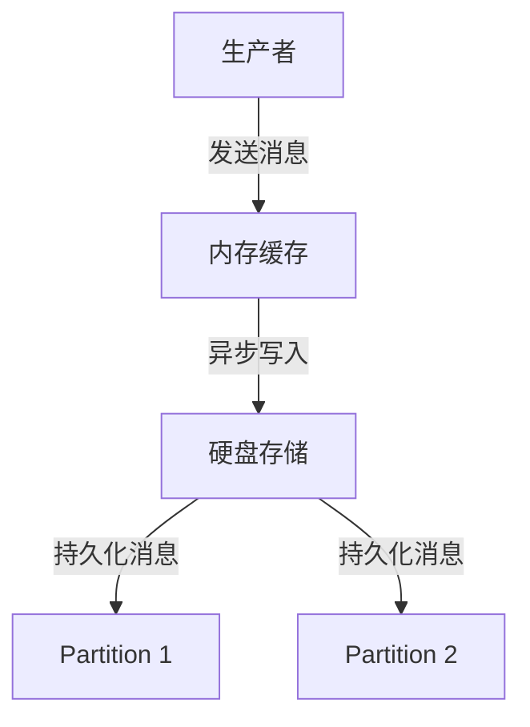
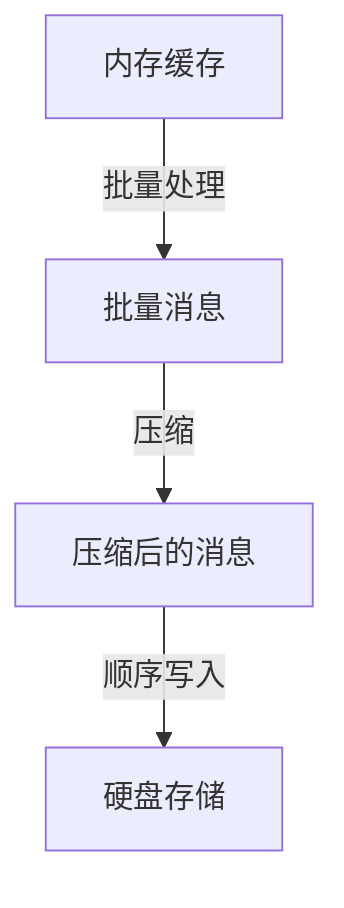
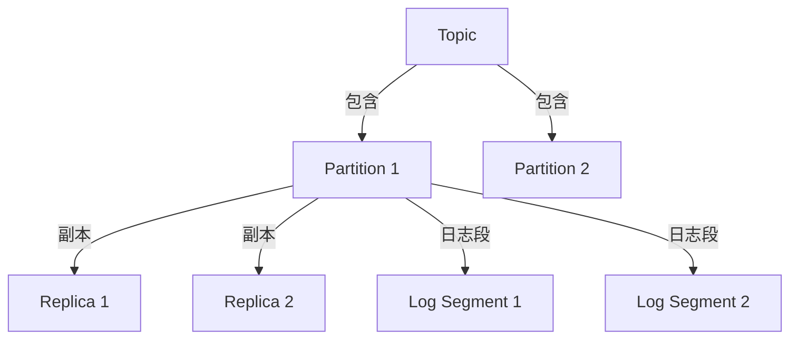
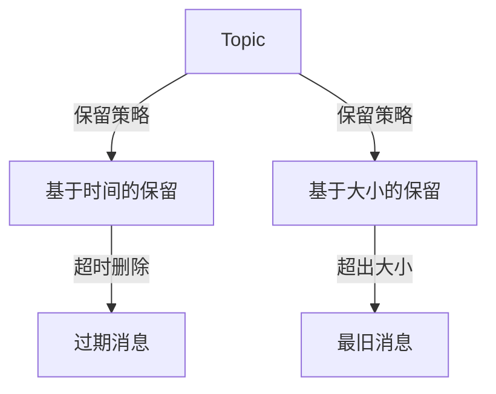
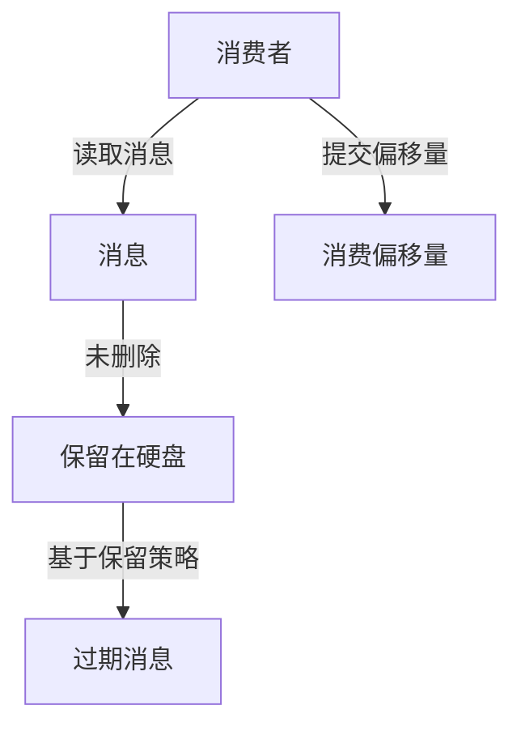
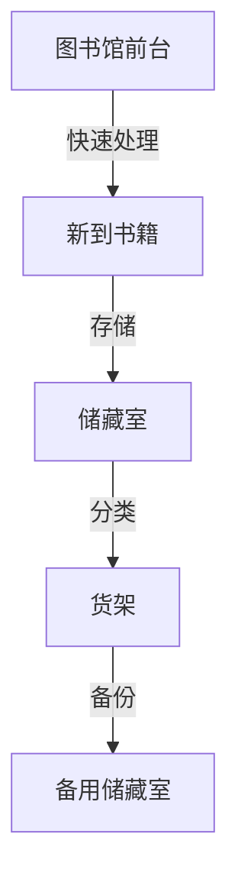
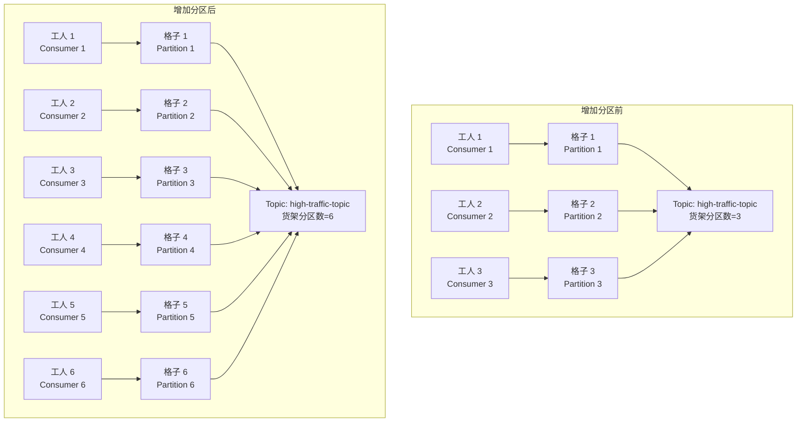
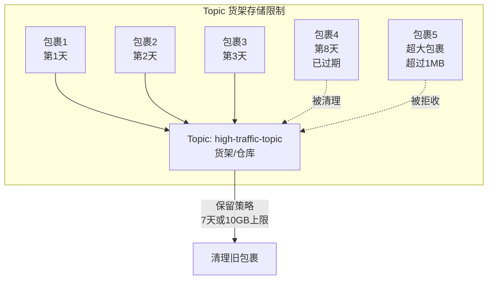

# Kafka 入门与集群实战：从零到企业级应用

## 技能掌握目标
通过本教案的学习，学员将掌握以下技能：
1. **Kafka 基础理论**：理解 Kafka 的核心概念和集群架构，掌握其解决的高并发消息流和系统解耦问题。
2. **架构认知**：熟悉 Kafka 集群的组成（如 Topic、Partition、Broker 等），以及新版本 KRaft 模式与传统 ZooKeeper 模式的区别。
3. **对比理解**：通过与 MySQL 和 Redis 的对比，明确 Kafka 的独特价值和使用场景。
4. **流量冲击应对**：理解 Kafka 如何作为消息中转站，缓解企业服务在流量高峰期的压力，避免服务崩溃。
5. **系统搭配**：了解 Kafka 与 MySQL、Redis 等工具如何在实际业务中协作，构建高效系统。
6. **分布式特性**：理解 Kafka 的分布式设计理念，为后续学习部署和运维打下理论基础。
7. **实践准备**：通过通俗讲解和图示，激发学习兴趣，为后续基于 Docker 的集群部署和企业级问题解决做好准备。


## 第一部分：Kafka 基础与集群架构

### 1.1 Kafka 简介
- **什么是 Kafka？**
  Kafka 是一种分布式流处理平台，简单来说，它就像一个“超级快递中心”，专门处理大量数据的接收、存储和分发。想象一下，每天有成千上万的包裹（数据）从不同地方寄来，Kafka 负责把这些包裹快速分类、存储，然后按需送到不同的收件人手中。
- **Kafka 解决的核心问题**：
  - **高并发消息流**：在互联网时代，数据量巨大且实时产生（如用户点击、订单信息、日志数据），Kafka 能高效处理每秒百万级别的消息，确保数据不丢失、不堵塞。
  - **异步解耦**：在复杂的系统中，不同模块（如订单系统和库存系统）需要交换数据，但它们不一定能同时在线。Kafka 就像一个“中间人”，让生产数据的系统（生产者）和消费数据的系统（消费者）不需要直接沟通，降低了耦合性。
  - **流量冲击防护**：在企业活动中（如电商大促、秒杀活动），流量会突然暴增，导致服务压力过大甚至崩溃。Kafka 作为“消息中转站”，可以先接收所有请求并存储起来，让后端服务按照自己的处理能力逐步消化这些请求，避免被流量直接冲垮。
- **生活化类比**：
  想象 Kafka 是一个巨大的“物流中转站”：
  - 生产者是“寄件人”，不断把包裹（消息）送到中转站。
  - 消费者是“收件人”，根据需求从中转站取走包裹。
  - 中转站（Kafka）负责存储和分发，确保包裹不会丢失，还能按顺序送到正确的人手中。特别是在“双11”这种高峰期，中转站可以先把所有包裹堆积起来，慢慢分拣，避免快递员直接被压垮。
- **目标**：让学员明白 Kafka 是一个处理大数据流的工具，核心作用是高效传递和存储消息，尤其在流量冲击时保护系统稳定。

### 1.2 为什么一定要学 Kafka？与 MySQL 和 Redis 的对比
- **MySQL、Redis 和 Kafka 的定位不同**：
  为了理解为什么需要 Kafka，我们先来看看大家可能更熟悉的两种工具：MySQL 和 Redis，然后对比它们的用途和局限性。
  - **MySQL（关系型数据库）**：
    - **作用**：MySQL 就像一个“档案室”，用来存储结构化数据（如用户信息、订单记录），支持复杂的查询和事务处理。
    - **局限性**：MySQL 不擅长处理高并发、实时的消息流。如果每秒有几十万条数据（如用户点击日志）需要写入，MySQL 会因为频繁的磁盘操作而变得很慢，甚至崩溃。特别是在企业活动流量暴增时，MySQL 无法承受突如其来的请求压力。
    - **适用场景**：存储需要长期保存和查询的数据，比如用户的账户余额。
  - **Redis（内存数据库）**：
    - **作用**：Redis 就像一个“快速便签本”，数据存储在内存中，读写速度极快，常用于缓存、计数器或简单的消息队列。
    - **局限性**：Redis 虽然快，但它更适合小规模、高速读写的场景。如果数据量巨大（如活动期间的订单流），内存成本会很高；而且 Redis 的持久化能力有限，数据容易丢失，难以应对大规模流量冲击。
    - **适用场景**：缓存热门数据、处理简单的实时任务，比如记录网站的访问量。
  - **Kafka（分布式消息系统）**：
    - **作用**：Kafka 就像一个“物流中转站”，专门处理大规模、实时的消息流。它能接收、存储和分发每秒百万级别的消息，同时保证数据不丢失。
    - **优势**：Kafka 既不像 MySQL 那样受限于磁盘性能，也不像 Redis 那样受限于内存成本。它通过分布式架构和磁盘顺序写入，实现了高吞吐量和可靠性。尤其是在企业活动流量暴增时，Kafka 作为“缓冲区”，可以先存储所有请求，让后端服务按自己的节奏处理，避免系统被直接冲垮。
    - **适用场景**：处理大规模实时数据流，比如收集用户行为日志、传递系统间消息，尤其是在流量高峰期保护系统稳定。
- **为什么一定要学 Kafka？**
  - **解决高并发问题**：在现代互联网应用中，数据量和实时性要求越来越高，MySQL 和 Redis 无法完全满足需求，而 Kafka 专为这种场景设计。
  - **流量冲击防护**：在企业活动中（如电商“双11”、秒杀活动），流量会突然暴增，Kafka 作为消息中转站，可以有效缓冲请求，保护后端服务不被压垮。这是 MySQL 和 Redis 难以实现的。
  - **系统解耦的关键**：Kafka 作为“中间人”，让不同系统（比如订单系统和库存系统）可以异步通信，减少直接依赖，提升系统的灵活性和稳定性。
  - **企业级标配**：几乎所有涉及大数据、实时处理的互联网公司（如电商、社交平台）都在使用 Kafka，学习 Kafka 是进入相关领域的必备技能。
- **生活化类比**：
  - MySQL 是“档案室”，适合存放需要仔细整理和查询的资料，但不适合快速收发大量包裹，尤其是在“双11”这种高峰期，档案室会直接瘫痪。
  - Redis 是“便签本”，适合快速记下小范围的事情，但不适合存储和管理海量包裹，一旦包裹太多，便签本就写不下了。
  - Kafka 是“物流中转站”，专门处理大规模包裹的收发和分发，效率高且可靠，尤其是在高峰期可以先堆积包裹，慢慢分拣，避免快递员被压垮。
- **目标**：通过与 MySQL 和 Redis 的对比，让学员理解 Kafka 的独特价值，明确它在高并发、系统解耦和流量冲击防护中的不可替代性。

### 1.3 Kafka 与 MySQL、Redis 如何搭配？
- **实际业务中的协作**：
  在一个完整的系统中，Kafka、MySQL 和 Redis 往往不是单独使用的，而是各司其职，相互配合。
  - **场景举例：电商平台秒杀活动**：
    1. 活动开始，用户疯狂下单，订单系统产生大量订单数据（生产者）。
    2. 订单数据首先发送到 Kafka，作为消息流存储在某个 Topic 中，缓冲流量冲击，避免直接冲击后端服务。
    3. 库存系统（消费者）从 Kafka 读取订单数据，按照自己的处理能力逐步更新库存，不会被瞬间流量压垮。
    4. 订单数据最终写入 MySQL，长期存储以供查询（如用户查看历史订单）。
    5. 热门商品的库存数据同时更新到 Redis，用于快速展示给其他用户（缓存）。
  - **为什么这样搭配？**
    - Kafka 负责“消息传递和缓冲”，处理高并发订单流，确保订单数据不丢失，并且让订单系统和库存系统异步通信，互不影响，尤其是在流量高峰期保护系统稳定。
    - MySQL 负责“数据存储”，保存订单的最终状态，支持复杂的查询和报表分析。
    - Redis 负责“快速访问”，缓存热门数据，提升用户体验。
- **搭配的优势**：
  - **高性能**：Kafka 处理高并发消息流，减轻 MySQL 的写入压力。
  - **低耦合**：通过 Kafka，订单系统和库存系统不需要直接通信，系统更灵活。
  - **流量防护**：Kafka 作为缓冲区，在活动高峰期存储大量请求，让后端服务按合理节奏处理，避免崩溃。
  - **用户体验**：Redis 提供快速缓存，页面响应更快。
- **生活化类比**：
  想象一个电商物流体系在“双11”高峰期：
  - Kafka 是“物流中转站”，接收和分发所有订单包裹，处理速度快，先堆积所有包裹，慢慢分拣，避免后端直接崩溃。
  - MySQL 是“档案室”，记录每个订单的最终状态，方便日后查账。
  - Redis 是“公告栏”，展示热门商品的库存，方便快速查看。
  这三者分工明确，共同保证电商平台在流量高峰期也能高效运转。
- **目标**：让学员明白 Kafka 不是孤立工具，它在实际业务中与 MySQL 和 Redis 配合，特别是在流量冲击时构建高效、稳定的系统。

### 1.4 集群架构详解
- **Kafka 的核心概念**：
  为了理解 Kafka 的工作原理，我们需要先认识它的几个“零件”：
  - **Topic（主题）**：消息的分类标签，类似物流中转站的“分类货架”。比如“订单”是一个 Topic，“用户日志”是另一个 Topic，消息会根据类型放到不同的 Topic 上。
  - **Partition（分区）**：一个 Topic 可以分成多个分区，每个分区就像货架上的“格子”，用来存放一部分消息。分区的作用是提高处理速度和存储能力，因为多个格子可以同时处理消息。
  - **Replica（副本）**：每个分区会有多个副本，就像“备份格子”，防止数据丢失。如果一个格子坏了，备份格子可以顶上。
  - **Broker（经纪人/节点）**：Kafka 集群中的一台服务器，负责存储和转发消息。就像物流中转站的一个“分站”，多个 Broker 组成集群，共同分担工作量。
  - **Consumer Group（消费者组）**：一组消费者共同消费某个 Topic 的消息，就像一队快递员一起取包裹，分工协作，确保每个消息只被处理一次。
- **这些概念如何协作？**
  - 生产者把消息发送到某个 Topic，Kafka 会根据规则把消息分配到 Topic 的某个 Partition 上。
  - 每个 Partition 存储在某个 Broker 上，同时有副本存储在其他 Broker 上，确保数据安全。
  - 消费者组订阅 Topic，组内不同消费者分别读取不同 Partition 的消息，实现高效并行处理。
- **生活化类比**：
  想象一个大型物流中心：
  - Topic 是“货架分类”（如“生鲜”“图书”）。
  - Partition 是货架上的“格子”，一个货架有多个格子，方便同时处理更多包裹。
  - Replica 是“备用格子”，防止某个格子坏了导致包裹丢失。
  - Broker 是“分站”，多个分站组成整个物流网络。
  - Consumer Group 是“快递小队”，小队成员分工取不同格子的包裹，确保高效配送。
- **目标**：通过类比和简单描述，让学员快速抓住 Kafka 集群的核心组件和它们之间的关系。

### 1.5 新版本架构变化：KRaft 模式
- **传统模式（ZooKeeper 模式）**：
  在 Kafka 的早期版本中，集群依赖一个叫 ZooKeeper 的工具来管理元数据（比如哪个 Broker 负责哪个 Partition，谁是 Leader）。ZooKeeper 就像一个“总调度员”，记录和管理整个集群的状态。
- **新版本变化（KRaft 模式）**：
  从 Kafka 2.8.0 开始，引入了 KRaft 模式（Kafka Raft Metadata 模式），Kafka 不再依赖 ZooKeeper，而是自己内置了一个元数据管理机制。简单来说，Kafka 集群中的几个 Broker 会选举出一个“Controller（控制器）”，由它来管理元数据和协调集群工作。
- **KRaft 模式的优势**：
  - **简化架构**：不需要额外部署和管理 ZooKeeper，减少了系统复杂度。
  - **性能提升**：元数据管理更高效，集群启动和恢复速度更快。
  - **更适合小型部署**：对于学习者和小型企业，KRaft 模式更容易上手。
- **生活化类比**：
  - ZooKeeper 模式就像物流中心请了一个“外部顾问”来指挥调度，顾问知道所有分站的情况。
  - KRaft 模式则是物流中心自己选一个“内部经理”来管理，不再需要外部顾问，沟通更快，成本更低。
- **目标**：让学员了解 Kafka 的技术演进，明白 KRaft 模式是当前趋势，后续实验将基于此模式。

### 1.6 架构图示
为了更直观地展示 Kafka 集群的结构，我们用 Mermaid 图来表示典型架构，并对比 KRaft 模式和 ZooKeeper 模式的差异。

- **Kafka 集群典型结构图**：
  ```mermaid
  graph TD
      P1[生产者 1] -->|发送消息| T1[Topic 1]
      P2[生产者 2] -->|发送消息| T1
      T1 --> P1_1[Partition 1]
      T1 --> P1_2[Partition 2]
      P1_1 --> B1[Broker 1]
      P1_1 -.->|副本| B2[Broker 2]
      P1_2 --> B2
      P1_2 -.->|副本| B3[Broker 3]
      B1 -->|读取消息| C1[消费者 1]
      B2 -->|读取消息| C2[消费者 2]
      C1 --- CG[消费者组]
      C2 --- CG
  ```
  **解释**：生产者将消息发送到 Topic，Topic 分成多个 Partition 存储在不同 Broker 上，每个 Partition 有副本备份。消费者组内的消费者分别读取不同 Partition 的消息。

- **ZooKeeper 模式 vs KRaft 模式对比图**：
  ```mermaid
  graph TD
      subgraph ZooKeeper 模式
          ZK[ZooKeeper 集群] -->|管理元数据| B1Z[Broker 1]
          ZK --> B2Z[Broker 2]
          ZK --> B3Z[Broker 3]
      end
      subgraph KRaft 模式
          B1K[Broker 1<br>Controller] -->|管理元数据| B2K[Broker 2]
          B1K --> B3K[Broker 3]
      end
  ```
  **解释**：
  - ZooKeeper 模式：ZooKeeper 作为一个独立集群，负责管理 Kafka 集群的元数据和协调工作。
  - KRaft 模式：Kafka 集群内部选举一个 Broker 作为 Controller，直接管理元数据，不需要外部 ZooKeeper。

- **Kafka 与 MySQL、Redis 搭配示意图（流量冲击场景）**：
  ```mermaid
  graph TD
      OS[订单系统<br>生产者<br>秒杀活动] -->|高并发订单消息| K[Kafka<br>Topic: 订单<br>缓冲流量]
      K -->|按节奏读取| IS[库存系统<br>消费者]
      K -->|按节奏读取| MS[MySQL<br>存储订单]
      IS -->|更新库存| R[Redis<br>缓存库存]
      US[用户系统] -->|查询库存| R
  ```
  **解释**：在秒杀活动中，订单系统产生高并发订单消息，Kafka 作为缓冲区存储所有请求，库存系统和 MySQL 按自己的处理能力逐步读取，避免被流量直接冲垮，Redis 缓存热门库存数据供用户快速查询。


## 1.7 Kafka 的内存与硬盘管理

### 1.7.1 工作原理

Kafka 作为一个高吞吐量的分布式消息队列，采用了独特的内存与硬盘管理机制，以确保高效的数据处理和持久化。其工作原理可以概括为以下几个步骤：

- **内存缓存**：
  - 当生产者发送消息时，Kafka 首先将这些消息写入内存缓存（也称为内存队列）。这一步骤是极其快速的，因为内存的读写速度远高于硬盘。内存缓存的作用是暂时存储即将写入硬盘的数据，以减少对硬盘的频繁访问。
  - 这种设计使得生产者可以在不等待写入确认的情况下继续发送消息，从而提高了系统的吞吐量。

- **异步写入硬盘**：
  - Kafka 在后台异步地将内存中的消息写入硬盘。这意味着，生产者发送消息后，不需要等待消息被写入硬盘的确认。Kafka 会定期将内存中的数据批量写入硬盘，这种批量处理方式可以显著降低 I/O 操作的开销。
  - 异步写入的另一个好处是，它允许 Kafka 在高负载情况下仍然保持良好的性能，因为生产者和消费者之间的操作不会相互阻塞。

- **持久化存储**：
  - Kafka 将消息以不可变的形式存储在硬盘上。这意味着一旦消息被写入，就无法被修改或删除，只有在达到保留策略时才会被删除。这样的设计确保了数据的一致性和可靠性。
  - 每个 Topic 被划分为多个 Partition，每个 Partition 内的消息按照顺序写入。Kafka 使用顺序写入的方式来提高写入性能，因为顺序写入比随机写入更高效。



### 1.7.2 性能优化策略

为了提高系统性能，Kafka 实施了一系列优化策略：

- **批量处理**：
  - Kafka 支持将多条消息打包成一个批次发送到 Broker。通过批量发送，Kafka 可以减少网络往返的次数，降低网络延迟，从而提高整体吞吐量。
  - 例如，生产者可以设置 `batch.size` 和 `linger.ms` 参数，调整批量发送的大小和等待时间，以实现最优的性能。

- **压缩**：
  - Kafka 支持对消息进行压缩（如 Gzip、Snappy 等），这不仅可以减少存储空间，还可以加快网络传输速度。压缩后的数据在传输时占用的带宽更少，减少了网络负担。
  - 消费者在读取消息时，Kafka 会自动解压缩这些消息，使得消费者能够透明地处理压缩数据。

- **顺序写入**：
  - Kafka 利用顺序写入的方式将数据写入硬盘，这种方式比随机写入性能更优，尤其是在处理大量数据时。顺序写入减少了磁盘寻道时间，提高了 I/O 效率。
  - 由于 Kafka 的消息是以日志的形式存储，顺序写入使得日志的读取和删除变得更加高效。



### 1.7.3 数据存储机制

Kafka 的数据存储机制是其高效性和可靠性的关键，主要包括以下几个方面：

- **Partition**：
  - 每个 Topic 被划分为多个 Partition，每个 Partition 是一个独立的日志文件，消息在 Partition 内是按顺序写入的。Partition 的数量可以根据需求进行配置，以实现负载均衡和并行处理。
  - 每个 Partition 有一个唯一的偏移量（offset），用于标识消息在 Partition 中的位置，消费者可以通过偏移量精确地读取消息。

- **副本（Replica）**：
  - 每个 Partition 可以有多个副本，这些副本分布在不同的 Broker 上。副本机制确保了数据的高可用性和容错性。如果某个 Broker 发生故障，其他副本可以继续提供服务，确保数据不会丢失。
  - 副本的数量可以通过配置 `min.insync.replicas` 来设置，以确保在写入数据时有足够的副本可用。

- **日志段（Log Segment）**：
  - Kafka 将每个 Partition 的数据分成多个日志段，每个日志段是一个固定大小的文件（如 1GB）。当日志段达到指定大小后，Kafka 会创建新的日志段。这种设计使得数据管理更加高效。
  - 日志段的使用不仅提高了磁盘的 I/O 性能，还便于进行数据的清理和过期处理。



### 1.7.4 数据保留策略

Kafka 提供了灵活的数据保留策略，以满足不同业务场景的需求：

1. **基于时间的保留**：
   - 用户可以为每个 Topic 设置消息的保留时间，超过这个时间的消息将被自动删除。这种策略适用于不需要长期保存的消息，例如实时数据流。
   - 配置项：`retention.ms`，例如，设置为 `604800000` 表示保留 7 天。

2. **基于大小的保留**：
   - 用户可以设置每个 Partition 的最大存储大小。当 Partition 的总大小超过这个限制时，Kafka 会开始删除最旧的消息，以腾出空间。
   - 配置项：`retention.bytes`，例如，设置为 `1073741824` 表示最大存储大小为 1GB。



### 1.7.5 消费后数据的处理

在 Kafka 中，消费者的行为与数据的存储和删除密切相关：

- **消费与删除**：
  - 消费者在读取消息时，并不会立即删除这些消息。消息的删除是基于保留策略进行的，消费者可以根据自己的需求选择何时读取下一个消息。
  - 这种设计使得消费者可以多次读取相同的消息，适用于需要重放数据的场景。

- **消费偏移量**：
  - 消费者通过偏移量（offset）跟踪已消费的消息。Kafka 提供了手动和自动提交偏移量的功能，消费者可以选择适合自己业务逻辑的方式。
  - 自动提交偏移量的机制可以简化消费者的实现，但在某些情况下可能会导致数据丢失或重复消费，因此需要谨慎使用。



### 1.7.6 生活化类比

想象 Kafka 像一个大型图书馆，书籍的管理方式如下：

- **内存**：就像图书馆的前台，快速处理新到的书籍。这里的书籍是临时存放的，适合快速分拣和借阅，但并不适合长期存储。
  
- **硬盘**：就像图书馆的储藏室，所有书籍都被整齐地存放在这里。每本书籍一旦放入储藏室，就会永久保存，直到被取走。

- **Partition**：就像储藏室中的多个货架，每个货架上有不同类型的书籍。每个货架上的书籍按照顺序放置，方便快速检索。

- **副本**：就像在不同地点有多个相同的储藏室，以防某个储藏室发生意外，其他储藏室仍然可以提供服务。




## 第二部分：Kafka 单机部署（重点：Docker 部署）

### 2.1 单机部署的理论基础
在学习 Kafka 集群之前，我们先从最简单的单机部署开始。单机部署就像“一个人开的小型物流站”，虽然规模小，但包含了 Kafka 的核心功能，让你快速上手，理解基本操作和命令。

- **什么是单机部署？**
  单机部署是指在一台机器上运行一个 Kafka Broker（节点），负责接收、存储和转发消息。没有其他节点参与，也没有副本和分布式特性，适合学习和测试。
- **单机部署的核心作用**：
  - **学习基础命令**：通过单机环境，熟悉 Kafka 的基本操作，如创建 Topic、发送消息、消费消息等。
  - **理解核心概念**：掌握 Topic、Partition、Broker 等概念的实际含义，为后续集群学习打基础。
  - **快速验证**：单机环境简单，启动快，容易排查问题，适合初学者。
- **生活化类比**：
  想象你开了一个小型快递点（单机 Kafka），只有你一个人（一个 Broker），负责接收包裹（消息）、放到货架上（Topic 和 Partition），然后分发给收件人（消费者）。虽然规模小，但你能学会如何管理包裹，为将来开大物流中心（集群）做好准备。
- **目标**：
  让学员理解单机部署的意义，降低学习门槛，为后续集群部署打好理论和实践基础。

### 2.2 环境准备
在开始部署 Kafka 单机之前，我们需要准备好实验环境。步骤很简单，就像准备一次简单的家庭聚会。

- **确保安装 Docker**：
  Docker 是一个“容器工具”，就像一个能快速打包和运行软件的“魔法箱子”，可以让我们在不同电脑上运行相同的 Kafka 环境。
  - 如果你还没安装 Docker，可以参考以下简单步骤：
    1. 访问 Docker 官网（https://www.docker.com/get-started/），下载适合你系统的版本（Windows、Mac 或 Linux）。
    2. 按照提示安装，安装完成后在终端输入 `docker --version`，如果能看到版本号，说明安装成功。
  - 详细安装指南：https://docs.docker.com/get-docker/。
- **硬件要求**：
  单机部署对资源要求较低，建议你的电脑或云服务器至少有：
  - 内存：2GB（就像给 Kafka 提供一个小的“工作空间”）。
  - CPU：1 核（就像给 Kafka 提供一个“工人”来处理任务）。
- **Kafka 版本与镜像**：
  我们将使用指定镜像 `swr.cn-north-4.myhuaweicloud.com/ddn-k8s/docker.io/bitnami/kafka:4.0.0`，这是 Bitnami 提供的 Kafka 镜像，版本较新，支持 KRaft 模式（不需要 ZooKeeper）。
- **Kafka UI 镜像**：
  为了方便可视化管理，我们还会部署一个 Web UI 工具，使用镜像 `swr.cn-north-4.myhuaweicloud.com/ddn-k8s/ghcr.io/kafbat/kafka-ui:v1.2.0`，这是一个开源的 Kafka 管理界面，类似“物流中心的监控屏幕”，可以直观查看 Topic、消息等信息。
- **目标**：
  确保每位学员都能准备好 Docker 环境和硬件资源，为单机部署做好准备。


### 2.3 Docker 部署 Kafka 单机
我们将通过 Docker 快速部署一个单机 Kafka Broker。步骤简单，类似“搭建一个小型积木房子”，以下是详细步骤和命令解释。

#### 步骤 1：拉取 Kafka 镜像
镜像是一个“预装好的软件包”，我们先从仓库下载 Kafka 镜像。
- 在终端输入以下命令：
  ```bash
  docker pull swr.cn-north-4.myhuaweicloud.com/ddn-k8s/docker.io/bitnami/kafka:4.0.0
  ```
- 下载完成后，用以下命令确认是否成功：
  ```bash
  docker images
  ```

#### 步骤 2：启动 Kafka 单机容器
我们将启动一个 Kafka 容器作为单机 Broker。Bitnami 镜像默认支持 KRaft 模式（无需 ZooKeeper），配置简便。
- 输入以下命令启动 Kafka（请将 `192.168.1.100` 替换为你的主机实际 IP）：
  ```bash
  docker run -d \
    --network host \
    --name kafka-single \
    -p 9092:9092 \
    -p 9093:9093 \
    -e KAFKA_CFG_NODE_ID=1 \
    -e KAFKA_CFG_PROCESS_ROLES=broker,controller \
    -e KAFKA_CFG_CONTROLLER_QUORUM_VOTERS=1@192.168.1.100:9093 \
    -e KAFKA_CFG_LISTENERS=PLAINTEXT://0.0.0.0:9092,CONTROLLER://0.0.0.0:9093 \
    -e KAFKA_CFG_ADVERTISED_LISTENERS=PLAINTEXT://192.168.1.100:9092 \
    -e KAFKA_CFG_LISTENER_SECURITY_PROTOCOL_MAP=PLAINTEXT:PLAINTEXT,CONTROLLER:PLAINTEXT \
    -e KAFKA_CFG_CONTROLLER_LISTENER_NAMES=CONTROLLER \
    -e KAFKA_CFG_INTER_BROKER_LISTENER_NAME=PLAINTEXT \
    -e ALLOW_PLAINTEXT_LISTENER=yes \
    -v kafka-data:/bitnami/kafka/data \
    swr.cn-north-4.myhuaweicloud.com/ddn-k8s/docker.io/bitnami/kafka:4.0.0
  ```
  **参数详细解释**：
  - `--name kafka-single`：为容器设置一个名称，方便后续管理，就像给你的 Kafka 服务起一个容易识别的名字。
  - `-p 9092:9092`：端口映射，将容器内部的 9092 端口映射到主机的 9092 端口。9092 是 Kafka Broker 的默认端口，用于客户端发送和接收消息。
  - `-p 9093:9093`：端口映射，将容器内部的 9093 端口映射到主机的 9093 端口。9093 是 Kafka Controller 的端口，用于集群管理（在 KRaft 模式下）。
  - `-e KAFKA_CFG_NODE_ID=1`：设置 Kafka 节点的唯一标识符，类似于给节点分配一个编号，在集群中用于区分不同节点。这里设置为 1，因为是单机模式。
  - `-e KAFKA_CFG_PROCESS_ROLES=broker,controller`：定义节点的角色。`broker` 角色负责存储和转发消息，`controller` 角色负责管理集群元数据（比如谁是 leader）。单机模式下，一个节点同时承担这两个角色。
  - `-e KAFKA_CFG_CONTROLLER_QUORUM_VOTERS=1@192.168.1.100:9093`：指定 Controller 的投票成员列表，用于选举 Controller 领导者。格式是 `节点ID@主机IP:端口`，这里只有 1 个节点，ID 为 1，地址为主机 IP 和 9093 端口。
  - `-e KAFKA_CFG_LISTENERS=PLAINTEXT://0.0.0.0:9092,CONTROLLER://0.0.0.0:9093`：定义 Kafka 监听的地址和端口。`0.0.0.0` 表示监听所有网络接口，`PLAINTEXT://0.0.0.0:9092` 表示 Broker 在 9092 端口监听消息通信，`CONTROLLER://0.0.0.0:9093` 表示 Controller 在 9093 端口监听管理通信。
  - `-e KAFKA_CFG_ADVERTISED_LISTENERS=PLAINTEXT://192.168.1.100:9092`：定义 Kafka 对外公布的地址和端口，告诉客户端和其它 Broker 通过这个地址连接到 Broker。设置为主机 IP 和 9092 端口（Controller 的地址不需要对外公布）。
  - `-e KAFKA_CFG_LISTENER_SECURITY_PROTOCOL_MAP=PLAINTEXT:PLAINTEXT,CONTROLLER:PLAINTEXT`：定义监听器的安全协议映射。`PLAINTEXT:PLAINTEXT` 表示 Broker 监听器使用明文通信，`CONTROLLER:PLAINTEXT` 表示 Controller 监听器也使用明文通信。
  - `-e KAFKA_CFG_CONTROLLER_LISTENER_NAMES=CONTROLLER`：指定 Controller 监听器的名称，用于内部识别和管理。
  - `-e KAFKA_CFG_INTER_BROKER_LISTENER_NAME=PLAINTEXT`：指定 Broker 之间通信使用的监听器名称，这里是 `PLAINTEXT`，确保 Broker 间通信正常。
  - `-e ALLOW_PLAINTEXT_LISTENER=yes`：允许使用明文（不加密）监听器，简化测试环境配置。生产环境中应设置为 `no`，并启用加密和认证。
  - `-v kafka-data:/bitnami/kafka/data`：数据卷挂载，将 Kafka 数据存储在主机的一个名为 `kafka-data` 的数据卷中，映射到容器内的 `/bitnami/kafka/data` 路径。这样即使容器被删除，数据也不会丢失。
  - `swr.cn-north-4.myhuaweicloud.com/ddn-k8s/docker.io/bitnami/kafka:4.0.0`：指定使用的 Docker 镜像及其版本，这里是 Bitnami 提供的 Kafka 4.0.0 版本镜像。

#### 步骤 3：检查 Kafka 是否正常运行
启动后，检查容器状态，确保 Kafka 运行正常。
- 查看容器状态：
  ```bash
  docker ps
  ```
  如果 `kafka-single` 状态为 `Up`，说明启动成功。
- 查看日志确认是否有错误：
  ```bash
  docker logs kafka-single
  ```
  如无 `ERROR` 等明显错误信息，Kafka 运行正常。

### 2.4 部署 Kafka UI（可视化管理工具）
为了直观管理 Kafka，我们部署 Kafka UI 工具。它就像“物流中心的监控屏幕”，通过浏览器即可查看和管理 Topic、消息等信息。

#### 步骤 1：拉取 Kafka UI 镜像
输入以下命令下载 Kafka UI 镜像：
```bash
docker pull swr.cn-north-4.myhuaweicloud.com/ddn-k8s/ghcr.io/kafbat/kafka-ui:v1.2.0
```

#### 步骤 2：启动 Kafka UI 容器
输入以下命令启动 Kafka UI，并连接到单机 Kafka 实例（请将 `192.168.1.100` 替换为你的主机实际 IP）：
```bash
docker run -d \
  --name kafka-ui \
  -p 8080:8080 \
  -e KAFKA_CLUSTERS_0_NAME=local \
  -e KAFKA_CLUSTERS_0_BOOTSTRAPSERVERS=192.168.1.100:9092 \
  swr.cn-north-4.myhuaweicloud.com/ddn-k8s/ghcr.io/kafbat/kafka-ui:v1.2.0
```
**参数详细解释**：
- `--name kafka-ui`：为容器设置一个名称，方便后续管理。
- `-p 8080:8080`：端口映射，将容器内部的 8080 端口映射到主机的 8080 端口。Kafka UI 的 Web 界面通过这个端口访问。
- `-e KAFKA_CLUSTERS_0_NAME=local`：设置 Kafka 集群的显示名称，在 UI 界面中会显示为 `local`，便于识别。
- `-e KAFKA_CLUSTERS_0_BOOTSTRAPSERVERS=192.168.1.100:9092`：指定 Kafka 集群的连接地址，即 Kafka Broker 的地址和端口。设置为主机 IP 和 9092 端口，必须与 Kafka 的 `ADVERTISED_LISTENERS` 配置一致，否则 UI 无法连接到 Kafka。
- `swr.cn-north-4.myhuaweicloud.com/ddn-k8s/ghcr.io/kafbat/kafka-ui:v1.2.0`：指定使用的 Kafka UI Docker 镜像及其版本。

#### 步骤 3：访问 Kafka UI
启动后，打开浏览器访问 `http://192.168.1.100:8080`（请将 IP 替换为你的主机实际 IP），即可看到 Kafka UI 界面。如果连接成功，界面会显示名为 `local` 的 Kafka 集群信息。
- 点击左侧菜单可查看 Topic、Broker 等信息。
- 如无 Topic，界面可能为空，后续可创建 Topic 并查看。


          
在进行Kafka实战操作之前，让我们先了解Kafka的核心命令和语法。

### 2.5 Kafka命令详解

#### 1. Topic管理命令

| 命令 | 语法 | 参数说明 | 用途 |
|------|------|----------|------|
| 创建Topic | `kafka-topics.sh --create --topic <topic_name> --bootstrap-server <server:port> --partitions <num> --replication-factor <num>` | • `--topic`: 主题名称<br>• `--bootstrap-server`: Kafka服务器地址<br>• `--partitions`: 分区数<br>• `--replication-factor`: 副本因子 | 创建新的主题 |
| 列出所有Topic | `kafka-topics.sh --list --bootstrap-server <server:port>` | • `--bootstrap-server`: Kafka服务器地址 | 显示所有主题列表 |
| 查看Topic详情 | `kafka-topics.sh --describe --topic <topic_name> --bootstrap-server <server:port>` | • `--topic`: 主题名称<br>• `--bootstrap-server`: Kafka服务器地址 | 查看主题详细信息 |
| 删除Topic | `kafka-topics.sh --delete --topic <topic_name> --bootstrap-server <server:port>` | • `--topic`: 主题名称<br>• `--bootstrap-server`: Kafka服务器地址 | 删除指定主题 |

#### 2. 生产者命令

| 命令 | 语法 | 参数说明 | 用途 |
|------|------|----------|------|
| 控制台生产者 | `kafka-console-producer.sh --topic <topic_name> --bootstrap-server <server:port>` | • `--topic`: 主题名称<br>• `--bootstrap-server`: Kafka服务器地址 | 启动控制台生产者 |
| 带key的生产者 | `kafka-console-producer.sh --topic <topic_name> --bootstrap-server <server:port> --property parse.key=true --property key.separator=:` | • `parse.key`: 启用消息键<br>• `key.separator`: 键值分隔符 | 发送带key的消息 |

#### 3. 消费者命令

| 命令 | 语法 | 参数说明 | 用途 |
|------|------|----------|------|
| 控制台消费者 | `kafka-console-consumer.sh --topic <topic_name> --bootstrap-server <server:port> --from-beginning` | • `--topic`: 主题名称<br>• `--bootstrap-server`: Kafka服务器地址<br>• `--from-beginning`: 从头开始消费 | 启动控制台消费者 |
| 消费者组消费 | `kafka-console-consumer.sh --topic <topic_name> --bootstrap-server <server:port> --group <group_name>` | • `--group`: 消费者组名称 | 使用消费者组消费消息 |

#### 4. 消费者组管理

| 命令 | 语法 | 参数说明 | 用途 |
|------|------|----------|------|
| 列出消费者组 | `kafka-consumer-groups.sh --list --bootstrap-server <server:port>` | • `--bootstrap-server`: Kafka服务器地址 | 显示所有消费者组 |
| 查看组详情 | `kafka-consumer-groups.sh --describe --group <group_name> --bootstrap-server <server:port>` | • `--group`: 消费者组名称<br>• `--bootstrap-server`: Kafka服务器地址 | 查看消费者组详情 |

#### 5. 常用参数说明

| 参数 | 说明 | 示例值 |
|------|------|--------|
| `--bootstrap-server` | Kafka服务器地址和端口 | localhost:9092 |
| `--topic` | 主题名称 | test-topic |
| `--partitions` | 主题分区数 | 1, 3, 5... |
| `--replication-factor` | 副本因子 | 1, 2, 3... |
| `--from-beginning` | 是否从头开始消费 | 无需值 |
| `--group` | 消费者组名称 | group1 |

#### 实战操作前的注意事项
1. 确保Kafka服务已启动
2. 命令中的服务器地址要根据实际部署情况调整
3. 分区数和副本因子要根据集群规模来设置
4. 建议先在测试环境熟悉这些命令


#### 6. Kafka 单机基础操作实战
现在 Kafka 单机已经运行，我们通过命令行进行一些基础操作，熟悉 Kafka 的核心功能。就像在小型快递点学习如何接收和分发包裹。

- **步骤 1：进入 Kafka 容器**
  由于 Bitnami 镜像中已经包含了 Kafka 的命令行工具，我们直接进入容器操作：
  ```bash
  docker exec -it kafka-single /bin/bash
  ```
  进入后，你可以在容器内运行 Kafka 相关命令。
- **步骤 2：创建 Topic**
  创建一个名为 `test-topic` 的主题，就像在快递点建一个新货架：
  ```bash
  kafka-topics.sh --create --topic test-topic --bootstrap-server localhost:9092 --partitions 1 --replication-factor 1
  ```
  **解释**：
  - `--topic test-topic`：主题名称。
  - `--partitions 1`：设置 1 个分区（单机只能是 1）。
  - `--replication-factor 1`：设置 1 个副本（单机只能是 1）。
  如果创建成功，会看到类似 `Created topic test-topic` 的输出。
- **步骤 3：发送消息（生产者）**
  启动一个生产者，发送消息到 `test-topic`，就像往货架上放包裹：
  ```bash
  kafka-console-producer.sh --topic test-topic --bootstrap-server localhost:9092
  ```
  然后输入一些消息，比如 `Hello Kafka!`，按 Enter 发送，可以多输入几条，按 Ctrl+D 退出。
- **步骤 4：消费消息（消费者）**
  在另一个终端，进入容器，启动一个消费者读取消息，就像从货架上取包裹：
  ```bash
  docker exec -it kafka-single /bin/bash
  kafka-console-consumer.sh --topic test-topic --bootstrap-server localhost:9092 --from-beginning
  ```
  你应该能看到刚才发送的消息，如 `Hello Kafka!`。
- **步骤 5：通过 Kafka UI 查看**
  打开浏览器，刷新 `http://192.168.110.8:8080`，在 Kafka UI 界面中：
  - 点击左侧 `Topics`，你会看到 `test-topic`。
  - 点击 `test-topic`，可以查看消息内容和分区信息。
- **生活化类比**：
  - 创建 Topic 就像建一个新货架。
  - 发送消息就像往货架上放包裹。
  - 消费消息就像从货架上取包裹。
  - Kafka UI 就像监控屏幕，随时查看货架状态。
- **目标**：
  通过基础命令和 UI 工具，让学员掌握 Kafka 的核心操作，理解消息的发送和消费流程。

#### 2.6 单机部署的优势与局限性
- **优势**：
  - **简单易上手**：就像开一个小型快递点，一个人就能搞定，适合学习和测试。
  - **资源占用少**：只需要一台机器，配置要求低。
  - **快速验证**：启动快，操作简单，容易排查问题。
- **局限性**：
  - **无高可用性**：单机只有一个 Broker，如果机器宕机，数据和服务不可用，就像快递点关门就没人处理包裹。
  - **无分布式特性**：无法处理大规模数据和并发请求，就像一个人无法应对“双11”那样的包裹量。


## 第三部分Kafka 集群部署（重点：Docker 部署 + KRaft 模式，跨 3 台主机）

### 为什么要使用 Kafka 集群？

在学习 Kafka 集群部署之前，我们先来了解为什么需要使用集群。Kafka 是一个分布式消息系统，如果只使用单节点部署，在实际生产环境中往往无法满足高可用性、高吞吐量和数据持久性的需求。以下是使用 Kafka 集群的主要原因：

1. **高可用性**：Kafka 集群由多个 Broker 节点组成，即使某个节点发生故障，其他节点仍能继续工作，确保系统不会中断。
2. **负载均衡与高吞吐量**：集群可以将消息分发到多个节点上处理，支持更高的并发量，满足大规模数据处理的需求。
3. **数据冗余与可靠性**：通过分区（Partition）和副本（Replica）机制，数据可以在多个节点上备份，避免数据丢失。
4. **可扩展性**：集群支持动态扩展，可以根据业务需求增加节点，提升处理能力。
5. **企业级应用场景**：在企业环境中，Kafka 集群能支持多个团队和应用共享消息队列，适应复杂的业务需求。

因此，学习和部署 Kafka 集群不仅是技术上的要求，也是模拟真实生产环境、提升实战能力的重要一步。接下来，我们将通过 Docker 在三台主机上部署一个基于 KRaft 模式的 Kafka 集群。


### 为什么要使用奇数节点？

在部署 Kafka 集群时，特别是在 KRaft 模式下（或传统的 ZooKeeper 模式下），通常推荐使用奇数节点（例如 3、5、7 个节点）。原因如下：

1. **共识协议的需要**：
   - Kafka 的 KRaft 模式使用 Raft 协议来管理元数据和选举 Leader，而 Raft 协议在达成共识时依赖多数投票（majority voting）。
   - 奇数节点更容易在节点故障时形成多数。例如，3 个节点中只要有 2 个正常运行即可形成多数（2/3），而如果是 4 个节点，则需要 3 个节点正常运行（3/4），容错能力反而下降。
2. **容错能力**：
   - 奇数节点允许集群在少数节点故障时仍能正常运行。例如，3 个节点的集群可以容忍 1 个节点故障，而 4 个节点的集群同样只能容忍 1 个节点故障，资源利用效率较低。
3. **避免脑裂（Split Brain）问题**：
   - 奇数节点可以有效避免网络分区时出现的脑裂问题。如果是偶数节点（例如 4 个），可能会出现两组节点各占一半，无法形成多数，导致集群无法决策。而奇数节点总能确保只有一组节点占据多数。
4. **资源效率与实际需求**：
   - 3 个节点是 Kafka 集群的最小推荐规模，既能满足高可用性和副本机制（副本因子=3），又能控制资源开销，非常适合学习和小型生产环境。

因此，在本次实验中，我们选择在 3 台主机上部署 3 个节点，既符合共识协议的要求，也便于 3 名学员分组协作，每人负责一台主机上的节点管理，模拟企业团队运维场景。


好的，我会根据你的需求对 Kafka 集群部署教案进行全面优化，修正 Docker 命令中的错误，添加详细的参数解释，加入内存和 JVM 性能优化参数，确保每台主机（2核4G）能够正常运行 Kafka，并添加主机名配置和 hosts 解析的步骤。同时，我会将之前提供的正确启动 Docker Kafka 的命令整合到教案中。以下是优化后的教案：

---

### Kafka 集群部署（重点：Docker 部署 + KRaft 模式，跨 3 台主机）

#### 1. 环境准备
- **分组安排**：将 3 名学员组成一组，每人负责一台主机上的 Kafka Broker 节点管理，模拟企业团队协作。
- **硬件要求**：每台主机的实验环境为 2 核 CPU 和 4GB 内存，适合运行 Kafka Broker 节点（已针对此配置优化 JVM 参数）。
- **Kafka 版本**：使用 Kafka 4.0.0（Bitnami 镜像），支持 KRaft 模式（Kafka Raft 模式，替代 ZooKeeper）。
- **网络要求**：确保 3 台主机在同一网络中，可以互相通信（通过内网 IP），并记录每台主机的 IP 地址（例如：主机 1：`192.168.1.101`，主机 2：`192.168.1.102`，主机 3：`192.168.1.103`）。

##### 1.1 主机名配置和 hosts 解析（重要步骤）
Kafka 集群部署要求明确配置主机名，否则可能导致初始化失败或通信错误。因此，第一步是设置主机名并配置 hosts 文件以确保节点间正常通信。
- 在每台主机上执行以下操作：
  1. **设置主机名**：
     - 主机 1（假设 IP 为 `192.168.1.101`）：
       ```bash
       sudo hostnamectl set-hostname kafka-broker1
       ```
     - 主机 2（假设 IP 为 `192.168.1.102`）：
       ```bash
       sudo hostnamectl set-hostname kafka-broker2
       ```
     - 主机 3（假设 IP 为 `192.168.1.103`）：
       ```bash
       sudo hostnamectl set-hostname kafka-broker3
       ```
     **说明**：主机名应与 Kafka 节点名称对应，便于识别和管理。
  2. **配置 hosts 文件**：
     - 在每台主机上编辑 `/etc/hosts` 文件，添加所有节点的 IP 和主机名映射：
       ```bash
       sudo nano /etc/hosts
       ```
       添加以下内容（根据实际 IP 调整）：
       ```
       192.168.1.101 kafka-broker1
       192.168.1.102 kafka-broker2
       192.168.1.103 kafka-broker3
       ```
     **说明**：确保每台主机都能通过主机名解析到其他节点的 IP，避免 Kafka 集群通信时因域名解析失败而报错。
  3. **验证主机名和解析**：
     - 检查主机名是否设置正确：
       ```bash
       hostname
       ```
     - 测试解析是否生效：
       ```bash
       ping kafka-broker1
       ping kafka-broker2
       ping kafka-broker3
       ```
     如果能 ping 通，说明配置正确。

##### 1.2 Docker 安装
确保每台主机已安装 Docker。以下是简单安装步骤（以 Ubuntu 系统为例）：
1. 更新软件包索引：`sudo apt update`
2. 安装 Docker：`sudo apt install docker.io -y`
3. 启动 Docker 服务：`sudo systemctl start docker`
4. 验证安装是否成功：`docker --version`（如果输出 Docker 版本信息，说明安装成功）
- 如果需要更多安装指南，可参考官方文档：[Docker 安装指南](https://docs.docker.com/engine/install/)

#### 2. Docker 部署方式（核心内容：跨 3 台主机）
我们将通过 Docker 命令在 3 台主机上各部署一个 Kafka Broker 节点，组成一个基于 KRaft 模式的 Kafka 集群。以下是详细步骤，并对每个命令和参数进行解释。

##### 2.1 拉取 Kafka 镜像
在每台主机上执行以下命令，拉取 Bitnami 提供的 Kafka 镜像（支持 KRaft 模式）：
```bash
docker pull swr.cn-north-4.myhuaweicloud.com/ddn-k8s/docker.io/bitnami/kafka:4.0.0
```
**命令解释**：
- `docker pull`：Docker 命令，用于从指定仓库下载镜像。
- `swr.cn-north-4.myhuaweicloud.com/ddn-k8s/docker.io/bitnami/kafka:4.0.0`：指定下载的镜像名称和版本，`4.0.0` 是支持 KRaft 模式的 Kafka 版本。

##### 2.2 启动 Kafka Broker 节点（KRaft 模式）
KRaft 模式是 Kafka 3.0+ 引入的新特性，使用内置的 Raft 协议管理元数据，无需依赖 ZooKeeper。以下是每台主机上启动 Broker 的命令，包含环境变量、端口映射、数据卷挂载和 JVM 优化参数。

- **主机 1（Broker 1，node.id=1）**：
  假设主机 1 的 IP 为 `192.168.1.101`，在主机 1 上执行：
  ```bash
  docker run -d \
    --name kafka-broker1 \
    --network host \
    -e KAFKA_CFG_NODE_ID=1 \
    -e KAFKA_CFG_BROKER_ID=1 \
    -e KAFKA_CFG_PROCESS_ROLES=broker,controller \
    -e KAFKA_CFG_CONTROLLER_QUORUM_VOTERS=1@kafka-broker1:9093,2@kafka-broker2:9093,3@kafka-broker3:9093 \
    -e KAFKA_KRAFT_CLUSTER_ID=abcdefghijklmnopqrstuv \
    -e KAFKA_CFG_LISTENERS=PLAINTEXT://0.0.0.0:9092,CONTROLLER://0.0.0.0:9093 \
    -e KAFKA_CFG_ADVERTISED_LISTENERS=PLAINTEXT://192.168.1.101:9092 \
    -e KAFKA_CFG_LISTENER_SECURITY_PROTOCOL_MAP=PLAINTEXT:PLAINTEXT,CONTROLLER:PLAINTEXT \
    -e KAFKA_CFG_CONTROLLER_LISTENER_NAMES=CONTROLLER \
    -e KAFKA_CFG_INTER_BROKER_LISTENER_NAME=PLAINTEXT \
    -e ALLOW_PLAINTEXT_LISTENER=yes \
    -e KAFKA_HEAP_OPTS="-Xmx2G -Xms2G" \
    -e KAFKA_JVM_PERFORMANCE_OPTS="-XX:+UseG1GC -XX:MaxGCPauseMillis=20 -XX:InitiatingHeapOccupancyPercent=35" \
    -v kafka-broker1-data:/bitnami/kafka/data \
    swr.cn-north-4.myhuaweicloud.com/ddn-k8s/docker.io/bitnami/kafka:4.0.0
  ```

- **主机 2（Broker 2，node.id=2）**：
  假设主机 2 的 IP 为 `192.168.1.102`，在主机 2 上执行：
  ```bash
  docker run -d \
    --name kafka-broker2 \
    --network host \
    -e KAFKA_CFG_NODE_ID=2 \
    -e KAFKA_CFG_BROKER_ID=2 \
    -e KAFKA_CFG_PROCESS_ROLES=broker,controller \
    -e KAFKA_CFG_CONTROLLER_QUORUM_VOTERS=1@kafka-broker1:9093,2@kafka-broker2:9093,3@kafka-broker3:9093 \
    -e KAFKA_KRAFT_CLUSTER_ID=abcdefghijklmnopqrstuv \
    -e KAFKA_CFG_LISTENERS=PLAINTEXT://0.0.0.0:9092,CONTROLLER://0.0.0.0:9093 \
    -e KAFKA_CFG_ADVERTISED_LISTENERS=PLAINTEXT://192.168.1.102:9092 \
    -e KAFKA_CFG_LISTENER_SECURITY_PROTOCOL_MAP=PLAINTEXT:PLAINTEXT,CONTROLLER:PLAINTEXT \
    -e KAFKA_CFG_CONTROLLER_LISTENER_NAMES=CONTROLLER \
    -e KAFKA_CFG_INTER_BROKER_LISTENER_NAME=PLAINTEXT \
    -e ALLOW_PLAINTEXT_LISTENER=yes \
    -e KAFKA_HEAP_OPTS="-Xmx2G -Xms2G" \
    -e KAFKA_JVM_PERFORMANCE_OPTS="-XX:+UseG1GC -XX:MaxGCPauseMillis=20 -XX:InitiatingHeapOccupancyPercent=35" \
    -v kafka-broker2-data:/bitnami/kafka/data \
    swr.cn-north-4.myhuaweicloud.com/ddn-k8s/docker.io/bitnami/kafka:4.0.0
  ```

- **主机 3（Broker 3，node.id=3）**：
  假设主机 3 的 IP 为 `192.168.1.103`，在主机 3 上执行：
  ```bash
  docker run -d \
    --name kafka-broker3 \
    --network host \
    -e KAFKA_CFG_NODE_ID=3 \
    -e KAFKA_CFG_BROKER_ID=3 \
    -e KAFKA_CFG_PROCESS_ROLES=broker,controller \
    -e KAFKA_CFG_CONTROLLER_QUORUM_VOTERS=1@kafka-broker1:9093,2@kafka-broker2:9093,3@kafka-broker3:9093 \
    -e KAFKA_KRAFT_CLUSTER_ID=abcdefghijklmnopqrstuv \
    -e KAFKA_CFG_LISTENERS=PLAINTEXT://0.0.0.0:9092,CONTROLLER://0.0.0.0:9093 \
    -e KAFKA_CFG_ADVERTISED_LISTENERS=PLAINTEXT://192.168.1.103:9092 \
    -e KAFKA_CFG_LISTENER_SECURITY_PROTOCOL_MAP=PLAINTEXT:PLAINTEXT,CONTROLLER:PLAINTEXT \
    -e KAFKA_CFG_CONTROLLER_LISTENER_NAMES=CONTROLLER \
    -e KAFKA_CFG_INTER_BROKER_LISTENER_NAME=PLAINTEXT \
    -e ALLOW_PLAINTEXT_LISTENER=yes \
    -e KAFKA_HEAP_OPTS="-Xmx2G -Xms2G" \
    -e KAFKA_JVM_PERFORMANCE_OPTS="-XX:+UseG1GC -XX:MaxGCPauseMillis=20 -XX:InitiatingHeapOccupancyPercent=35" \
    -v kafka-broker3-data:/bitnami/kafka/data \
    swr.cn-north-4.myhuaweicloud.com/ddn-k8s/docker.io/bitnami/kafka:4.0.0
  ```

**命令和参数详细解释**：
- `docker run`：Docker 命令，用于启动一个容器。
- `-d`：后台运行容器，不占用当前终端。
- `--name kafka-broker1`：为容器命名，便于后续管理（每个主机上的容器名称不同）。
- `--network host`：使用主机网络模式，容器直接使用主机的网络栈，避免端口映射问题，确保 Kafka 节点间通信顺畅。
- `-e`：设置环境变量，用于配置 Kafka 的运行参数：
  - `KAFKA_CFG_NODE_ID`：Kafka 节点的唯一标识符，每个节点不同，用于 KRaft 模式下区分节点。
  - `KAFKA_CFG_PROCESS_ROLES`：定义节点角色，`broker` 表示处理消息存储和转发，`controller` 表示管理集群元数据，KRaft 模式下可以组合。
  - `KAFKA_CFG_CONTROLLER_QUORUM_VOTERS`：定义控制器节点的投票列表，用于 Raft 协议共识，格式为 `node_id@hostname:port`，包含所有节点的 hostname 和端口（使用主机名而非 IP，确保通过 hosts 解析）。
  - `KAFKA_CFG_LISTENERS`：配置 Kafka 监听的地址和端口，`PLAINTEXT://0.0.0.0:9092` 用于消息通信，监听所有接口的 9092 端口；`CONTROLLER://0.0.0.0:9093` 用于元数据管理，监听所有接口的 9093 端口。
  - `KAFKA_CFG_ADVERTISED_LISTENERS`：配置对外暴露的地址，客户端和其它 Broker 通过此地址连接，必须使用主机的实际 IP 和 9092 端口。
  - `KAFKA_CFG_LISTENER_SECURITY_PROTOCOL_MAP`：定义监听器的安全协议映射，`PLAINTEXT:PLAINTEXT` 表示 Broker 监听器使用明文通信，`CONTROLLER:PLAINTEXT` 表示 Controller 监听器也使用明文通信。
  - `KAFKA_CFG_CONTROLLER_LISTENER_NAMES`：指定 Controller 监听器的名称，用于内部识别和管理。
  - `KAFKA_CFG_INTER_BROKER_LISTENER_NAME`：指定 Broker 间通信使用的监听器名称，这里是 `PLAINTEXT`，确保 Broker 间通信正常。
  - `ALLOW_PLAINTEXT_LISTENER`：允许使用明文（不加密）监听器，简化测试环境配置。生产环境中应设置为 `no`，并启用加密和认证。
  - `KAFKA_HEAP_OPTS="-Xmx2G -Xms2G"`：设置 Kafka 的 JVM 堆内存大小，最大和初始值均为 2GB，适合 4GB 内存的主机，避免内存不足或过大导致性能问题。
  - `KAFKA_JVM_PERFORMANCE_OPTS="-XX:+UseG1GC -XX:MaxGCPauseMillis=20 -XX:InitiatingHeapOccupancyPercent=35"`：优化 JVM 垃圾回收性能，`UseG1GC` 使用 G1 垃圾回收器，适合延迟敏感应用；`MaxGCPauseMillis=20` 限制最大垃圾回收暂停时间为 20ms；`InitiatingHeapOccupancyPercent=35` 设置堆占用比例达到 35% 时触发垃圾回收。
- `-v kafka-broker1-data:/bitnami/kafka/data`：数据卷挂载，将容器内 Kafka 数据存储到主机上一个名为 `kafka-broker1-data` 的数据卷中，避免容器删除后数据丢失。
- `swr.cn-north-4.myhuaweicloud.com/ddn-k8s/docker.io/bitnami/kafka:4.0.0`：指定使用的 Docker 镜像及其版本。

**注意**：
- 请根据实际环境替换 IP 地址（`192.168.1.101`、`192.168.1.102`、`192.168.1.103`）。
- 每台主机使用 `--network host` 模式，确保端口直接映射到主机，避免冲突。

##### 2.3 一键部署 Shell 脚本（每台主机单独执行）
为了方便每位学员在各自主机上快速部署，以下是一个简单的 shell 脚本模板，需根据主机 IP 和 Broker ID 进行调整后执行。

```bash
#!/bin/bash
# 部署 Kafka Broker 节点
# 请根据主机 IP 和 Broker ID 调整以下参数
BROKER_ID=1
NODE_ID=1
HOST_IP="192.168.1.101"
QUORUM_VOTERS="1@kafka-broker1:9093,2@kafka-broker2:9093,3@kafka-broker3:9093"

docker run -d \
  --name kafka-broker${BROKER_ID} \
  --network host \
  -e KAFKA_CFG_NODE_ID=${NODE_ID} \
  -e KAFKA_CFG_PROCESS_ROLES=broker,controller \
  -e KAFKA_CFG_CONTROLLER_QUORUM_VOTERS=${QUORUM_VOTERS} \
  -e KAFKA_KRAFT_CLUSTER_ID=abcdefghijklmnopqrstuv \
  -e KAFKA_CFG_LISTENERS=PLAINTEXT://0.0.0.0:9092,CONTROLLER://0.0.0.0:9093 \
  -e KAFKA_CFG_ADVERTISED_LISTENERS=PLAINTEXT://${HOST_IP}:9092 \
  -e KAFKA_CFG_LISTENER_SECURITY_PROTOCOL_MAP=PLAINTEXT:PLAINTEXT,CONTROLLER:PLAINTEXT \
  -e KAFKA_CFG_CONTROLLER_LISTENER_NAMES=CONTROLLER \
  -e KAFKA_CFG_INTER_BROKER_LISTENER_NAME=PLAINTEXT \
  -e ALLOW_PLAINTEXT_LISTENER=yes \
  -e KAFKA_HEAP_OPTS="-Xmx2G -Xms2G" \
  -e KAFKA_JVM_PERFORMANCE_OPTS="-XX:+UseG1GC -XX:MaxGCPauseMillis=20 -XX:InitiatingHeapOccupancyPercent=35" \
  -v kafka-broker${BROKER_ID}-data:/bitnami/kafka/data \
  swr.cn-north-4.myhuaweicloud.com/ddn-k8s/docker.io/bitnami/kafka:4.0.0

echo "Kafka Broker ${BROKER_ID} 已启动！"
```

**使用方法**：
1. 每位学员将上述代码保存为文件 `deploy-kafka-broker.sh`。
2. 根据自己的主机 IP 和 Broker ID 修改脚本中的参数（`BROKER_ID`、`NODE_ID`、`HOST_IP`）。
3. 赋予执行权限：`chmod +x deploy-kafka-broker.sh`。
4. 运行脚本：`./deploy-kafka-broker.sh`。

##### 2.4 检查 Kafka 集群是否正常运行
启动后，在每台主机上检查容器状态，确保 Kafka 运行正常。
- 查看容器状态：
  ```bash
  docker ps
  ```
  如果 `kafka-brokerX` 状态为 `Up`，说明启动成功。
- 查看日志确认是否有错误：
  ```bash
  docker logs kafka-broker1
  ```
  如无 `ERROR` 等明显错误信息，Kafka 运行正常。
- 验证集群状态（在任意一台主机上执行）：
  进入容器并使用 Kafka 工具查看集群状态：
  ```bash
  docker exec -it kafka-broker1 bash
  kafka-cluster.sh cluster-id --bootstrap-server 192.168.1.101:9092

  ```
  如果输出集群 ID，说明集群初始化成功。


##### 2.4 快速验证集群是否正常运行
部署完成后，学员可以协作验证集群功能。以下命令可以在任意一台主机上执行：

1. **创建 Topic**：
   在主机 1 上执行（假设主机 1 的 IP 为 `192.168.1.101`）：
   ```bash
   docker exec -it kafka-broker1 kafka-topics.sh --create --topic test-topic --bootstrap-server 192.168.1.101:9092 --partitions 3 --replication-factor 3
   ```
   **命令解释**：
   - `docker exec -it kafka-broker1`：进入名为 `kafka-broker1` 的容器内部。
   - `kafka-topics --create`：Kafka 提供的工具，用于创建主题（Topic）。
   - `--topic test-topic`：指定主题名称为 `test-topic`。
   - `--bootstrap-server 192.168.1.101:9092`：指定连接的 Kafka Broker 地址。
   - `--partitions 3`：设置主题的分区数为 3。
   - `--replication-factor 3`：设置副本因子为 3，确保数据在 3 个 Broker 上备份。

2. **发送消息**：
   在主机 2 上执行（假设主机 1 的 IP 为 `192.168.1.101`）：
   ```bash
   docker exec -it kafka-broker2 kafka-console-producer.sh --topic test-topic --bootstrap-server 192.168.1.101:9092
   ```
   **命令解释**：
   - `kafka-console-producer.sh`：Kafka 提供的生产者工具，用于发送消息。

   - 输入任意消息后回车，例如：`Hello, Kafka Cluster!`，然后按 `Ctrl+C` 退出。

3. **消费消息**：
   在主机 3 上执行（假设主机 1 的 IP 为 `192.168.1.101`）：
   ```bash
   docker exec -it kafka-broker3 kafka-console-consumer.sh --topic test-topic --bootstrap-server 192.168.1.101:9092 --from-beginning
   ```
   **命令解释**：
   - `kafka-console-consumer`：Kafka 提供的消费者工具，用于接收消息。
   - `--from-beginning`：从主题的开始位置读取消息，确保能看到之前发送的消息。
   - 如果看到主机 2 发送的消息，说明集群正常运行。

#### 3. 部署 Kafka UI（图形化管理工具）
为了更直观地管理 Kafka 集群，我们将部署一个 Kafka UI 工具，它是一个基于 Web 的图形化界面，可以查看主题、消息、Broker 状态等信息。

##### 3.1 部署 Kafka UI 容器
在任意一台主机上（建议选择主机 1）执行以下命令，部署 Kafka UI：

```bash
# 先删除现有容器（如果有，避免冲突）
docker rm -f kafka-ui

# 运行 Kafka UI 容器
docker run -d \
  --name kafka-ui \
  --restart always \
  -p 8080:8080 \
  -e KAFKA_CLUSTERS_0_NAME=kafka-cluster \
  -e KAFKA_CLUSTERS_0_BOOTSTRAPSERVERS=192.168.1.101:9092,192.168.1.102:9092,192.168.1.103:9092 \
  --network host \
  swr.cn-north-4.myhuaweicloud.com/ddn-k8s/ghcr.io/kafbat/kafka-ui:v1.2.0
```

**命令和参数解释**：
- `docker rm -f kafka-ui`：删除名为 `kafka-ui` 的容器（如果存在），避免启动时冲突。`-f` 表示强制删除，即使容器正在运行。
- `docker run -d`：后台运行一个新容器。
- `--name kafka-ui`：为容器命名为 `kafka-ui`，便于管理。
- `-p 8080:8080`：端口映射，将容器内的 8080 端口映射到主机的 8080 端口，方便通过浏览器访问。
- `-e KAFKA_CLUSTERS_0_NAME=local`：设置 Kafka 集群的名称，显示在 UI 界面中，这里命名为 `local`。
- `-e KAFKA_CLUSTERS_0_BOOTSTRAPSERVERS=192.168.1.101:9092,192.168.1.102:9092,192.168.1.103:9092`：指定 Kafka 集群的 Broker 地址列表，UI 将通过这些地址连接到集群。请根据实际 IP 替换。
- `--network host`: 直接使用主机网络，无需端口映射，提高性能。
- `swr.cn-north-4.myhuaweicloud.com/ddn-k8s/ghcr.io/kafbat/kafka-ui:v1.2.0`：指定 Kafka UI 的镜像名称和版本。

##### 3.2 访问 Kafka UI
部署完成后，在浏览器中访问 `http://你的主机IP:8080`（例如 `http://192.168.1.101:8080`），即可看到 Kafka UI 界面。你可以在界面中查看集群状态、主题列表、消息内容等。


## 第四部分 企业级问题解决：消息处理与优化 （高薪必学）
在企业级应用中，Kafka 常用于处理高并发、大规模的消息流。然而，消息过载、积压或资源限制等问题可能影响系统稳定性和性能。本节将针对常见问题提供解决方法，并结合 Docker 环境给出具体实践操作，确保学员能够在实际场景中快速应对。

### 1. 整体 Kafka 系统类比：快递分拣中心
在开始具体问题之前，先用一个统一的类比帮助大家建立 Kafka 的整体认知：
- **Kafka 集群**：就像一个大型“快递分拣中心”，负责接收、存储和分发快递包裹（消息）。
- **Broker 节点**：分拣中心里的每个“分拣站”，负责处理一部分包裹（存储和转发消息）。
- **Topic**：就像分拣中心里的“分类货架”，每个货架存放特定类型的包裹（特定主题的消息）。
- **Partition（分区）**：每个货架上的“格子”，一个 Topic 分成多个格子，方便多人同时处理。
- **生产者（Producer）**：就像“寄快递的人”，不断把包裹送到分拣中心。
- **消费者（Consumer）**：就像“收快递的人”，从分拣中心取走包裹。
- **消费者组**：就像一个“收件团队”，团队里多人分工取包裹，每个格子只被一个人负责，避免重复。

这个类比将贯穿下面的问题解释，帮助大家把抽象概念映射到熟悉的场景。

### 4.1 消息来得太快
**问题描述**：当生产者发送消息的速度远超消费者处理能力或 Broker 存储能力时，可能导致消息积压、系统延迟甚至崩溃。

**问题场景**：想象快递分拣中心每天收到 10 万个包裹，但分拣站的工人（消费者）和仓库空间（Broker 存储）只能处理 5 万个，包裹堆积如山，中心快要“爆仓”。

**Mermaid 图：增加分区数的效果**


**图解释**：
- 增加分区数就像把货架分成更多小格子，每个格子可以被一个工人（消费者）负责，处理速度变快，包裹不再堆积。
- 注意：如果工人数量没增加（消费者数量不足），多出来的格子也没人处理，效果就不明显。

**解决方法**：
1. **增加分区数**：
   - 分区（Partition）是 Kafka 提高并行处理能力的关键。增加 Topic 的分区数可以让更多消费者并行处理消息，从而提升吞吐量。
   - 注意：分区数增加后需确保消费者组中有足够消费者，否则效果有限。
   - 类比：就像把一个大货架拆分成更多小格子，每个格子可以分配给不同工人同时处理，加快分拣速度。
2. **扩展 Broker 节点**：
   - 通过增加 Kafka Broker 节点分担负载，提升集群存储和处理能力。
   - 新增 Broker 后，需重新平衡分区分配，确保负载均匀。
   - 类比：就像在城市里新增一个分拣站，把一部分包裹分流过去，减轻原有站点的压力。
3. **调整生产者配置**：
   - 设置 `linger.ms`：增加生产者发送消息的延迟时间，批量发送消息，减少请求次数。
   - 设置 `compression.type`：启用压缩（如 `gzip` 或 `snappy`），减少消息体积，降低网络和存储压力。
   - 类比：就像告诉寄快递的人“别一次送太多，攒一攒再送
4. **生产者限流**：
   - 在生产者端实现限流逻辑，控制发送速率，避免压垮 Broker。
   - 类比：就像在分拣站门口设个限流闸，每天只收一定数量的包裹，确保不超载。

**实践操作（基于 Docker 环境）**：
- **增加分区数**：
  假设已有 Topic 名为 `high-traffic-topic`，当前分区数为 3，想增加到 6：
  1. 进入任意 Kafka 容器（例如 `kafka-broker1`）：
     ```bash
     docker exec -it kafka-broker1 bash
     ```
  2. 使用 Kafka 工具增加分区：
     ```bash
     kafka-topics.sh --alter --topic high-traffic-topic --partitions 6 --bootstrap-server 192.168.1.101:9092
     ```
     **说明**：分区数只能增加，不能减少。增加后需检查消费者组是否能充分利用新分区。
- **Broker 扩容步骤**：
  假设要在第 4 台主机（IP 为 `192.168.1.104`）上新增一个 Broker 节点：
  1. 配置主机名和 hosts 解析（参考前文步骤），设置主机名为 `kafka-broker4`，并在所有主机 `/etc/hosts` 中添加解析：
     ```
     192.168.1.104 kafka-broker4
     ```
  2. 在新主机上启动 Kafka Broker 容器（`node.id=4`）：
     ```bash
     docker run -d \
       --name kafka-broker4 \
       --network host \
       -e KAFKA_CFG_NODE_ID=4 \
       -e KAFKA_CFG_PROCESS_ROLES=broker,controller \
       -e KAFKA_CFG_CONTROLLER_QUORUM_VOTERS=1@kafka-broker1:9093,2@kafka-broker2:9093,3@kafka-broker3:9093,4@kafka-broker4:9093 \
       -e KAFKA_KRAFT_CLUSTER_ID=abcdefghijklmnopqrstuv \
       -e KAFKA_CFG_LISTENERS=PLAINTEXT://0.0.0.0:9092,CONTROLLER://0.0.0.0:9093 \
       -e KAFKA_CFG_ADVERTISED_LISTENERS=PLAINTEXT://192.168.1.104:9092 \
       -e KAFKA_CFG_LISTENER_SECURITY_PROTOCOL_MAP=PLAINTEXT:PLAINTEXT,CONTROLLER:PLAINTEXT \
       -e KAFKA_CFG_CONTROLLER_LISTENER_NAMES=CONTROLLER \
       -e KAFKA_CFG_INTER_BROKER_LISTENER_NAME=PLAINTEXT \
       -e ALLOW_PLAINTEXT_LISTENER=yes \
       -e KAFKA_HEAP_OPTS="-Xmx2G -Xms2G" \
       -e KAFKA_JVM_PERFORMANCE_OPTS="-XX:+UseG1GC -XX:MaxGCPauseMillis=20 -XX:InitiatingHeapOccupancyPercent=35" \
       -v kafka-broker4-data:/bitnami/kafka/data \
       swr.cn-north-4.myhuaweicloud.com/ddn-k8s/docker.io/bitnami/kafka:4.0.0
     ```
  3. 重新平衡分区（可选，确保负载均衡）：
     ```bash
     kafka-reassign-partitions.sh --bootstrap-server 192.168.1.101:9092 --topics-to-move-json-file topics.json --broker-list 1,2,3,4 --generate
     ```
     **说明**：需根据实际情况调整分区重新分配计划，执行后应用计划以完成平衡。
- **调整生产者配置**：
  生产者配置通常在应用代码中设置，以下是示例（Java 生产者）：
  ```java
  properties.put("linger.ms", 50); // 延迟 50ms 批量发送
  properties.put("compression.type", "gzip"); // 使用 gzip 压缩
  ```

### 4.2 限制最大消息数
**问题描述**：Kafka 集群存储空间有限，过多的消息可能导致磁盘爆满，影响服务可用性。此外，超大消息可能导致处理延迟。

**问题场景**：分拣中心的仓库空间有限，如果包裹太大或数量太多，仓库会装不下，影响正常运营。

**Mermaid 图：消息保留与清理策略**


**图解释**：
- Topic 就像一个仓库，包裹（消息）有存储时间和大小限制。超过 7 天的旧包裹会被清理，超大包裹直接不收，确保仓库空间够用。

**解决方法**：
1. **限制单条消息大小**：
   - 配置 `message.max.bytes` 参数，限制单条消息的最大字节数，避免超大消息影响性能。
   - 类比: 就像规定每个包裹不能超过 5 公斤，超重的包裹直接拒收，确保分拣和存储不超载。
2. **控制存储总量**：
   - 配置 `log.retention.bytes`：限制每个 Topic 或分区的总存储大小，超出后删除旧消息。
   - 配置 `log.retention.hours`：限制消息保留时间，过期后自动删除。
   - 类比: 就像设定仓库最多存 1000 个包裹，或者只存 7 天的包裹，超限就清理掉旧包裹，给新包裹腾地方。

**配置建议**：
- 合理设置消息保留策略，避免存储压力过大。例如，设置 7 天保留时间或 10GB 存储上限。
- 可通过 Docker 环境变量在启动时设置，或通过配置文件动态修改。

**实践操作（基于 Docker 环境）**：
- **通过环境变量设置（启动时）**：
  在启动 Kafka Broker 容器时添加以下环境变量（以 `kafka-broker1` 为例）：
  ```bash
  docker run -d \
    --name kafka-broker1 \
    --network host \
    -e KAFKA_CFG_NODE_ID=1 \
    -e KAFKA_CFG_PROCESS_ROLES=broker,controller \
    -e KAFKA_CFG_CONTROLLER_QUORUM_VOTERS=1@kafka-broker1:9093,2@kafka-broker2:9093,3@kafka-broker3:9093 \
    -e KAFKA_KRAFT_CLUSTER_ID=abcdefghijklmnopqrstuv \
    -e KAFKA_CFG_LISTENERS=PLAINTEXT://0.0.0.0:9092,CONTROLLER://0.0.0.0:9093 \
    -e KAFKA_CFG_ADVERTISED_LISTENERS=PLAINTEXT://192.168.1.101:9092 \
    -e KAFKA_CFG_LISTENER_SECURITY_PROTOCOL_MAP=PLAINTEXT:PLAINTEXT,CONTROLLER:PLAINTEXT \
    -e KAFKA_CFG_CONTROLLER_LISTENER_NAMES=CONTROLLER \
    -e KAFKA_CFG_INTER_BROKER_LISTENER_NAME=PLAINTEXT \
    -e ALLOW_PLAINTEXT_LISTENER=yes \
    -e KAFKA_HEAP_OPTS="-Xmx2G -Xms2G" \
    -e KAFKA_CFG_MESSAGE_MAX_BYTES=1048576 \
    -e KAFKA_CFG_LOG_RETENTION_HOURS=168 \
    -e KAFKA_CFG_LOG_RETENTION_BYTES=10737418240 \
    -v kafka-broker1-data:/bitnami/kafka/data \
    swr.cn-north-4.myhuaweicloud.com/ddn-k8s/docker.io/bitnami/kafka:4.0.0
  ```
  **参数解释**：
  - `KAFKA_CFG_MESSAGE_MAX_BYTES=1048576`：限制单条消息最大为 1MB。
  - `KAFKA_CFG_LOG_RETENTION_HOURS=168`：消息保留 7 天（168 小时）。
  - `KAFKA_CFG_LOG_RETENTION_BYTES=10737418240`：每个分区存储上限为 10GB。
- **动态修改配置（运行时）**：
  使用 Kafka 工具修改 Topic 级别的保留策略：
  1. 进入 Kafka 容器：
     ```bash
     docker exec -it kafka-broker1 bash
     ```
  2. 修改特定 Topic 的保留时间（例如 `high-traffic-topic`）：
     ```bash
     kafka-configs.sh --alter --entity-type topics --entity-name high-traffic-topic --add-config retention.ms=604800000 --bootstrap-server 192.168.1.101:9092
     ```
     **说明**：`retention.ms=604800000` 表示保留 7 天（单位：毫秒）。
