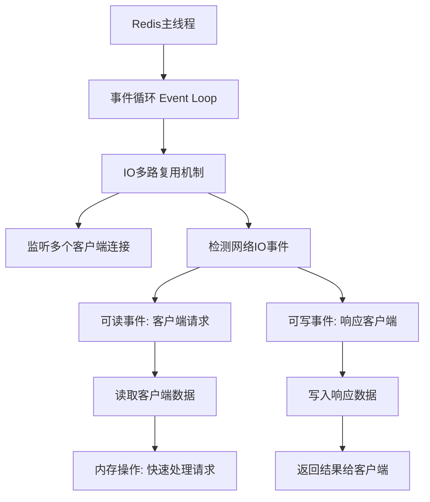
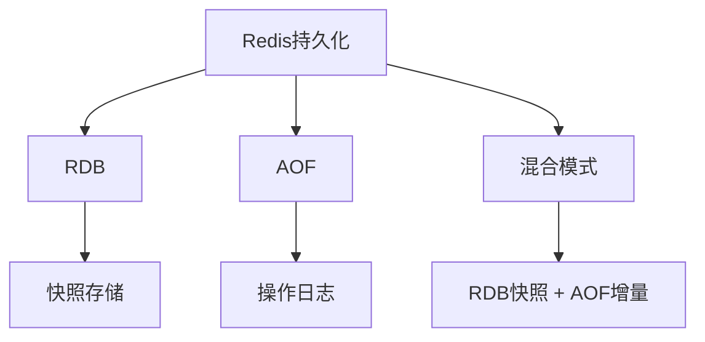

# Redis企业级实践：从单机优化到分布式架构

## 教学目标
- 理解Redis的基本概念和使用场景，结合已学习的MySQL主从分离知识，解决分布式存储中的问题。
- 掌握Redis的核心原理，包括持久化模式、数据结构、配置优化等。
- 学会使用Redis管理工具（如AnotherRedisDesktopManager）和运维命令。
- 完成Redis 7的部署、优化配置及用户权限管理。
- 了解Redis的两种主要集群模式：Redis哨兵（Sentinel）和Redis Cluster。
- 掌握两种模式的优缺点及企业使用场景。
- 理解常见问题（如大Key、洪水问题等）对集群的影响及应对策略。
- 通过原理图和解释，深入理解两种集群的工作机制。
- 学习两种集群的最小三台部署要求及其原因。
- 掌握两种集群的部署配置和优化方法，通过实验加深理解。

---


## 一、带着问题认识Redis（结合MySQL主从分离）

**问题1：为什么需要Redis？MySQL主从分离还不够吗？**  
- MySQL主从分离通过将读写操作分开（主库负责写操作，从库负责读操作），确实缓解了数据库的压力，也实现了数据备份。但在某些高并发场景下，比如每秒有几十万用户同时访问一个热门商品的详情页，如果每次都去查询MySQL，即使是从库，也会因为频繁的磁盘IO操作导致响应速度变慢，甚至可能宕机。
- Redis作为一款内存数据库，数据存储在内存中，读写速度极快（每秒可处理10万次以上请求），远超MySQL（每秒处理几千次请求已接近极限）。通过将热点数据（如商品详情、用户登录信息）缓存到Redis中，可以大幅减少对MySQL的直接访问，从而提升系统性能。
- **具体举例**：假设一个电商网站在“双11”促销时，某款热门商品的详情页被100万用户同时访问。如果每次都查询MySQL，即使有主从分离，从库也可能因为高并发查询而响应超时。而将商品的标题、价格、库存等信息提前缓存到Redis中，用户访问时直接从Redis读取数据，响应时间从几百毫秒缩短到几毫秒，MySQL的压力也大大降低，仅需处理订单提交等关键写操作。

**问题2：Redis和MySQL的角色分工是什么？**  
- MySQL和Redis在系统中扮演不同的角色，互为补充。MySQL是关系型数据库，擅长处理复杂查询和持久化存储，适合存储需要长期保存且结构化的数据，比如用户的订单记录、支付流水、商品库存等，这些数据对一致性和可靠性要求极高。
- Redis则是基于内存的NoSQL数据库，擅长快速读写，适合存储临时性、频繁访问的数据，比如用户登录状态（Session）、网站的热点缓存数据、排行榜等。这些数据通常不需要复杂的查询，但对速度要求极高。
- **具体举例**：在用户登录电商网站时，登录状态信息（比如用户ID、登录时间）可以存储在Redis中，设置一个30分钟的过期时间，用户每次操作都会刷新这个时间。这样后续的页面访问可以直接从Redis中判断用户是否已登录，速度非常快。而用户的订单数据，比如购买了哪些商品、支付金额等，则存储在MySQL中，因为这些数据需要永久保存，并且可能需要复杂的统计查询（比如按时间段统计销售额），这正是MySQL的强项。

**问题3：Redis能替代MySQL吗？**  
- 不能。Redis和MySQL的设计目标和适用场景完全不同。Redis是内存数据库，虽然有持久化机制（RDB和AOF），但其主要设计目标是速度，数据存储在内存中，一旦服务器断电或重启，数据可能丢失（持久化机制也无法完全避免数据丢失风险）。因此，Redis更适合作为缓存，存储临时数据。
- MySQL是关系型数据库，数据存储在磁盘上，设计目标是数据的持久性和一致性，支持事务、复杂查询和数据完整性约束，适合存储核心业务数据。
- **具体举例**：假设一个电商网站将所有订单数据都存储在Redis中，如果服务器突然宕机，即使有持久化机制，也可能丢失最近几秒的订单记录，导致用户支付成功但系统没有记录，这种损失对业务是不可接受的。而如果将订单数据存储在MySQL中，即使宕机，数据依然安全，可以通过事务回滚或备份恢复。反过来，如果将用户登录状态存储在MySQL中，每次页面访问都查询数据库，会导致响应速度慢，用户体验差，而Redis可以轻松应对这种高频读写场景。因此，Redis和MySQL各司其职，无法相互替代。


## 二、Redis原理详解（带着问题讲解）

### 2.1 Redis是什么？为什么快？
**问题1：Redis为什么比MySQL快？**  
- Redis是一款基于内存的NoSQL数据库，数据存储在内存中，而内存的读写速度比磁盘快上百倍甚至千倍。Redis的查询每秒可处理10万次以上（QPS），而MySQL由于是基于磁盘的关系型数据库，读写速度受限于磁盘IO，通常每秒仅能处理几千次查询。
- **具体对比**：内存的访问速度大约是100纳秒级别，而磁盘的访问速度是毫秒级别（约10毫秒），差距巨大。举个例子，Redis就像把数据放在桌面上，随手就能拿到；而MySQL就像把数据锁在柜子里，每次都要打开柜门取出来，速度自然慢得多。
- 此外，Redis采用单线程模型，避免了多线程上下文切换的开销（多线程切换会浪费CPU时间），并且通过IO多路复用技术高效处理并发请求。

**问题2：Redis单线程为什么能支持这么高的并发？**  
- 很多人会疑惑，单线程不是意味着一次只能处理一个请求吗？为什么Redis还能支持高并发？答案在于Redis使用了**IO多路复用**技术。简单来说，Redis通过一种叫“事件驱动”的方式，利用操作系统提供的机制（如Linux的epoll），可以同时监听多个客户端的请求，而不需要为每个客户端分配一个线程。
- **通俗解释**：想象Redis是一个餐厅的服务员，虽然只有一个人（单线程），但他能同时听多个桌子客人的需求（IO多路复用），哪个桌子喊“点菜”或“结账”，他就立刻去处理，而不是一次只服务一个桌子。这种方式让Redis在单线程下也能高效处理大量请求。
- **底层原理**：Redis的主线程运行一个事件循环（Event Loop），这个循环会不断检查是否有网络IO事件（比如客户端发来的连接请求、数据读取或写入请求）。当有事件发生时，Redis会立即处理该事件。由于内存操作本身非常快（微秒级别），即使是单线程，也能在短时间内处理大量请求，从而实现高并发。IO多路复用机制（如epoll）允许Redis同时监听成千上万个客户端连接，而不会阻塞主线程。
- **具体流程**：  
  1. Redis启动后，主线程进入事件循环，监听所有客户端连接。  
  2. 当某个客户端发送请求时，操作系统会通知Redis有一个“可读事件”。  
  3. Redis主线程读取该客户端的数据，处理请求（比如读取内存中的某个键值对）。  
  4. 处理完成后，将结果写回客户端，同时继续监听其他事件。  
  5. 由于内存操作极快，即使有大量客户端请求，Redis也能快速轮询处理。

**Mermaid结构图：Redis单线程高并发原理**

**解释**：  
- **事件循环（Event Loop）**：Redis主线程的核心机制，负责不断检查是否有新的事件需要处理。  
- **IO多路复用机制**：利用操作系统提供的功能（如epoll），同时监听多个客户端连接，避免阻塞。  
- **网络IO事件**：包括客户端发送请求（可读事件）和需要返回响应（可写事件）。  
- **内存操作**：Redis数据在内存中，处理速度极快，即使单线程也能快速响应大量请求。

**问题3：既然是单线程，选机器时是不是只要1核CPU就够了？内存越大越好吗？**  
- **CPU核数选择**：虽然Redis是单线程，但并不意味着只需要1核CPU就够了。Redis的单线程主要负责处理核心的数据操作和网络请求，但在实际运行中，可能还有其他辅助任务（如持久化操作RDB或AOF的重写）会在后台线程执行。如果机器只有1核，这些后台任务会与主线程抢占CPU资源，导致性能下降。因此，建议至少选择2核或以上的CPU，让主线程和后台线程有足够的资源分配。
- **内存大小选择**：内存确实是Redis性能的关键因素，因为Redis是内存数据库，数据都存储在内存中，内存越大，能存储的数据越多，缓存命中率越高，性能自然更好。但内存也不是越大越好，需根据业务需求和预算平衡。过大的内存可能导致浪费，而内存不足则会导致数据被淘汰（根据淘汰策略）或频繁触发持久化操作，影响性能。
- **具体建议**：对于中小型应用，建议从4GB或8GB内存开始，根据监控数据（如`INFO MEMORY`命令查看内存使用情况）逐步调整。如果业务数据量大且对延迟敏感，可以选择16GB甚至更高的内存配置。同时，CPU建议至少2核，4核更佳，确保主线程和后台任务（如持久化）不会相互干扰。

### 2.2 Redis持久化模式
**问题：Redis是内存数据库，断电数据会丢失吗？如何解决？有哪些具体应用场景？**  
- 是的，Redis数据默认存储在内存中，如果服务器断电或重启，内存中的数据会全部丢失。为了解决这个问题，Redis提供了两种主要的持久化机制：RDB和AOF，以及Redis 4.0后引入的混合模式。持久化机制的目的是将内存数据保存到磁盘上，以便在断电或重启后恢复数据。

1. **RDB（Redis Database Backup）**  
   - **原理**：RDB是定时将内存中的数据快照（Snapshot）保存到磁盘上，形成一个`.rdb`文件。这个快照包含了某一时刻Redis中所有的数据。
   - **优点**：由于是快照形式，文件体积较小，恢复速度快（直接读取文件到内存）。
   - **缺点**：因为是定时保存（比如每5分钟保存一次），如果在两次保存之间发生断电，最近的数据会丢失，数据安全性较低。
   - **配置方式**：通过`save`参数设置触发条件，例如`save 60 1000`表示60秒内有1000次写操作就保存一次。
   - **应用场景**：  
     - **冷备份**：适合用于定期备份数据，比如每天凌晨备份一次Redis数据，用于灾难恢复。因为RDB文件小，备份和传输成本低。
     - **缓存场景**：如果Redis主要用于缓存，数据丢失影响不大（如用户浏览记录），可以用RDB做简单持久化，节省资源。
     - **具体举例**：一个论坛网站的帖子浏览量数据存储在Redis中，即使丢失几分钟的数据也不会影响核心业务，可以使用RDB每小时备份一次，降低系统开销。
   - **通俗解释**：RDB就像“拍照”，每隔一段时间拍一张全家福，照片很清晰，但如果拍照后有人走开（数据变更），下次拍照前的数据就没了。

   **Mermaid结构图：RDB持久化原理**
   ```mermaid
   graph TD
       A[Redis内存数据] --> B[触发条件: 定时/操作次数]
       B --> C[生成快照: Snapshot]
       C --> D[保存到磁盘: .rdb文件]
       D --> E[重启时加载快照]
       E --> F[恢复内存数据]
       B --> G[缺点: 可能丢失快照间的数据]
   ```
   **解释**：  
   - **触发条件**：根据配置（如`save 60 1000`），定时或达到一定操作次数时生成快照。  
   - **生成快照**：将内存中某一时刻的完整数据复制一份。  
   - **保存到磁盘**：将快照写入`.rdb`文件，文件体积小。  
   - **恢复数据**：重启时直接读取`.rdb`文件到内存，恢复速度快，但快照之后的数据无法恢复。

2. **AOF（Append Only File）**  
   - **原理**：AOF将Redis接收到的每一条写操作命令（如`SET`、`DEL`）记录到日志文件中，类似于操作日志。断电或重启后，通过重放这些日志命令，可以重新构建内存中的数据。
   - **优点**：数据安全性高，因为记录的是每条操作命令，丢失的数据量极小（最多丢失1秒的数据，取决于同步频率）。
   - **缺点**：日志文件会随着操作增多而不断变大，恢复速度较慢（需要逐条执行命令）。
   - **配置方式**：通过`appendfsync`参数控制同步频率，`everysec`表示每秒同步一次，`always`表示每条命令都同步（最安全但性能最低）。
   - **应用场景**：  
     - **高安全性场景**：适合对数据安全性要求较高的场景，比如存储用户会话数据（Session），如果丢失可能导致用户被迫重新登录。
     - **业务关键数据临时存储**：某些业务数据虽然临时存储在Redis中，但对一致性要求较高，可以使用AOF确保数据不丢失。
     - **具体举例**：一个在线游戏的玩家状态数据存储在Redis中，如果断电导致数据丢失，玩家可能需要重新开始游戏，影响体验。使用AOF每秒同步，可以最大程度减少数据丢失。
   - **通俗解释**：AOF就像“日记”，每天记下每一件事，即使中途停笔，也能根据之前的记录恢复大部分内容，但日记太长时翻阅（恢复）就很慢。

   **Mermaid结构图：AOF持久化原理**
   ```mermaid
   graph TD
       A[Redis内存数据] --> B[接收写操作命令]
       B --> C[记录命令到缓冲区]
       C --> D[同步策略: always/everysec/no]
       D --> E[写入磁盘: AOF日志文件]
       E --> F[重启时重放日志命令]
       F --> G[恢复内存数据]
       D --> H[缺点: 文件大, 恢复慢]
   ```
   **解释**：  
   - **写操作命令**：Redis每执行一条写命令（如`SET key value`），都会记录下来。  
   - **同步策略**：根据配置决定命令何时写入磁盘，`always`最安全但性能低，`everysec`平衡性能和安全。  
   - **AOF日志文件**：记录所有操作命令，文件随时间增长。  
   - **恢复数据**：重启时逐条执行日志命令重建数据，安全性高但速度慢。

3. **混合模式（RDB + AOF）**  
   - **原理**：Redis 4.0后支持混合模式，先用RDB保存一个完整的快照，然后用AOF记录后续的增量操作命令。恢复时，先加载RDB快照，再执行AOF增量日志。
   - **优点**：结合了RDB和AOF的优点，文件体积相对较小（RDB部分），恢复速度较快，同时数据安全性较高（AOF增量记录）。
   - **缺点**：配置和维护稍复杂，AOF部分仍可能随时间增长。
   - **应用场景**：  
     - **综合场景**：适合既需要较高数据安全性，又希望恢复速度较快的场景，比如电商网站的购物车数据。
     - **生产环境通用选择**：在生产环境中，混合模式是推荐的选择，因为它在性能和安全性之间取得了平衡。
     - **具体举例**：一个电商网站的购物车数据存储在Redis中，用户添加商品到购物车后，如果数据丢失会影响购买流程，但恢复速度也很重要。使用混合模式，既能快速恢复大部分数据（RDB），又能保证最近的操作不丢失（AOF）。
   - **通俗解释**：混合模式就像“照片+日记”，先拍一张全家福（RDB），然后记录后续的小变化（AOF），既能快速看全貌，又不漏掉细节。

   **Mermaid结构图：混合模式持久化原理**
   ```mermaid
   graph TD
       A[Redis内存数据] --> B[RDB: 定时生成快照]
       A --> C[AOF: 记录后续写命令]
       B --> D[保存到磁盘: .rdb文件]
       C --> E[保存到磁盘: AOF增量日志]
       D --> F[重启时加载RDB快照]
       E --> G[执行AOF增量日志]
       F --> H[恢复大部分数据: 快速]
       G --> I[补充最新数据: 安全]
       H --> J[完整恢复内存数据]
       I --> J
   ```
   **解释**：  
   - **RDB快照**：定时保存内存完整数据到`.rdb`文件，恢复速度快。  
   - **AOF增量日志**：记录快照之后的写操作命令，确保数据安全性。  
   - **恢复过程**：先加载RDB快照快速恢复大部分数据，再执行AOF日志补充最新操作，兼顾速度和安全。


非常理解您的需求，确实在讲解Redis配置优化之前，应该先引导学员完成Redis的安装，确保上下文连贯，避免直接跳到配置优化导致学员感到困惑。我会调整内容，将Redis的安装步骤添加到“Redis原理详解”之后，作为一个过渡部分，并对配置优化和AnotherRedisDesktopManager的使用部分进行适当修改，使整体内容更加流畅和适合小白用户。以下是修订后的内容：

---

## 二、Redis原理详解（带着问题讲解）

### 2.1 Redis是什么？为什么快？
**问题1：Redis为什么比MySQL快？**  
- Redis是一款基于内存的NoSQL数据库，数据存储在内存中，而内存的读写速度比磁盘快上百倍甚至千倍。Redis的查询每秒可处理10万次以上（QPS），而MySQL由于是基于磁盘的关系型数据库，读写速度受限于磁盘IO，通常每秒仅能处理几千次查询。
- **具体对比**：内存的访问速度大约是100纳秒级别，而磁盘的访问速度是毫秒级别（约10毫秒），差距巨大。举个例子，Redis就像把数据放在桌面上，随手就能拿到；而MySQL就像把数据锁在柜子里，每次都要打开柜门取出来，速度自然慢得多。
- 此外，Redis采用单线程模型，避免了多线程上下文切换的开销（多线程切换会浪费CPU时间），并且通过IO多路复用技术高效处理并发请求。

**问题2：Redis单线程为什么能支持这么高的并发？**  
- 很多人会疑惑，单线程不是意味着一次只能处理一个请求吗？为什么Redis还能支持高并发？答案在于Redis使用了**IO多路复用**技术。简单来说，Redis通过一种叫“事件驱动”的方式，利用操作系统提供的机制（如Linux的epoll），可以同时监听多个客户端的请求，而不需要为每个客户端分配一个线程。
- **通俗解释**：想象Redis是一个餐厅的服务员，虽然只有一个人（单线程），但他能同时听多个桌子客人的需求（IO多路复用），哪个桌子喊“点菜”或“结账”，他就立刻去处理，而不是一次只服务一个桌子。这种方式让Redis在单线程下也能高效处理大量请求。
- **底层原理**：Redis的主线程运行一个事件循环（Event Loop），这个循环会不断检查是否有网络IO事件（比如客户端发来的连接请求、数据读取或写入请求）。当有事件发生时，Redis会立即处理该事件。由于内存操作本身非常快（微秒级别），即使是单线程，也能在短时间内处理大量请求，从而实现高并发。

**Mermaid结构图：Redis单线程高并发原理**


### 2.2 Redis持久化模式
**问题：Redis是内存数据库，断电数据会丢失吗？如何解决？**  
- 是的，Redis数据默认在内存中，断电会丢失。为此Redis提供了两种持久化机制：RDB和AOF。

1. **RDB（Redis Database Backup）**  
   - 原理：定时将内存中的数据快照保存到磁盘，形成`.rdb`文件。
   - 优点：文件小，恢复速度快。
   - 缺点：可能丢失最近的数据（因为是定时保存）。
   - 场景：适合做冷备份。
2. **AOF（Append Only File）**  
   - 原理：将每条写操作命令记录到日志文件，断电后通过重放日志恢复数据。
   - 优点：数据安全性高，丢失数据少。
   - 缺点：文件较大，恢复慢。
   - 场景：对数据安全性要求高的场景。
3. **混合模式**：Redis 4.0后支持RDB+AOF混合，结合两者优点。

**Mermaid结构图：Redis持久化模式**

**解释**：RDB像“拍照”，记录某一时刻的全貌；AOF像“日记”，记录每一步操作；混合模式是两者的结合。

## 三、Redis安装与初始设置

**问题：如何安装Redis？安装后如何启动和测试？**  
- 在学习Redis的配置优化和使用之前，我们需要先安装Redis服务器。本节将以Linux系统（Ubuntu/CentOS）和Windows系统为例，详细讲解Redis的安装步骤，适合小白用户操作。安装完成后，我们会进行简单的启动和测试，确保Redis正常运行。

### 3.1 Linux系统安装Redis（以Ubuntu为例）
1. **更新系统包列表**：  
   打开终端，输入以下命令，确保系统软件包是最新的：  
   ```bash
   sudo apt update
   sudo apt upgrade
   ```
2. **安装Redis**：  
   使用以下命令直接从Ubuntu软件源安装Redis：  
   ```bash
   sudo apt install redis-server
   ```
   安装过程中可能需要确认，输入`Y`并回车。
3. **检查安装是否成功**：  
   安装完成后，检查Redis版本：  
   ```bash
   redis-server --version
   ```
   输出类似`Redis server v=7.0.12`表示安装成功。
4. **启动Redis服务**：  
   默认情况下，安装后Redis会自动启动。你可以通过以下命令确认Redis是否正在运行：  
   ```bash
   sudo systemctl status redis
   ```
   如果状态显示`active (running)`，说明Redis已启动。如果未启动，可手动启动：  
   ```bash
   sudo systemctl start redis
   ```
5. **测试Redis连接**：  
   使用Redis自带的命令行工具测试连接：  
   ```bash
   redis-cli
   ```
   进入Redis命令行后，输入`ping`，如果返回`PONG`，说明Redis服务器正常运行。退出命令行输入`exit`。
6. **设置开机自启**：  
   确保Redis在系统重启后自动运行：  
   ```bash
   sudo systemctl enable redis
   ```

**注意**：如果是CentOS系统，可以使用`yum install redis`或`dnf install redis`进行安装，启动命令类似，具体可参考官方文档或根据系统版本调整。


### 3.2 初次测试与简单使用
- 安装并启动Redis后，我们可以进行简单的测试，确保一切正常。  
  1. 进入Redis命令行：`redis-cli`。  
  2. 设置一个键值对：输入`SET mykey "Hello Redis"`，回车。  
  3. 获取值：输入`GET mykey`，回车，应返回`"Hello Redis"`。  
  4. 退出：输入`exit`。  
- **通俗解释**：Redis就像一个超级快的笔记本，你可以用`SET`命令写下内容（键值对），用`GET`命令查看内容，操作简单且速度极快。

**学习建议**：小白用户安装完成后，先不要急于深入配置，重点是确保Redis能正常启动和连接，后续再逐步学习优化配置。

---

## 四、Redis配置优化原理

**问题：Redis默认配置能用吗？如何优化性能？**  
- 现在我们已经完成了Redis的安装和初步测试，可以看到Redis默认配置是可以运行的。但面对高并发场景或特定业务需求，默认配置可能无法满足性能和安全要求。因此，我们需要对Redis进行优化，优化方向包括内存管理、持久化策略、网络参数等。
- **通俗解释**：Redis默认配置就像一辆车的出厂设置，能开，但如果你要跑高速或拉重货，就得调校发动机（内存）、刹车（持久化）等参数，让车跑得更快更安全。

1. **内存管理**  
   - 设置`maxmemory`限制内存使用，避免内存爆满导致系统崩溃或性能下降。  
   - 配置`maxmemory-policy`，选择淘汰策略（如`volatile-lru`：优先淘汰设置了过期时间的键），确保内存满时能合理清理数据，防止服务不可用。
2. **持久化优化**  
   - 根据业务选择RDB或AOF，减少持久化频率（如RDB保存间隔调大），避免频繁写入磁盘影响性能。  
   - 如果数据安全性要求高，可结合RDB和AOF使用混合模式。
3. **网络优化**  
   - 调整`tcp-backlog`和`somaxconn`，提升并发连接能力，适应更多客户端同时访问。  
   - 设置`maxclients`，限制最大客户端连接数，避免过多连接导致资源耗尽，影响Redis稳定性和响应速度。
   - **通俗解释**：`maxclients`就像餐厅的最大座位数，设置得太低会拒绝新顾客（连接失败），太高则服务员（Redis进程）忙不过来，导致服务质量下降（性能降低）。

**关于`maxclients`的计算方式和设置建议**：  
- **作用**：`maxclients`参数定义了Redis服务器能够同时处理的最大客户端连接数。默认值通常是10000（视Redis版本和系统而定），但在高并发场景下可能需要调整。
- **计算方式**：  
  1. **基于系统资源**：Redis的每个客户端连接都会占用文件描述符（File Descriptor, FD），而文件描述符的数量受限于操作系统设置（Linux中可通过`ulimit -n`查看）。理论上，`maxclients`不能超过系统允许的最大文件描述符数减去Redis自身使用的部分（通常Redis自身会占用10-20个FD）。  
     计算公式：  
     ```
     maxclients ≈ 系统最大文件描述符数 - 32（预留给Redis内部使用和其他系统开销）
     ```
     例如，系统最大文件描述符数为65535，则`maxclients`可设置为约65500。
  2. **基于业务需求**：估算实际业务中可能出现的最大并发连接数。例如，一个Web应用有1000个活跃用户，每个用户平均产生2个连接（前后端请求），则需要至少2000个连接能力，建议将`maxclients`设置为业务峰值连接数的1.5-2倍，以应对突发流量（即3000-4000）。  
  3. **基于硬件性能**：Redis是单线程模型，过多连接会导致请求排队，增加延迟。需结合CPU和内存性能测试，观察在特定`maxclients`值下，Redis的响应时间是否满足要求（可用`redis-benchmark`工具测试）。
- **设置建议**：  
  - **中小型项目**：建议从默认值10000开始，如果业务并发不高，可适当降低到5000-8000，减少资源占用。  
  - **高并发场景**：如果业务峰值连接数较高，可逐步增加到20000或更高，但需确保系统文件描述符限制（Linux中修改`/etc/security/limits.conf`和`/etc/pam.d/sshd`中的`nofile`值）已提升，并监控Redis性能。  
  - **注意事项**：设置`maxclients`过高可能导致内存和CPU资源不足（每个连接占用少量内存），需结合`maxmemory`参数和服务器硬件综合调整。同时，Linux系统可能还需要调整内核参数`somaxconn`（通过`sysctl -w net.core.somaxconn=65535`设置），确保TCP连接队列能支持大量连接。
- **查看当前连接数**：使用Redis命令`INFO CLIENTS`查看当前连接数（`connected_clients`字段），以便根据实际使用情况动态调整`maxclients`。


---

## 五、Redis完整优化配置详情

以下是一个针对Redis 7的优化配置文件（Linux路径：`/etc/redis/redis.conf`，Windows路径：安装目录下的`redis.conf`），适用于中小型项目，注释说明优化目的。配置文件需要用文本编辑器（如Linux的`vim`或Windows的记事本）打开并修改，修改后重启Redis生效。

```bash
# 基本设置
port 6379                # 默认端口，保持不变即可
bind 0.0.0.0             # 监听所有网络接口，生产环境建议限制为特定IP（如127.0.0.1）
daemonize yes            # 后台运行（Linux适用，Windows默认作为服务运行）
pidfile /run/redis/redis-server.pid  # PID文件路径（Linux适用）
loglevel notice          # 日志级别，生产环境建议notice，减少不必要日志
logfile /var/log/redis/redis.log  # 日志文件路径（Linux适用，Windows可自定义）

# 最大客户端连接数优化
maxclients 5000          # maxclients ≈ 系统最大文件描述符数 - 32 x cpu内核 x 2（预留给Redis内部使用和其他系统开销）

# 内存优化
maxmemory 2gb            # 最大内存限制，根据服务器内存大小调整，建议占总内存的50%-70%
maxmemory-policy volatile-lru  # 内存满时淘汰策略，优先淘汰设置过期时间的键

# 持久化优化
save 900 1               # 900秒内至少1次变更时保存RDB，频率较低，节省资源
save 300 10              # 300秒内至少10次变更时保存RDB
save 60 10000            # 60秒内至少10000次变更时保存RDB，频率较高时保存
stop-writes-on-bgsave-error yes  # 后台保存失败时停止写入，防止数据不一致
rdbcompression yes       # RDB文件压缩，节省磁盘空间
rdbchecksum yes          # RDB文件校验，增加数据可靠性
dir /var/lib/redis       # 数据和日志存储目录（Linux适用，Windows根据安装路径调整）

# AOF设置
appendonly yes           # 开启AOF持久化，结合RDB提高安全性
appendfilename "appendonly.aof"  # AOF文件名
appendfsync everysec     # 每秒同步一次，折中性能和安全性
no-appendfsync-on-rewrite no  # 重写时是否同步，建议no以提高性能
auto-aof-rewrite-percentage 100  # AOF文件增长100%时重写，控制文件大小
auto-aof-rewrite-min-size 64mb  # AOF文件至少64MB时重写，避免频繁重写

# 网络优化
tcp-backlog 511          # TCP连接队列长度，增加并发连接能力
timeout 0                # 客户端空闲超时时间，0表示不超时
tcp-keepalive 300        # TCP保活间隔，单位秒，防止连接长时间闲置

# 安全设置
requirepass admin123    # 设置密码，生产环境必须配置，防止未经授权访问
```

**优化说明**：  
- **内存限制和淘汰策略**：防止内存溢出，确保Redis不会因内存不足而崩溃。  
- **持久化参数**：根据业务需求调整，RDB和AOF结合确保数据安全，同时避免频繁操作影响性能。  
- **网络参数**：提升并发能力，适应更多客户端访问。  
- **安全设置**：设置密码保护Redis实例，防止外部攻击。

**如何应用配置**：  
- **Linux**：修改`/etc/redis/redis.conf`文件后，使用`sudo systemctl restart redis`重启服务。  
- **Windows**：修改安装目录下的`redis.conf`文件后，通过“服务”面板重启Redis服务。  
- **测试配置**：重启后，使用`redis-cli`连接，输入`INFO ALL`查看当前配置是否生效（如内存限制、持久化策略等）。

**学习建议**：小白用户初次接触配置优化时，不必全部修改，可先关注`maxmemory`和`requirepass`两项，确保内存限制和安全性。后续随着业务需求增加，再逐步调整其他参数。


## 六、AnotherRedisDesktopManager安装与学习

**问题：为什么需要Redis管理工具？如何使用？**  
- Redis命令行操作虽然功能强大，但对于小白用户来说，命令复杂且容易出错。图形化工具如AnotherRedisDesktopManager可以直观管理Redis数据，通过界面操作就能查看、添加或修改数据，极大降低学习门槛。
- **通俗解释**：命令行就像用键盘打字输入指令，图形化工具就像用鼠标点菜单，简单直观，适合新手。

### 6.1 安装步骤
1. **下载工具**：访问GitHub页面（https://github.com/qishibo/AnotherRedisDesktopManager），下载最新版本的Windows/Linux安装包（如Windows的`.exe`文件或Linux的`.AppImage`文件）。
2. **安装工具**：  
   - **Windows**：双击下载的`.exe`安装包，按提示完成安装。  
   - **Linux**：如果是`.AppImage`文件，下载后赋予执行权限（`chmod +x 文件名`），然后直接运行即可，无需安装。
3. **连接Redis**：  
   - 打开工具，点击“添加连接”或“New Connection”。  
   - 输入Redis服务器IP（本地测试用`127.0.0.1`）、端口（默认6379）、密码（如果在配置文件中设置了`requirepass`）。  
   - 点击“测试连接”或“Test Connection”，成功后保存配置。

### 6.2 基本使用
- **查看数据**：左侧显示数据库列表（默认是`db0`），点击某个数据库可查看其中的键值对。  
- **添加/修改数据**：右键数据库，选择“添加键”或“Add Key”，支持String、Hash、List等多种类型，输入键名和值后保存。  
- **删除数据**：右键某个键，选择“删除”或“Delete”，即可移除。  
- **监控性能**：工具提供实时监控功能，可查看连接数、内存使用等信息（通常在“监控”或“Monitor”选项卡中）。

**学习建议**：小白用户先熟悉界面操作，重点练习添加、删除、查询键值对，尝试用图形化工具完成之前命令行测试的`SET`和`GET`操作。后期可尝试监控功能，了解Redis运行状态。

---

好的，我会在实验中加入更多的`GET`、`SET`和`DEL`语句，帮助用户更好地进行测试和理解。以下是调整后的内容，在实验步骤和测试权限部分增加了具体的操作示例，确保用户能够通过这些命令直观地验证权限设置是否生效。

---

## 五、运维Redis命令学习（用户管理）

**问题：如何管理Redis用户和权限？有哪些常用命令？**

**单机场景背景**：  
在单机环境下，Redis通常由单一项目或少量应用使用，权限隔离和资源限制的需求较低，更多关注的是基本安全。因此，只需创建用户并赋予最大权限（允许操作所有键和所有命令），以简化管理，同时通过密码保护确保基本安全。

**单机场景目标**：  
- 创建用户并赋予最大权限，减少配置复杂性。  
- 确保基本安全（通过设置密码）。

### 5.1 常用运维命令表格
| 命令                  | 功能                              | 示例                              |
|-----------------------|-----------------------------------|-----------------------------------|
| `AUTH username password` | 认证用户和密码（Redis 6.0+支持用户名） | `AUTH singleuser 123456`        |
| `CONFIG SET requirepass` | 设置默认账户密码（适用于旧版本或单一账户） | `CONFIG SET requirepass "123456"`|
| `CONFIG GET requirepass` | 获取当前默认账户密码            | `CONFIG GET requirepass`         |
| `ACL LIST`            | 查看用户列表和权限               | `ACL LIST`                       |
| `ACL SETUSER`         | 创建或修改用户及权限             | `ACL SETUSER singleuser on >123456 +@all` |
| `ACL DELUSER`         | 删除用户                         | `ACL DELUSER singleuser`         |
| `SET`                 | 设置键值对                       | `SET key1 value1`                |
| `GET`                 | 获取键的值                       | `GET key1`                       |
| `DEL`                 | 删除键                           | `DEL key1`                       |

**注意**：`AUTH`命令在Redis 6.0及以上版本支持用户名和密码的双参数模式，若使用旧版本则只支持单一密码模式（如`AUTH 123456`）。

### 5.2 创建用户与权限测试（单机场景）
1. **创建用户**  
   在单机场景下，创建一个用户`singleuser`，密码为`123456`，赋予最大权限（允许操作所有键和所有命令）：  
   ```bash
   ACL SETUSER singleuser on >123456 +@all +flushall
   ```
   解释：`on`表示启用用户，`>123456`设置密码，`+@all`表示赋予所有命令权限，`+flushall`额外授权危险命令，确保权限最大化。

2. **测试权限**  
   - 使用`singleuser`用户登录：  
     ```bash
     AUTH singleuser 123456
     ```
   - 测试基本操作：  
     ```bash
     SET key1 value1        # 成功，设置键key1的值为value1
     GET key1               # 成功，返回value1
     SET key2 "test data"   # 成功，设置键key2的值为test data
     GET key2               # 成功，返回test data
     DEL key1               # 成功，删除键key1
     GET key1               # 成功，返回nil（键已删除）
     DEL key2               # 成功，删除键key2
     FLUSHALL               # 成功，清空所有数据（已授权）
     ```

### 5.3 单机场景实验：创建用户并赋予最大权限
**实验背景**：  
假设在单机环境下，Redis由一个小型应用或开发测试环境使用，目标是简化权限管理，创建用户并赋予最大权限，确保基本安全。

**实验目标**：  
- 创建一个用户，赋予最大权限，简化管理。  

**实验步骤**：  
1. **创建用户并设置最大权限**  
   为单机环境创建一个用户`singleuser`，密码为`123456`，赋予所有命令权限：  
   ```bash
   ACL SETUSER singleuser on >123456 +@all +flushall
   ```
   使用`ACL LIST`查看用户权限：  
   ```bash
   ACL LIST
   ```
   预期输出类似：  
   ```
   1) "user default on nopass ~* +@all"
   2) "user singleuser on >****** ~* +@all +flushall"
   ```

2. **测试用户权限**  
   以`singleuser`用户登录并进行多种操作测试权限：  
   ```bash
   AUTH singleuser 123456
   SET user:name "Alice"      # 成功，设置键user:name的值为Alice
   GET user:name              # 成功，返回Alice
   SET user:age "25"          # 成功，设置键user:age的值为25
   GET user:age               # 成功，返回25
   SET temp:data "temporary"  # 成功，设置键temp:data的值为temporary
   GET temp:data              # 成功，返回temporary
   DEL user:name              # 成功，删除键user:name
   GET user:name              # 成功，返回nil（键已删除）
   DEL temp:data              # 成功，删除键temp:data
   SET test:key "value"       # 成功，设置键test:key的值为value
   GET test:key               # 成功，返回value
   DEL test:key               # 成功，删除键test:key
   FLUSHALL                   # 成功，清空所有数据（已授权）
   GET user:age               # 成功，返回nil（数据已清空）
   ```

3. **实验结果分析**  
   - **权限简化**：用户`singleuser`拥有最大权限，可以操作所有键和命令（如`SET`、`GET`、`DEL`和`FLUSHALL`），减少了单机环境下的管理复杂度。  
   - **基本安全**：通过设置密码，确保未经授权的用户无法访问Redis。

**实验对单机环境的帮助**：  
- **简化管理**：通过赋予用户最大权限，无需频繁调整ACL规则，适合单机环境下快速开发和测试。  
- **基本保护**：通过密码设置，防止未经授权的访问，保障基本安全。

**学习建议**：单机环境下，小白用户可以先熟悉`AUTH`和`ACL SETUSER`命令，快速创建用户并设置最大权限。同时，通过`SET`、`GET`和`DEL`命令进行数据操作测试，验证权限是否生效。如果不需要多用户管理，可以直接使用默认账户并设置密码（通过`CONFIG SET requirepass`）。建议通过实验掌握用户创建、登录和基本数据操作，确保Redis的基本安全和使用。

---

**总结补充**：  
在单机场景下，Redis用户管理被简化为创建用户并赋予最大权限（`+@all +flushall`），重点放在基本安全（通过密码保护）上。通过增加`SET`、`GET`和`DEL`命令的测试示例，用户可以直观地验证权限设置是否正确。这种方式最大程度降低了配置复杂度，适合单机环境下的简单使用需求。如果未来有更复杂的管理需求，可以再引入权限限制或其他配置。


