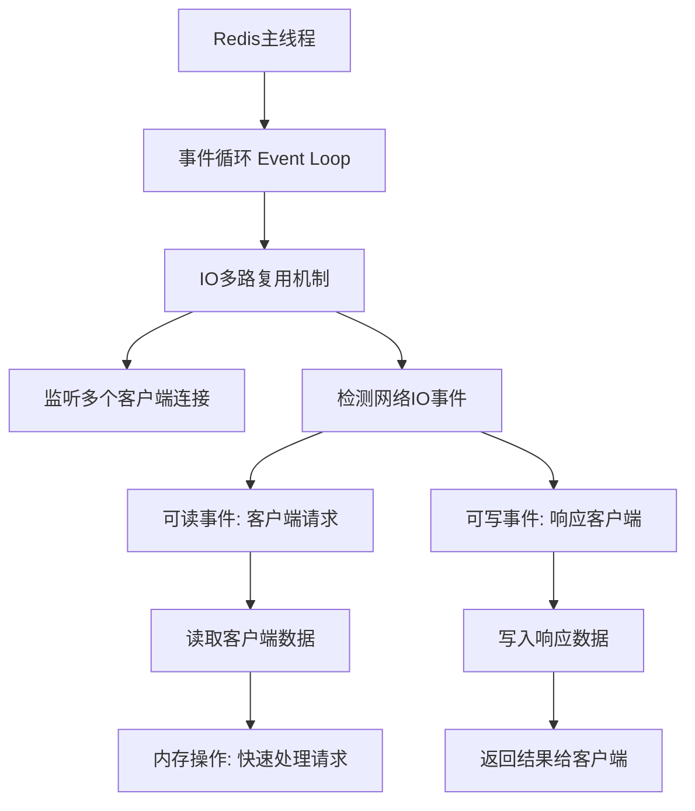
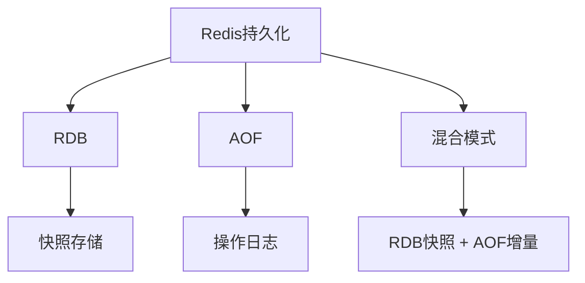
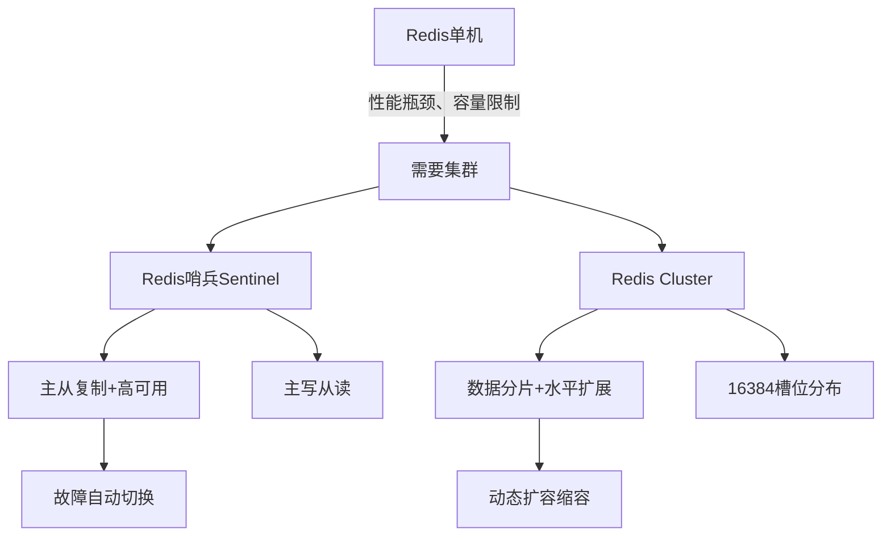
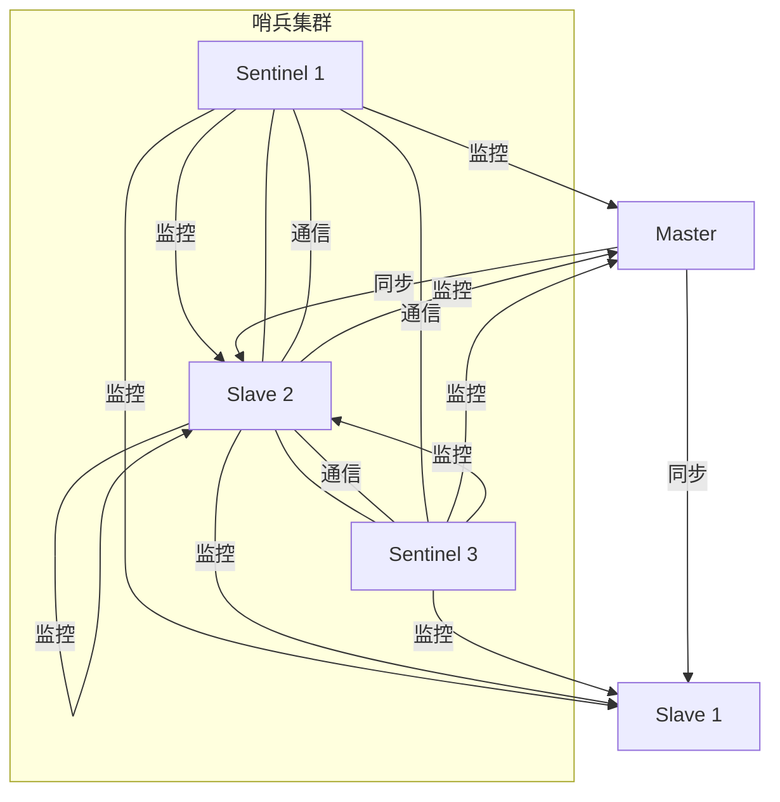
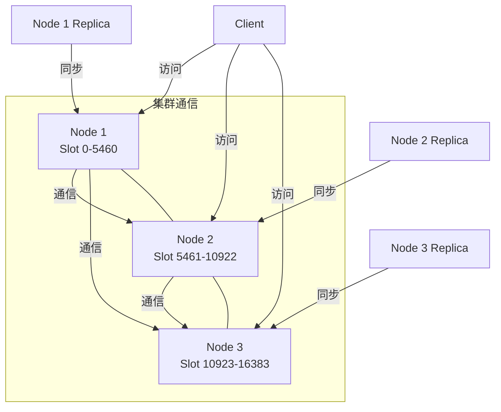
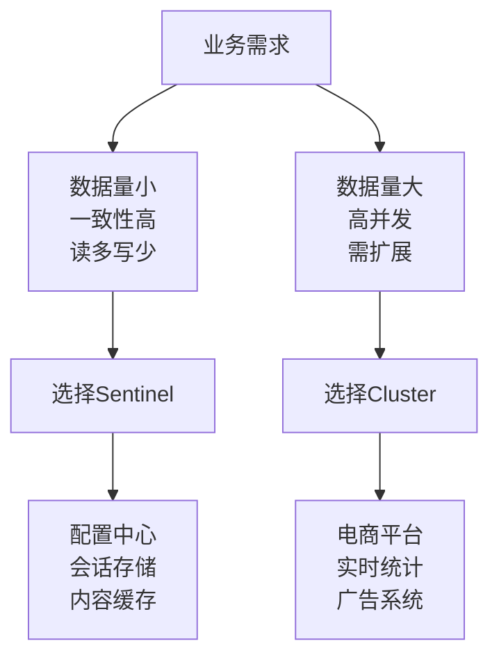
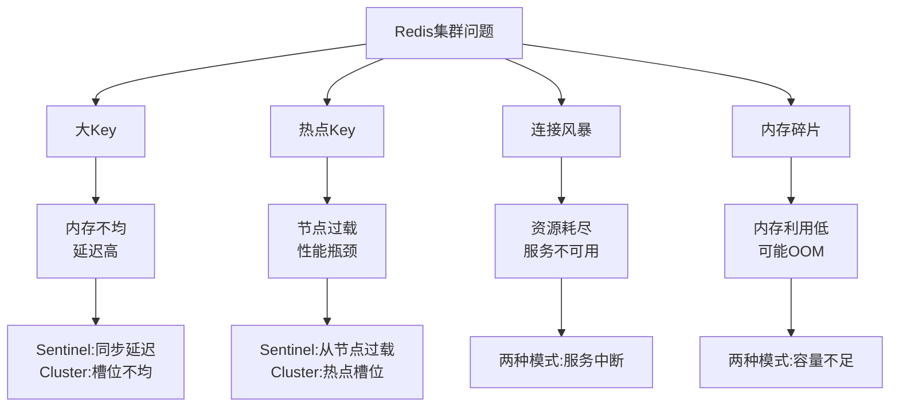
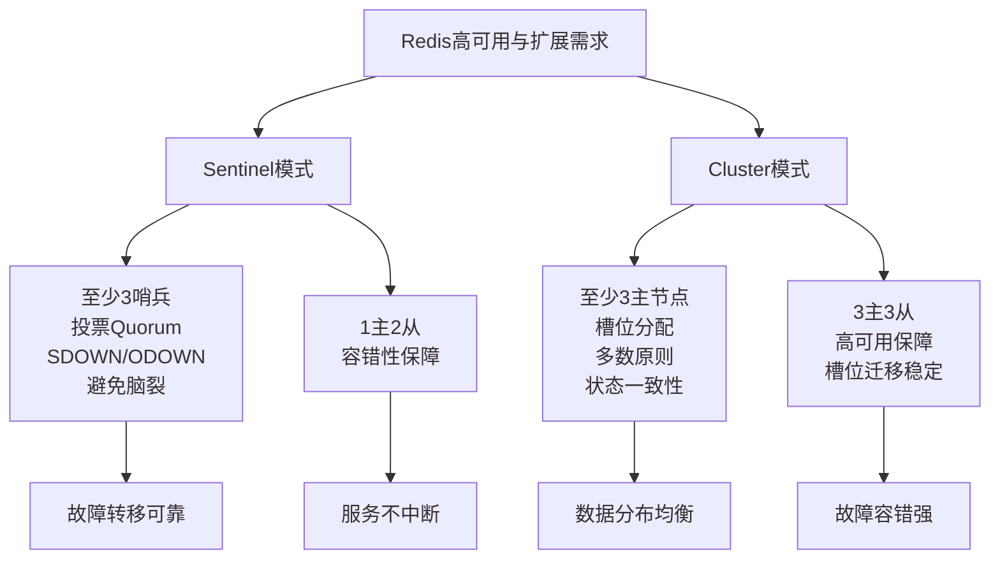

# Redis企业级实践：从单机优化到分布式架构

## 教学目标
- 理解Redis的基本概念和使用场景，结合已学习的MySQL主从分离知识，解决分布式存储中的问题。
- 掌握Redis的核心原理，包括持久化模式、数据结构、配置优化等。
- 学会使用Redis管理工具（如AnotherRedisDesktopManager）和运维命令。
- 完成Redis 7的部署、优化配置及用户权限管理。
- 了解Redis的两种主要集群模式：Redis哨兵（Sentinel）和Redis Cluster。
- 掌握两种模式的优缺点及企业使用场景。
- 理解常见问题（如大Key、洪水问题等）对集群的影响及应对策略。
- 通过原理图和解释，深入理解两种集群的工作机制。
- 学习两种集群的最小三台部署要求及其原因。
- 掌握两种集群的部署配置和优化方法，通过实验加深理解。

## 教学建议
学习两天学员掌握更深


## 一、带着问题认识Redis（结合MySQL主从分离）

**问题1：为什么需要Redis？MySQL主从分离还不够吗？**  
- MySQL主从分离通过将读写操作分开（主库负责写操作，从库负责读操作），确实缓解了数据库的压力，也实现了数据备份。但在某些高并发场景下，比如每秒有几十万用户同时访问一个热门商品的详情页，如果每次都去查询MySQL，即使是从库，也会因为频繁的磁盘IO操作导致响应速度变慢，甚至可能宕机。
- Redis作为一款内存数据库，数据存储在内存中，读写速度极快（每秒可处理10万次以上请求），远超MySQL（每秒处理几千次请求已接近极限）。通过将热点数据（如商品详情、用户登录信息）缓存到Redis中，可以大幅减少对MySQL的直接访问，从而提升系统性能。
- **具体举例**：假设一个电商网站在“双11”促销时，某款热门商品的详情页被100万用户同时访问。如果每次都查询MySQL，即使有主从分离，从库也可能因为高并发查询而响应超时。而将商品的标题、价格、库存等信息提前缓存到Redis中，用户访问时直接从Redis读取数据，响应时间从几百毫秒缩短到几毫秒，MySQL的压力也大大降低，仅需处理订单提交等关键写操作。

**问题2：Redis和MySQL的角色分工是什么？**  
- MySQL和Redis在系统中扮演不同的角色，互为补充。MySQL是关系型数据库，擅长处理复杂查询和持久化存储，适合存储需要长期保存且结构化的数据，比如用户的订单记录、支付流水、商品库存等，这些数据对一致性和可靠性要求极高。
- Redis则是基于内存的NoSQL数据库，擅长快速读写，适合存储临时性、频繁访问的数据，比如用户登录状态（Session）、网站的热点缓存数据、排行榜等。这些数据通常不需要复杂的查询，但对速度要求极高。
- **具体举例**：在用户登录电商网站时，登录状态信息（比如用户ID、登录时间）可以存储在Redis中，设置一个30分钟的过期时间，用户每次操作都会刷新这个时间。这样后续的页面访问可以直接从Redis中判断用户是否已登录，速度非常快。而用户的订单数据，比如购买了哪些商品、支付金额等，则存储在MySQL中，因为这些数据需要永久保存，并且可能需要复杂的统计查询（比如按时间段统计销售额），这正是MySQL的强项。

**问题3：Redis能替代MySQL吗？**  
- 不能。Redis和MySQL的设计目标和适用场景完全不同。Redis是内存数据库，虽然有持久化机制（RDB和AOF），但其主要设计目标是速度，数据存储在内存中，一旦服务器断电或重启，数据可能丢失（持久化机制也无法完全避免数据丢失风险）。因此，Redis更适合作为缓存，存储临时数据。
- MySQL是关系型数据库，数据存储在磁盘上，设计目标是数据的持久性和一致性，支持事务、复杂查询和数据完整性约束，适合存储核心业务数据。
- **具体举例**：假设一个电商网站将所有订单数据都存储在Redis中，如果服务器突然宕机，即使有持久化机制，也可能丢失最近几秒的订单记录，导致用户支付成功但系统没有记录，这种损失对业务是不可接受的。而如果将订单数据存储在MySQL中，即使宕机，数据依然安全，可以通过事务回滚或备份恢复。反过来，如果将用户登录状态存储在MySQL中，每次页面访问都查询数据库，会导致响应速度慢，用户体验差，而Redis可以轻松应对这种高频读写场景。因此，Redis和MySQL各司其职，无法相互替代。


## 二、Redis原理详解（带着问题讲解）

### 2.1 Redis是什么？为什么快？
**问题1：Redis为什么比MySQL快？**  
- Redis是一款基于内存的NoSQL数据库，数据存储在内存中，而内存的读写速度比磁盘快上百倍甚至千倍。Redis的查询每秒可处理10万次以上（QPS），而MySQL由于是基于磁盘的关系型数据库，读写速度受限于磁盘IO，通常每秒仅能处理几千次查询。
- **具体对比**：内存的访问速度大约是100纳秒级别，而磁盘的访问速度是毫秒级别（约10毫秒），差距巨大。举个例子，Redis就像把数据放在桌面上，随手就能拿到；而MySQL就像把数据锁在柜子里，每次都要打开柜门取出来，速度自然慢得多。
- 此外，Redis采用单线程模型，避免了多线程上下文切换的开销（多线程切换会浪费CPU时间），并且通过IO多路复用技术高效处理并发请求。

**问题2：Redis单线程为什么能支持这么高的并发？**  
- 很多人会疑惑，单线程不是意味着一次只能处理一个请求吗？为什么Redis还能支持高并发？答案在于Redis使用了**IO多路复用**技术。简单来说，Redis通过一种叫“事件驱动”的方式，利用操作系统提供的机制（如Linux的epoll），可以同时监听多个客户端的请求，而不需要为每个客户端分配一个线程。
- **通俗解释**：想象Redis是一个餐厅的服务员，虽然只有一个人（单线程），但他能同时听多个桌子客人的需求（IO多路复用），哪个桌子喊“点菜”或“结账”，他就立刻去处理，而不是一次只服务一个桌子。这种方式让Redis在单线程下也能高效处理大量请求。
- **底层原理**：Redis的主线程运行一个事件循环（Event Loop），这个循环会不断检查是否有网络IO事件（比如客户端发来的连接请求、数据读取或写入请求）。当有事件发生时，Redis会立即处理该事件。由于内存操作本身非常快（微秒级别），即使是单线程，也能在短时间内处理大量请求，从而实现高并发。IO多路复用机制（如epoll）允许Redis同时监听成千上万个客户端连接，而不会阻塞主线程。
- **具体流程**：  
  1. Redis启动后，主线程进入事件循环，监听所有客户端连接。  
  2. 当某个客户端发送请求时，操作系统会通知Redis有一个“可读事件”。  
  3. Redis主线程读取该客户端的数据，处理请求（比如读取内存中的某个键值对）。  
  4. 处理完成后，将结果写回客户端，同时继续监听其他事件。  
  5. 由于内存操作极快，即使有大量客户端请求，Redis也能快速轮询处理。

**Mermaid结构图：Redis单线程高并发原理**

**解释**：  
- **事件循环（Event Loop）**：Redis主线程的核心机制，负责不断检查是否有新的事件需要处理。  
- **IO多路复用机制**：利用操作系统提供的功能（如epoll），同时监听多个客户端连接，避免阻塞。  
- **网络IO事件**：包括客户端发送请求（可读事件）和需要返回响应（可写事件）。  
- **内存操作**：Redis数据在内存中，处理速度极快，即使单线程也能快速响应大量请求。

**问题3：既然是单线程，选机器时是不是只要1核CPU就够了？内存越大越好吗？**  
- **CPU核数选择**：虽然Redis是单线程，但并不意味着只需要1核CPU就够了。Redis的单线程主要负责处理核心的数据操作和网络请求，但在实际运行中，可能还有其他辅助任务（如持久化操作RDB或AOF的重写）会在后台线程执行。如果机器只有1核，这些后台任务会与主线程抢占CPU资源，导致性能下降。因此，建议至少选择2核或以上的CPU，让主线程和后台线程有足够的资源分配。
- **内存大小选择**：内存确实是Redis性能的关键因素，因为Redis是内存数据库，数据都存储在内存中，内存越大，能存储的数据越多，缓存命中率越高，性能自然更好。但内存也不是越大越好，需根据业务需求和预算平衡。过大的内存可能导致浪费，而内存不足则会导致数据被淘汰（根据淘汰策略）或频繁触发持久化操作，影响性能。
- **具体建议**：对于中小型应用，建议从4GB或8GB内存开始，根据监控数据（如`INFO MEMORY`命令查看内存使用情况）逐步调整。如果业务数据量大且对延迟敏感，可以选择16GB甚至更高的内存配置。同时，CPU建议至少2核，4核更佳，确保主线程和后台任务（如持久化）不会相互干扰。

### 2.2 Redis持久化模式
**问题：Redis是内存数据库，断电数据会丢失吗？如何解决？有哪些具体应用场景？**  
- 是的，Redis数据默认存储在内存中，如果服务器断电或重启，内存中的数据会全部丢失。为了解决这个问题，Redis提供了两种主要的持久化机制：RDB和AOF，以及Redis 4.0后引入的混合模式。持久化机制的目的是将内存数据保存到磁盘上，以便在断电或重启后恢复数据。

1. **RDB（Redis Database Backup）**  
   - **原理**：RDB是定时将内存中的数据快照（Snapshot）保存到磁盘上，形成一个`.rdb`文件。这个快照包含了某一时刻Redis中所有的数据。
   - **优点**：由于是快照形式，文件体积较小，恢复速度快（直接读取文件到内存）。
   - **缺点**：因为是定时保存（比如每5分钟保存一次），如果在两次保存之间发生断电，最近的数据会丢失，数据安全性较低。
   - **配置方式**：通过`save`参数设置触发条件，例如`save 60 1000`表示60秒内有1000次写操作就保存一次。
   - **应用场景**：  
     - **冷备份**：适合用于定期备份数据，比如每天凌晨备份一次Redis数据，用于灾难恢复。因为RDB文件小，备份和传输成本低。
     - **缓存场景**：如果Redis主要用于缓存，数据丢失影响不大（如用户浏览记录），可以用RDB做简单持久化，节省资源。
     - **具体举例**：一个论坛网站的帖子浏览量数据存储在Redis中，即使丢失几分钟的数据也不会影响核心业务，可以使用RDB每小时备份一次，降低系统开销。
   - **通俗解释**：RDB就像“拍照”，每隔一段时间拍一张全家福，照片很清晰，但如果拍照后有人走开（数据变更），下次拍照前的数据就没了。

   **Mermaid结构图：RDB持久化原理**
   ```mermaid
   graph TD
       A[Redis内存数据] --> B[触发条件: 定时/操作次数]
       B --> C[生成快照: Snapshot]
       C --> D[保存到磁盘: .rdb文件]
       D --> E[重启时加载快照]
       E --> F[恢复内存数据]
       B --> G[缺点: 可能丢失快照间的数据]
   ```
   **解释**：  
   - **触发条件**：根据配置（如`save 60 1000`），定时或达到一定操作次数时生成快照。  
   - **生成快照**：将内存中某一时刻的完整数据复制一份。  
   - **保存到磁盘**：将快照写入`.rdb`文件，文件体积小。  
   - **恢复数据**：重启时直接读取`.rdb`文件到内存，恢复速度快，但快照之后的数据无法恢复。

2. **AOF（Append Only File）**  
   - **原理**：AOF将Redis接收到的每一条写操作命令（如`SET`、`DEL`）记录到日志文件中，类似于操作日志。断电或重启后，通过重放这些日志命令，可以重新构建内存中的数据。
   - **优点**：数据安全性高，因为记录的是每条操作命令，丢失的数据量极小（最多丢失1秒的数据，取决于同步频率）。
   - **缺点**：日志文件会随着操作增多而不断变大，恢复速度较慢（需要逐条执行命令）。
   - **配置方式**：通过`appendfsync`参数控制同步频率，`everysec`表示每秒同步一次，`always`表示每条命令都同步（最安全但性能最低）。
   - **应用场景**：  
     - **高安全性场景**：适合对数据安全性要求较高的场景，比如存储用户会话数据（Session），如果丢失可能导致用户被迫重新登录。
     - **业务关键数据临时存储**：某些业务数据虽然临时存储在Redis中，但对一致性要求较高，可以使用AOF确保数据不丢失。
     - **具体举例**：一个在线游戏的玩家状态数据存储在Redis中，如果断电导致数据丢失，玩家可能需要重新开始游戏，影响体验。使用AOF每秒同步，可以最大程度减少数据丢失。
   - **通俗解释**：AOF就像“日记”，每天记下每一件事，即使中途停笔，也能根据之前的记录恢复大部分内容，但日记太长时翻阅（恢复）就很慢。

   **Mermaid结构图：AOF持久化原理**
   ```mermaid
   graph TD
       A[Redis内存数据] --> B[接收写操作命令]
       B --> C[记录命令到缓冲区]
       C --> D[同步策略: always/everysec/no]
       D --> E[写入磁盘: AOF日志文件]
       E --> F[重启时重放日志命令]
       F --> G[恢复内存数据]
       D --> H[缺点: 文件大, 恢复慢]
   ```
   **解释**：  
   - **写操作命令**：Redis每执行一条写命令（如`SET key value`），都会记录下来。  
   - **同步策略**：根据配置决定命令何时写入磁盘，`always`最安全但性能低，`everysec`平衡性能和安全。  
   - **AOF日志文件**：记录所有操作命令，文件随时间增长。  
   - **恢复数据**：重启时逐条执行日志命令重建数据，安全性高但速度慢。

3. **混合模式（RDB + AOF）**  
   - **原理**：Redis 4.0后支持混合模式，先用RDB保存一个完整的快照，然后用AOF记录后续的增量操作命令。恢复时，先加载RDB快照，再执行AOF增量日志。
   - **优点**：结合了RDB和AOF的优点，文件体积相对较小（RDB部分），恢复速度较快，同时数据安全性较高（AOF增量记录）。
   - **缺点**：配置和维护稍复杂，AOF部分仍可能随时间增长。
   - **应用场景**：  
     - **综合场景**：适合既需要较高数据安全性，又希望恢复速度较快的场景，比如电商网站的购物车数据。
     - **生产环境通用选择**：在生产环境中，混合模式是推荐的选择，因为它在性能和安全性之间取得了平衡。
     - **具体举例**：一个电商网站的购物车数据存储在Redis中，用户添加商品到购物车后，如果数据丢失会影响购买流程，但恢复速度也很重要。使用混合模式，既能快速恢复大部分数据（RDB），又能保证最近的操作不丢失（AOF）。
   - **通俗解释**：混合模式就像“照片+日记”，先拍一张全家福（RDB），然后记录后续的小变化（AOF），既能快速看全貌，又不漏掉细节。

   **Mermaid结构图：混合模式持久化原理**
   ```mermaid
   graph TD
       A[Redis内存数据] --> B[RDB: 定时生成快照]
       A --> C[AOF: 记录后续写命令]
       B --> D[保存到磁盘: .rdb文件]
       C --> E[保存到磁盘: AOF增量日志]
       D --> F[重启时加载RDB快照]
       E --> G[执行AOF增量日志]
       F --> H[恢复大部分数据: 快速]
       G --> I[补充最新数据: 安全]
       H --> J[完整恢复内存数据]
       I --> J
   ```
   **解释**：  
   - **RDB快照**：定时保存内存完整数据到`.rdb`文件，恢复速度快。  
   - **AOF增量日志**：记录快照之后的写操作命令，确保数据安全性。  
   - **恢复过程**：先加载RDB快照快速恢复大部分数据，再执行AOF日志补充最新操作，兼顾速度和安全。

---

## 二、Redis原理详解（带着问题讲解）

### 2.1 Redis是什么？为什么快？
**问题1：Redis为什么比MySQL快？**  
- Redis是一款基于内存的NoSQL数据库，数据存储在内存中，而内存的读写速度比磁盘快上百倍甚至千倍。Redis的查询每秒可处理10万次以上（QPS），而MySQL由于是基于磁盘的关系型数据库，读写速度受限于磁盘IO，通常每秒仅能处理几千次查询。
- **具体对比**：内存的访问速度大约是100纳秒级别，而磁盘的访问速度是毫秒级别（约10毫秒），差距巨大。举个例子，Redis就像把数据放在桌面上，随手就能拿到；而MySQL就像把数据锁在柜子里，每次都要打开柜门取出来，速度自然慢得多。
- 此外，Redis采用单线程模型，避免了多线程上下文切换的开销（多线程切换会浪费CPU时间），并且通过IO多路复用技术高效处理并发请求。

**问题2：Redis单线程为什么能支持这么高的并发？**  
- 很多人会疑惑，单线程不是意味着一次只能处理一个请求吗？为什么Redis还能支持高并发？答案在于Redis使用了**IO多路复用**技术。简单来说，Redis通过一种叫“事件驱动”的方式，利用操作系统提供的机制（如Linux的epoll），可以同时监听多个客户端的请求，而不需要为每个客户端分配一个线程。
- **通俗解释**：想象Redis是一个餐厅的服务员，虽然只有一个人（单线程），但他能同时听多个桌子客人的需求（IO多路复用），哪个桌子喊“点菜”或“结账”，他就立刻去处理，而不是一次只服务一个桌子。这种方式让Redis在单线程下也能高效处理大量请求。
- **底层原理**：Redis的主线程运行一个事件循环（Event Loop），这个循环会不断检查是否有网络IO事件（比如客户端发来的连接请求、数据读取或写入请求）。当有事件发生时，Redis会立即处理该事件。由于内存操作本身非常快（微秒级别），即使是单线程，也能在短时间内处理大量请求，从而实现高并发。

**Mermaid结构图：Redis单线程高并发原理**


### 2.2 Redis持久化模式
**问题：Redis是内存数据库，断电数据会丢失吗？如何解决？**  
- 是的，Redis数据默认在内存中，断电会丢失。为此Redis提供了两种持久化机制：RDB和AOF。

1. **RDB（Redis Database Backup）**  
   - 原理：定时将内存中的数据快照保存到磁盘，形成`.rdb`文件。
   - 优点：文件小，恢复速度快。
   - 缺点：可能丢失最近的数据（因为是定时保存）。
   - 场景：适合做冷备份。
2. **AOF（Append Only File）**  
   - 原理：将每条写操作命令记录到日志文件，断电后通过重放日志恢复数据。
   - 优点：数据安全性高，丢失数据少。
   - 缺点：文件较大，恢复慢。
   - 场景：对数据安全性要求高的场景。
3. **混合模式**：Redis 4.0后支持RDB+AOF混合，结合两者优点。

**Mermaid结构图：Redis持久化模式**

**解释**：RDB像“拍照”，记录某一时刻的全貌；AOF像“日记”，记录每一步操作；混合模式是两者的结合。

## 三、Redis安装与初始设置

**问题：如何安装Redis？安装后如何启动和测试？**  
- 在学习Redis的配置优化和使用之前，我们需要先安装Redis服务器。本节将以Linux系统（Ubuntu/CentOS）和Windows系统为例，详细讲解Redis的安装步骤，适合小白用户操作。安装完成后，我们会进行简单的启动和测试，确保Redis正常运行。

### 3.1 Linux系统安装Redis（以Ubuntu为例）
1. **更新系统包列表**：  
   打开终端，输入以下命令，确保系统软件包是最新的：  
   ```bash
   sudo apt update
   ```
2. **安装Redis**：  
   使用以下命令直接从Ubuntu软件源安装Redis：  
   ```bash
   sudo apt install redis-server
   ```
   安装过程中可能需要确认，输入`Y`并回车。
3. **检查安装是否成功**：  
   安装完成后，检查Redis版本：  
   ```bash
   redis-server --version
   ```
   输出类似`Redis server v=7.0.12`表示安装成功。
4. **启动Redis服务**：  
   默认情况下，安装后Redis会自动启动。你可以通过以下命令确认Redis是否正在运行：  
   ```bash
   sudo systemctl status redis
   ```
   如果状态显示`active (running)`，说明Redis已启动。如果未启动，可手动启动：  
   ```bash
   sudo systemctl start redis
   ```
5. **测试Redis连接**：  
   使用Redis自带的命令行工具测试连接：  
   ```bash
   redis-cli
   ```
   进入Redis命令行后，输入`ping`，如果返回`PONG`，说明Redis服务器正常运行。退出命令行输入`exit`。
6. **设置开机自启**：  
   确保Redis在系统重启后自动运行：  
   ```bash
   sudo systemctl enable redis
   ```

**注意**：如果是CentOS系统，可以使用`yum install redis`或`dnf install redis`进行安装，启动命令类似，具体可参考官方文档或根据系统版本调整。


### 3.2 初次测试与简单使用
- 安装并启动Redis后，我们可以进行简单的测试，确保一切正常。  
  1. 进入Redis命令行：`redis-cli`。  
  2. 设置一个键值对：输入`SET mykey "Hello Redis"`，回车。  
  3. 获取值：输入`GET mykey`，回车，应返回`"Hello Redis"`。  
  4. 退出：输入`exit`。  
- **通俗解释**：Redis就像一个超级快的笔记本，你可以用`SET`命令写下内容（键值对），用`GET`命令查看内容，操作简单且速度极快。

**学习建议**：小白用户安装完成后，先不要急于深入配置，重点是确保Redis能正常启动和连接，后续再逐步学习优化配置。

---

## 四、Redis配置优化原理

**问题：Redis默认配置能用吗？如何优化性能？**  
- 现在我们已经完成了Redis的安装和初步测试，可以看到Redis默认配置是可以运行的。但面对高并发场景或特定业务需求，默认配置可能无法满足性能和安全要求。因此，我们需要对Redis进行优化，优化方向包括内存管理、持久化策略、网络参数等。
- **通俗解释**：Redis默认配置就像一辆车的出厂设置，能开，但如果你要跑高速或拉重货，就得调校发动机（内存）、刹车（持久化）等参数，让车跑得更快更安全。

1. **内存管理**  
   - 设置`maxmemory`限制内存使用，避免内存爆满导致系统崩溃或性能下降。  
   - 配置`maxmemory-policy`，选择淘汰策略（如`volatile-lru`：优先淘汰设置了过期时间的键），确保内存满时能合理清理数据，防止服务不可用。
2. **持久化优化**  
   - 根据业务选择RDB或AOF，减少持久化频率（如RDB保存间隔调大），避免频繁写入磁盘影响性能。  
   - 如果数据安全性要求高，可结合RDB和AOF使用混合模式。
3. **网络优化**  
   - 调整`tcp-backlog`和`somaxconn`，提升并发连接能力，适应更多客户端同时访问。  
   - 设置`maxclients`，限制最大客户端连接数，避免过多连接导致资源耗尽，影响Redis稳定性和响应速度。
   - **通俗解释**：`maxclients`就像餐厅的最大座位数，设置得太低会拒绝新顾客（连接失败），太高则服务员（Redis进程）忙不过来，导致服务质量下降（性能降低）。

**关于`maxclients`的计算方式和设置建议**：  
- **作用**：`maxclients`参数定义了Redis服务器能够同时处理的最大客户端连接数。默认值通常是10000（视Redis版本和系统而定），但在高并发场景下可能需要调整。
- **计算方式**：  
  1. **基于系统资源**：Redis的每个客户端连接都会占用文件描述符（File Descriptor, FD），而文件描述符的数量受限于操作系统设置（Linux中可通过`ulimit -n`查看）。理论上，`maxclients`不能超过系统允许的最大文件描述符数减去Redis自身使用的部分（通常Redis自身会占用10-20个FD）。  
     计算公式：  
     ```
     maxclients ≈ 系统最大文件描述符数 - 32（预留给Redis内部使用和其他系统开销）
     ```
     例如，系统最大文件描述符数为65535，则`maxclients`可设置为约65500。
  2. **基于业务需求**：估算实际业务中可能出现的最大并发连接数。例如，一个Web应用有1000个活跃用户，每个用户平均产生2个连接（前后端请求），则需要至少2000个连接能力，建议将`maxclients`设置为业务峰值连接数的1.5-2倍，以应对突发流量（即3000-4000）。  
  3. **基于硬件性能**：Redis是单线程模型，过多连接会导致请求排队，增加延迟。需结合CPU和内存性能测试，观察在特定`maxclients`值下，Redis的响应时间是否满足要求（可用`redis-benchmark`工具测试）。
- **设置建议**：  
  - **中小型项目**：建议从默认值10000开始，如果业务并发不高，可适当降低到5000-8000，减少资源占用。  
  - **高并发场景**：如果业务峰值连接数较高，可逐步增加到20000或更高，但需确保系统文件描述符限制（Linux中修改`/etc/security/limits.conf`和`/etc/pam.d/sshd`中的`nofile`值）已提升，并监控Redis性能。  
  - **注意事项**：设置`maxclients`过高可能导致内存和CPU资源不足（每个连接占用少量内存），需结合`maxmemory`参数和服务器硬件综合调整。同时，Linux系统可能还需要调整内核参数`somaxconn`（通过`sysctl -w net.core.somaxconn=65535`设置），确保TCP连接队列能支持大量连接。
- **查看当前连接数**：使用Redis命令`INFO CLIENTS`查看当前连接数（`connected_clients`字段），以便根据实际使用情况动态调整`maxclients`。


---

## 五、Redis完整优化配置详情

以下是一个针对Redis 7的优化配置文件（Linux路径：`/etc/redis/redis.conf`，Windows路径：安装目录下的`redis.conf`），适用于中小型项目，注释说明优化目的。配置文件需要用文本编辑器（如Linux的`vim`或Windows的记事本）打开并修改，修改后重启Redis生效。

```bash
# 基本设置
port 6379                # 默认端口，保持不变即可
bind 0.0.0.0             # 监听所有网络接口，生产环境建议限制为特定IP（如127.0.0.1）
daemonize yes            # 后台运行（Linux适用，Windows默认作为服务运行）
pidfile /run/redis/redis-server.pid  # PID文件路径（Linux适用）
loglevel notice          # 日志级别，生产环境建议notice，减少不必要日志
logfile /var/log/redis/redis.log  # 日志文件路径（Linux适用，Windows可自定义）

# 最大客户端连接数优化
maxclients 5000          # maxclients ≈ 系统最大文件描述符数 - 32 x cpu内核 x 2（预留给Redis内部使用和其他系统开销）

# 内存优化
maxmemory 2gb            # 最大内存限制，根据服务器内存大小调整，建议占总内存的50%-70%
maxmemory-policy volatile-lru  # 内存满时淘汰策略，优先淘汰设置过期时间的键

# 持久化优化
save 900 1               # 900秒内至少1次变更时保存RDB，频率较低，节省资源
save 300 10              # 300秒内至少10次变更时保存RDB
save 60 10000            # 60秒内至少10000次变更时保存RDB，频率较高时保存
stop-writes-on-bgsave-error yes  # 后台保存失败时停止写入，防止数据不一致
rdbcompression yes       # RDB文件压缩，节省磁盘空间
rdbchecksum yes          # RDB文件校验，增加数据可靠性
dir /var/lib/redis       # 数据和日志存储目录（Linux适用，Windows根据安装路径调整）

# AOF设置
appendonly yes           # 开启AOF持久化，结合RDB提高安全性
appendfilename "appendonly.aof"  # AOF文件名
appendfsync everysec     # 每秒同步一次，折中性能和安全性
no-appendfsync-on-rewrite no  # 重写时是否同步，建议no以提高性能
auto-aof-rewrite-percentage 100  # AOF文件增长100%时重写，控制文件大小
auto-aof-rewrite-min-size 64mb  # AOF文件至少64MB时重写，避免频繁重写

# 网络优化
tcp-backlog 511          # TCP连接队列长度，增加并发连接能力
timeout 0                # 客户端空闲超时时间，0表示不超时
tcp-keepalive 300        # TCP保活间隔，单位秒，防止连接长时间闲置

# 安全设置
requirepass admin123    # 设置密码，生产环境必须配置，防止未经授权访问
```

**优化说明**：  
- **内存限制和淘汰策略**：防止内存溢出，确保Redis不会因内存不足而崩溃。  
- **持久化参数**：根据业务需求调整，RDB和AOF结合确保数据安全，同时避免频繁操作影响性能。  
- **网络参数**：提升并发能力，适应更多客户端访问。  
- **安全设置**：设置密码保护Redis实例，防止外部攻击。

**如何应用配置**：  
- **Linux**：修改`/etc/redis/redis.conf`文件后，使用`sudo systemctl restart redis`重启服务。  
- **Windows**：修改安装目录下的`redis.conf`文件后，通过“服务”面板重启Redis服务。  
- **测试配置**：重启后，使用`redis-cli`连接，输入`INFO ALL`查看当前配置是否生效（如内存限制、持久化策略等）。

**学习建议**：小白用户初次接触配置优化时，不必全部修改，可先关注`maxmemory`和`requirepass`两项，确保内存限制和安全性。后续随着业务需求增加，再逐步调整其他参数。


## 六、AnotherRedisDesktopManager安装与学习

**问题：为什么需要Redis管理工具？如何使用？**  
- Redis命令行操作虽然功能强大，但对于小白用户来说，命令复杂且容易出错。图形化工具如AnotherRedisDesktopManager可以直观管理Redis数据，通过界面操作就能查看、添加或修改数据，极大降低学习门槛。
- **通俗解释**：命令行就像用键盘打字输入指令，图形化工具就像用鼠标点菜单，简单直观，适合新手。

### 6.1 安装步骤
1. **下载工具**：访问GitHub页面(https://github.com/qishibo/AnotherRedisDesktopManager) ,下载最新版本的Windows/Linux安装包（如Windows的`.exe`文件或Linux的`.AppImage`文件）。
2. **安装工具**：  
   - **Windows**：双击下载的`.exe`安装包，按提示完成安装。  
   - **Linux**：如果是`.AppImage`文件，下载后赋予执行权限（`chmod +x 文件名`），然后直接运行即可，无需安装。
3. **连接Redis**：  
   - 打开工具，点击“添加连接”或“New Connection”。  
   - 输入Redis服务器IP（本地测试用`127.0.0.1`）、端口（默认6379）、密码（如果在配置文件中设置了`requirepass`）。  
   - 点击“测试连接”或“Test Connection”，成功后保存配置。

### 6.2 基本使用
- **查看数据**：左侧显示数据库列表（默认是`db0`），点击某个数据库可查看其中的键值对。  
- **添加/修改数据**：右键数据库，选择“添加键”或“Add Key”，支持String、Hash、List等多种类型，输入键名和值后保存。  
- **删除数据**：右键某个键，选择“删除”或“Delete”，即可移除。  
- **监控性能**：工具提供实时监控功能，可查看连接数、内存使用等信息（通常在“监控”或“Monitor”选项卡中）。

**学习建议**：小白用户先熟悉界面操作，重点练习添加、删除、查询键值对，尝试用图形化工具完成之前命令行测试的`SET`和`GET`操作。后期可尝试监控功能，了解Redis运行状态。

---

好的，我会在实验中加入更多的`GET`、`SET`和`DEL`语句，帮助用户更好地进行测试和理解。以下是调整后的内容，在实验步骤和测试权限部分增加了具体的操作示例，确保用户能够通过这些命令直观地验证权限设置是否生效。

---

## 五、运维Redis命令学习（用户管理）

**问题：如何管理Redis用户和权限？有哪些常用命令？**

**单机场景背景**：  
在单机环境下，Redis通常由单一项目或少量应用使用，权限隔离和资源限制的需求较低，更多关注的是基本安全。因此，只需创建用户并赋予最大权限（允许操作所有键和所有命令），以简化管理，同时通过密码保护确保基本安全。

**单机场景目标**：  
- 创建用户并赋予最大权限，减少配置复杂性。  
- 确保基本安全（通过设置密码）。

### 5.1 常用运维命令表格
| 命令                  | 功能                              | 示例                              |
|-----------------------|-----------------------------------|-----------------------------------|
| `AUTH username password` | 认证用户和密码（Redis 6.0+支持用户名） | `AUTH singleuser 123456`        |
| `CONFIG SET requirepass` | 设置默认账户密码（适用于旧版本或单一账户） | `CONFIG SET requirepass "123456"`|
| `CONFIG GET requirepass` | 获取当前默认账户密码            | `CONFIG GET requirepass`         |
| `ACL LIST`            | 查看用户列表和权限               | `ACL LIST`                       |
| `ACL SETUSER`         | 创建或修改用户及权限             | `ACL SETUSER singleuser on >123456 +@all` |
| `ACL DELUSER`         | 删除用户                         | `ACL DELUSER singleuser`         |
| `SET`                 | 设置键值对                       | `SET key1 value1`                |
| `GET`                 | 获取键的值                       | `GET key1`                       |
| `DEL`                 | 删除键                           | `DEL key1`                       |

**注意**：`AUTH`命令在Redis 6.0及以上版本支持用户名和密码的双参数模式，若使用旧版本则只支持单一密码模式（如`AUTH 123456`）。

### 5.2 创建用户与权限测试（单机场景）
1. **创建用户**  
   在单机场景下，创建一个用户`singleuser`，密码为`123456`，赋予最大权限（允许操作所有键和所有命令）：  
   ```bash
   ACL SETUSER singleuser on >123456 +@all +flushall
   ```
   解释：`on`表示启用用户，`>123456`设置密码，`+@all`表示赋予所有命令权限，`+flushall`额外授权危险命令，确保权限最大化。

2. **测试权限**  
   - 使用`singleuser`用户登录：  
     ```bash
     AUTH singleuser 123456
     ```
   - 测试基本操作：  
     ```bash
     SET key1 value1        # 成功，设置键key1的值为value1
     GET key1               # 成功，返回value1
     SET key2 "test data"   # 成功，设置键key2的值为test data
     GET key2               # 成功，返回test data
     DEL key1               # 成功，删除键key1
     GET key1               # 成功，返回nil（键已删除）
     DEL key2               # 成功，删除键key2
     FLUSHALL               # 成功，清空所有数据（已授权）
     ```

### 5.3 单机场景实验：创建用户并赋予最大权限
**实验背景**：  
假设在单机环境下，Redis由一个小型应用或开发测试环境使用，目标是简化权限管理，创建用户并赋予最大权限，确保基本安全。

**实验目标**：  
- 创建一个用户，赋予最大权限，简化管理。  

**实验步骤**：  
1. **创建用户并设置最大权限**  
   为单机环境创建一个用户`singleuser`，密码为`123456`，赋予所有命令权限：  
   ```bash
   ACL SETUSER singleuser on >123456 +@all +flushall
   ```
   使用`ACL LIST`查看用户权限：  
   ```bash
   ACL LIST
   ```
   预期输出类似：  
   ```
   1) "user default on nopass ~* +@all"
   2) "user singleuser on >****** ~* +@all +flushall"
   ```

2. **测试用户权限**  
   以`singleuser`用户登录并进行多种操作测试权限：  
   ```bash
   AUTH singleuser 123456
   SET user:name "Alice"      # 成功，设置键user:name的值为Alice
   GET user:name              # 成功，返回Alice
   SET user:age "25"          # 成功，设置键user:age的值为25
   GET user:age               # 成功，返回25
   SET temp:data "temporary"  # 成功，设置键temp:data的值为temporary
   GET temp:data              # 成功，返回temporary
   DEL user:name              # 成功，删除键user:name
   GET user:name              # 成功，返回nil（键已删除）
   DEL temp:data              # 成功，删除键temp:data
   SET test:key "value"       # 成功，设置键test:key的值为value
   GET test:key               # 成功，返回value
   DEL test:key               # 成功，删除键test:key
   FLUSHALL                   # 成功，清空所有数据（已授权）
   GET user:age               # 成功，返回nil（数据已清空）
   ```

3. **实验结果分析**  
   - **权限简化**：用户`singleuser`拥有最大权限，可以操作所有键和命令（如`SET`、`GET`、`DEL`和`FLUSHALL`），减少了单机环境下的管理复杂度。  
   - **基本安全**：通过设置密码，确保未经授权的用户无法访问Redis。

**实验对单机环境的帮助**：  
- **简化管理**：通过赋予用户最大权限，无需频繁调整ACL规则，适合单机环境下快速开发和测试。  
- **基本保护**：通过密码设置，防止未经授权的访问，保障基本安全。

**学习建议**：单机环境下，小白用户可以先熟悉`AUTH`和`ACL SETUSER`命令，快速创建用户并设置最大权限。同时，通过`SET`、`GET`和`DEL`命令进行数据操作测试，验证权限是否生效。如果不需要多用户管理，可以直接使用默认账户并设置密码（通过`CONFIG SET requirepass`）。建议通过实验掌握用户创建、登录和基本数据操作，确保Redis的基本安全和使用。

---

**总结补充**：  
在单机场景下，Redis用户管理被简化为创建用户并赋予最大权限（`+@all +flushall`），重点放在基本安全（通过密码保护）上。通过增加`SET`、`GET`和`DEL`命令的测试示例，用户可以直观地验证权限设置是否正确。这种方式最大程度降低了配置复杂度，适合单机环境下的简单使用需求。如果未来有更复杂的管理需求，可以再引入权限限制或其他配置。


## 六、Redis集群模式学习与实践

### 6.1 带着问题引入Redis集群模式

**问题引导**：  
1. **单机Redis的问题及集群必要性**：  
   - **专业解释**：单机Redis有性能瓶颈、存储容量限制和单点故障风险，无法满足高并发和高可用需求。  
   - **通俗类比**：像一个人干活，活多干不动、东西放不下、病了就停工。集群是请一群人分担，互相替补。  

2. **Redis两种集群模式及解决的问题**：  
   - **Redis哨兵（Sentinel）**：专注高可用，解决主节点故障自动切换，适合一致性要求高、读写分离场景。  
     - **类比**：像保安队，盯着“老大”干活，老大倒下换替补。  
   - **Redis Cluster**：专注数据分片和扩展性，通过槽位分配数据，支持水平扩展，适合大数据量、高并发场景。  
     - **类比**：像大仓库分拣，数据分成小份，不同仓库管，活多加仓库。  

**简介**：  
- **Redis哨兵（Sentinel）**：监控Redis主从复制，主节点故障时自动切换从节点为主，确保高可用。  
- **Redis Cluster**：官方分布式方案，数据分片到16384个槽位，分布多节点，支持动态扩展和故障转移。  

**Mermaid结构图**：两种模式架构对比  

**结构图讲解**：  
- 上图展示了从单机Redis到集群的演进。单机问题促使集群出现，分为Sentinel和Cluster两种模式。  
- Sentinel关注高可用，通过主从复制实现故障切换，适合读写分离。  
- Cluster关注扩展性，通过数据分片（16384槽位）分布多节点，支持动态调整。  

---

感谢你的反馈，我理解你觉得当前对Redis哨兵（Sentinel）和Redis Cluster原理的讲解过于简单，缺乏深入的细节。以下我会补充更详细的原理内容，增加技术深度，同时保留Mermaid结构图和通俗易懂的风格，确保既专业又清晰易懂。以下是修订后的6.2部分内容。

---

### 6.2 Redis哨兵与Redis Cluster的原理图解

#### 6.2.1 Redis哨兵（Sentinel）原理
**Mermaid结构图**：  

**原理解释**：  
- **哨兵集群的组成与职责**：  
  哨兵（Sentinel）是一个独立的进程，多个Sentinel节点组成哨兵集群，负责监控Redis的主节点（Master）和从节点（Slave）。Sentinel不仅仅是监控工具，它还能在主节点故障时执行自动故障转移，确保系统高可用。  
- **监控机制与心跳检测**：  
  每个Sentinel节点会定期向Master和Slave发送PING命令（心跳检测），以判断节点是否存活。如果Master在一定时间（`down-after-milliseconds`配置）内未响应，Sentinel会将其标记为“主观下线”（SDOWN）。随后，Sentinel会与其他Sentinel节点通信，确认是否达到“客观下线”（ODOWN）状态，即多数Sentinel同意Master已下线。  
- **故障转移与投票机制**：  
  一旦Master被确认为客观下线，Sentinel集群会通过Raft一致性算法类似的投票机制（多数原则）选举一个“领导者”Sentinel，由其负责故障转移。领导者会从所有Slave中选择一个条件最佳的节点（基于优先级、复制进度等）提升为新Master，并通知其他Slave同步新Master的数据，同时更新自身的监控目标。  
- **哨兵间通信与一致性**：  
  哨兵节点之间通过Redis的发布/订阅机制（Pub/Sub）进行通信，共享监控信息和集群状态，确保一致性。这种通信机制还能避免脑裂（split-brain）问题，即多个Master同时存在的情况。  
- **客户端交互与透明访问**：  
  客户端通常不直接连接Redis的Master或Slave，而是通过Sentinel获取当前Master的地址。Sentinel会动态返回最新的Master信息，即使发生故障转移，客户端也能透明地切换到新Master，无需修改代码。  
- **配置参数与优化点**：  
  关键配置包括`quorum`（投票所需的最小哨兵数量，通常设置为哨兵总数的一半加一）和`down-after-milliseconds`（判断下线的时间阈值）。合理设置这些参数可以平衡故障检测的速度和误判率。  

**通俗类比**：  
哨兵就像一支保安队，轮流盯着“老大”（Master）和“替补”（Slave）是否正常工作。如果老大病倒，保安队开会投票决定谁来接班，并通知所有人新老大是谁，确保工作不中断。保安之间还互相通气，避免意见不一致。  

---

#### 6.2.2 Redis Cluster原理
**Mermaid结构图**：  

**原理解释**：  
- **数据分片与槽位机制**：  
  Redis Cluster将所有数据划分为16384个槽位（Slot），每个槽位负责存储一部分数据。数据的分配基于CRC16算法：对Key进行CRC16计算后取模16384，得到对应的槽位号。每个主节点（Master）负责管理一部分槽位，例如上图中Node 1管理0-5460槽位。通过这种分片机制，数据被均匀分布到多个节点，提升存储容量和并发性能。  
- **主从复制与故障容错**：  
  每个主节点可以配置一个或多个从节点（Replica），从节点通过异步复制同步主节点的数据。从节点平时只提供读服务（可选），当主节点故障时，集群会将从节点提升为新主节点，接管原主节点的槽位和数据，确保服务不中断。  
- **节点通信与集群状态维护**：  
  集群中的节点通过Gossip协议进行通信，定期交换彼此的状态信息（如槽位分配、节点健康状况等）。Gossip协议是一种去中心化的通信方式，确保即使部分节点故障，集群状态仍能保持一致。每个节点都维护一份集群元数据，记录槽位与节点的映射关系。  
- **客户端访问与重定向**：  
  客户端可以连接集群中的任意节点进行数据操作。如果请求的Key所在的槽位不在当前节点上，节点会返回一个`MOVED`或`ASK`重定向响应，指引客户端访问正确的节点。支持Cluster协议的客户端（如Jedis、Lettuce）会自动处理重定向，普通客户端则需手动处理。  
- **动态扩容与缩容**：  
  Redis Cluster支持动态调整集群规模。扩容时，新增节点加入集群，部分槽位会从原有节点迁移到新节点，数据随之迁移（通过`CLUSTER ADDSLOTS`和`resharding`操作）。缩容时，将节点负责的槽位迁移到其他节点后移除该节点。数据迁移过程中，集群仍可提供服务，但性能可能受影响。  
- **一致性与局限性**：  
  Redis Cluster采用最终一致性模型，不保证强一致性。跨节点的事务（如`MULTI`）或多Key操作（如`MGET`）可能因数据分布在不同节点而难以实现，需客户端自行处理。此外，集群对网络分区（Network Partition）敏感，可能导致部分节点不可用。  
- **配置参数与优化点**：  
  关键配置包括`cluster-node-timeout`（节点超时时间，影响故障检测速度）和`cluster-slave-validity-factor`（从节点数据有效性因子，影响故障转移选择）。合理设置槽位分布和节点数量也能优化性能和稳定性。  

**通俗类比**：  
Redis Cluster就像一个大仓库分拣系统，把货物（数据）分成16384小份（槽位），每个仓库（节点）管一部分。每个仓库有“替补”（从节点）帮忙备份。如果一个仓库坏了，替补顶上。仓库之间互相通气（Gossip协议），知道谁管什么。客户问货在哪，仓库会指路（重定向），还能加减仓库（扩容缩容），灵活但有点复杂。  


感谢你的反馈，我将结合Redis哨兵（Sentinel）和Redis Cluster的优缺点及企业场景选择（6.3部分）与Redis集群常见问题及应对策略（6.4部分），进行整合和丰富，力求内容更全面、逻辑更连贯，并增加技术深度和实际案例。以下是修订后的内容，涵盖两部分的要点，同时保持通俗易懂和专业性。

---

### 6.3 Redis哨兵与Redis Cluster的优缺点及企业场景选择

#### 6.3.1 Redis哨兵（Sentinel）
- **优点**：  
  1. **实现简单，专注高可用**：Sentinel专注于主从复制架构下的监控和故障转移，部署配置简单，无需复杂的分布式逻辑，适合快速搭建可靠的小规模Redis环境。  
  2. **支持读写分离，提升读性能**：主节点负责写操作，从节点分担读请求，尤其在读多写少的场景下，能显著提升系统吞吐量，优化资源利用。  
  3. **故障转移快，恢复时间短**：通过心跳检测和投票机制，Sentinel能在主节点故障后快速（通常几秒到几十秒）完成主从切换，减少服务中断时间，保障业务连续性。  
  4. **客户端兼容性强**：Sentinel模式下，客户端只需通过Sentinel获取Master地址，无需特殊协议支持，适配大多数Redis客户端库（如Jedis、Lettuce），开发成本低。  
- **缺点**：  
  1. **不支持数据分片，容量受限**：所有数据存储在主节点，容量受单机内存限制，无法通过增加节点扩展存储空间，适合数据量较小的场景。  
  2. **写性能受限，无法水平扩展**：写操作集中在主节点，写性能无法通过增加节点提升，高并发写场景下主节点易成为瓶颈。  
  3. **哨兵集群需额外管理**：Sentinel集群本身需要维护，若哨兵节点数量不足或配置不当（如投票Quorum设置不合理），可能导致故障转移失败或延迟，成为新的风险点。  
  4. **主从同步延迟问题**：主从异步复制可能导致从节点数据滞后，读写分离时可能读取到旧数据，对强一致性要求高的业务需额外处理（如强制读主节点）。  
- **类比总结**：像小团队请保安队，部署简单、反应快，但受限于团队规模，存货（数据量）和处理能力（写性能）有限，适合小规模、不能出错的场景。  
- **企业场景**：  
  - **数据量小（几十GB），一致性要求高**：如配置中心（存储系统配置参数，要求低延迟和高一致性）、会话存储（用户登录状态，数据量小但需高可用）。  
  - **读多写少业务**：如内容缓存系统（CMS内容缓存，频繁读取页面数据，偶尔更新）、新闻门户网站（静态内容缓存，读请求远超写请求）。  
  - **对开发成本敏感的场景**：中小型企业或初创公司，资源有限，需快速部署高可用Redis方案，Sentinel的简单性更具吸引力。  
- **典型案例**：某中小型企业使用Sentinel模式部署Redis存储用户会话数据，主节点存储10GB数据，配置2个从节点和3个Sentinel节点，实现读写分离和高可用，满足低成本和高可靠需求。

#### 6.3.2 Redis Cluster
- **优点**：  
  1. **支持数据分片，容量和性能可水平扩展**：通过16384个槽位将数据分布到多个节点，单集群存储容量可达TB级别，读写性能随节点增加近线性提升，适合大规模数据存储和高并发场景。  
  2. **内置故障转移，增强可靠性**：每个主节点配有从节点，主节点故障时从节点自动接管槽位和数据，集群整体仍可提供服务，具备较强的容错能力。  
  3. **支持动态扩容缩容，适应业务增长**：支持在线添加或移除节点，通过槽位重新分配实现数据迁移，业务高峰期可快速扩容，流量低谷期可缩容节约成本，灵活性高。  
  4. **去中心化设计，管理自动化**：采用Gossip协议通信，无需额外管理组件，节点间自动维护集群状态，减少人工干预，提升运维效率。  
- **缺点**：  
  1. **实现复杂，开发成本高**：客户端需支持Cluster协议（如处理`MOVED`和`ASK`重定向），部分老旧客户端库不兼容，开发和调试成本较高，需额外适配或使用代理（如Twemproxy、Codis）。  
  2. **数据一致性弱，跨节点事务难实现**：由于数据分片，跨槽位的多Key操作（如`MGET`、`MULTI`）可能分布在不同节点，难以保证原子性和强一致性，需业务层自行处理或避免此类操作。  
  3. **管理成本高，通信开销大**：节点间通过Gossip协议频繁通信，随着节点数量增加，通信开销呈指数级增长，集群规模过大时可能影响性能，运维复杂度也随之提升。  
  4. **对网络分区敏感**：Redis Cluster在网络分区（Network Partition）时可能导致部分节点不可用或数据不一致，需额外配置和监控以降低风险。  
- **类比总结**：像大仓库分拣系统，灵活扩展但复杂，数据分布多个仓库（节点），适合大规模、高并发场景，但管理成本和一致性问题需特别关注。  
- **企业场景**：  
  - **数据量大（TB级别），高并发读写**：如大数据缓存（存储海量日志或用户行为数据）、实时统计（实时计算用户点击或交易数据）。  
  - **需动态扩展业务**：如电商平台（高峰期订单数据激增，需快速扩容）、广告系统（实时竞价数据高并发读写，需水平扩展）。  
  - **可接受一致性损失的场景**：对数据一致性要求不高，但对性能和扩展性要求高的业务，如推荐系统缓存（允许短暂数据不一致）。  
- **典型案例**：某电商平台使用Redis Cluster存储商品库存和用户购物车数据，部署6个主节点和6个从节点，管理数百GB数据，支持双11高峰期高并发读写，并通过动态扩容应对流量激增。

**Mermaid对比图**：两种模式适用场景  

**对比图讲解**：  
- 上图根据业务需求划分Sentinel和Cluster的适用场景。  
- 数据量小、一致性高、读多写少的场景选Sentinel，如配置中心、会话存储。  
- 数据量大、高并发、需扩展的场景选Cluster，如电商平台、实时统计系统。  

**选择建议**：  
- **Sentinel**：适合数据量小、一致性要求高、读多写少、需高可用的场景，部署简单，适合中小型企业或单一业务模块。  
- **Cluster**：适合数据量大、并发高、需动态扩展、可接受一致性损失的场景，扩展性强，但开发和运维成本较高。  
- **结合使用**：在复杂场景下，可采用Cluster进行分片存储，每个分片内使用Sentinel保障高可用，兼顾扩展性和可靠性，例如大型互联网企业核心业务系统。  


### 6.4 Redis集群常见问题及应对策略（与Sentinel和Cluster结合）

在实际企业应用中，无论是Sentinel还是Cluster模式，Redis集群都会面临一些常见问题，这些问题可能影响系统的性能、稳定性和可用性。以下结合两种模式的特点，详细分析四大高频问题（面试常考），并提供针对性解决方案。

#### 6.4.1 常见问题及应对策略
1. **大Key问题**：  
   - **现象**：  
     - **专业解释**：单个Key存储的数据过大（如一个List包含百万元素，或一个String存储大文件），导致内存占用不均，操作延迟高，甚至引发OOM（内存溢出）。  
     - **通俗类比**：像文件柜塞了一本超厚书，占空间大，翻书慢，柜子可能撑爆。  
   - **影响**：  
     - **Sentinel模式**：大Key导致主从同步延迟，主节点内存压力大，从节点复制耗时长，可能影响故障转移效率。  
     - **Cluster模式**：大Key集中在某个槽位，导致槽位不均衡，单个节点负载过高，影响集群整体性能。  
     - **通俗类比**：Sentinel下备份耗时长；Cluster下一仓库忙碌，其他空闲。  
   - **解决**：  
     - **专业解释**：1）拆分大Key为多个小Key（如将大List拆为多个小List，按范围或ID分片）；2）优化数据序列化方式，减少存储体积；3）设置合理过期时间，及时清理无用数据；4）使用Redis的惰性删除（Lazy Delete）机制，避免删除大Key时的阻塞。  
     - **通俗类比**：把厚书拆成薄书分放；用压缩袋装书；过期书及时扔掉；慢慢清理不急用书。  
   - **结合模式特点**：在Sentinel模式下，关注主节点内存使用，避免大Key引发OOM；在Cluster模式下，关注槽位分布，防止大Key导致节点负载不均。  

2. **洪水问题（热点Key）**：  
   - **现象**：  
     - **专业解释**：某些Key被高频访问（如热门商品ID、热搜词），请求集中到特定节点，导致性能瓶颈甚至宕机。  
     - **通俗类比**：像商场热门商品，收银台被挤爆，排队严重。  
   - **影响**：  
     - **Sentinel模式**：热点Key集中在主节点或某从节点，导致节点过载，响应延迟增加，甚至影响其他业务。  
     - **Cluster模式**：热点Key所在槽位的节点成为瓶颈，集群整体性能受限，可能引发级联故障。  
     - **通俗类比**：Sentinel下替补累垮；Cluster下一仓库忙疯，其他无事可做。  
   - **解决**：  
     - **专业解释**：1）使用本地缓存（如Ehcache、Caffeine）或CDN分担热点请求；2）增加副本或在Sentinel模式下配置更多从节点分担读压力；3）对热点Key进行分片存储（如加随机前缀，将请求分散到多个Key）；4）使用Redis的读写分离或代理层（如Twemproxy）均衡流量。  
     - **通俗类比**：门口设小摊分流；多开收银台；商品拆放不同柜台；请保安引导人流。  
   - **结合模式特点**：Sentinel模式下可通过增加从节点分担读压力；Cluster模式下需关注槽位热点，结合分片或代理优化流量分布。  

3. **连接风暴问题**：  
   - **现象**：  
     - **专业解释**：短时间内大量客户端连接请求涌入（如应用重启、流量突发），连接数暴增，耗尽Redis服务端资源，导致服务不可用。  
     - **通俗类比**：像商场促销，门口人流挤爆，卡死无法营业。  
   - **影响**：  
     - **Sentinel模式**：主节点或从节点连接数超出限制，导致新请求被拒绝，服务中断。  
     - **Cluster模式**：多个节点可能同时受到冲击，集群整体性能下降，甚至部分节点宕机。  
     - **通俗类比**：两种模式下人都挤爆，商场瘫痪。  
   - **解决**：  
     - **专业解释**：1）配置客户端连接池，限制最大连接数，避免无限制创建连接；2）使用代理层（如Twemproxy、Codis）控制连接总数，减轻Redis压力；3）监控连接数和流量，及时扩容或限流；4）优化应用逻辑，减少不必要的连接或批量操作。  
     - **通俗类比**：设门票限制人数；请保安分流；盯着人流多开入口；优化促销规则少扎堆。  
   - **结合模式特点**：Sentinel模式下关注主节点连接压力；Cluster模式下需全局监控，避免多节点同时受冲击。  

4. **内存碎片问题**：  
   - **现象**：  
     - **专业解释**：频繁的Key更新或删除操作导致内存碎片，内存空间零散，可用内存减少，影响存储效率。  
     - **通俗类比**：像文件柜空间零碎，大文件放不下，尽管柜子看着有空。  
   - **影响**：  
     - **Sentinel模式**：主节点内存利用率低，可能提前触发OOM，影响服务稳定性。  
     - **Cluster模式**：各节点内存碎片累积，可能导致整体容量不足，数据迁移或扩容受阻。  
     - **通俗类比**：两种模式下柜子看着有空，大东西塞不下。  
   - **解决**：  
     - **专业解释**：1）定期重启Redis实例释放碎片（需配合故障转移避免中断）；2）调整内存分配器（如使用`jemalloc`优化内存管理）；3）监控内存使用率，合理规划容量；4）避免频繁更新大Key，优化数据结构设计。  
     - **通俗类比**：隔段时间清柜重整理；换会收拾的管理员；常查柜子用量；少乱塞大物件。  
   - **结合模式特点**：Sentinel模式下关注主节点内存状态；Cluster模式下需全局监控，避免碎片累积影响扩容。  

#### 6.4.2 Mermaid问题分类图：常见问题及影响  

**问题分类图讲解**：  
- 上图梳理了Redis集群四大常见问题及其主要影响，并结合Sentinel和Cluster模式的特点进一步细分影响范围。  
- 大Key导致内存不均和延迟，Sentinel下同步耗时，Cluster下槽位不均；热点Key造成节点过载，Sentinel下从节点压力大，Cluster下热点槽位成瓶颈；连接风暴使资源耗尽，两种模式均可能服务中断；内存碎片降低利用率，两种模式均可能容量不足。  
- 面试时可结合图中分类，清晰说明问题现象、影响及解决方法，体现对两种模式的深刻理解。  

#### 6.4.3 面试小贴士与综合建议
- **面试技巧**：以上问题是大Key、热点Key等高频考点，回答时结合专业术语（如槽位、同步延迟）和通俗类比，既显专业又易于理解。建议从“现象-影响-解决”三步走，结合具体模式特点（如Sentinel的主从同步、Cluster的槽位分布）展开，展现全面分析能力。  
- **综合运维建议**：  
  - **Sentinel模式**：重点监控主节点负载和同步延迟，合理配置从节点数量和Sentinel Quorum参数，结合大Key拆分和内存监控，确保小规模场景下的高可用。  
  - **Cluster模式**：关注槽位分布均衡性和节点通信开销，优化客户端重定向逻辑，使用代理层分担连接压力，结合动态扩容应对流量波动。  
  - **通用策略**：无论哪种模式，建议部署监控系统（如Prometheus+Grafana）实时追踪内存、连接数、延迟等指标；定期检查Key设计，避免大Key和热点Key；制定应急预案，确保故障时快速响应。  
- **典型案例补充**：某电商平台使用Redis Cluster存储热销商品数据，发现热点Key问题导致某节点延迟激增，通过增加本地缓存和Key前缀分片，将请求分散，延迟从500ms降至50ms，系统稳定性显著提升。  

## 七、Redis哨兵（Sentinel）原理与部署

Redis Sentinel是Redis提供的一种高可用解决方案，用于监控Redis主从架构中的节点状态，自动执行故障转移（Failover），确保系统在主节点故障时仍能持续提供服务。以下从原理、配置要求到实际部署步骤进行详细讲解，结合通俗类比和实践案例，帮助你全面掌握Sentinel模式。

### 7.1 原理分析
- **核心功能**：  
  Sentinel模式主要负责三项任务：  
  1. **监控（Monitoring）**：持续检查主节点（Master）和从节点（Slave）的运行状态，检测是否正常工作。  
  2. **通知（Notification）**：当检测到节点故障时，通过API或日志通知管理员或应用程序。  
  3. **故障转移（Failover）**：当主节点故障时，自动将一个从节点提升为新的主节点，并调整其他从节点的复制目标，确保服务不中断。  
- **最小配置要求**：  
  Redis Sentinel模式通常建议至少部署1台主节点（Master）、2台从节点（Slave），以及3个哨兵（Sentinel）实例。主从节点负责数据存储和读写分离，哨兵节点负责监控和故障转移。至少3台节点（主从或哨兵）的设计是为了满足一致性和容错性需求。  
- **关键机制**：  
  1. **故障转移的可靠性与多数投票机制（Quorum）**：  
     Sentinel模式通过哨兵节点之间的投票机制决定是否执行故障转移。投票需达到“多数同意”（Quorum），即超过半数的哨兵节点认可某一决定。如果只有2个哨兵节点，投票可能出现1:1僵局，无法形成多数意见，导致故障转移失败。而3个哨兵节点（奇数）可以确保投票结果明确（如2:1），顺利完成新主节点的选举。  
  2. **主观下线（Subjective Down, SDOWN）与客观下线（Objective Down, ODOWN）**：  
     Sentinel的故障检测分为两个阶段：  
     - **主观下线（SDOWN）**：某个哨兵节点通过心跳检测（PING）发现主节点在一定时间内（由`down-after-milliseconds`参数配置，默认30秒）未响应，则将其标记为“主观下线”，即该哨兵认为主节点可能故障。但这是单个哨兵的“主观”判断，可能因网络延迟或自身问题导致误判。  
     - **客观下线（ODOWN）**：为避免误判，该哨兵会向其他哨兵节点询问主节点状态。如果达到预设Quorum数量（通常为哨兵节点数/2+1）的哨兵节点都认为主节点已主观下线，则主节点被标记为“客观下线”，即集群达成共识，认为主节点确实故障。随后，哨兵集群发起投票，选举一个哨兵节点作为领导者（Leader），负责执行故障转移，选择一个从节点提升为新主节点。  
     - **为何至少3个哨兵节点**：如果只有2个哨兵节点，即使都检测到主观下线，Quorum值（假设设为2）可能无法满足，或在网络分区时无法达成客观下线共识，导致故障转移失败。而3个哨兵节点确保即使1个节点误判或失联，剩余2个仍能达到Quorum（如设为2），完成客观下线判断和故障转移。  
  3. **从节点选举为新主节点的机制**：  
     在故障转移过程中，Sentinel节点需要从多个从节点中选择一个提升为新的主节点。这一选举过程并非随机，而是基于以下优先级规则和条件，确保选出的新主节点数据最新且性能最佳：  
     - **步骤1：过滤不合格的从节点**：  
       Sentinel首先会排除不满足条件的从节点，例如：  
       - 与Sentinel失去连接的从节点（无法响应PING）。  
       - 已标记为主观下线（SDOWN）的从节点。  
       - 与原主节点同步严重滞后的从节点（数据过旧）。  
     - **步骤2：根据优先级评分选择最佳从节点**：  
       在通过初步过滤的从节点中，Sentinel会根据以下规则计算每个从节点的优先级分数，优先级高的从节点将被选为新主节点：  
       1. **从节点优先级（Slave Priority）**：通过配置文件中的`slave-priority`参数设置（默认为100，值越小优先级越高）。管理员可以手动设置某些从节点优先级更高，例如硬件性能更好或网络条件更优的节点。如果优先级不同，Sentinel会选择优先级最高（数值最小）的从节点。  
       2. **同步进度（Replication Offset）**：如果优先级相同，Sentinel会比较从节点的复制偏移量（Replication Offset），即从节点从主节点同步的数据量。偏移量越大，说明从节点同步的数据越新，数据丢失风险越小，因此会优先选择同步进度最接近原主节点的从节点。  
       3. **运行ID（Run ID）**：如果同步进度也相同，Sentinel会比较从节点的Run ID（Redis实例启动时生成的唯一标识符），选择Run ID字典序较小的从节点（这是一个次要条件，用于打破平局）。  
     - **步骤3：执行提升操作**：  
       选定目标从节点后，领导者Sentinel会向该从节点发送`SLAVEOF NO ONE`命令，将其提升为新主节点。随后，Sentinel会通知其他从节点更新复制目标，指向新的主节点，并通知客户端更新连接信息。  
     - **通俗类比**：  
       选择新主节点就像挑选一个“接班人”，先排除不在线或不靠谱的候选人，然后优先挑“资历最老”（优先级高）、“学得最多”（同步数据最新）、“名字排前”（Run ID较小）的人，确保接班后业务损失最小，团队能快速恢复正常。  
  4. **避免脑裂问题（Split-Brain）**：  
     脑裂是指由于网络分区导致集群分裂为多个独立部分，每个部分都认为自己是“合法”的集群，可能导致数据不一致。如果只有2个哨兵节点且网络分区发生，两个节点可能各自认为对方失联，从而各自选举一个新主节点，导致两个主节点同时存在（脑裂）。而3个节点配置下，网络分区后至少有一方无法达到多数票数（Quorum），从而避免脑裂，确保系统一致性。  
  5. **主从复制的容错性**：  
     在主从架构中，至少1主2从的配置（共3台节点）确保主节点故障后，至少有一个从节点可以接管服务，同时另一个从节点继续提供读服务或作为备用。这种配置在数据量较小时也能提供基本的高可用性保障。  
- **通俗类比**：  
  想象一个三人裁判小组决定比赛结果，3人投票可以得出2:1的明确结果，确保比赛继续。如果只有2人，意见分歧时（1:1）比赛就无法推进，陷入僵局。主观下线就像每个裁判单独觉得选手“不行了”，但可能看错；客观下线则是三个裁判讨论后，至少两人一致认为“确实不行了”，才正式判罚，确保公平。3个哨兵节点就像3个裁判，确保故障时能快速决定“谁上场”。而1主2从就像一个老板带两个助手，老板不在时，Sentinel会挑一个“学得最多、能力最强”的助手顶上，另一个还能继续干杂活，业务不至于停摆。

### 7.2 部署步骤
以下是以1主2从和3个哨兵节点的最小配置为例，介绍Redis Sentinel的部署步骤，针对实验环境（三台主机）进行优化设计，假设在3台服务器上部署，IP分别为`192.168.1.101`、`192.168.1.102`和`192.168.1.103`。由于同学们已完成Redis的安装和主从配置优化，以下内容专注于Sentinel的配置和测试步骤，并为3位同学提供分工建议。

- **实验环境规划**：  
  - **主机1（192.168.1.101）**：已部署主节点（Master，端口6379），新增Sentinel1（端口26379）。  
  - **主机2（192.168.1.102）**：已部署从节点1（Slave1，端口6379），新增Sentinel2（端口26379）。  
  - **主机3（192.168.1.103）**：已部署从节点2（Slave2，端口6379），新增Sentinel3（端口26379）。  
  这样，实现了1主2从和3个Sentinel的最小配置，满足高可用需求，同时每台主机负责一部分工作，便于分工。

- **分工建议（3位同学）**：  
  - **同学A**：负责主机1（192.168.1.101）的Sentinel1配置和启动，监控整体故障转移过程。  
  - **同学B**：负责主机2（192.168.1.102）的Sentinel2配置和启动，观察Sentinel投票和日志变化。  
  - **同学C**：负责主机3（192.168.1.103）的Sentinel3配置和启动，记录故障转移结果并验证新主节点。  
  同学们需相互协作，共同确认Sentinel集群状态和故障转移是否正常，模拟故障时一起观察日志和切换效果。

- **步骤1：同学A - 安装并配置Sentinel1（主机1，192.168.1.101，端口26379）**  
  1. **安装Redis Sentinel**：  
     确保`redis-sentinel`已安装，若未安装，执行以下命令（适用于基于Debian/Ubuntu的系统）：  
     ```bash
     sudo apt update
     sudo apt install -y redis-sentinel
     ```
     安装完成后，确认`redis-sentinel`命令可用：  
     ```bash
     redis-sentinel --version
     ```
  2. **创建Sentinel配置文件**：  
     ```bash
     cp /etc/redis/sentinel.conf /etc/redis/sentinel.conf.backup
     sudo vim /etc/redis/sentinel.conf
     ```
     输入以下内容：  
     ```bash
     bind 0.0.0.0
     sentinel monitor mymaster 192.168.1.101 6379 2
     sentinel auth-pass mymaster admin123
     sentinel down-after-milliseconds mymaster 5000
     sentinel failover-timeout mymaster 10000
     sentinel parallel-syncs mymaster 1
     ```
     保存并退出编辑器。  
     根据实验需求，修改和增加以下配置项（基于系统自带配置）：  
     - **需要修改的配置项**：  
       - `bind 0.0.0.0`：默认可能未设置或为`127.0.0.1`，修改为`0.0.0.0`以允许外部访问。  
       - `sentinel monitor mymaster 192.168.1.101 6379 2`：修改监控的主节点IP为`192.168.1.101`，Quorum值设为2。三台一样
       - `sentinel auth-pass mymaster admin123` 确保`sentinel`它能够成功连接到 Redis 实例, 检查状态
     - **需要增加的配置项**：  
       - `sentinel down-after-milliseconds mymaster 5000`：设置主观下线判定时间，5秒未响应标记SDOWN。  
       - `sentinel failover-timeout mymaster 10000`：设置故障转移超时时间，10秒。  
       - `sentinel parallel-syncs mymaster 1`：设置故障转移后同时同步新主节点的从节点数，设为1避免过载。  
     - **保留默认配置项**：  
       - `protected-mode no`  
       - `port 26379`  
       - `daemonize no`
       - `pidfile "/run/sentinel/redis-sentinel.pid"`
       - `logfile "/var/log/redis/redis-sentinel.log"`
       - `dir "/var/lib/redis"`
       - `supervised systemd`  
       - `acllog-max-len 128`  
       - `sentinel deny-scripts-reconfig yes`  
       - `sentinel resolve-hostnames no`  
       - `sentinel announce-hostnames no`  
       - `latency-tracking-info-percentiles 50 99 99.9`  
       - `user default on nopass ~* &* +@all`  
  4. **启动Sentinel**：  
     使用配置文件启动Sentinel服务：  
     ```bash
     sudo systemctl restart sentinel
     ```
  5. **检查是否启动成功**：  
     确认Sentinel进程是否正常运行：  
     ```bash
     sudo systemctl status sentinel
     ```
     若进程未显示，可能由于目录权限或配置文件错误，请检查日志`/var/log/redis/sentinel.log`排查问题。  
  同学A需将安装和启动结果告知同学B和C，确保步骤同步。

- **步骤2：同学B - 安装并配置Sentinel2（主机2，192.168.1.102，端口26379）**  
  1. **从节点redis配置修改**
     指定复制数据来源为主节点redis 192.168.1.101  6379,`sudo vim /etc/redis/redis.conf`
     ```bash
     replicaof 192.168.1.101 6379
     masterauth admin123
     requirepass admin123
     ```
     - **需要增加的配置项（主节点认证密码，用于主从复制和Sentinel访问）：**
       - `replicaof 192.168.1.101 6379`：设置从节点复制的主节点地址和端口。
       - `masterauth "yourpassword"`：设置主节点认证密码，替换`yourpassword`为实际密码，用于从节点和Sentinel连接主节点。
       - `requirepass "yourpassword"`：设置Redis访问密码，替换`yourpassword`为实际密码，与masterauth保持一致。
  2. **安装Redis Sentinel**：  
     确保`redis-sentinel`已安装，若未安装，执行以下命令：  
     ```bash
     sudo apt update
     sudo apt install -y redis-sentinel
     ```
     安装完成后，确认命令可用：  
     ```bash
     redis-sentinel --version
     ```
  3. **创建Sentinel配置文件**：  
     输入以下内容：  
     ```bash
     bind 0.0.0.0
     sentinel monitor mymaster 192.168.1.101 6379 2
     sentinel auth-pass mymaster admin123
     sentinel down-after-milliseconds mymaster 5000
     sentinel failover-timeout mymaster 10000
     sentinel parallel-syncs mymaster 1
     ```
     保存并退出编辑器。  
     根据实验需求，修改和增加以下配置项（基于系统自带配置）：  
     - **需要修改的配置项**：  
       - `bind 0.0.0.0`：默认可能未设置或为`127.0.0.1`，修改为`0.0.0.0`以允许外部访问。  
       - `sentinel monitor mymaster 192.168.1.101 6379 2`：修改监控的主节点IP为`192.168.1.101`，Quorum值设为2。三台一样
       - `sentinel auth-pass mymaster admin123` 确保`sentinel`它能够成功连接到 Redis 实例, 检查状态
     - **需要增加的配置项**：  
       - `sentinel down-after-milliseconds mymaster 5000`：设置主观下线判定时间，5秒未响应标记SDOWN。  
       - `sentinel failover-timeout mymaster 10000`：设置故障转移超时时间，10秒。  
       - `sentinel parallel-syncs mymaster 1`：设置故障转移后同时同步新主节点的从节点数，设为1避免过载。  
     - **保留默认配置项**：  
       - `protected-mode no`  
       - `port 26379`  
       - `daemonize no`
       - `pidfile "/run/sentinel/redis-sentinel.pid"`
       - `logfile "/var/log/redis/redis-sentinel.log"`
       - `dir "/var/lib/redis"`
       - `supervised systemd`  
       - `acllog-max-len 128`  
       - `sentinel deny-scripts-reconfig yes`  
       - `sentinel resolve-hostnames no`  
       - `sentinel announce-hostnames no`  
       - `latency-tracking-info-percentiles 50 99 99.9`  
       - `user default on nopass ~* &* +@all`  
  
  4. **启动Sentinel**：  
     使用配置文件启动Sentinel服务：  
     ```bash
     sudo systemctl restart sentinel
     ```
  5. **检查是否启动成功**：  
     确认Sentinel进程是否正常运行：  
     ```bash
     sudo systemctl status sentinel
     ```
     若进程未显示，可能由于目录权限或配置文件错误，请检查日志`/var/log/redis/sentinel2.log`排查问题。  

- **步骤3：同学C - 安装并配置Sentinel3（主机3，192.168.1.103，端口26379）**  
  1. **从节点redis配置修改**
     指定复制数据来源为主节点redis 192.168.1.101  6379,`sudo vim /etc/redis/redis.conf`
     ```bash
     replicaof 192.168.1.101 6379
     masterauth admin123
     requirepass admin123
     ```
     - **需要增加的配置项（主节点认证密码，用于主从复制和Sentinel访问）：**
       - `replicaof 192.168.1.101 6379`：设置从节点复制的主节点地址和端口。
       - `masterauth "yourpassword"`：设置主节点认证密码，替换`yourpassword`为实际密码，用于从节点和Sentinel连接主节点。
       - `requirepass "yourpassword"`：设置Redis访问密码，替换`yourpassword`为实际密码，与masterauth保持一致。
  2. **安装Redis Sentinel**：  
     确保`redis-sentinel`已安装，若未安装，执行以下命令：  
     ```bash
     sudo apt update
     sudo apt install -y redis-sentinel
     ```
     安装完成后，确认命令可用：  
     ```bash
     redis-sentinel --version
     ```
  3. **创建Sentinel配置文件**：  
     输入以下内容：  
     ```bash
     bind 0.0.0.0
     sentinel monitor mymaster 192.168.1.101 6379 2
     sentinel auth-pass mymaster admin123
     sentinel down-after-milliseconds mymaster 5000
     sentinel failover-timeout mymaster 10000
     sentinel parallel-syncs mymaster 1
     ```
     保存并退出编辑器。  
     根据实验需求，修改和增加以下配置项（基于系统自带配置）：  
     - **需要修改的配置项**：  
       - `bind 0.0.0.0`：默认可能未设置或为`127.0.0.1`，修改为`0.0.0.0`以允许外部访问。  
       - `sentinel monitor mymaster 192.168.1.101 6379 2`：修改监控的主节点IP为`192.168.1.101`，Quorum值设为2。三台一样
       - `sentinel auth-pass mymaster admin123` 确保`sentinel`它能够成功连接到 Redis 实例, 检查状态
     - **需要增加的配置项**：  
       - `sentinel down-after-milliseconds mymaster 5000`：设置主观下线判定时间，5秒未响应标记SDOWN。  
       - `sentinel failover-timeout mymaster 10000`：设置故障转移超时时间，10秒。  
       - `sentinel parallel-syncs mymaster 1`：设置故障转移后同时同步新主节点的从节点数，设为1避免过载。  
     - **保留默认配置项**：  
       - `protected-mode no`  
       - `port 26379`  
       - `daemonize no`
       - `pidfile "/run/sentinel/redis-sentinel.pid"`
       - `logfile "/var/log/redis/redis-sentinel.log"`
       - `dir "/var/lib/redis"`
       - `supervised systemd`  
       - `acllog-max-len 128`  
       - `sentinel deny-scripts-reconfig yes`  
       - `sentinel resolve-hostnames no`  
       - `sentinel announce-hostnames no`  
       - `latency-tracking-info-percentiles 50 99 99.9`  
       - `user default on nopass ~* &* +@all`  
  
  4. **启动Sentinel**：  
     使用配置文件启动Sentinel服务：  
     ```bash
     sudo systemctl restart sentinel
     ```
  5. **检查是否启动成功**：  
     确认Sentinel进程是否正常运行：  
     ```bash
     sudo systemctl status sentinel
     ```
     若进程未显示，可能由于目录权限或配置文件错误，请检查日志`/var/log/redis/sentinel3.log`排查问题。  

- **步骤4：确认Sentinel集群状态（同学A牵头，同学B和C配合）**  
  同学A在主机1上执行以下命令，检查Sentinel集群是否正常：
  ```bash
  redis-cli -h 192.168.1.101 -p 26379 info sentinel
  ```
  应看到3个Sentinel节点（`192.168.1.101:26379`、`192.168.1.102:26379`、`192.168.1.103:26379`）已互相发现，并监控主节点`192.168.1.101:6379`。同学A需将结果告知同学B和C，确保集群状态一致。

- **步骤5：测试故障转移（协作完成）**  
  1. **同学A：模拟主节点故障**  
     在主机1上关闭主节点Redis服务：
     ```bash
     systemctl stop redis-server
     ```
     通知同学B和C，主节点已下线，开始观察Sentinel行为。  
  2. **同学B和C：观察Sentinel日志**  
     在各自主机上查看Sentinel日志（如`/var/log/redis/sentinel.log`），记录以下关键信息：  
     - 是否检测到主观下线（SDOWN）。  
     - 是否达成客观下线（ODOWN）共识（Quorum=2）。  
     - 投票结果和领导者Sentinel是谁。  
     - 新主节点是哪个从节点（取决于从节点的`slave-priority`和同步进度）。  
     - 命令检查`redis-cli -p 26379 info sentinel`
     同学B和C需将观察结果反馈给同学A。  
  3. **同学A：验证新主节点**  
     在预期新主节点（例如`192.168.1.102:6379`，若其优先级较高）上执行：
     ```bash
     redis-cli -p 6379 info replication
     ```
     确认其角色是否为`master`，并检查其他从节点是否同步到新主节点。结果需共享给同学B和C，完成实验验证。

### 7.3 Another Redis Desktop Manager添加Redis Sentinel连接
1. **打开Another Redis Desktop Manager**：
   启动软件后，点击左侧菜单中的“连接”或主界面上的“+”按钮，添加一个新的连接。

2. **选择连接类型**：
   在弹出的“添加连接”窗口中，选择连接类型为 **“Sentinel”**（哨兵模式）。如果界面没有直接显示“Sentinel”选项，可能需要点击“高级选项”或类似按钮来切换模式。

3. **填写Sentinel连接信息**：
   在连接配置界面中，填写以下信息：
   - **连接名称**：自定义一个名称，例如“Redis-Sentinel-Cluster”。
   - **Sentinel地址**：输入Sentinel节点的地址，格式为`IP`例如：
     ```
     192.168.1.101
     ```
     （只需要填入一个Sentinel地址，工具会通过该Sentinel获取其他信息）。
   - **Sentinel端口**：默认是26379，一般无需修改。
   - **Sentinel密码**：如果你的Redis和Sentinel设置了密码（即`masterauth`），在“密码”字段中输入密码，例如`admin123`。如果没有设置密码，可以留空。
   - **主节点名称（Master Name）**：输入Sentinel配置文件中定义的主节点名称，例如`mymaster`（与`sentinel monitor`中的名称一致）。
   - **Redis节点密码**：如果你的Redis设置了密码（即`requirepass`），在“密码”字段中输入密码，例如`admin123`。如果没有设置密码，可以留空。
   - **其他选项**：根据需要可以设置连接超时时间、SSL等高级选项，一般默认即可。

4. **测试连接**：
   点击“测试连接”按钮（如果有），工具会尝试连接到Sentinel节点，并通过Sentinel获取当前主节点地址。如果测试成功，会显示类似“连接成功”的提示；如果失败，请检查网络、IP地址、端口、密码是否正确，或者确认Sentinel服务是否正常运行。

5. **保存连接**：
   测试通过后，点击“保存”或“确认”按钮，将该连接添加到工具中。

### 7.4 注意事项与协作要点
- **注意事项**：  
  1. **端口隔离**：Sentinel使用26379端口，确保不与Redis实例（6379）冲突。若端口已被占用，可调整为其他端口（如26380）。  
  2. **网络连通性**：三台主机间需确保网络互通，防火墙或安全组需开放26379端口，否则Sentinel心跳检测和投票机制会失败。  
  3. **参数调整**：实验环境可将`down-after-milliseconds`设为较小值（如5000ms），加速故障检测，方便观察切换过程。  
- **协作要点**：  
  1. **实时沟通**：三位同学需通过聊天工具或现场交流，同步操作进度（如“Sentinel已启动”、“主节点已关闭”），确保步骤一致。  
  2. **分工明确**：同学A负责整体协调和主节点故障模拟，同学B和C负责Sentinel监控和日志记录，共同分析故障转移结果。  
  3. **结果共享**：实验结束后，汇总各自日志和观察结果，讨论新主节点的选举依据（`slave-priority`和同步进度），加深对Sentinel机制的理解。  

### 7.4 实验目标与扩展思考
- **实验目标**：  
  1. 掌握Redis Sentinel的配置和部署步骤。  
  2. 理解主观下线（SDOWN）、客观下线（ODOWN）和投票机制（Quorum）的实际表现。  
  3. 观察从节点选举机制，验证`slave-priority`和同步进度对新主节点选择的影响。  
- **扩展思考**：  
  1. 如果只有2个Sentinel会发生什么？（提示：投票可能僵局，无法达成ODOWN。）  
  2. 如何通过调整`slave-priority`改变新主节点选举结果？（提示：可修改从节点配置并重启实验。）  
  3. 网络中断时，Sentinel如何避免脑裂？（提示：Quorum和多数原则。）  


## 八、Redis Cluster 原理与部署

以下是针对Redis Cluster的原理介绍与部署步骤，基于最小的3台主节点配置，适合3位同学协作完成实验。实验环境假设有3台服务器，IP分别为`192.168.1.101`、`192.168.1.102`和`192.168.1.103`，每台服务器部署一个主节点（共3个Redis实例）。内容将涵盖原理分析和具体部署步骤，确保通俗易懂且具有实践指导意义。


### 8.1 Redis Cluster 原理与最小配置分析

- **最小配置要求**：  
  Redis Cluster建议至少部署3台主节点（Master），以实现完整的数据分片功能和高可用性基础。  
- **原因分析**：  
  1. **数据分片与槽位分配的完整性**：  
     Redis Cluster通过16384个槽位（Slot）实现数据分片，每个槽位负责存储一部分数据。为了确保数据分布均衡，槽位必须完整分配到所有主节点。如果只有1台主节点，所有槽位集中在单一节点，无法实现分片效果，等同于单机模式；如果只有2台主节点，槽位分配虽可实现，但容错性极差（一台故障即丢失一半数据）。而3台主节点可以将16384个槽位较为均衡地分配（如每台约5461个槽位），既实现了数据分片，又为容错性提供了基础。  
  2. **故障容错与多数原则（Majority）**：  
     Redis Cluster采用去中心化的设计，节点间通过Gossip协议通信，并在故障转移时依赖多数原则（Majority）决定集群状态。如果只有2台主节点，网络分区或单台故障会导致无法形成多数（1:1或1:0），集群可能陷入不一致状态，甚至无法提供服务。而3台主节点配置下，即使1台故障，剩余2台仍能形成多数（2>1.5），确保集群状态一致性，避免数据丢失或冲突。  
  3. **集群状态一致性**：  
     Redis Cluster中，每个节点维护集群状态信息（Cluster State），包括槽位分配、节点角色等，通过Gossip协议同步。如果少于3台主节点，集群状态可能无法达成一致，导致故障转移失败或状态不一致（例如，部分节点认为某节点是主节点，另一些节点不认可）。至少3台主节点确保了即使发生网络分区，仍有一方能形成多数，维持集群状态一致性。  
  4. **槽位迁移与动态扩展的稳定性**：  
     Redis Cluster支持动态扩容和缩容，通过槽位迁移（Slot Migration）实现数据重新分配。如果初始只有2台主节点，新增节点或故障时槽位迁移可能导致数据分布极不均衡，甚至引发大规模数据丢失。而3台主节点作为最小配置，可以在扩容或故障时更平稳地进行槽位迁移，减少对业务的影响。  
- **通俗类比**：  
  想象一个大仓库分成多个小仓库存储货物，3个小仓库是最少配置，能基本实现货物（数据）分散存放。如果只有2个小仓库，一个坏了就丢一半货物，太冒险；3个小仓库即使坏1个，另2个还能继续运营，损失可控。16384个槽位就像16384个货架，必须分到至少3个仓库才能合理摆放。集群状态一致性就像仓库管理员必须统一账本，3个仓库才能确保即使1个账本出错，另2个还能对账，避免混乱。  
- **实际场景**：  
  某电商平台部署Redis Cluster存储商品库存数据，使用3台主节点。16384个槽位平均分配到3个主节点，每节点负责约5461个槽位。当一台主节点因硬件故障宕机时，集群通过多数原则（2/3）确认状态，整体仍可提供服务，仅短暂延迟，库存查询业务无明显影响。在后续扩容到5台主节点时，槽位迁移过程平稳，客户端通过`MOVED`重定向无缝适配。  
- **扩展思考**：  
  虽然3台主节点是最小配置，但生产环境中建议部署更多主节点（如5台或7台，保持奇数），以进一步分散数据和负载，提升容错能力。Cluster模式下还需关注槽位迁移成本，初始节点数量规划不足可能导致后期扩容时数据迁移开销过大，同时需优化客户端重定向逻辑（如支持`ASKING`命令），减少迁移期间的性能波动。

---

### 8.2 Redis Cluster 部署步骤（3台主节点，3位同学协作）

以下是基于3台服务器的最小Redis Cluster部署步骤，3位同学（同学A、B、C）分别负责一台服务器的配置和协作完成集群搭建。实验环境规划如下：  
- **主机1（192.168.1.101，同学A负责）**：主节点1（Master1，端口6379）。  
- **主机2（192.168.1.102，同学B负责）**：主节点2（Master2，端口6379）。  
- **主机3（192.168.1.103，同学C负责）**：主节点3（Master3，端口6379）。

#### 步骤1：确认Redis已安装（同学A、B、C各自完成）
假设3台服务器已安装Redis，若未安装，请执行以下命令（以Ubuntu为例）：  
```bash
sudo apt update
sudo apt install -y redis-server
```
确认Redis版本支持Cluster模式（建议5.0以上）：  
```bash
redis-server --version
```

#### 步骤2：清理Redis现有数据和集群配置（同学A、B、C各自完成）
在配置集群之前，需要清理Redis实例的现有数据和集群配置，以确保环境干净，避免旧配置导致集群创建失败。  
1. **登录Redis实例**：  
   连接到本地Redis实例：  
   ```bash
   redis-cli -h 192.168.1.101 -p 6379
   ```
   （同学B和C分别连接`192.168.1.102:6379`和`192.168.1.103:6379`）  
2. **认证密码**：  
   输入密码进行认证：  
   ```bash
   AUTH admin123
   ```
3. **重置集群配置**：  
   使用`CLUSTER RESET HARD`命令彻底重置集群配置，清除节点信息和槽位分配：  
   ```bash
   CLUSTER RESET HARD
   ```
   - `HARD`选项会强制重置集群状态，删除所有集群相关信息，适用于初始化或重新配置场景。  
4. **清理数据**：  
   使用`FLUSHALL`命令清除所有数据，确保Redis实例为空：  
   ```bash
   FLUSHALL
   ```
5. **确认清理完成**：  
   检查数据是否已清空：  
   ```bash
   KEYS *
   ```
   输出应为空，表示数据已清理。

#### 步骤3：修改Redis配置文件（同学A、B、C各自完成）
由于3台Redis已部署，现在需要修改配置文件以启用Cluster模式。以下是具体操作：  
1. **备份配置文件**：  
   备份默认配置文件以防万一：  
   ```bash
   sudo cp /etc/redis/redis.conf /etc/redis/redis.conf.bak
   ```
2. **修改配置文件以支持Cluster模式**：  
   打开Redis配置文件（假设为`/etc/redis/redis.conf`）：  
   ```bash
   sudo vim /etc/redis/redis.conf
   ```
   添加或修改以下内容：  
   ```
   port 6379
   bind 0.0.0.0
   cluster-enabled yes
   cluster-config-file nodes-6379.conf
   cluster-node-timeout 5000
   appendonly yes
   requirepass "admin123"
   ```
   - `cluster-enabled yes`：启用集群模式。  
   - `cluster-config-file nodes-6379.conf`：指定集群配置文件，记录节点信息。  
   - `cluster-node-timeout 5000`：设置节点超时时间，单位为毫秒。  
   - `requirepass "admin123"`：设置Redis密码，与已部署的密码一致。  
3. **重启Redis服务**：  
   重启Redis实例以应用配置：  
   ```bash
   sudo systemctl restart redis
   ```
   确认实例已启动：  
   ```bash
   ps aux | grep redis
   ```

#### 步骤4：创建Redis Cluster（同学A负责，B和C协助确认）
1. **同学A：使用`redis-cli`创建集群**：  
   在主机1上执行以下命令，将3个主节点加入集群：  
   ```bash
   redis-cli --cluster create 192.168.1.101:6379 192.168.1.102:6379 192.168.1.103:6379 --cluster-replicas 0 -a "admin123"
   ```
   - `--cluster-replicas 0`表示不添加从节点，仅配置3台主节点。  
   - `-a "admin123"`：指定密码为`admin123`，与配置文件一致。  
   - 系统会提示槽位分配方案（16384个槽位平均分配到3个主节点），输入`yes`确认。  
2. **同学B和C：确认集群状态**：  
   在各自主机上使用以下命令查看集群状态：  
   ```bash
   redis-cli -h 192.168.1.102 -p 6379 -a "admin123" cluster info
   redis-cli -h 192.168.1.103 -p 6379 -a "admin123" cluster info
   ```
   确认输出中`cluster_state:ok`，表示集群创建成功，并将结果反馈给同学A。  
   - **`cluster info`字段说明**：  
     执行`cluster info`命令会返回集群的详细信息，以下是常见字段的含义：  
     - `cluster_state`：集群状态，`ok`表示正常运行，`fail`表示集群不可用。  
     - `cluster_slots_assigned`：已分配的槽位数量，正常情况下应为16384。  
     - `cluster_slots_ok`：正常工作的槽位数量，理想情况下等于已分配槽位数量。  
     - `cluster_slots_pfail`：可能故障的槽位数量，通常为0。  
     - `cluster_slots_fail`：已故障的槽位数量，通常为0。  
     - `cluster_known_nodes`：集群中已知节点数量，此处应为3。  
     - `cluster_size`：主节点数量，此处应为3。  
     - `cluster_current_epoch`：当前集群轮数，用于故障转移和一致性管理。  
     - `cluster_my_epoch`：当前节点的轮数，通常与`cluster_current_epoch`一致。  
     这些字段帮助快速判断集群是否正常运行，是否有槽位或节点异常。

#### 步骤5：测试集群功能（同学A、B、C协作完成）
1. **同学A：测试数据读写与分片**：  
   连接到任意节点写入数据：  
   ```bash
   redis-cli -h 192.168.1.101 -p 6379 -a "admin123"
   SET key1 value1
   GET key1
   ```
   如果遇到`MOVED`重定向错误，按照提示连接到正确的节点进行操作。  
2. **同学B：模拟主节点故障**：  
   在主机2上停止主节点服务：  
   ```bash
   sudo systemctl stop redis
   ```
   通知同学A和C观察集群行为。  
3. **同学C：观察集群状态**：  
   在主机3上查看集群状态：  
   ```bash
   redis-cli -h 192.168.1.103 -p 6379 -a "admin123" cluster nodes
   ```
   确认`192.168.1.102:6379`是否标记为`fail`，并将结果反馈给同学A和B。  
4. **同学A：验证服务可用性**：  
   再次尝试读写数据，确认集群仍可正常工作：  
   ```bash
   redis-cli -h 192.168.1.101 -p 6379 -a "admin123" GET key1
   ```

#### 步骤6：连接Redis Cluster（同学A、B、C各自测试）
1. **使用`redis-cli`连接集群**：  
   使用`-c`参数启用集群模式，自动处理重定向：  
   ```bash
   redis-cli -c -h 192.168.1.101 -p 6379 -a "admin123"
   SET key2 value2
   GET key2
   ```
2. **使用GUI工具连接（如Another Redis Desktop Manager）**：  
   - 打开工具，添加新连接，选择“Cluster”模式。  
   - 输入任意节点地址（例如`192.168.1.101:6379`），设置密码`admin123`。  
   - 测试连接并保存，连接后可查看槽位分配和节点状态。


### 九 总结与综合分析（修正版）

以下是去掉“Sentinel与Cluster结合使用的理论分析”后的内容，保留其他核心部分，并对相关内容进行调整以保持逻辑连贯性。

---

### 1. 核心原因
无论是Sentinel还是Cluster模式，最小3台节点的设计都是为了满足分布式系统的一致性和容错性需求：
- **Sentinel模式**：通过奇数哨兵节点的投票机制（Quorum）避免僵局和脑裂问题，结合主观下线（SDOWN，指单个哨兵认为主节点不可用）和客观下线（ODOWN，指多数哨兵确认主节点不可用）确保故障检测的准确性。
- **Cluster模式**：通过至少3台主节点的槽位分配和多数原则（Majority）实现数据分片和故障容错，同时通过集群状态一致性和槽位迁移机制保障动态扩展能力。
- **总结**：3台节点是实现高可用和一致性的最小配置，为后续部署和扩展奠定了基础。

### 2. 通俗总结
3台节点就像一个三人决策小组：
- 至少能保证“多数决定”，避免2人僵局导致无法决策。
- 还能分担任务（Sentinel分担监控职责，Cluster分担数据槽位）。
- Sentinel的“裁判投票”和“双重确认（SDOWN到ODOWN）”机制，以及Cluster的“仓库分货（槽位分配）”和“账本统一（状态一致性）”机制，都依赖3台节点作为最小安全线。少于3台，系统就可能“翻车”（出现单点故障或一致性问题）。

### 3. 企业部署建议
- **Sentinel模式**：
  - 配置建议：至少1主2从+3哨兵，哨兵节点保持奇数，分散部署在不同物理位置以避免单点故障。
  - 参数关注：设置合理的Quorum参数（建议为哨兵节点数/2+1），调整`down-after-milliseconds`参数以避免误判主观下线。
- **Cluster模式**：
  - 配置建议：至少3主3从，主节点保持奇数，初始槽位分配要合理规划，避免后期频繁迁移。
  - 容错优化：节点分布在不同物理位置以提升容错性，客户端需优化对`MOVED`和`ASK`重定向的支持。
- **监控与优化**：
  - 无论哪种模式，建议使用监控工具（如Prometheus）实时追踪节点状态，关注网络延迟和故障转移时间。
  - 定期进行故障演练，确保3台节点配置下的高可用性。

### 4. 典型案例补充
某互联网公司初期采用Sentinel模式（1主2从+3哨兵）存储配置数据，主观下线和客观下线的双重机制有效降低了误判率；随着业务增长，升级为Cluster模式（5主5从），初期3台主节点的经验为后续扩容和槽位迁移提供了重要参考。两种模式下，3台节点的最小配置都确保了早期部署的稳定性和可靠性，避免了单点故障导致的业务中断。

### 5. Mermaid示意图：3台节点的重要性

**示意图讲解**：
- 图中展示了Sentinel和Cluster模式下，至少3台节点如何满足高可用需求。
- Sentinel通过3个哨兵节点实现投票Quorum、从主观下线（SDOWN）到客观下线（ODOWN）的准确判断，避免脑裂，同时通过1主2从保障容错性。
- Cluster通过3主节点实现槽位分配、多数原则和状态一致性，通过3主3从增强故障容错并保障槽位迁移的稳定性。
- 3台节点是两种模式的最小安全配置，确保故障转移可靠、服务不中断、数据分布均衡和容错性强。

---

### 6. 内容亮点与补充说明
- **Sentinel模式补充**：新增了“主观下线（SDOWN）”和“客观下线（ODOWN）”的关键概念，详细解释了故障检测的双重机制，以及为何3个哨兵节点是确保Quorum和避免误判的最小配置，覆盖了面试高频考点。
- **Cluster模式补充**：新增了“集群状态一致性”和“槽位迁移”的内容，强调了多数原则在故障转移和动态扩展中的作用，以及客户端重定向（如`MOVED`和`ASK`）对稳定性的影响，确保覆盖常见考点。
- **通俗易懂与技术深度结合**：通过类比和实际案例，将复杂概念（如SDOWN/ODOWN、槽位迁移）转化为直观理解，同时保留技术细节，适合学习和面试准备。
- **可视化更新**：Mermaid图中包含了SDOWN/ODOWN、状态一致性、槽位迁移的内容，逻辑清晰全面。

---

### 7. 特别提醒
需要跟学员说明，本内容主要讲解Redis的Sentinel和Cluster模式的理论基础，旨在帮助理解核心概念、最小配置逻辑以及企业级部署思路。具体的操作步骤和实践部分，请参考以下资源：
- 学习视频链接：https://www.bilibili.com/video/BV1PzMbzZE8u/?spm_id_from=333.1387.search.video_card.click&vd_source=ff6451c7d1cec9b1608e57c7a9736369

