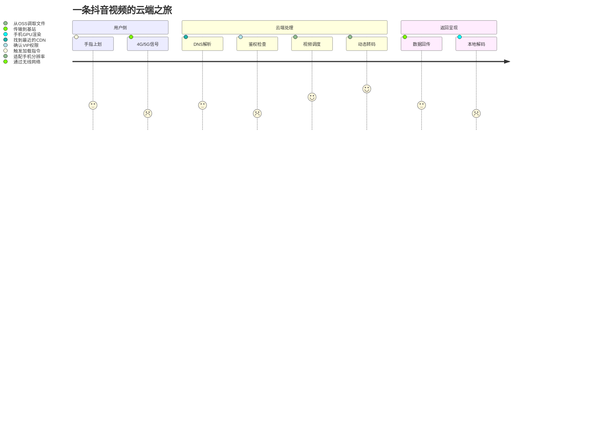

# 《从生活走进云计算》全场景认知教案

`核心目标`：建立"生活需求→技术实现→岗位价值"的完整认知闭环

## 第一章：生活中的云计算

### 1.1 早间场景：刷抖音吃早餐

#### ❶ 文字场景描述（建立共鸣）
"清晨7:30，你一边啃着煎饼果子，左手拇指习惯性地上划抖音。一只萌猫视频瞬间加载完毕，1080P画质下猫咪的胡须清晰可见。此时你可能不知道：这个简单的动作背后，云计算系统正在完成17个技术环节的协同工作。"

#### ❷ 生活化类比（降低理解门槛）
把抖音视频比作**"外卖订单"**：
* 视频内容 = 你点的餐食
* 手机APP = 外卖小哥（负责取餐和送达）
* 云计算平台 = 连锁餐饮中央厨房（真正制作内容的地方）
* CDN节点 = 社区配送站（提前把热门视频缓存到离你最近的仓库）

#### ❸ 技术流程图解（可视化关键环节）
`案例分解：`

* 技术映射：你看到的："刷视频不卡顿"
* 背后的云：
    * `内容分发网络（CDN）`：把视频缓存到离你最近的机房（就像小区里的菜鸟驿站）
    * `弹性计算`：瞬间调动数百个CPU核心处理4K转码（类似早餐高峰期临时增派煎饼摊）
    * `对象存储`：视频实际存放在阿里云OSS（相当于超市的中央冷库）

#### ❹ 运维技术对应表（关联职业价值）
| 你感受到的体验 | 背后的云计算技术     | 运维工程师的工作     |
| -------------- | -------------------- | -------------------- |
| 视频秒开       | CDN预热缓存         | 监控节点命中率       |
| 画质清晰       | 实时转码集群         | 管理GPU服务器        |
| 不卡顿         | 负载均衡策略         | 调整SLB权重          |
| 历史记录不丢   | 分布式数据库         | 设计备份方案         |

#### ❺ 互动思考题（强化认知）
> 如果学员有兴趣，我会在这里稍微多一些扩展

1. 当你在电梯里刷视频时，为什么有时会提示"网络不佳"？
   * 提示：思考移动场景下基站切换与VPC网络配置的关系

2. 同一WiFi下，为什么室友刷抖音流畅而你卡顿？
    * 提示：涉及QoS流量调度和TCP拥塞控制机制

### 1.2 晚间场景：家庭智能家居
