# 云计算运维开发课程大纲

## 课程简介
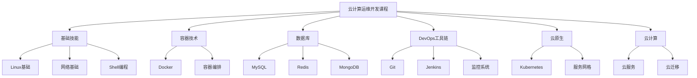

## 课程特点

* 理论与实践结合
* 完整的DevOps技术栈
* 真实项目案例
* 云原生技术体系

## 课程大纲

### 第一周：基础入门

1. Day1：计算机基础与环境搭建
    * 计算机组成原理
    * 云计算与虚拟化基础
    * 操作系统安装配置
    * 网络基础配置

2. Day2-3：Linux基础
    * Linux文件系统
    * 基础命令
    * 文本处理

3. Day4：包管理
    * RPM包管理
    * YUM使用
    * APT使用

4. Day5：Web服务器与负载均衡
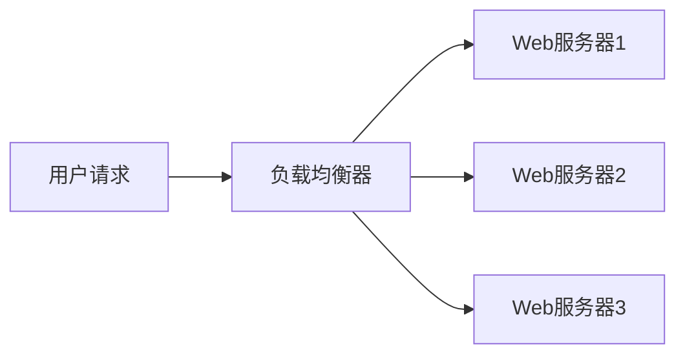

* Nginx配置与优化
* 反向代理实现
* 负载均衡策略
* 高可用架构


### 第二周：容器技术

1. Day7：Docker基础
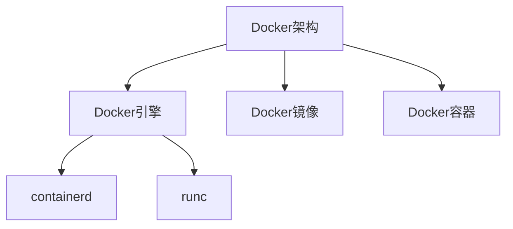

* 容器基本概念
* Docker核心原理
* 基础命令操作
* 镜像管理

2. Day8-9：Docker进阶
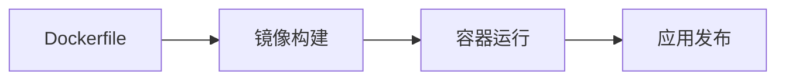

* Dockerfile最佳实践
* 镜像制作
* 网络模式
* 容器编排基础


3. Day10-11：Shell编程
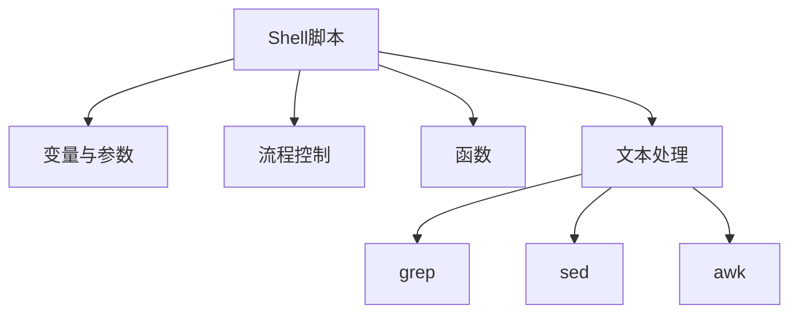

* 基础语法
* 条件判断
* 循环结构
* 三剑客应用

### 第三周：数据库
1. Day12-13：MySQL基础
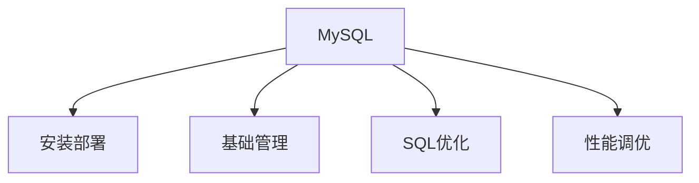

* 安装配置
* 核心参数
* SQL语句
* 查询优化

2. Day14-15：MySQL高可用
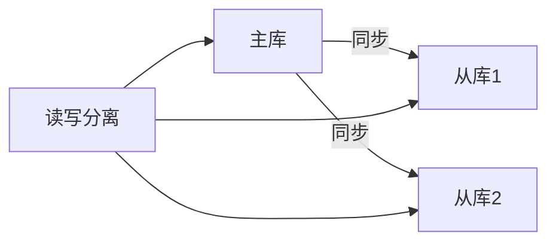
* 主从复制
* 读写分离
* 数据备份
* 故障恢复

3. Day16：NoSQL数据库
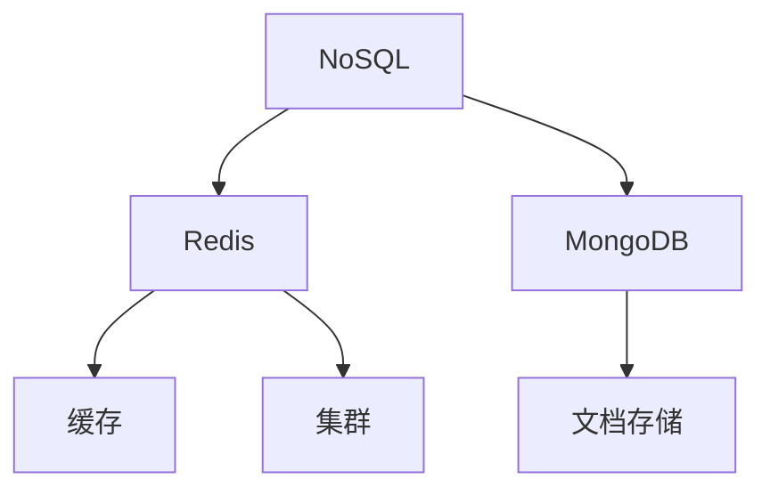

* Redis原理与实践
* 集群部署
* MongoDB基础

### 第四周：DevOps工具链
1. Day18-19：版本控制与消息队列

* Git使用
* GitLab运维
* MQ应用
* ES检索

2. Day20：构建工具

* Maven基础
* 依赖管理
* 项目构建
* 微服务部署

3. Day21-22：监控与日志
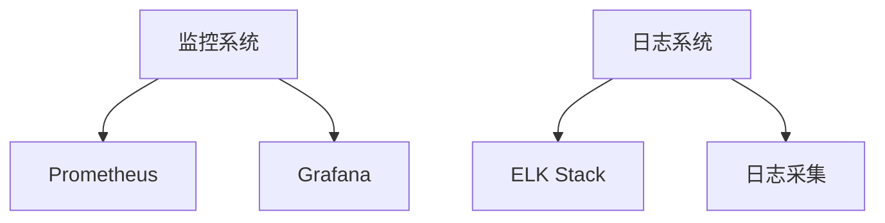

* Zabbix
* Prometheus
* ELK部署
* Ansible自动化

4. Day23：持续集成


* Jenkins配置
* 流水线设计
* 自动化发布

### 第五周：Kubernetes
1. Day24-25：K8s基础
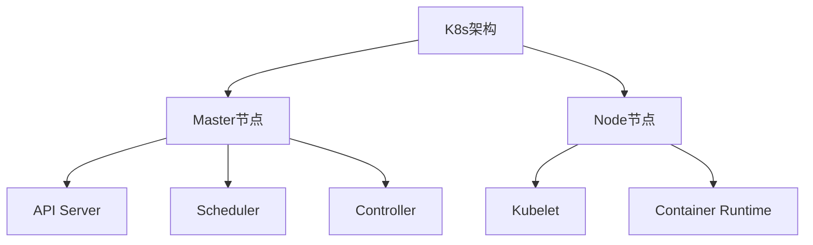

* 架构原理
* 核心组件
* Pod管理
* 资源对象

2. Day26-28：K8s进阶
* 配置管理
* 调度策略
* 存储管理
* 网络方案

3. Day29-31：K8s应用
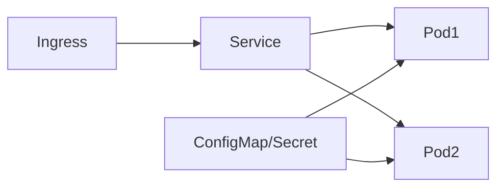

* Service配置
*  Ingress控制
* RBAC权限
* 应用部署

### 第六周：云计算

1. 云服务基础
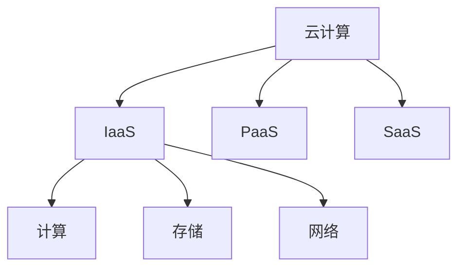

* 基本概念
* 服务模型
* 部署模型

2. 阿里云产品
* ECS
    ```mermaid
    graph TD
        A[ECS弹性计算服务] --> B[计算能力]
        A --> C[存储系统]
        A --> D[网络配置]
        B --> B1[多种实例规格]
        B --> B2[弹性伸缩]
        C --> C1[系统盘]
        C --> C2[数据盘]
        D --> D1[私有网络]
        D --> D2[公网IP]

    ```
* RDS
    ```mermaid
    graph TD
        A[ECS弹性计算服务] --> B[计算能力]
        A --> C[存储系统]
        A --> D[网络配置]
        B --> B1[多种实例规格]
        B --> B2[弹性伸缩]
        C --> C1[系统盘]
        C --> C2[数据盘]
        D --> D1[私有网络]
        D --> D2[公网IP]

    ```
* OSS
    ```mermaid
    graph TD
        A[ECS弹性计算服务] --> B[计算能力]
        A --> C[存储系统]
        A --> D[网络配置]
        B --> B1[多种实例规格]
        B --> B2[弹性伸缩]
        C --> C1[系统盘]
        C --> C2[数据盘]
        D --> D1[私有网络]
        D --> D2[公网IP]

    ```
* VPC
    ```mermaid
    graph TD
        A[ECS弹性计算服务] --> B[计算能力]
        A --> C[存储系统]
        A --> D[网络配置]
        B --> B1[多种实例规格]
        B --> B2[弹性伸缩]
        C --> C1[系统盘]
        C --> C2[数据盘]
        D --> D1[私有网络]
        D --> D2[公网IP]

    ```
* SLB
    ```mermaid
    graph TD
        A[ECS弹性计算服务] --> B[计算能力]
        A --> C[存储系统]
        A --> D[网络配置]
        B --> B1[多种实例规格]
        B --> B2[弹性伸缩]
        C --> C1[系统盘]
        C --> C2[数据盘]
        D --> D1[私有网络]
        D --> D2[公网IP]

    ```
3. 云迁移实践
* 迁移策略
* 工具使用
* 最佳实践

3. 第七周：综合实践
