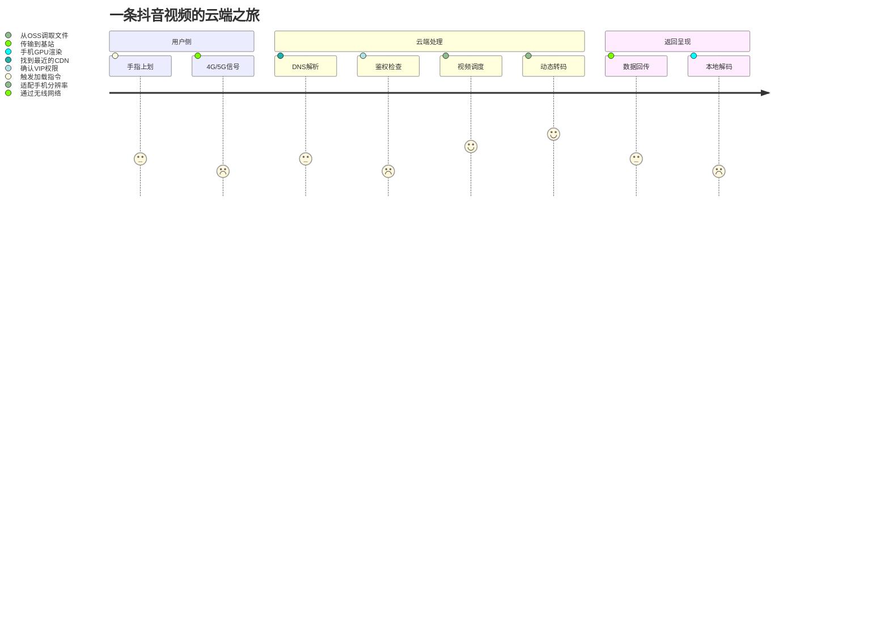

# 《从生活走进云计算》全场景认知教案

`核心目标`：建立"生活需求→技术实现→岗位价值"的完整认知闭环

## 第一章：生活中的云计算

### 🛋️ 早间场景：刷抖音吃早餐

#### ❶ 文字场景描述（建立共鸣）
"清晨7:30，你一边啃着煎饼果子，左手拇指习惯性地上划抖音。一只萌猫视频瞬间加载完毕，1080P画质下猫咪的胡须清晰可见。此时你可能不知道：这个简单的动作背后，云计算系统正在完成17个技术环节的协同工作。"

#### ❷ 生活化类比（降低理解门槛）
把抖音视频比作**"外卖订单"**：
* 视频内容 = 你点的餐食
* 手机APP = 外卖小哥（负责取餐和送达）
* 云计算平台 = 连锁餐饮中央厨房（真正制作内容的地方）
* CDN节点 = 社区配送站（提前把热门视频缓存到离你最近的仓库）

#### ❸ 技术流程图解（可视化关键环节）
`案例分解：`

* 技术映射：你看到的："刷视频不卡顿"
* 背后的云：
    * `内容分发网络（CDN）`：把视频缓存到离你最近的机房（就像小区里的菜鸟驿站）
    * `弹性计算`：瞬间调动数百个CPU核心处理4K转码（类似早餐高峰期临时增派煎饼摊）
    * `对象存储`：视频实际存放在阿里云OSS（相当于超市的中央冷库）

#### ❹ 运维技术对应表（关联职业价值）
| 你感受到的体验 | 背后的云计算技术     | 运维工程师的工作     |
| -------------- | -------------------- | -------------------- |
| 视频秒开       | CDN预热缓存         | 监控节点命中率       |
| 画质清晰       | 实时转码集群         | 管理GPU服务器        |
| 不卡顿         | 负载均衡策略         | 调整SLB权重          |
| 历史记录不丢   | 分布式数据库         | 设计备份方案         |

#### ❺ 互动思考题（强化认知）
> 如果学员有兴趣，我会在这里稍微多一些扩展

1. 当你在电梯里刷视频时，为什么有时会提示"网络不佳"？
   * 提示：思考移动场景下基站切换与VPC网络配置的关系

2. 同一WiFi下，为什么室友刷抖音流畅而你卡顿？
    * 提示：涉及QoS流量调度和TCP拥塞控制机制

## 运维行业认知

### 什么是运维？
运维（Operations and Maintenance，简称O&M）是一个看似简单但内容丰富的概念。简单来说，运维就是保障IT系统稳定运行的所有工作。

就像一个城市需要各种市政人员来维持正常运转，企业的IT系统同样需要运维工程师来保障：

* 所有服务器正常运行
* 网络畅通无阻
* 应用程序稳定工作
* 数据安全可靠

#### 举个生活中的例子：
当你使用微信支付买一杯咖啡时，背后涉及

1. 支付系统要24小时稳定运行
2. 你的支付请求要快速响应
3. 交易数据要安全存储
4. 支付过程要万无一失

这些都需要运维团队来保障。

### 运维的工作内容

* 系统监控：
    - 监控服务器状态（CPU、内存、硬盘使用情况）
    - 监控网络连接（带宽使用、延迟情况）
    - 监控应用性能（响应时间、错误率）
    - 监控安全事件（异常登录、攻击行为）

* 日常维护：
    - 定期检查系统日志
    - 更新系统补丁
    - 优化系统配置
    - 清理无用数据

* 故障处理：
    - 快速响应告警
    - 定位问题原因
    - 实施解决方案
    - 编写故障报告

### 运维的发展历程

#### 人工运维时代（2000年前）
* 特点：
    - 手工操作为主
    - 被动处理故障
    - 经验主导工作
    - 效率较低

* 案例：服务器出现问题，运维工程师需要
    1. 收到电话通知
    2. 赶到机房现场
    3. 手动排查问题
    4. 人工解决故障

#### 工具运维时代（2000-2010）
* 特点：
    - 使用自动化工具
    - 标准化操作流程
    - 建立监控系统
    - 提高工作效率

* 案例：同样的服务器问题
    1. 监控系统自动告警
    2. 远程登录服务器
    3. 使用工具快速定位
    4. 自动化处理故障

#### DevOps时代（2010-2020）

* 特点：
    - 开发运维一体化
    - 持续交付部署
    - 自动化程度高
    - 快速迭代发布

* 实践方式：
    1. 开发团队参与运维
    2. 运维参与系统设计
    3. 自动化发布部署
    4. 持续监控优化

#### 云原生时代（2020至今）
* 特点：
    - 云上资源管理
    - 容器化部署
    - 微服务架构
    - 智能运维

* 技术革新：
    1. 所有资源云上管理
    2. 容器编排自动化
    3. 服务治理智能化
    4. AI辅助运维决策

## 运维工程师的进阶之路 🚀

### 第一周：从小白到Linux达人 💻
想象你第一天入职，老板给了你100台服务器要管理...
懵了吧？别担心！这就是为什么我们先学Linux：

* ✨ 学习内容：
    - Linux基础命令（就像学会开车要先认识方向盘）
    - 系统管理（相当于学会车辆保养）
    - 软件安装管理（就像给车安装各种配件）

* 🎯 真实应用场景："老板，网站访问太慢了！"
    - 用Linux命令查看CPU、内存使用情况
    - 定位性能瓶颈
    - 解决问题，成为团队英雄！

### 第一周后半：Nginx - 现代网站的门面担当 🌐
想象你是购物中心的大堂经理，要管理成千上万的顾客...
这就是Nginx的工作！

* ✨ 为什么要学：
    - 它是互联网的"交通警察"，管理着用户的访问流量
    - 帮助网站实现负载均衡（就像多个收银台分流顾客）
    - 配置HTTPS（给网站加把安全锁）

* 🎯 实际应用："老板，我们的网站要支持HTTPS！"
    - 配置SSL证书
    - 设置反向代理
    - 一个下午搞定，老板直呼靠谱！

### 第二周：Docker - 把应用装进"集装箱" 📦
还记得以前安装软件时的痛苦吗？
"在我电脑上能运行啊！"
"为什么到了服务器就不行了？"
Docker就是来解决这个问题的！

* ✨ 学习要点：
    - 把应用打包成标准化的容器
    - 一键部署，到哪都能跑
    - 环境隔离，互不影响

* 🎯 实战场景：
    * "需要部署20个不同版本的Java应用！"
    * 以前：配环境配到怀疑人生
    * 现在：Docker一键部署，喝茶看报纸

### 第三周：数据库管理 - 数据就是金钱 💰
数据库就像公司的金库，你将是保管这些"金库"的人！

* ✨ 学习内容：
    - MySQL：最流行的关系型数据库
    - Redis：飞快的缓存数据库
    - 主从复制：数据库的"双保险"

* 🎯 日常场景："系统好像变慢了..."
    - 检查数据库性能
    - 优化SQL查询
    - 加入Redis缓存
    - 性能提升10倍！

### 第四周：DevOps工具集 - 自动化的艺术 🔄
重复的工作交给机器，人做更有价值的事！

* ✨ 核心工具：
    - Git：代码版本控制（就像给代码拍照存档）
    - Jenkins：自动化部署（像个尽职的搬运工）
    - ELK：日志分析（系统的"黑匣子"）

* 🎯 实际案例：
    - 以前：手动部署要一个小时
    - 现在：点击按钮，3分钟搞定
    - 老板：你是怎么做到的？😮

### 第五周：K8s - 容器们的"指挥官" ⚓
如果Docker是集装箱，那K8s就是整个港口的调度系统！

* ✨ 学习重点：
    - Pod管理（容器的"宿舍管理员"）
    - 服务发现（自动找到需要的服务）
    - 自动扩缩容（流量大了自动加机器）

* 🎯 应用场景：双11购物节：
    - 流量暴增？K8s自动扩容
    - 服务挂了？自动重启
    - 你在睡觉，系统自己在解决问题！

### 第六周：云计算 - 未来的技术基础设施 ☁️
告别自建机房的繁琐，拥抱云计算的便利

* ✨ 主要内容：
    - 云服务器ECS（随时随地开服务器）
    - 云数据库RDS（无需运维的数据库）
    - 对象存储OSS（无限容量的网盘）

* 🎯 实际应用：
    * 老板："我们要在海外开展业务！"
    * 以前：需要海外机房，超麻烦
    * 现在：云平台点几下，分分钟搞定

### 学完这些你将成为：

* 🏆 本领：
    1. 服务器管理专家
    2. 容器技术大师
    3. 数据库调优能手
    4. 自动化运维达人
    5. 云计算技术专家

* 💼 职业发展：
    - 初级运维（月薪8k-15k）
    - 中级运维（月薪15k-25k）
    - 高级运维（月薪25k+）
    - 运维架构师（月薪35k+）

## 结语
> 记住：运维就像是企业的IT医生，保障着公司系统的稳定运行。当你精通这些技能，你就是公司最重要的人之一！

`学习建议：`
1. 动手实践最重要，光看不练假把式
2. 遇到问题先尝试自己解决，培养排查问题的能力
3. 建立自己的知识库，把踩过的坑记录下来
4. 关注新技术，但不要盲目追逐
5. 多和开发同学交流，了解应用的需求

加油！未来的运维大神就是你！💪